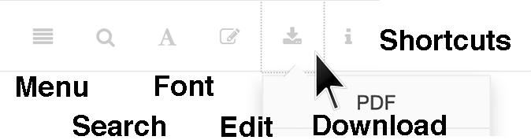

## How to Read and Cite {-}

#### Two Editions: Web and PDF {-}

We encourage readers to access the free web edition of this digital book-in-progress at (http://ontheline.trincoll.edu), to fully experience the interactive maps, video clips, and source links. Any modern web browser will display the book, but readers may prefer larger screens (desktop, laptop, tablet) over smaller screens (such as smartphones).

The web edition also displays these features near the top of the screen:

- Menu
- Search
- Font (adjust text size and display)
- Edit (to suggest edits or comment; requires free [GitHub](http://github.com) account)
- Download (PDF edition)
- Keyboard Shortcuts (arrow keys to navigate; `s` to toggle sidebar; `f` to toggle search)

```{r how-to-read, echo=FALSE, out.width="70%", fig.align="center"}
 
```

Also, readers may freely download the PDF edition of this book-in-progress, as described above, and print it on paper for off-line reading. Static images will appear in place of interactive maps and videos, with links to the online versions. After the book is completed, a cleaner PDF file will be available to download, and inexpensive paperback edition will be made available for sale by the publisher.

#### How to Cite {-}

To cite this book-in-progress, please refer to the web edition (rather than the PDF editions), since this online version is easiest for all readers to access instantly.

For general citations of the book, see these samples of common academic styles:

>**Chicago-style footnote or endnote:**  
>Jack Dougherty and contributors, *On the Line: How Schooling, Housing, and Civil Rights Shaped Hartford and Its Suburbs* (Trinity College, book-in-progress, 2019), http://ontheline.trincoll.edu.
>
>**Chicago-style bibliography entry:**  
>Dougherty, Jack, and contributors. *On the Line: How Schooling, Housing, and Civil Rights Shaped Hartford and Its Suburbs*. Trinity College, book-in-progress, 2019. http://ontheline.trincoll.edu.
>
>**MLA bibliography entry (with web address):**  
>Dougherty, Jack, and contributors. *On the Line: How Schooling, Housing, and Civil Rights Shaped Hartford and Its Suburbs*. Trinity College, book-in-progress, 2019. Web. <http://ontheline.trincoll.edu/>.
>
>**APA reference entry:**  
>Dougherty, J., & contributors. (2019). *On the Line: How Schooling, Housing, and Civil Rights Shaped Hartford and Its Suburbs*. Trinity College, book-in-progress. Retrieved from http://ontheline.trincoll.edu

To cite a specific passage, insert the author/title/web address of the relevant chapter as a "book section" in your preferred citation style. Since the web edition does not include page numbers, rely on the URL to point to the specific page.

>Sample Chicago-style note for a specific chapter:  
>Elaina Rollins, Clarissa Ceglio, and Jack Dougherty, "Writing Greater Hartford's Civil Rights Past with ConnecticutHistory.org," in *On The Line: How Schooling, Housing, and Civil Rights Shaped Hartford and its Suburbs* (Trinity College, book-in-progress, 2019), https://ontheline.trincoll.edu/teaching-researching.html#writing-greater-hartfords-civil-rights-past-with-connecticuthistory.org.

What if web links break?
All past and present editions of On The Line include the stable web address (http://OnTheLine.trincoll.edu), which redirects readers to the current version of the book.

The web edition of the book also includes internal links to different pages within the book (e.g. selected chapters, bibliography, etc.) If any internal links break, this platform has been set up to automatically redirect readers to the book's home page.

The book also contains external links (such as endnotes that refer to other articles, books, or websites). If any external links break, each endnote contains a full citation and external web address, which readers may search in the "Way Back Machine" at (http://archive.org) to see the most recent version of this site. [Donate to the Internet Archive](http://archive.org/donate/), the non-profit organization that maintains this valuable collection of our digital history as a free public service.
