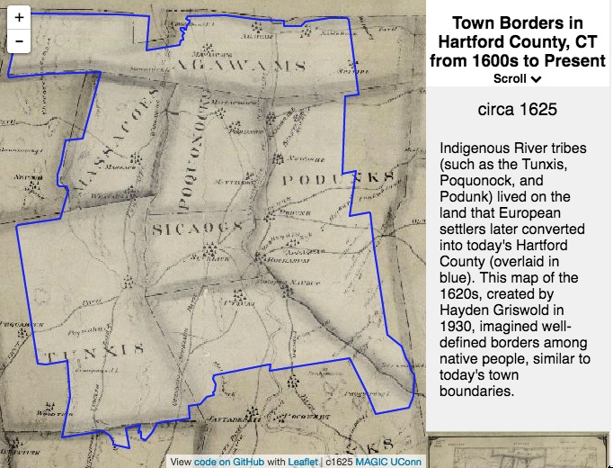
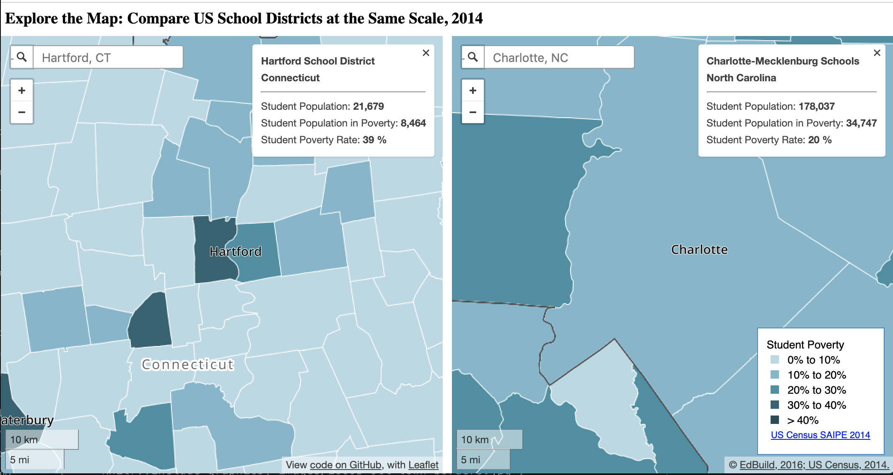

## Carving Up Town Boundaries {#carving}

TODO: Text to come on the continual redrawing of town boundaries in Hartford region thru 1880s

(ref:1600s-otl-town-borders) Scroll the narrative (or click and use arrow keys) in this [interactive map](https://ontheline.github.io/otl-town-borders/index-frame.html) of town borders in Hartford County, Connecticut. From the early 1600s to the late 1880s, local and state government divided the region into 29 separate towns as the European settler population grew. Boundaries shown here are not exact, but approximated from the best available digital sources: [UConn Libraries MAGIC historical maps](http://magic.lib.uconn.edu), [Atlas of Historical County Boundaries at Newberry Library](http://publications.newberry.org/ahcbp/pages/Connecticut.html), and the [Connecticut State Register and Manual](http://www.ct.gov/sots/cwp/view.asp?a=3188&q=392440). View [historical sources, known issues, and the code](https://github.com/ontheline/otl-town-borders/) for this map, developed by Ilya Ilyankou and Jack Dougherty.^[@ilyankouMapTownBorders2017]

<!-- set iframe height to 600px in custom-scripts.html -->
```{r 1600s-otl-town-borders, echo=FALSE, fig.cap="(ref:1600s-otl-town-borders)"}
if(knitr::is_html_output()) knitr::include_url("https://ontheline.github.io/otl-town-borders/") else 
```
<!-- Move this into Divided School Districts chapter 2.5? -->
TODO: Text to come on CT 1909 school district consolidation, which redrew school district boundaries to match town boundaries


TODO: Fix basemaps and narrative for <https://ontheline.github.io/otl-redraw-lines-hartford/index-frame.html>

TODO: Text to come on rigidity of CT school district boundaries today, and their size relative to cities that annexed suburban land or county-wide school districts in many other states

<!-- set iframe height to 600px in custom-scripts.html -->
```{r 2014-otl-compare-school-districts, echo=FALSE, fig.cap="(ref:1600s-otl-town-borders)"}
if(knitr::is_html_output()) knitr::include_url("https://ontheline.github.io/otl-compare-school-districts/") else 
```
