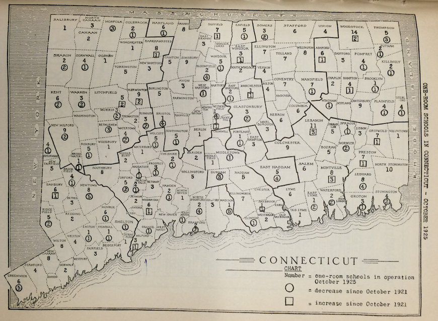
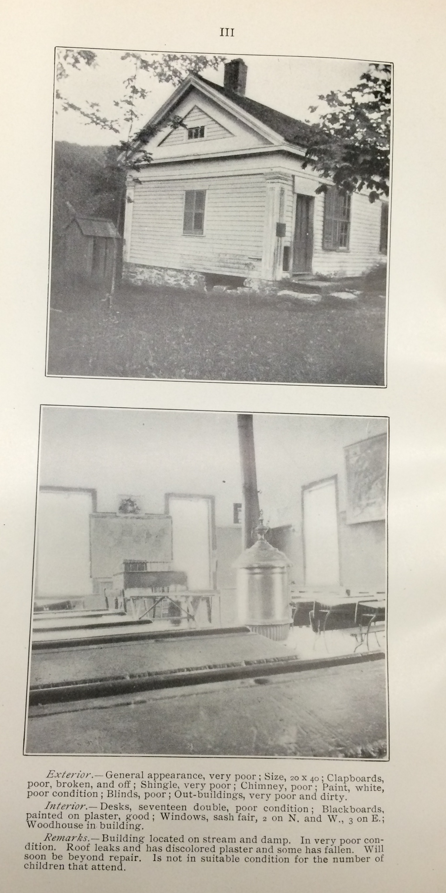

## Challenges for Rural and Early Suburban Schools {#rural}

PREVIEW: In contrast to the golden age of urban schools, most rural and suburban schools faced deep challenges to educational quality during the early 1900s. Several had no high schools and relied on regional arrangements with neighboring towns--funded by state subsidies--to educate their teenage students. Decades ago, Connecticut students routinely and legally crossed school district boundaries to receive a public education, and the entire system was arguably more regionalized than it is today, with rigidly divided districts.

According to a 1925 study by the Connecticut State Board of Education, about 137 out of 169 towns (81 percent) still operated a one-room school, for a total of 558. State officials praised a modest decrease in one-room schools from 1921, but noted that the rural school grants program served as a disincentive. "The town which receives a percentage of teachers' salaries grants is not inclined to close a school, transport the pupils, and lose this grant when no compensating grant to help meet the costs of conveyance is provided," stated the report authors. "The present scheme of grants is all too evidently hindering rather than aiding the small towns to improve their schools," as shown in Figure \@ref(fig:1925-one-room-schools).^[@connecticutstateboardofeducationOneRoomSchoolsConnecticut1926]

TODO - expand chapter

(ref:1925-one-room-schools) This map illustrated the gradual decline of one-room schools across Connecticut from 1921 to 1925, according to the State Board of Education.

```{r 1925-one-room-schools, echo=FALSE, fig.cap="(ref:1925-one-room-schools)"}
 
```

In 1901, the Connecticut State Board of Education attempted to shame towns by printing photos of low-quality one-room schools, without the name of the town, as shown in Figure \@ref(fig:1901-csde-one-room-school-p3).^[@connecticutstateboardofeducationAnnualReportConnecticut1901]

(ref:1901-csde-one-room-school-p3) The Connecticut State Board of Education shamed towns by printing photos of low-quality one-room rural schools in its 1901 report.

```{r 1901-csde-one-room-school-p3, echo=FALSE, fig.cap="(ref:1901-csde-one-room-school-p3)", out.width="50%"}
 
```
