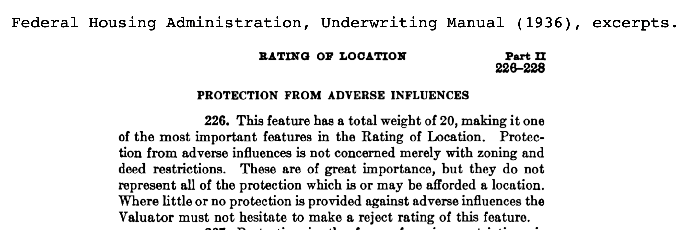

## Federal Lending and Redlining {#lending}
*by [Shaun McGann and Jack Dougherty](authors-and-contributors.html)*

<!-- TODO: update with 3.3a and b* -->

Racial and class discrimination in American housing was not simply caused by the prejudice of individual property owners. During the 1930s Depression, when federal agencies entered into the home mortgage market to bolster the economy, the U.S. government systematically instituted segregation into housing policies in ways that went far beyond the actions of individuals. This section compares how two federal lending programs---the Home Owners' Loan Corporation (HOLC) and the Federal Housing Administration (FHA)---carried out their respective missions, and their long-term consequences for city and suburban neighborhoods. Both agencies institutionalized discrimination by creating color-coded maps and ratings systems that downgraded neighborhoods based on the racial and class demographics of their residents, rather than objective assessments of their market value alone. While their lending practices differed, both programs contributed to what we today call "redlining": discrimination by refusing to provide (or charging higher rates) for financial services such as mortgages or insurance, due primarily to the location of a property. Although this term was not coined until the late 1960s, the story of its origins---and the federal government's active role in shaping these racial and class boundaries--—dates back to the 1930s. Looking back at the evolution of mortgage lending policies and vivid evidence of discrimination captures the story behind these segregated housing lines, and the thinking of both public and private officials as they drew them.^[TODO: check definition and "coined" source, whether made illegal under 1968 FH Act, and more recent definitions.]

When the nation sank into the Great Depression of the 1930s, the economic collapse threatened both lenders and borrowers in the housing market. Millions of Americans who already owned a home were in danger of defaulting on their mortgages, and potentially losing their homes to bank foreclosures. Many more could not afford to buy a home through a privately-owned bank or other lender, based on conventional mortgage terms at that time:

- High interest rate (around 7 percent).  
- Large down payment (typically 50 percent, due to a 50 percent limit on the amount of the loan relative to the market value of the home, or loan-to-value ratio).  
- Short-term loans (only 3 to 5 years to repay).  
- Interest-only loan repayment, with very large "balloon payment" of principal at the end, or refinancing a new loan.^[TODO: Check sources; history of amortization in Snowden and Rose paper,
http://realestateresearch.frbatlanta.org/rer/2012/04/debunking-popular-myth-about-mortgage-lending.html; compare with typical HUD history http://homeguides.sfgate.com/amortization-mortgage-2809.html and http://answers.google.com/answers/threadview/id/533059.html and
http://archives.huduser.org/about/hud_timeline/tl/hudtimeline_1930.html]  

In response to this lending crisis, President Franklin D. Roosevelt signed legislation in 1933 to create the Home Owners' Loan Corporation (HOLC), and subsequent programs to subsidize the cost of mortgages. The HOLC purchased and refinanced loans for homeowners who were in danger of bank foreclosure, due to their failure to keep up with existing mortgage payments or balloon payments. In addition to lower interest rates, these federally-backed mortgages offered much more favorable terms for middle-class homeowners:  

- Lower interest rate (5 percent or lower).  
- Smaller down payment (typically 20 percent, by raising the loan-to-value ratio to 80 percent).
- Longer-term loans (for 15 years, and then 30 years).  
- Amortization of loans, which calculates a gradual repayment of both interest and principal, shifting largely from one to the other over time.  

Government involvement in the private lending marked prevented millions of Americans from being forced out of their homes, and subsequent programs expanded ownership to millions more, but only for those who qualified. Eligibility was not neutral on the racial and class composition of homeowners' neighborhoods, and tied federal funds into supporting and spreading segregation.[@freundColoredPropertyState2007]

In order for the HOLC to measure the risk of mortgage investments in different neighborhoods across the nation, the agency launched its City Survey Program in 1935. Field agents were sent to interview local banks and other lenders in 239 cities, and record their findings in confidential reports. In recent years, historians such as Robert K. Nelson and colleagues have compiled a growing collection of these maps for their nationwide Mapping Inequality Project.[@nelsonMappingInequalityRedlining2016]

Foster Milliken Jr., the HOLC field agent assigned to Hartford, was no stranger to the world of finance. Decades earlier, his father presided over Milliken Brothers, Inc., a multi-million dollar structural steel manufacturer in New York City that built the world's tallest buildings at that time. Prior to the Depression, Foster Milliken Jr. worked as a stockbroker in Manhattan and was familiar with its social circles. When HOLC sent him to evaluate the Hartford area in 1937, he consulted key figures in the city's home lending market—real estate board leaders, bank executives, and local administrators of federal housing loan programs—who he described as "a fair and composite opinion of the best qualified local people." But in Milliken's eyes, Hartford was a "typical New England city" with "ultra-conservative" fiscal policies, preferring to avoid federal assistance whenever possible. "It is not surprising," Milliken wrote, that most of Hartford's conservative banking circle refused to accept HOLC funding (which required only a 20 percent down payment from lenders, far lower than their conventional terms) and "generally frowned upon" federal home lending programs. Nevertheless, several bank executives and real estate board members agreed to speak confidentially with Milliken and offer their assessment of city and suburban neighborhoods, revealing which areas they believed to be safest or riskiest investments, and why.^[TODO: Milliken bio from 19070611NYT Milliken Brothers; 1930 Ancestry on zotero; 19350120NYT Foster Milliken. TWO REPORTS: Foster Milliken, Jr., "Confidential Report of a Survey in Hartford, Connecticut" (5 May 1936) and "Residential Security Map and Area Descriptions" (20 November 1937), for the Division of Research and Statistics, Home Owners’ Loan Corporation, Folder "Hartford CT #2", Box 64, City Survey Files, Record Group 195: Records of the Federal Home Loan Bank Board, National Archives II, College Park, MD; "best qualified" quote and acknowledgments  in page 4-5 of 1937 report; ultraconverv and FHA quotes in 1936 report p3, 20]

(ref:1937-holc-hartford-map-scan) View the [Residential Security Map for Hartford and West Hartford, 1937](http://mapwarper.net/maps/15096), from the Home Owners' Loan Corporation records at the National Archives. HOLC staff transformed neighborhood appraisals for over 200 cities into color-coded maps. Green indicated the best neighborhoods for mortgage investment, followed by blue and yellow, and then red to mark the riskiest areas, hence the name "redlining."^[@homeownersloancorporationResidentialSecurityMap1937, uploaded to @homeownersloancorporationResidentialSecurityRedlining1937a and @homeownersloancorporationResidentialSecurityRedlining1937]

```{r 1937-holc-hartford-map-scan, echo=FALSE, fig.cap="(ref:1937-holc-hartford-map-scan)"}
 knitr::include_graphics("images/1937-holc-hartford-map-scan.jpg")
```

Milliken submitted his confidential report to the HOLC central office, where staff created a four-color Residential Security Map to visually represent the "trend of desirability" he reported for neighborhoods in Hartford and two adjacent suburbs, West Hartford and East Hartford. Green, the highest rating, marked the best opportunities for mortgage investment, what Milliken described as "hot spots" of new and well-planned home construction where "lenders with available funds are willing to make their maximum loans" at up to 80 percent of the appraised property value (thereby requiring only a 20 percent down payment from homeowners). Blue, the second-grade level, represented completely developed neighborhoods of good quality, but not the best, where lenders offered mortgages at no more than 70 percent of the home value (or a 30 percent down payment). Yellow, the third-grade ranking, indicated areas in "transition" due to obsolescent housing or the "infiltration of a lower grade population," and where mortgage lenders were even more conservative than above. Red, the fourth-grade areas, designated areas "broader than the so-called slum districts" where negative transitions had already occurred, and now were characterized by an "undesirable population" with "unstable incomes." While some lenders avoided the third- and fourth-grade areas, Millken's report was cautious to avoid implying that good mortgage investments could not be made there. Rather, "we do think [mortgages] should be made and serviced [but] on a different basis than in the First and Second grade areas." In this way, the HOLC did not refuse to offer loans in the "redlined" areas, but acknowledged that this practice existed among some lenders, and justified doing business differently in these areas.^[TODO: quotes from 1937 report, p. 1; pp. 3-4]

(ref:1937-otl-redlining) Click on color-coded areas in the [full-screen interactive map](https://ontheline.github.io/otl-redlining/index-caption.html) to view neighborhood appraisals by the Home Owners' Loan Corporation (HOLC) in the Hartford area, 1937. HOLC prioritized neighborhoods to receive mortgage lending from the highest level (A, in green) to the lowest (D, in red). This federal agency worked with local banks and lenders to evaluate Hartford and over 200 other cities during the Great Depression. They measured not only physical conditions, but also the "social status of the population," and downgraded neighborhoods with non-white, immigrant, and poor residents. In later decades, activists labeled these discriminatory lending practices as "redlining." View [historical sources and code](https://github.com/OnTheLine/otl-redlining) for this map, developed by Ilya Ilyankou and Jack Dougherty, based on an earlier version with UConn MAGIC and the Kirwin Institute.^[@ilyankouMapFederalHOLC2017; @universityofconnecticutlibrariesmapandgeographicinformationcenterFederalHOLCRedlining2012]

<!-- set iframe 600px height 100% width in custom-scripts.html -->
```{r 1937-otl-redlining, echo=FALSE, fig.cap="(ref:1937-otl-redlining)"}
if(knitr::is_html_output()) knitr::include_url("https://ontheline.github.io/otl-redlining/") else knitr::include_graphics("images/1937-otl-redlining.png")
```

Looking outward from the downtown Hartford business district, Milliken observed that "the entire trend is to the west." In general, the lowest-grade red areas were located along the flood-prone banks of the Connecticut River, the location of the oldest colonial-era settlements that now contained the least desirable housing. Milliken perceived that the quality of neighborhoods improved—--from yellow to blue to green—--as the "better-class" residents moved from the central city to suburban West Hartford, and rising classes successively migrated into their old neighborhoods. A similar movement, though less pronounced in his view, also occurred on the opposite side of the river in suburban East Hartford. Despite this general trend, a closer look at the HOLC map reveals that not all suburban neighborhoods received high ratings, and not all city neighborhoods received low ratings. For example, yellow (the third grade) dominated the southern half of West Hartford and most of East Hartford. Likewise, green (the first grade) prevailed in the northwest quadrant of the City of Hartford.^[TODO: recheck if "better-class" phrase appears, and if so, quote it; 1936 report page 10]

Which factors influenced Milliken's mortgage risk ratings? Although his report considered the physical condition and market price of the housing stock, it also gave strong weight to the "social status of the population" in each neighborhood. The report was comprised of one-page standardized appraisal forms for each of the 27 neighborhoods studied. Near the top, HOLC instructed its appraisers to insert details about current inhabitants based on the prevailing standards of racial superiority and economic privilege of the time. Milliken dutifully reported the percentage of "Foreign-born" and "Negro" families, as well as "Relief families" who received Depression-era federal income assistance. In the section asking about the "Infiltration" of outside groups, he occasionally listed "Italians" or "Mixed foreign" residents for selected city and suburban neighborhoods.^[TO DO: social status quote from 1937 page 1; see forms on pages A1-D3]

(ref:1937-holc-inhabitants-c10) Explore the [HOLC area descriptions](https://github.com/ontheline/otl-redlining/blob/master/sources/holc-hartford-1937-appraisal.pdf), with forms that required appraisers to report the social composition of the neighborhood as a factor to measure mortgage risk. Source: Hartford area C-10, 1937, from the National Archives.^[@homeownersloancorporationResidentialSecurityMap1937]

```{r 1937-holc-inhabitants-c10, echo=FALSE, fig.cap="(ref:1937-holc-inhabitants-c10)"}
 knitr::include_graphics("images/1937-holc-inhabitants-c10.png")
```

At the bottom of each appraisal form, Milliken added racial and social class commentary about several neighborhoods, which he most likely heard from his local banking and real estate consultants, capturing their dominant cultural desires to maintain boundaries drawn by race, ethnicity, and social class. In a newer housing development occupied by "minor executives and businessmen" in suburban West Hartford (labeled A-2), he noted approvingly that, "a stream separates this section from its less desirable neighbor," referring to an adjacent area of West Hartford with an "infiltration of mixed foreign" families in "workingmen's homes" (C-2). In the North End of Hartford, Milliken described the Blue Hills neighborhood (B-5) as "largely given over to the Hebrew race although the better class Italians are now also moving there." In the predominantly white South End of the city (C-9), Milliken noted that a small percentage of "Negro families are confined to Roosevelt Street," and added that, "Lenders suggest caution in the selection of loans." But all of these neighborhoods were rated above the area immediately north of downtown, "the city's oldest residential section, which has gradually drifted into a slum area now mainly occupied by Negroes" (D-1). The HOLC map revealed not only the visible housing stock in the Hartford area, but also the "invisible" color and class lines drawn by mortgage lenders and real estate agents.

#### Restricting with FHA {-}

Around the same time that HOLC created these color-coded maps, a second agency, the Federal Housing Administration (FHA), began publishing guidelines for its staff to uniformly evaluate mortgage applications. Whereas the HOLC focused on foreclosures, the FHA devoted its attention to new loans, by subsidizing affordable terms for homebuyers and guaranteeing repayment to commercial lenders. To decide who qualified for FHA loans, the agency published its first *Underwriting Manual* in 1936. These detailed instructions specified exactly how evaluators should inspect the property, its location, and the applicant's credit worthiness. The FHA *Manual* provided uniform scoring charts, with examples of accepted and rejected applications.

(ref:1936-fha-manual-247) Explore the [1936 Federal Housing Administration Underwriting Manual](https://babel.hathitrust.org/cgi/pt?id=mdp.39015018409246;view=1up;seq=246'), which illustrated how a poor location rating would result in a rejected mortgage application. Digitized by HathiTrust.^[@federalhousingadministrationUnderwritingManualUnderwriting1936]

```{r 1936-fha-manual-247, echo=FALSE, fig.cap="(ref:1936-fha-manual-247)"}
 knitr::include_graphics("images/1936-fha-manual-247.png")
```

In the Location category, the FHA *Underwriting Manual* instructed evaluators to rate mortgage risk based on potential changes in the racial and class demographics of the neighborhood. This policy placed the federal government's financial interest *in favor of segregation*, and sought to protect property values *against integration*. The most direct language appeared in the "Protection from Adverse Influences" section, the factor carrying most of the weight in the Location category of the *Manual*. Overall, the FHA risk-rating system valued newly developed neighborhoods with homogenous upper-class stability. Evaluators were instructed to "investigate areas surrounding the location to determine whether or not incompatible racial and social groups are present." Any intrusions would provoke "instability and a reduction in values," the *Manual* warned. If the "character of a neighborhood" declines, "it is usually impossible to induce a higher social class than those already in the neighborhood to purchase and occupy properties." Neighborhoods received higher scores if they were protected by "natural or artificially established barriers," such as public parks or college campuses, that prevented the "infiltration of business and industrial uses, lower-class occupancy, and inharmonious racial groups." Similarly, the guidelines cautioned that neighborhood schools "should not be attended in large numbers by inharmonious racial groups." The rating system also approved of restrictive deeds that prohibited "the occupancy of properties except by the race for which they are intended" for at least twenty years. In fact, when restrictive property covenants covered an entire housing development or neighborhood, the *Manual* judged them to be more effective than zoning ordinances, which municipalities may have adopted "with little or no real understanding of its purpose." ^[@federalhousingadministrationUnderwritingManualUnderwriting1936, part II, sections 233, 229, 289, 284, 227-28.]

(ref:1936-fha-manual-226) Scroll through the [1936 FHA Underwriting Manual](https://babel.hathitrust.org/cgi/pt?id=mdp.39015018409246;view=1up;seq=195'), which required lower scores for mortgage applications located in neighborhoods or near schools that might experience changes in the racial or social class composition of residents. Digitized by HathiTrust.^[@federalhousingadministrationUnderwritingManualUnderwriting1936, part II, sections 226-289.]

```{r 1936-fha-manual-226, echo=FALSE, fig.cap="(ref:1936-fha-manual-226)"}
if(knitr::is_html_output()) knitr::include_url("images/1936-fha-manual-226.pdf") else 
```

When the FHA expanded its *Manual* in 1938, it added a four-level neighborhood ranking, on a scale from A to D, when rating the location. The new evaluation forms included specific codes to designate the predominant racial composition of the neighborhood: White, Mixed, Foreign, and Negro.^[TO DO: expand from Rothstein book]

(ref:1938-fha-manual-1849) The FHA introduced racial codes in its [1938 Underwriting Manual](https://babel.hathitrust.org/cgi/pt?id=mdp.39015018409261;view=1up;seq=476). Digitized by HathiTrust.^[@federalhousingadministrationUnderwritingManualUnderwriting1938a, section 1849-50.]

```{r 1938-fha-manual-1849, echo=FALSE, fig.cap="(ref:1938-fha-manual-1849)"}
 knitr::include_graphics("images/1938-fha-manual-1849.png")
```

The 1930s HOLC maps were marked "confidential" for several decades, until community organizers and academics discovered and renamed them as "redlining" maps in the late 1960s and '70s.The frequency of this phrase jumped upward in full-text databases of published books after the 1970s. Ken Jackson's popular history of suburbanization, *Crabgrass Frontier*, called public attention to the discriminatory language of field agents' reports. He and others pointed to what they saw as a clear pattern of assigning the lowest "red" rating to neighborhoods with high concentrations of African-American residents.^[TODO: Check "confidential" marking; check Jackson notes on discovery; insert quote from @jacksonCrabgrassFrontierSuburbanization1985; decide about adding Google Books Ngram, https://books.google.com/ngrams/graph?content=redlining&year_start=1940&year_end=2000 ]

But the story may not be as simple as Jackson suggests. Clearly, the fact that the HOLC forms required social demographics of residents, and that appraisers inserted their own racial, ethnic, and class comments in the ratings, shows that discrimination influenced the ratings process. Yet we also know that dominant whites forced black, immigrant, and lower-class residents into segregated sub-standard housing. Could lower ratings simply reflect lower property values? Or can we test whether HOLC agents downgraded specific neighborhoods solely due to the presence of unwanted groups, while holding constant their market price? That question is difficult to answer by looking solely at the Hartford-area report and maps, because of the small sample of neighborhoods (27), their limited variation (only 3 had black residents), and the multitude of variables on the forms. Try comparing two areas that shared relatively similar physical housing characteristics, but received different ratings, such as B-5 (the Blue Hills neighborhood in Hartford's North End) and C-9 (the South End neighborhood). In 1937, both consisted primarily of two-family wooden frame homes, built within the previous two decades, which sold and rented at comparable prices. So why did the appraiser give B-5 a second-grade blue rating, but assigned C-9 a lower third-grade yellow rating? Was it because the C-9 South End neighborhood had more factory workers, or more foreign-born families, or a noticeable number of African-American residents? This direct comparison between two neighborhoods is strongly suggestive, but the sample of neighborhoods is too small to make statistically meaningful claims with Hartford data alone. A better answer requires a richer analysis of a larger city, or pooling together ratings from multiple cities.

##### Compare the columns: HOLC Appraisals in Areas B5 vs. C9, Hartford 1937 {-}
| **Area**                  | **B5**                     | **C9**                   |
|---------------------------|----------------------------|--------------------------|
| Security Grade            | Second                     | Third                    |
| Location                  | Hartford                   | Hartford                 |
| Trend Next Decade         | Stable                     | Stable                   |
| Occupation                | Shopkeepers & white collar | Factory workers & clerks |
| Estimated Family Income   | $1,800                     | $1,500                   |
| **Foreign-born families** | **5%**                     | **20%**                  |
| Predominant foreign group | Italians                   | Italians                 |
| **Negro Y/N**             | **No**                     | **Yes**                  |
| **Negroes**               | **0%**                     | **1%**                   |
| **Relief Families**       | **None**                   | **Quite a few**          |
| Primary Building: Type    | 2-Family                   | 2-Family                 |
| Construction              | Frame                      | Frame                    |
| Average Age (yrs)         | 15                         | 20                       |
| Repair                    | Good                       | Fair                     |
| Occupancy                 | 98%                        | 97%                      |
| Home ownership rate       | 85%                        | 85%                      |
| Price Range (1937)        | $7,500 to 12,000           | $7,500 to 11,000         |
| Sales Activity            | Poor                       | Almost None              |
| Rental Range (1937)       | $40 to 50/month            | $32.5 to 55/month        |
| Rental Activity           | Good                       | Good                     |
| Mortgage Availability     | Ample                      | Limited                  |
*In the table above, although areas B5 and C9 had similar housing stock and financials, HOLC assigned them different ratings (blue versus yellow), most likely due to the social class and racial composition of neighborhood residents (noted in bold type). Source: HOLC appraisal data, Hartford CT, 1937.*[@ilyankouMapFederalHOLC2017]

Some of the most insightful research on the federal government's role in the lending market comes from Amy Hillier's spatial analysis of Philadelphia sources, and her key distinction between the HOLC and FHA programs. The Philadelphia HOLC map covered a large number of neighborhood appraisals, which Hillier plotted on a digital map of census data. Through spatial regression modeling, she found that the racial composition of neighborhoods was a significant predictor for HOLC ratings in Philadelphia, while controlling for differences in housing characteristics. On the surface, this confirms that HOLC maps systematically downgraded Philadelphia neighborhoods due to race, which we could not prove in the smaller Hartford region.^[@hillierRedliningHomeOwners2003]

But Hillier conducts a second, more direct test of the historical evidence, to find out which neighborhoods actually received HOLC or FHA loans, since actual lending patterns matter more than stated intentions. For a sample of Philadelphia mortgage documents from 1940 to 1960, she matched the home address to her digital map and recorded the type and interest rate. Surprisingly, HOLC actually made a large proportion of its loans to lower-grade areas. This finding challenges the conventional "redlining" thesis by pointing out that HOLC has two stories, which are somewhat contradictory. On one hand, Hillier observes, "HOLC created security maps in which race was used to signify race levels." But on the other hand, "HOLC provided assistance to a million homeowners, across race and ethnicity, who were desperate to save their homes," including many to African-Americans and immigrants in the lowest-rated red areas.^[@hillierSearchingRedLines2005; TODO: CHECK  (Hillier JUH 2003, 394; Hillier Soc Sci Hist 2005, p227; Hillier SSH 2005 p209, see Hiller 2003b)]

By contrast, FHA loans were less common in Philadelphia's lower-rated neighborhoods, though limitations in the evidence prevents Hillier from making a more definitive claim. Overall, when considering both direct and indirect evidence, Hillier concludes that the FHA "reflected an anti-urban and racial bias deeper than the HOLC's," because its *Underwriting Manual* and other materials directed evaluators not to lend to low-rated areas, while HOLC reports consistently stated that loans could be profitable there. Although the HOLC "redlining" maps were not as influential as previous historians may have believed, the FHA is the primary culprit responsible for federal divestment and segregation that led to post-war urban decline.^[TODO: check "prevents" in Hillier PA History 2003; Hillier p414 JUH 2003]

We do not know whether Hillier's claims about HOLC and FHA lending patterns also hold true for the Hartford region, because no one has yet uncovered and examined the evidence. In any case, both the FHA Manual in general, and the HOLC report and map on Hartford in particular, reveal the upper-class white supremacy state-of-mind by federal agent Foster Milliken Jr. and the city's banking and real estate elite of the 1930s.

*[About the authors and contributors:](authors-and-contributors.html) Shaun McGann (Trinity 2014) wrote the first draft of this essay in the Cities Suburbs and Schools seminar, and published it in ConnecticutHistory.org.[@mcgannEffectsRedliningHartford2014] Jack Dougherty expanded the essay for publication in this book. Ilya Ilyankou (Trinity 2018) and Jack Dougherty developed the interactive map, based on an earlier version created with contributors from UConn MAGIC and the Kirwin Institute.*^[@ilyankouMapFederalHOLC2017; @universityofconnecticutlibrariesmapandgeographicinformationcenterFederalHOLCRedlining2012]

 *[On The Line](http://ontheline.trincoll.edu) is an open-access, born-digital, book-in-progress by [Jack Dougherty and contributors](authors-and-contributors.html) at Trinity College, Hartford CT, USA. This work is copyrighted by the authors and freely distributed under a [Creative Commons Attribution-NonCommercial-ShareAlike 4.0 International License](http://creativecommons.org/licenses/by-nc-sa/4.0/). Learn about our [open-access policy and code repository](copyright-with-open-access.html) and [how to read and cite](how-to-read-and-cite.html) our work. This book-in-progress was last updated on: `r Sys.Date()`*
