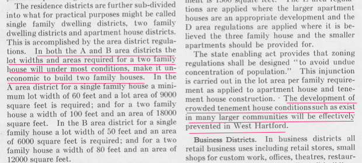

## Origins of Exclusionary Zoning {#origins-zoning}

<!-- TODO revise and expand draft with notes from repo, Scriv, update maps, images -->

During the 1920s, several states granted local governments a new policy tool—known as municipal zoning—to exert greater control over land development. But tools can be used to achieve different goals. We can use them to help people or cause harm. Evaluating the history of zoning requires a closer look at how local governments implemented this policy, and to what ends.

Progressive advocates saw zoning as a necessary tool for government to regulate the free market and to protect the health and safety of its citizens. For example, zoning gave municipalities the power to draw lines on the land and create separate spaces for residential, commercial, and industrial development. Family homes could be legally separated from potentially harmful businesses or factories. When the Connecticut General Assembly approved zoning enabling law in 1923, it stated that local regulations should be designed for this purpose: "... to prevent a close arrangement or constructions of buildings upon the streets, to secure safety from fire and other dangers, to avoid undue concentration of population and to provide health, comfort and general welfare in living and working conditions."^[TODO: check original source, cited in @whittenWestHartfordZoning1924, p. 8; @PlansApportionPopulation1923]

But local governments often crafted zoning ordinances to achieve other, less innocent goals. Some wrote local ordinances that made housing construction in selected neighborhoods affordable only for upper-class families, thereby blocking out lower-income families. Today we call this "exclusionary zoning" and its roots can be traced back nearly a century ago.

West Hartford became the first Connecticut town to enact municipal zoning in 1924, immediately after the state granted this power. Town leaders hired Robert Whitten, a consultant from Cleveland, Ohio, to guide this process. He drafted West Hartford's first zoning guidelines, which emphasized how these land-use laws would bring "orderliness" and "efficiency" to real estate development in this rapidly growing suburb, "and an increase of health, comfort and happiness for all people."^[@whittenWestHartfordZoning1924, preface]

Whitten also recommended a system of dividing residential areas by minimum home construction sizes, to effectively segregate citizens by social class. In the most exclusive A district, constructing a single-family home required the largest size property lot (at least 9,000 square feet, or 1/5 of an acre), and building a two-family home required twice as much land. Similar rules mandated the minimum width of the property facing the street. The 1924 zoning plan clearly stated that these rules "will under most conditions, make it uneconomic to build two-family houses" in the A district. Exclusionary zoning required more land per family, which increased home prices to levels that only wealthier residents could afford. While zoning did not explicitly ban lower-class citizens, it effectively pushed them downward to the D-level districts (which permitted two-family duplexes with lower minimum property sizes), or out of the suburb entirely. Under the new zoning law, Hartford's tenement houses and apartment buildings, crowded with working-class families, would be "effectively prevented in West Hartford."^[@whittenWestHartfordZoning1924, p. 10.] West Hartford town leaders voted to adopt most of their consultant's recommendations.

#### Explore interactive West Hartford zoning maps, 1924 and present {-}

<http://magic.lib.uconn.edu/otl/dualcontrol_zoning_westhartford.html>

*TODO: rebuild map in Leaflet*

Drafting local ordinances this way made zoning an exclusionary tool to restrict neighborhoods by wealth, and most likely to pump up high-end real estate sales. Unlike other tools developed around the same time (such as racially restrictive property covenants that prohibited non-white residents, and have since been outlawed by civil rights legislation), class-based zoning remains perfectly legal today.  But it does nothing to promote the health and safety of the citizenry, as promised by the original intent of the state law.

Drafting local ordinances this way made zoning an exclusionary tool to restrict neighborhoods by wealth, and most likely to pump up high-end real estate sales. Unlike other tools developed around the same time (such as racially restrictive property covenants that prohibited non-white residents, and have since been outlawed by civil rights legislation), wealth-based zoning remains perfectly legal today. But it does nothing to promote the health and safety of the citizenry, as promised by the original intent of the state law.

Today in Connecticut, we continue to struggle with this legacy of our restrictive land-use laws. Exclusionary zoning has been criticized in multiple reports as a barrier to fair housing and equal opportunity.[@suburbanactioninstituteStudyZoningConnecticut1978; @reecePeoplePlaceOpportunity2009] In 2013, the Connecticut Fair Housing Center and Trinity College student researcher Fionnuala Darby-Hudgens and I compiled all of the local zoning ordinances for towns across Connecticut and evaluated them on their degree of restrictions against affordable housing for the Connecticut Zoning Initiative.[@connecticutfairhousingcenterConnecticutZoningInitiative2013; @connecticutfairhousingcenterGuideZoningFair2013; @connecticutfairhousingcenterAnalysisImpedimentsFair2015]

#### Explore Connecticut Zoning Initiative maps and data, 2013 {-}

TODO: Show new CFHC maps and graphics, and redirect to replace old <http://commons.trincoll.edu/cssp/zoning>

Exclusionary zoning across 169 Connecticut towns, 2012:

- 23 prohibit new construction of multi-family housing (red)
- 122 require special permit for multi-family housing (yellow)
- 13 require > 2 acre lot size for single-family homes
- 18 require > 5 acre lot size for multi-family homes

TO DO: review slides and transform into text <https://docs.google.com/presentation/d/1yYDQTzNoUBzCW6tCSH21beUrwsYQVwVTQO3Ctqf2BPM/edit#slide=id.g299a37f04f_0_0>

But these zoning analysis maps are incomplete because there is no uniform reporting requirements for local zoning ordinances, and no state entity charged with collecting this data in meaningful ways. Despite these obstacles, the question remains the same. If we wish to keep zoning as a governmental policy to regulate market forces in real estate, what kind of tool do we want it to be? Should we consider rewriting exclusionary zoning laws to make them more helpful for the health of our communities?

`r if (knitr::is_latex_output()) '<!--'`
 *[On The Line](http://ontheline.trincoll.edu) is an open-access, born-digital, book-in-progress by [Jack Dougherty and contributors](authors-and-contributors.html) at Trinity College, Hartford CT, USA. This work is copyrighted by the authors and freely distributed under a [Creative Commons Attribution-NonCommercial-ShareAlike 4.0 International License](http://creativecommons.org/licenses/by-nc-sa/4.0/). Learn more [about the book](about-the-book.html), including [how to read and cite](how-to-read-and-cite.html) and our [copyright with open-access policy and code repository](copyright-with-open-access.html). This book-in-progress was last updated on: `r format (Sys.Date(), '%d %b %Y')`*
`r if (knitr::is_latex_output()) '-->'`
