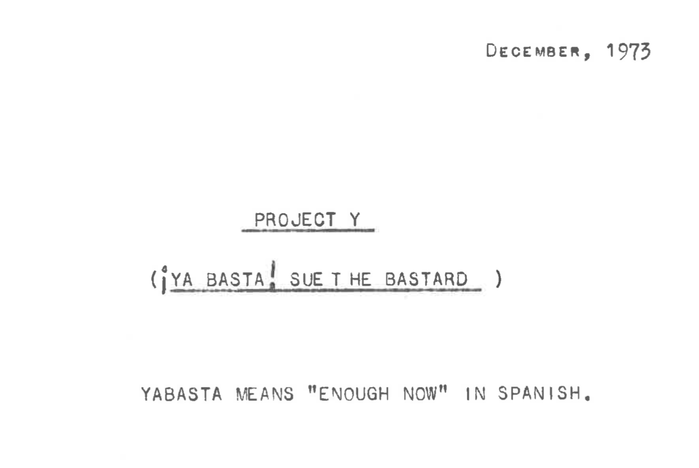
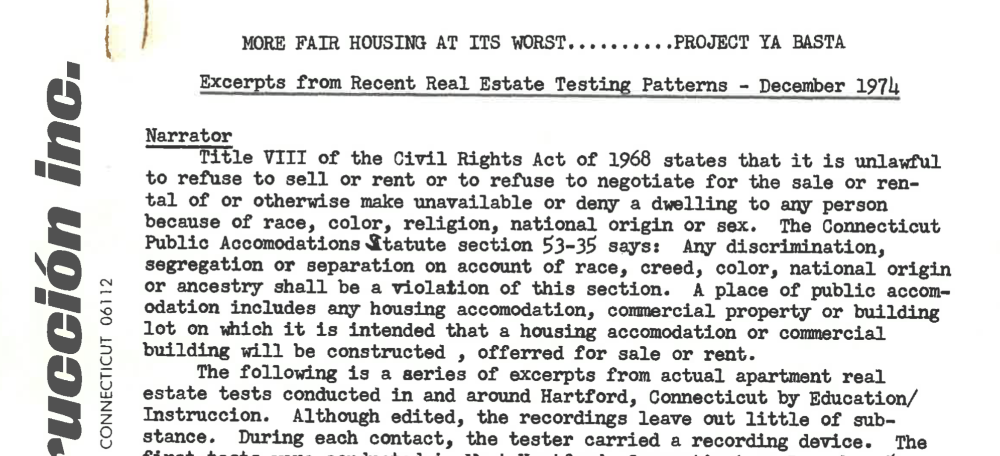

## Mobilizing Against Racial Steering and Redlining {- #mobilizing}
*by [Jasmin Agosto, Vianna Iorio, and Jack Dougherty](authors-and-contributors.html)*

In the early 1970’s, Julia Ramos, Ben Dixon, and Boyd Hinds gathered in a small storefront office at 1170 Albany Avenue, located in a predominantly Black neighborhood in the North End of Hartford. Armed with scissors, glue, and string, they cut, pasted, and connected the names of board members from leading corporations and government: the big banks, insurance companies, real estate firms, and regulatory agencies. On their office wall, the trio mapped out the interconnected lines of power between a handful of wealthy White men who “sat on each other’s boards, who knew each other, and who were comfortable with each other.” This “spider web” visually depicted a concept that was difficult for many people to grasp: institutional racism. Collectively, these power brokers drew the lines that racially and economically segregated metropolitan Hartford, by deciding which neighborhoods received home mortgages and insurance, where different groups of people would be allowed to buy or rent property, and how everyone played the rules of the game. This was the beginning of Education/Instrucción, and its mission was to mobilize people to “eliminate racism wherever it existed.”[@grenierOralHistoryInterview2009]

Ramos, Dixon, and Hinds co-founded Education/Instrucción, an innovative team with an intentionally bilingual name, designed to teach Hartford communities and organizations to use their power to challenge institutional racism. Originally, this multicultural trio met as teachers at Westledge, a private school in suburban Simsbury, Connecticut. Although the school promoted racial equality, none were fully satisfied in this isolated setting, as they dreamed about tackling broader political and economic issues beyond the classroom. Hinds asked Ramos and Dixon to join him, on equal footing as co-directors, to start a new Hartford-based organization to take on larger challenges of institutional racism in housing, education, and employment.^[@grenierOralHistoryInterview2009] The trio came from starkly different backgrounds but shared a common moral compass that drove their activism. Julia Ramos, a Puerto Rican woman and recent graduate of the University of Hartford, had learned to speak Spanish, English, German, and French by living in various bases with her father, who served in the US military. She worked as a translator at Travelers Insurance, one of Hartford’s largest corporations, then later became the assistant director for an anti-poverty organization, the Poor People’s Federation. Ben Dixon, who grew up in Hartford’s North End, learned about inequality and power as a Black student during the 1950s at Hartford Public High School. When he was assigned to the vocational track, his mother marched into the superintendent’s office and insisted that he be moved up to the college preparatory track. He later earned his degree from Howard University and returned to Hartford to become a music teacher. Boyd Hinds, a White man who graduated from Amherst College, developed his organizational skills in the telecommunications business world and also as an educator. Later, he and his wife Wendy moved their family from an all-White suburb to live in Blue Hills, a racially-mixed neighborhood in Hartford’s North End. People called their trio, as pictured in Image \@ref(fig:1974circa-ei), the "Mod Squad," referring to the late-1960s television show starring three multicultural undercover crime fighters, because as Ramos recalls, “when they saw us coming, they always expected some kind of problem or issue to arise.”^[@grenierOralHistoryInterview2009; @dixonOralHistoryInterview2010; @humphreysMemoryBoydHinds2011; @education/instruccionCodirectorsBoydHinds1974]

(ref:1974circa-ei) Education/Instrucción Co-Directors Boyd Hinds, Julia Ramos McKay, Ben Dixon, circa 1974.

```{r 1974circa-ei, fig.cap="(ref:1974circa-ei)"}
 knitr::include_graphics("images/1974circa-education_instruccion_dixon-papers.jpg")
```

When Hinds, Ramos, and Dixon initially launched Education/Instrucción (EI) as a non-profit organization in July 1971, they pitched their “consulting services” to advance “cultural pluralism” in educational, governmental, and business organizations across the Hartford region. EI conducted training sessions and anti-racism workshops, and offered Spanish/English translation and program evaluation, to help their clients identify and eliminate institutional bias within their organizations.^[@education/instruccioninc.BilingualPamphletcirca1970s] Hartford’s demographics were rapidly changing, with the city’s combined Black and Puerto Rican population reaching 30 percent in 1970. “You need to get ready for it,” Julia Ramos recalled telling business leaders, because “you are not going to have that many White people to turn to... [If] you want to continue to make money as an organization, you need to pay attention to that. Not only... to get employees, but to sell products.” Yet even when EI emphasized profits, Hartford’s business leaders were not receptive. So the trio found more creative and assertive approaches to push their agenda. For example, they bought one share of stock in several of Hartford’s largest corporate employers---such as Aetna, Travelers, and United Technologies---in order to attend the annual meeting of shareholders. “We would stand up and talk about the institutional racist practices of the company,” Julia Ramos recalled, and “people started coming out of the woodwork. We would get calls from some of the employees from some of these companies to give us information about what was going on.”^[@grenierOralHistoryInterview2009; @education/instruccioninc.HistoryOrganization1975]

Overall, Education/Instrucción mobilized both city and suburban residents to document and directly challenge the discriminatory lines that divided metropolitan Hartford, with two major successes. First, their “¡Ya Basta!” (Spanish for “Enough already!”) campaign organized the area’s first mass-participant investigation of racial steering by the real estate industry, by sending pairs of White, Black, and Puerto Rican testers to local offices, to compare differences in the properties shown and how they were treated. When EI publicized the damning evidence of discrimination that they had collected, the US Justice Department prosecuted Hartford’s leading real estate firms for violating the 1968 Fair Housing Act. Second, EI creatively publicized deeper levels of discrimination in the home mortgage and insurance industries, and lack of enforcement by Connecticut state regulators. Its series of “Fair Housing at its Worst” reports translated these complex issues into easier-to-understand text and graphics for everyday readers. But EI’s successes were tempered by limitations. Working with the US Justice Department, their out-of court settlement against Hartford’s leading real estate agencies yielded no financial penalties for decades of damages to Black and Puerto Rican families. Furthermore, although the “Mod Squad” was innovative, their work was not part of a sustainable institution, and EI eventually folded as its founders went their separate ways.

### ¡Ya Basta!: Taking Real Estate Racism to Court {-}
In 1973, the EI trio launched its ambitious campaign against racial steering in the Hartford-area real estate industry. They titled the project “¡Ya Basta! Sue the Bastards,” and defined their goal: “to bring statewide attention to the dual housing market problem and to strike deep at the institutionally racist and elitist causes.” This investigative study was motivated by local residents’ experiences with real estate agents who “steered” Black and Latino home buyers into predominantly minority or racially-mixed neighborhoods in Hartford and Bloomfield, but guided White homebuyers to nearly all-White suburbs such as Avon or West Hartford. Past attempts by Hartford-area activists to challenge housing discrimination from the 1940s through the 1960s were relatively isolated and short-lived. By contrast, EI and its ally, the Open Housing Coalition, systematically documented bias at Hartford’s largest real estate firms, using methods adopted from organizations such as National Neighbors. They trained dozens of White, Black, and Puerto Rican couples to become “testers,” who posed as clients during visits to real estate agencies, where they used the same script: “Tell us about what kinds of homes and communities are available through the $40,000 range.” As shown in \@ref(fig:1973-ya-basta-hinds-box5), testers carefully listened to how real estate agents spoke about different areas, especially racially-coded phrases such as “bad neighborhoods” or “poor schools” or “those people.” The testers wrote detailed accounts of what agents told them. In total, EI mobilized over 100 volunteers from activist and religious networks to conduct 600 hours of testing, and produce 150 pages of testimonial evidence on racial steering.^[@education/instruccioninc.ProjectYaBasta1973; @bishRacialSteeringDual1973]

(ref:1973-ya-basta-hinds-box5) Scroll the [full-screen document](http://ontheline.trincoll.edu/images/1973-ya-basta-hinds-box5.pdf) to read instructions for housing discrimination testers in the Ya Basta: Sue the Bastards project, 1973.

```{r 1973-ya-basta-hinds-box5, fig.cap="(ref:1973-ya-basta-hinds-box5)"}
if(knitr::is_html_output()) knitr::include_url("images/1973-ya-basta-hinds-box5.pdf") else 
```

To demonstrate persistent racial steering by real estate firms, volunteer testers wrote testimonials that provided damning evidence. For example, when Barbara and Richard Benson, a White couple, phoned the Hartford office of the Barrows & Wallace Company in August 1973, the receptionist directed them to the suburban Wethersfield branch. The Bensons arrived for their appointment, met real estate agent Tom Ryan, and told him that they had no preference about the location of homes, as long as it was within their price range. The agent explained that “there were three problems with living in Hartford:... high taxes... the poor school system... and integration.” If they wanted to live in Hartford’s West End neighborhood, the agent warned that “we would want our children out of the city by the time they were ready for middle school,” and that people already living there “sent their children to private school.” He also warned the Bensons against the Blue Hills neighborhood in Hartford’s North End, which he said “used to be all Jewish, and now it was all Black...” and “he said flatly that we did not want to live there.” Hartford’s South End also should be avoided, the agent told them, because “as the Puerto Ricans moved in, Italians moved out.” As the agent continued talking about the city, he shared his personal theory of “ethnic blocks that reacted like molecules bumping into one another.” Finally, he recommended to the Bensons that “West Hartford was obviously the kind of place where we wanted to be, but that we could not afford it” within their current budget “because he could not get us out of the city for that price.” Using a combination of overtly racial scare tactics and more subtle coded warnings, the agent clearly steered this White couple out of racially-mixed city neighborhoods to a White suburb.^[@usv.barrowsandwallacecompanyetal.DocumentsPertainingDefendants1974, PDF pp. 12-13; @usv.barrowsandwallacecompanyetal.PlaintiffCombinedAnswers1974, attachment I, paragraph 1a.]

To compare discriminatory treatment by race, organizers also arranged for Charles and Shirley Gray, a Black couple, to visit the same real estate office in August 1973, and offer the same price range. Real estate agent Larry Poulin sat them down and thumbed through a book of listings. First, he suggested “a broken down house” in Hartford’s South End, which he described as “a good neighborhood... [with] good schools... and a good buy.” Next, he pointed out a house in Hartford’s West End that “needed a little work” but “he said the schools were good,” the opposite of what his co-worker told the White couple. Even though their meeting took place in the suburban Wethersfield office, the agent solely recommended listings inside the city of Hartford. Only after persistent questioning about his occupation did Charles Gray reveal that he was a deputy commissioner for child and youth services, a state government agency. But even with new information about the client’s status and income, the agent did not offer to show homes in White suburbs. Instead, he referred the Grays to the Windsor branch of their firm, located to the north of Hartford, near the increasingly Black suburb of Bloomfield. After the Grays left the agent’s office, they looked through the newspaper and found several real estate listings that matched their desired home description and price range, which were located in White suburbs such as Newington and Simsbury. Most likely, the agent knew about these homes through the Multiple Listings Service, a clearinghouse for sharing information between real estate firms. But he never mentioned them to the Grays, to avoid violating the real estate industry’s prevailing but unwritten rule to steer Black homebuyers away from White neighborhoods and suburbs.^[@usv.barrowsandwallacecompanyetal.DocumentsPertainingDefendants1974, PDF pp. 7-8; @usv.barrowsandwallacecompanyetal.PlaintiffCombinedAnswers1974, attachment I, paragraph 1b.]

Organizers also invited residents of the Hartford region to share personal accounts of racial discrimination they encountered in the real estate industry, and these individual stories became more powerful when compiled into a comparative document. For example, real estate agents steered White and Black faculty from Trinity College in opposite directions. When Andrew and Toni Gold, a White couple, visited the J.W. Beach real estate office in West Hartford in December 1973, they told agent Gloria Winans that they wished to buy a home and mentioned that Andy would be teaching economics at Trinity College in Hartford. The agent recommended that they look in suburban Wethersfield or Newington, or perhaps the Foster Heights area of Hartford because “it was up on a hill and isolated from the rest of the city.” She warned that the rest of that area “was not safe and was changing,” and told two stories about friends who had been attacked or robbed by “a colored man” in other parts of Hartford.^[@usv.barrowsandwallacecompanyetal.DocumentsPertainingDefendants1974, PDF pp. 110-11; @usv.barrowsandwallacecompanyetal.PlaintiffCombinedAnswers1974, attachment I, paragraphs 6b, 4h. See also testimony by the Golds about their initial visit to find a home in Hartford in 1971, @usv.barrowsandwallacecompanyetal.DocumentsPertainingDefendants1974, PDF p. 86.]

By contrast, Ed Johnetta and James Miller, a Black couple, came to Hartford in 1972 when Jim accepted a position in the English Department at Trinity College. His wife called the Hurwit and Simons real estate firm to inquire about their ad for a home for sale in the Blue Hills neighborhood in the North End of Hartford. On the phone, a female agent responded, “Do you know anything about that neighborhood?... That it’s slowly turning into a Black ghetto?” The agent recommended homes outside of this area. In her account, Ed Johnetta stated that “It was clear to me that the Hurwit and Simons agent did not realized that I was Black. She assumed that because my husband was being hired by Trinity College, we were white buyers.” ^[@usv.barrowsandwallacecompanyetal.DocumentsPertainingDefendants1974, PDF p. 94; @usv.barrowsandwallacecompanyetal.PlaintiffCombinedAnswers1974, attachment I, paragraph 5b.]

In fact, EI collected so much damning evidence on racist real estate practices from testers’ reports that they devised creative strategies to publicize their findings. In early 1974, they compiled pages and pages of handouts that summarized the most glaring examples of racial steering, and mimeographed these for broader audiences. Later that year, EI organizers produced an audiotape with extended excerpts from rental apartment testers who carried recording devices. At one apartment building in West Hartford, near the Hartford border, a White male tester had this exchange with a White building superintendent, captured on a recorder:

> Tester: Tell me, what kind of neighborhood is it around here?  
> Building superintendent: Oh, this is a really good section here. You can’t beat nothing here. There’s no Puerto Ricans, no niggers around here.  

When the tester asked how building remained all-White amid the growing minority population nearby, the superintendent explained techniques that he and the White owner developed to avoid Fair Housing laws. When prospective tenants phoned to ask about rentals advertised in the local newspaper, the superintendent explained that “we don’t put up the price over the phone unless we’re really talking to somebody that, you know, we’re sure that they are white.” In cases when Blacks show up to look at the rental, the superintendent described how “I just jack up [the price]... We’re sure they won’t take it because they can’t afford it.” If necessary, the superintendent required Blacks to fill out a “long form” with “all kinds of questions” about their occupation, to discourage them from renting.

About 45 minutes after the White tester left, a Black female tester approached the same superintendent to ask if any apartments were available. “Not in this building here,” the superintendent replied. “You missed by a couple of hours.” He falsely claimed that the White tester already paid a deposit for the last unit. Then 5 minutes after the Black tester left, the White tester returned to ask if the unit is still available. “We had more people come in right after you,” the superintendent explained, “and I told... because she was a colored girl, I told her the place was already taken.” After capturing this blatant evidence of racial discrimination on audiotape, EI organizers played an edited recording, with narration, for audiences that included newspaper editors, churches, the metropolitan board of realtors, state lending regulators, and federal housing officials, as shown in \@ref(fig:1974-YaBastaExcerpts).^[@education/instruccioninc.HartfordAreaHousing1974; @education/instruccioninc.MoreFairHousing1974; @education/instruccioninc.HeGotSecret1974]

(ref:1974-YaBastaExcerpts) Scroll the [full-screen document](http://ontheline.trincoll.edu/images/1974-YaBastaExcerpts-Hinds-box5.pdf) to read the transcript of housing tester secret tape-recordings in the Ya Basta: Sue the Bastards project, 1974.

```{r 1974-YaBastaExcerpts, fig.cap="(ref:1974-YaBastaExcerpts)"}
if(knitr::is_html_output()) knitr::include_url("images/1974-YaBastaExcerpts-Hinds-box5.pdf") else 
```

EI organizers and their allies shared their evidence with sympathetic lawyers at the US Department of Justice in early 1974, who requested that FBI agents launch an investigation. Front-page news on racial discrimination rattled the metro Hartford real estate industry. It also troubled Connecticut’s real estate commission, which publicly questioned EI’s tester evidence and complained that they should have brought the case to their state agency, rather than the federal government, despite their past inaction. Shortly afterwards, federal attorneys filed a lawsuit, _US v Barrows and Wallace Company et al._, which charged 7 of the 8 largest real estate brokerage firms in metropolitan Hartford with violating the Fair Housing Act of 1968. These real estate firms were:

- The Barrows and Wallace Co., Hartford
- The T.R. Preston Co., West Hartford
- The Heritage Group, Inc., West Hartford
- Bulkeley Realtors South, Inc. & Bulkeley Realtors West, Inc., Wethersfield
- Hurwit & Simons Realtors, a Partnership, West Hartford
- J. Watson Beach Real Estate Co., Hartford
- Colli-Wagner Realty Co., Hartford

According to lawsuit, real estate firms "steered" White buyers away from racially mixed neighborhoods in Hartford and Bloomfield, and instead funneled in Black and Puerto Rican buyers. Together, these seven firms employed about 170 sales agents, who sold about 1500 homes annually in the region. Based on over 30 documented cases by housing testers, the government argued that discrimination did not arise merely by the actions of individual agents, but was caused systemically by these major real estate firms. In addition, activists from the region’s only racially-mixed suburb, Bloomfield, joined with the plaintiffs in _US v Barrows and Wallace_ to challenge blockbusting, another real estate tactic that played on White racial fears to turn a quick profit.^[@usv.barrowsandwallacecompanyetal.PlaintiffMemorandumSupport1974; @FBIProbesCharges1974; @reganRealEstateUnit1974; @williamsSuesAreaRealty1974; @uscongressPublicLaw902841968. Also, Education/Instruccion filed a state-level employment discrimination complaint against the Greater Hartford Board of Realtors and the seven firms, which counted only 3 minority workers among its 330 employees, in @RealtorsChargedUnfair1974.]

Although EI activists and their allies won an out-of-court settlement in _US v Barrows and Wallace_, the remedy focused on educational programs for real estate agents, with no financial penalties. All seven firms signed a consent decree in July 1974, which contained no admission of “unlawful conduct,” but instead a promise to obey the Fair Housing Act of 1968 and take affirmative measures to comply with the law. Specifically, the firms agreed to refrain from “refusing or failing to show” or “providing or volunteering different information about homes” or “influencing the residential choice of any person” on the basis of race, color, religion, or national origin. The decree expressly prohibited sales tactics such as “discouraging white prospective buyers from inspecting or purchasing homes in racially transitional areas” (one type of racial steering) and “‘cold canvassing’ in areas of racial transition” (also known as blockbusting). The real estate firms agreed to educate all employees about these rules, prominently display “Equal Housing Opportunity” slogans in their offices and advertisements, and to reach out to prospective minority home buyers in the future. Over the next few months, they submitted compliance reports and real estate sales activity data by race to the court, as required by the consent decree, until the US Justice Department moved to dissolve the order in 1977. But these real estate firms never admitted wrongdoing, nor did they pay any financial compensation to Black and Puerto Rican families who were blocked from moving to higher-opportunity suburbs. EI had won a victory, but only a partial one. They turned their attention to the next phase of the struggle.^[@usv.barrowsandwallacecompanyetal.ConsentDecree1974; @kauffmanFirmsSignAntibias1974; @lowensteinRealEstateFirms1974; @goodmanLetterUSDistrict1977]

### Exposing Institutional Racism through *Fair Housing At Its Worst* {-}
Education/Instrucción did not cease with its limited legal victory against racial steering by real estate firms. Instead, as Boyd Hinds led the expansion of EI’s scope in the mid-1970s, the organization challenged racial discrimination across what it described as an “overlapping, interlocking, and powerful” political and economic network. Segregation was caused not only by _individual racism_ of one real estate broker toward a prospective buyer, but rather by a broader network of _institutional racism_ where real estate firms collaborated with insurance companies, influential banks, and the state regulatory agencies that were supposed to serve as government “watchdogs” for the public interest. Together, EI charged this network with taking actions that favored the interests of White suburbanites over Black and Puerto Rican city residents, and thereby intensified the boundaries between them. To expand both their analysis and audience, Hinds and his EI colleagues published an innovative series of ten reports from 1974 to 1978, titled _Fair Housing At Its Worst_. This series of reports revealed how this powerful network intentionally maintained segregation in the metropolitan Hartford region by violating the federal Fair Housing Act (reports 1-8) and promoting mortgage and insurance redlining (reports 9-10). To help audiences make the conceptual leap from individual to institutional racism, Education/Instrucción creatively used 70s-style graphic design, data, and maps, as shown in \@ref(fig:1974-fairhousingreports-ctda.png) and \@ref(fig:1972-74-EI-images).^[@education/instruccionFairHousingIts1974h. In Report 2, EI's preliminary statement credited national networks of housing activists, such as @helperRacialPoliciesPractices1969. On creative advertising, see @education/instruccioninc.WhatCreatesMaintains1972; @education/instruccionFairHousingIts1974c; @education/instruccionFairHousingIts1974a]

(ref:1974-fairhousingreports-ctda) Explore the ["Fair Housing At Its Worst" series of ten reports](http://hdl.handle.net/11134/120002:otl-ei-fairhousingworst), based on originals in the Boyd Hinds Papers at the Hartford History Center, and shared online through the Connecticut Digital Archive.

```{r 1974-fairhousingreports-ctda, fig.cap="(ref:1974-fairhousingreports-ctda)"}
 knitr::include_graphics("images/1974-fairhousingreports-ctda.png")
```

(ref:1972-74-EI-images) Education/Instrucción creatively communicated its message by placing ads in the 1972 Hartford Courant Sunday real estate section to ask "What Creates, Maintains, and Condones over 99% White Population in the Hartford Suburbs?" and "Can You Understand Institutional White Racism?" (left). Its 1974 *Fair Housing At Its Worst* report 4 placed 1970s racial census data on a map to illustrate segregated housing (center), and report 2 showed layers of corporate and governmental control over the housing market (right).

```{r 1972-74-EI-images, fig.cap="(ref:1972-74-EI-images)"}
 
 ```

EI’s expanding analysis of the institutional networks that housing discrimination appears in the progression of topics in the _Fair Housing At Its Worst_ reports. In the first set of reports (number 1-4, published in February 1974), EI outlined its investigation of racial steering by real estate firms. Complicit in this discrimination, EI claimed, were industry associations (such as the Greater Hartford Board of Realtors, which tolerated racist actions by many of its members) and state regulators (such as the Connecticut Real Estate Commission, which refused to enforce existing laws against racist sales practices). But after the 1974 _Barrows_ case brought weak penalties against the real estate industry, EI activists pivoted their campaign to demonstrate complicity by larger corporations and the federal government. The second set of reports (numbers 5-8, published May 1974) criticized Hartford’s leading businesses (such as Travelers Insurance) for promoting employee relocation services that steered new hires out of the city, and encouraged them to buy homes in the suburbs. Also, EI charged the US Department of Housing and Urban Development with failing to reverse federal mortgage programs that favored all-White suburbs, such as Federal Housing Administration loans from the 1930s through the 1950s [described in the Federal Lending and Redlining](separating.html#federal-lending-and-redlining) section in this book, as well as the Section 235 program of the 1970s. Furthermore, pointed out how Connecticut’s weak regional government failed to act against powerful White suburban interests. During the early 1960s, Hartford’s federally-certified development authority, the Capitol Region Planning Agency, warned how local land-use policies caused racial and economic segregation. But in 1971, this same agency opposed opposed state legislation to halt exclusionary zoning practices, and thereby blocked affordable housing programs in favor of more expensive (and racially exclusive) single-family home construction.^[@education/instruccionFairHousingIts1974h, report 5, p. 89; report 6, pp. 99-105; report 7, pp. 108-118.]

In their third and final set of reports (numbers 9-10, which began in 1974 but were not published until 1977-78), Boyd Hinds and EI confronted Hartford banking and insurance corporations over “redlining.” Generally defined as denying mortgage loans or homeowner insurance due to an area’s racial composition---and depicted with red ink on a map---this discriminatory practice can be traced back to the infamous Home Owners’ Loan Corporation residential security maps of the 1930s, as described in the [Federal Lending and Redlining](separating.html#federal-lending-and-redlining) section in this book. But since these Depression-era maps were hidden from the public, the phrase “redlining" (sometimes spelled “red-lining”) did not become popularized until the late 1960s, when civil rights activists began using the term, which then appeared in press reports and publications.^[See early instances of “red-lining” in the national press by New Jersey Governor Richard Hughes and National Urban League Executive Director Whitney Young in @semplejr.PanelProdsGhetto1967 and @InsurersAreWarned1967.]

Boyd Hinds most likely encouraged staff members of the US Commission on Civil Rights to investigate discriminatory home lending practices by Hartford-area banks in its 1974 report, _Mortgage Money: Who Gets It?_. This case study focused national attention on Hartford, a leading financial center, and revealed unfair treatment of racial minorities and women who applied for home loans. Although the federal report did not name specific lenders, local journalists soon revealed that the study was based on nine large banks that provided most of the conventional home loans in the Hartford region at that time:

- Hartford Home Savings & Loan Association
- Hartford National Bank & Trust Co.
- Windsor Federal Savings & Loan Association
- Mechanics Savings Bank
- State-Dime Savings Bank
- Hartford Federal Savings and Loan Association
- Connecticut Savings and Loan Association
- Connecticut Bank & Trust Co.
- Society for Savings

Prior to its report, the US Commission on Civil Rights held public hearings, where Hartford residents described the redlining practices they witnessed. For example, real estate agent Mark Lawrence explained how banks simply refused to fund mortgages in racially “transitional” areas, such as the Asylum Hill neighborhood near downtown Hartford. Boyd Hinds charged that Connecticut’s regulatory agencies failed in their responsibility to prevent racial discrimination by the banking, insurance, and real estate industries. Sally Knack, who authored the report for the US Commission on Civil Rights, told local reporters that the Commission’s findings had been forwarded to Congress and the White House, and that “we expect some action on it.” The report contributed to the passage of a new federal law, the Home Mortgage Disclosure Act of 1975 (HMDA), which improved monitoring of discrimination by requiring lenders to publicly share data on mortgage applications and approvals.^[@u.s.commissiononcivilrightsMortgageMoneyWho1974; @reganLeadersPolicyBiased1974; @reganAreaBanksNamed1974; @uscongressPublicLaw942001975]

Armed with newly-available public HMDA data, Hinds and his colleagues published a 1977 report that challenged Hartford-area banks with “disinvestment” in urban areas. According to EI, the City of Hartford invested its employee pension funds in local banks, which in turn reinvested this money in home mortgages in predominantly White suburbs, thereby funneling funds away from urban neighborhoods. But others argued that HMDA data was insufficient to prove that the banks were guilty of redlining. Trinity College professor Andrew Gold, who had participated as a housing discrimination tester for EI in the early 1970s, wrote a report for the State Banking Commissioner in 1977 that challenged the civil rights organization’s analysis. Given that HMDA data for 11 Hartford-area banks only revealed the number of loans and their dollar amounts, Gold concluded that due to “the absence of information on the demand for loans, it is impossible to know if redlining (or disinvestment) occurred. Of those loans that were made, we do not know if, how or why the terms may have differed between the city and suburb." In other words, although banks made more loans to suburbs than the city, that fact could be explained by other factors, and by itself did not prove discrimination.^[@education/instruccionFairHousingIts1977, pp. 185-192;  @goldReportStateBanking1977, p. 37]

But even if federal HMDA data did not prove the existence of redlining, EI’s final report made a strong case against Hartford’s insurance industry by using testers. In order to qualify for a home loan, mortgage lenders typically required that applicants also obtain a homeowner’s insurance policy to cover any damages to the property in order to protect the bank’s investment. But EI charged that homeowners’ insurance policies were subject to discriminatory redlining by racial composition of the neighborhood. EI staff conducted homeowner’s insurance testing by phone. Testers contacted insurance agents about coverage for identical types of homes (by size, construction, and age) in different areas of the city: a predominantly Black neighborhood in the North End of Hartford, a White neighborhood in the South End, and a White neighborhood in West Hartford. Overall, the influence of location was unmistakable. In the Black neighborhood, 9 out of 13 agents denied home insurance coverage, but they approved it for an identical home in a White neighborhood. On the phone, agents affiliated with major insurance corporations typically offered these reasons for denial of coverage:

> “It’s simply because of the location… You have a problem being up in the North End..."  
> ---agent affiliated with Travelers Insurance Company  
>  “Well, I will be honest with you. We have very little available that our companies will let us write anywhere in the City of Hartford.”  
> ---agent affiliated with The Hartford insurance company

Without homeowner’s insurance, mortgage lenders typically rejected buyers’ applications in Hartford neighborhoods, citing risks about the general location without considering the individual applicant or property. In the view of Boyd Hinds and EI, this evidence proved to them that the “spider web” network of real estate firms, leading banks, and insurance companies, with the approval of state regulators, favored investment in White suburbs, to the detriment of Black and Puerto Rican city neighborhoods. ^[@education/instruccionFairHousingIts1978, pp. 202-209]

### Successes and Limitations {-}
Looking back, the Education/Instrucción leadership trio of Hinds, Dixon, and Ramos and their supporters deserve credit for their accomplishments in civil rights activism during the 1970s. First, EI mobilized large numbers of city and suburban residents to serve as testers to challenge racial discrimination by Hartford’s largest real estate firms, and collaborated with the US Justice Department to win a court-approved settlement. Second, EI expanded the Hartford region's understanding of discrimination from individual actions by real estate agents to broader patterns of institutional racism. Through their creative public information campaigns, EI explained how real estate, banking, and insurance corporations---with the complicity of government agencies---intensified racial and economic divisions between the city and its suburbs.

But the Education/Instrucción story also reveals the limitations of activism during this era. Fighting an ambitious civil rights struggle on multiple fronts, with few victories that delivered tangible results, would be difficult for any organization to sustain, especially a small one such as EI. By the mid-1970s, the trio began to move in different directions. Julia Ramos decided to focus her work in the field of psychology, and she eventually left Hartford to obtain her doctoral degree. Ben Dixon saw education as a lever for social change, and he moved his way up through educational administration posts in city and suburban school districts, the Capital Region Education Council, and later as Connecticut’s deputy commissioner of education. Boyd Hinds identified government inaction as the root cause of the problem, so he entered politics and won election to the 8th District of the Connecticut General Assembly to represent Hartford's North End from 1976-80. While he soon became known as the most left-leaning representative in state government, his positions on issues limited his ability to form coalitions with moderate Democrats, and it diverted energy and funding away from the organization. While EI continued to exist on paper, it ceased operations in Hartford in 1979. "I am exhausted and overextended," Boyd Hinds wrote to Julia Ramos and Ben Dixon, and explained that all staff positions had been terminated due to lack of grant funds. "I intend to let EI remain dormant for awhile until I get my political involvement completed and my brother's business straightened out." He had already moved to spend half his time in Greenfield, Massachusetts, and he and his spouse Wendy tragically died in a car accident Vermont in 1988.^[@hindsLetterBenDixon1979; @dixonOralHistoryInterview2010; @grenierOralHistoryInterview2009; @grenierOralHistoryInterview2010; @humphreysMemoryBoydHinds2011]

Did the work of Education/Instrucción produce lasting reforms against racism? One answer appeared in 1989, when the *Hartford Courant* newspaper sent a team of Black and White investigative reporters to pose as homebuyers at Hartford-area real estate agencies. Back in 1974 when EI conducted similar testing, 7 out of 8 of Hartford’s largest real estate agencies racially steered buyers. In this 1989 *Courant* study, only 6 out of 15 agencies racially steered buyers, a noticeable improvement. But the *Courant* also found that 14 out of 15 agencies treated White testers more favorably than Black testers. In half of these cases, real estate agents subjected Black testers to significantly more scrutiny of their personal finances before showing them homes. Judging from this 1974 to 1989 comparison, the frequency of racial steering declined but persisted, despite being expressly prohibited by the 1968 Fair Housing Act and the 1974 *U.S. v Barrows* settlement that mandated equal opportunity training for real estate firms and their employees. Moreover, the 1989 study revealed how White buyers continued to enjoy hidden privileges in over 90 percent of their encounters with real estate agents. The lesson is clear: Education/Instrucción definitely made a difference, but institutional racism did not disappear. Rather, racism continued to evolve and express itself in ways that still favored White suburban interests. Civil rights victories had been won, but the larger struggle remained unfinished, with new challenges to be taken up by the next generation of activists.^[The 1989 *Courant* study also found that Black and White testers received equal treatment in only 1 of the 15 real estate firms, Armstrong Realty in Bloomfield, which also employed the only Black agent that testers encountered in all of their visits. @bixbyRealEstateAgents1989]

*[About the authors and contributors:](authors-and-contributors.html) Jasmin Agosto (Trinity 2010) wrote the first draft as her senior thesis, researched additional sources, and conducted oral history interviews.[@agostoFightingSegregationTeaching2010] Vianna Iorio (Trinity 2019) and Jack Dougherty expanded on her work for the final draft. Special thanks to Ben Dixon and Lisa Hinds Humphreys (daughter of Boyd Hinds), who both contributed their archives, which were combined into the [Boyd Hinds Papers](http://hhc2.hplct.org/boyd_hinds_pdf.pdf) at the Hartford History Center, Hartford Public Library.*

`r if (knitr::is_latex_output()) '<!--'`
 *[On The Line](http://ontheline.trincoll.edu) is an open-access, born-digital, book-in-progress by [Jack Dougherty and contributors](authors-and-contributors.html) at Trinity College, Hartford CT, USA. This work is copyrighted by the authors and freely distributed under a [Creative Commons Attribution-NonCommercial-ShareAlike 4.0 International License](http://creativecommons.org/licenses/by-nc-sa/4.0/). Learn more [about the book](about-the-book.html), including [how to read and cite](how-to-read-and-cite.html) and our [copyright with open-access policy and code repository](copyright-with-open-access.html). This book-in-progress was last updated on: `r format (Sys.Date(), '%d %b %Y')`*
`r if (knitr::is_latex_output()) '-->'`
