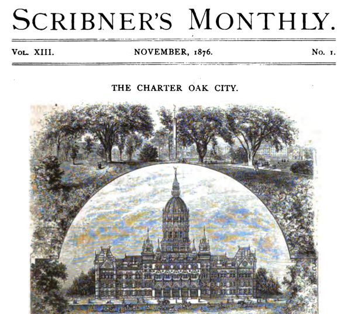
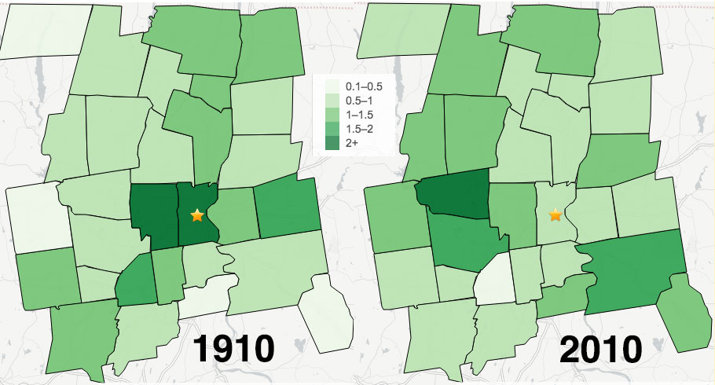
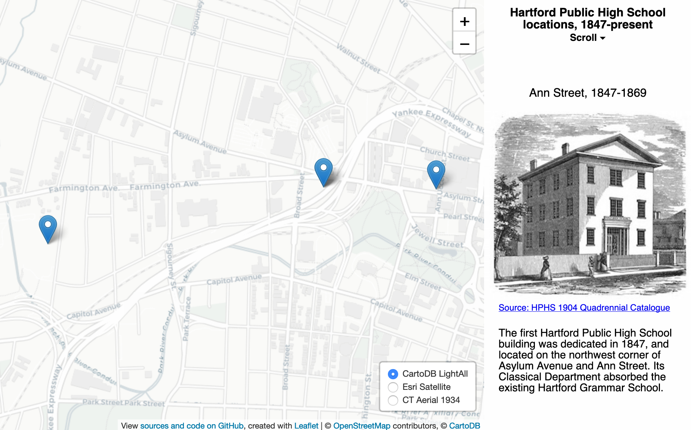
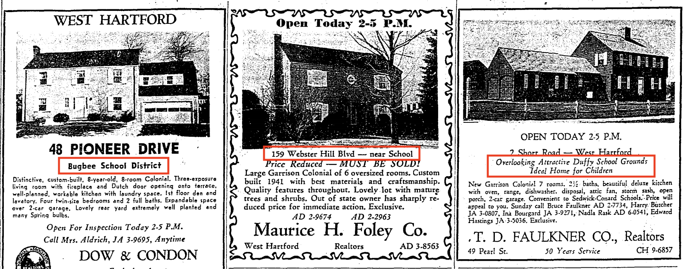

## Investigating Spatial Inequality with the Cities Suburbs and Schools Project {#investigating}

*I wrote this essay as an introductory overview to Hartford-area education and housing research, featuring studies conducted with students and faculty involved in the Cities, Suburbs, and Schools Project at Trinity College. It originally appeared in the 2011-12 preview edition of On The Line, and was later published in Xiangming Chen and Nicholas Bacon's 2013 edited volume on Hartford. This version has been revised and expanded to include more recent works and digital features.*[@doughertyInvestigatingSpatialInequality2013]

For over a decade, Trinity College students, colleagues, and I have worked together on the [Cities, Suburbs, and Schools Project](http://commons.trincoll.edu/cssp/) to better understand the past and present relationship between public education and private housing in metropolitan Hartford, Connecticut.^[Cities Suburbs and Schools Project at Trinity College, <http://commons.trincoll.edu/cssp>.] The CSS Project refers to the collective work done by undergraduates in the interdisciplinary seminar I teach, as well as independent studies, summer research assistantships, and other presentations and papers with student and faculty co-authors. Together, we formulate research questions from provocative readings from literature in history and the social sciences, and design studies using historical, qualitative, and/or quantitative methods to test these ideas in the Hartford region. Several leading scholars have kindly provided guidance and critical feedback via conference calls and professional meetings. Inspired by Trinity's broader [Community Learning Initiative](http://cher.trincoll.edu), we also have conducted several research projects in collaboration with local partner organizations, which help us to frame questions, identify sources, and interpret our findings.^[Community Learning at Trinity College, <http://cher.trincoll.edu>.]

In its broadest sense, our work explores spatial inequalities arising from the increasingly tightening bonds between schooling and housing in the city-suburban Hartford region over the last century. Looking back, our past has been shaped by the lines we have drawn to separate ourselves. Real estate agents maintained the color line. Mortgage lenders engaged in discriminatory redlining. Locally elected officials drew exclusionary residential zoning lines. Suburban homebuyers shopped for better opportunities on the other side of public school attendance lines. As these boundaries became more powerful over time, civil rights activists fought to cross over, redraw, or erase these lines.

The story of schooling and racial inequality in Greater Hartford has attracted many scholars and journalists, most notably Christopher Collier's encyclopedic history, *Connecticut's Public Schools*, and Susan Eaton's close examination of one classroom amid the Sheff v O'Neill segregation case in *The Children in Room E4*.[@collierConnecticutPublicSchools2009; @eatonChildrenRoomE42007] The work of the CSS Project expands upon this literature by analyzing how the relationship between schooling and housing became more influential from the late nineteenth century to the present, generating the contemporary policy challenges of voluntary desegregation remedies and public school choice. Specifically, this chapter highlights and synthesizes research conducted by Trinity students who have worked with me to answer two questions. First, when and how did the most desirable schools shift from the city to selected suburbs, and what role did the real estate industry play in this transformation? Second, under growing pressure from civil rights activists, state and local government have implemented voluntary desegregation remedies and public school choice. Whose interests have been served by these policies—and whose have not? To answer those questions, we need to understand the historical evolution of the marketplace commonly known today as "shopping for schools," and recent policy reforms that have attempted to decouple public education and private housing.

#### Follow the Money from City to Suburbs {-}
Trinity students encountering this topic for the first time are astounded to learn about the stark economic disparity surrounding their campus. According to 2009 estimates from the US Census Bureau, Hartford ranks as the 4th poorest city among those with populations over 100,000 in the United States (excluding Puerto Rico), with an average family income of only $42,775 in 2009. Nearly three out of ten families in Hartford live below the current federal poverty line, currently around $22,000 for a family of four. But what is most striking is that this impoverished city is located inside the 13th richest metropolitan statistical area, ranked by more than 350 such areas across the United States. In the Hartford metropolitan region (currently defined by the Census as Hartford, Middlesex, and Tolland counties), the average family income reached $99,597 in 2009. When comparing the two columns in the table below, an income gap of over $56,000 separates the average family living inside the Hartford city boundary from those residing in the Hartford metropolitan area.^[“Average Family Income in the Past 12 Months in 2009 Inflation-Adjusted Dollars, Table SE:T:59” (American Community Survey 1-year estimates via Social Explorer, 2009), in author’s Google Spreadsheet, https://docs.google.com/spreadsheet/ccc?key=0AtmGKybdRLlZdDJEcDRxSXN1ZS1oZkNISmFEOE9jUEE.]

<!-- TODO: Decide if Markdown table format is adequate, or explore knitr::kable format -->

##### Table: Lowest Average Family Income in US Cities over 100,000 (excluding Puerto Rico), 2009 {-}
| Rank | City                                       | Avg Fam Income 2009 |
|----|---------------------------------------------------------|----------|
| 1  | Flint city, Michigan                                    | $40,368  |  
| 2  | Cleveland city, Ohio                                    | $40,600  |
| 3  | Detroit city, Michigan                                  | $41,443  |
| 4  | **Hartford city, Connecticut **                         | $42,775  |
| 5  | Dayton city, Ohio                                       | $43,406  |
| 6  | Hialeah city, Florida                                   | $45,010  |
| 7  | East Los Angeles CDP, California                        | $45,320  |
| 8  | Brownsville city, Texas                                 | $45,507  |
| 9  | Paterson city, New Jersey                               | $46,954  |
| 10 | Toledo city, Ohio                                       | $48,846  |
| 11 | Rochester city, New York                                | $49,072  |
| 12 | South Bend city, Indiana                                | $49,691  |
| 13 | Allentown city, Pennsylvania                            | $50,105  |
| 14 | Syracuse city, New York                                 | $50,220  |
| 15 | Laredo city, Texas                                      | $51,152  |

##### Table: Highest Average Family Income in US Metropolitan Statistical Areas, 2009 {-}
| Rank | Metro Statistical Area                                | Avg Fam Income 2009 |
|----|---------------------------------------------------------|----------|
| 1  | Bridgeport-Stamford-Norwalk, CT Metro Area              | $150,336 |
| 2  | Washington-Arlington-Alexandria, DC-VA-MD-WV Metro Area | $127,167 |
| 3  | San Jose-Sunnyvale-Santa Clara, CA Metro Area           | $120,407 |
| 4  | Trenton-Ewing, NJ Metro Area                            | $119,590 |
| 5  | San Francisco-Oakland-Fremont, CA Metro Area            | $118,713 |
| 6  | Boston-Cambridge-Quincy, MA-NH Metro Area               | $113,192 |
| 7  | Boulder, CO Metro Area                                  | $110,988 |
| 8  | Napa, CA Metro Area                                     | $106,579 |
| 9  | NY-Northern NJ-Long Island, NY-NJ-PA Metro Area         | $105,680 |
| 10 | Baltimore-Towson, MD Metro Area                         | $101,836 |
| 11 | Oxnard-Thousand Oaks-Ventura, CA Metro Area             | $100,854 |
| 12 | Naples-Marco Island, FL Metro Area                      | $100,466 |
| 13 | **Hartford-West Hartford-East Hartford, CT Metro Area** | $99,597  |
| 14 | Santa Cruz-Watsonville, CA Metro Area                   | $98,712  |
| 15 | Anchorage, AK Metro Area                                | $98,290  |

But the region did not always look this way. In 1876, national headlines declared Hartford to be "the richest city in the United States," relative to its number of inhabitants. When tabulating the value of all bank deposits, insurance company assets, and taxable property of homes and businesses, Connecticut's capital city outperformed more famous competitors such as New York and Chicago. To be clear, this claim defined "richest" based on corporate (rather than individual) wealth. By 1903, scholars such as Hartford Seminary sociologist Alexander Merriam pointed out that local wealth varied widely in Hartford, between residences of "wealthier citizens...scattered in different parts of the city" and "a slum of almost the first magnitude" along the Connecticut river. Nevertheless, the central city of Hartford served as an economic engine for the capital region well into the first few decades of the twentieth century.^[@clarkCharterOakCity1876; @merriamSocialSignificanceSmaller1903, reprinted as @merriamSocialConditionsSmaller1903]

(ref:1876-scribners-monthly2) Explore this [scrolling version](https://ontheline.github.io/otl-google-books-api/scribners-monthly-1876.html) of *Scribner's Monthly* in 1876, which declared Hartford as "the richest city in the United States," relative to its population. Digitized by Google Books.^[@clarkCharterOakCity1876]

<!-- set iframe height to 660px and width to 700px in custom-scripts.html -->
```{r 1876-scribners-monthly2, echo=FALSE, fig.cap="(ref:1876-scribners-monthly2)"}
if(knitr::is_html_output()) knitr::include_url("https://ontheline.github.io/otl-google-books-api/scribners-monthly-1876.html") else 
```

Where did the money go? One way to visualize the spatial redistribution of wealth from the City of Hartford to its suburbs is to track home values by town during the twentieth century. For each decade in the map below, the average dwelling or single-family home value is indexed to the region to correct for historical price inflation, with higher values represented by darker shades of green. While not a precise measure, the rough differences over time are striking. In 1910, the region's highest home values were located in the City of Hartford and its neighboring suburb of West Hartford. In second place were inner-ring suburbs with manufacturing jobs (such as East Hartford, Manchester, Windsor, and New Britain), followed by outlying farming towns to the west and southeast. In 1910, the average home value in Hartford was nearly $5,000, four times more than the average $1,200 home value in the agricultural community of Avon.

A century later, that relationship had reversed, as home values in the city fell to nearly the lowest in the region, while some outlying farm towns---known today as elite suburbs---climbed to the top. In 2010, the average sales price for a single-family home in Avon climbed to $536,000, more than three times the average $178,000 sales price in Hartford. In some eyes, the once-powerful city-based economic powerhouse had become a doughnut---a fiscally depressed center surrounded by an affluent suburban ring---though with wide variation in the middle. A closer look at recent data reveals wider variation across suburbs than most assume. The Connecticut Metropatterns report dispelled "the myth of the affluent suburban monolith" by illustrating how some suburbs face high levels of fiscal stress, based on the cost of educating their population of needy children relative to their local capacity to raise tax revenues.^[@orfieldConnecticutMetropatternsRegional2003; See home value data sources in "Calculating Wealth and Poverty in Past and Present” chapter, TO COME in this book.]

(ref:1910-2010-otl-home-value2) Explore the [full-screen interactive map](https://ontheline.github.io/otl-home-value/index-caption.html) of home values in Hartford County, 1910-2010. The most valuable single-family homes (in dark green) shifted from the capital city to selected suburbs over time. Click the tabs or use arrow keys to advance years. Hover over towns for details. Home values have been indexed (where county average = 1.0) to adjust for rising prices over time. Missing values appear in gray. Sources: 1910-1980 from Connecticut Tax Commissioner, author's calculation of average dwelling value from equalized assessments; 1990 from Capital Region Council of Governments, median single-family home sales price; 2000-10 from State of Connecticut, Office of Policy and Management, average single-family home sales price (2000-2010). Learn more in “Calculating Wealth and Poverty in Past and Present" chapter, TO COME in this book. View [historical sources and code](https://github.com/OnTheLine/otl-home-value) for this map, developed by Ilya Ilyankou and Jack Dougherty, based on an earlier version with UConn MAGIC.^[@ilyankouMapHomeValue2017]

<!-- set iframe height 575px in custom-scripts.html -->
```{r 1910-2010-otl-home-value2, echo=FALSE, fig.cap="(ref:1910-2010-otl-home-value2)"}
if(knitr::is_html_output()) knitr::include_url("https://ontheline.github.io/otl-home-value/") else 
```

#### The Rise of "Shopping for Schools" {-}
The status of Hartford's city and suburban school districts also reversed trajectories during this same period. A century ago, Hartford Public High School offered what nearly all agreed to be the best secondary education in the entire region, attracting students into the city. According to HPHS student records, one out of five students resided outside of Hartford, many in bordering towns, and paid tuition to enroll. Emerging suburbs typically had no high school or one that some viewed as substandard. In nearby Wethersfield in 1917, parents strongly objected to plans to eliminate Latin in their fledgling high school, while four members of the local school board sent their children to Hartford city schools. Two decades later, a prominent survey by Columbia University Teachers College praised Hartford's public high schools for "maintaining the 'gold standard' of its college preparatory students," with a reputation "widely and favorably known through eastern collegiate circles." As late as 1958, surveys of Hartford teachers reported it to be "common knowledge in education circles that the city of Hartford and its school system have enjoyed an excellent reputation as a good place in which to live and work over the past 20 years," according to Trinity researcher Eric Lawrence. At the same time, ten miles west of the city, the rural town of Avon ceased busing its older students to a neighboring district and began constructing their own high school building. By the late 1990s, after decades of urban decline nearly caused Hartford Public High School to lose its accreditation, Avon High School claimed title to the most prestigious public secondary education in the Hartford region.^[@hartfordpublichighschoolStudentRecords1882; @KicksSchoolsWethersfield1917, p. 11; @strayerHartfordPublicSchools1937, pamphlet X, p. 13; @PersonnelPoliciesReport1958, cited in @lawrenceTeacherSuburbanizationDiverging2002.]

(ref:1847-otl-hphs2) Scroll down this [interactive storymap](https://ontheline.github.io/otl-hphs) to view images of Hartford Public High School as it moved to different locations over time. View [historical sources and code](https://github.com/OnTheLine/otl-hphs) for this map, developed by Ilya Ilyankou and Jack Dougherty.^[@ilyankouMapHartfordPublic2017]

```{r 1847-otl-hphs2, echo=FALSE, fig.cap="(ref:1847-otl-hphs2)"}
if(knitr::is_html_output()) knitr::include_url("https://ontheline.github.io/otl-hphs") else 
```

What attracted white middle-class families to move from the cities to the suburbs? Ken Jackson's *Crabgrass Frontier*, which paved a way of thinking for a generation of suburban historians, boiled down the causes of post-war mass suburbanization to "two necessary conditions...the suburban ideal and population growth—and two fundamental causes—racial prejudice and cheap housing." Indeed, there is supporting evidence for Jackson's thesis in the Hartford region, particularly the influence of discriminatory public policy decisions on private housing markets. For instance, my colleagues at the University of Connecticut Libraries MAGIC Center and I reconstructed Hartford area maps, originally created by the federal Home Owners' Loan Corporation and private lenders in 1937 to assess mortgage risks by neighborhoods. Officials coded the best investments in green, and the worst in red, which led them to be known in later years as "redlining" maps. But rather than evaluate only the physical property conditions, field agents were instructed to record the racial, ethnic, and social composition of current residents, based on the prevailing White standards of the time. The reports discouraged lenders from offering mortgages to neighborhoods with an "infiltration" of "Negro," "Foreign-born," and "Relief families," thereby favoring mortgage lending to White middle-class areas. Similarly, during the early 1940s, suburban West Hartford officials blocked African-Americans from moving into federally subsidized wartime public housing.^[@jacksonCrabgrassFrontierSuburbanization1985, p. 287; See [Federal Lending and Redlining, with Sean McGann](lending.html) and [Racial Barriers to Public Housing, with Emily Meehan](public-housing.html), both in this book.]

(ref:1937-otl-redlining2) Click on color-coded areas in this [interactive map](https://ontheline.github.io/otl-redlining/index-caption.html) to view neighborhood appraisals by the Home Owners' Loan Corporation (HOLC) in the Hartford area, 1937. HOLC prioritized neighborhoods to receive mortgage lending from the highest level (A, in green) to the lowest (D, in red). This federal agency worked with local banks and lenders to evaluate Hartford and over 200 other cities during the Great Depression. They measured not only physical conditions, but also the "social status of the population," and downgraded neighborhoods with non-white, immigrant, and poor residents. In later decades, activists labeled these discriminatory lending practices as "redlining." View [historical sources and code](https://github.com/OnTheLine/otl-redlining) for this map, developed by Ilya Ilyankou and Jack Dougherty, based on an earlier version with UConn MAGIC and the Kirwin Institute.^[@ilyankouMapFederalHOLC2017; @universityofconnecticutlibrariesmapandgeographicinformationcenterFederalHOLCRedlining2012]

<!-- set iframe 600px height 100% width in custom-scripts.html -->
```{r 1937-otl-redlining2, echo=FALSE, fig.cap="(ref:1937-otl-redlining2)"}
if(knitr::is_html_output()) knitr::include_url("https://ontheline.github.io/otl-redlining/") else knitr::include_graphics("images/1937-otl-redlining.png")
```

Around the same time, some West Hartford real estate developers wrote racially restrictive covenants into deeds that prohibited residents "other than the white race" from renting or buying property, which remained legally enforceable until 1948, as Trinity alumna Tracey Wilson and student researcher Katie Campbell discovered. These and other hidden chapters of Northern racial injustice, as well as activists' efforts to overturn them, have been recounted by Trinity researchers in [a special section of ConnectictHistory.org](https://connecticuthistory.org/trinity-college-students-call-attention-to-histories-of-inequality/). See also [Writing Greater Hartford’s Civil Rights Past with ConnecticutHistory.org](writing.html) with Elaina Rollins and Clarissa Ceglio, and [Restricting with Property Covenants](restricting.html) with Tracey Wilson and Vianna Iorio, both in this book.^[@TrinityCollegeStudents2013]

(ref:1940-otl-covenants2) Click on colored rectangles in the [full-screen interactive map](https://ontheline.github.io/otl-covenants/index-caption.html) of restrictive covenants in the Hartford area in the 1940s. Real estate developers wrote restrictions into property deeds that prohibited occupants “other than the Caucasian race." The U.S. Supreme Court approved these restrictions in the 1926 Corrigan v. Buckley ruling, but later declared them unenforceable in the 1948 Shelley v. Kraemer decision. Yet these restrictions still exist in official property records. To date, we have found 5 race restrictive covenants in West Hartford. If you know of similar restrictions, by race or religion, anywhere in Connecticut, [contact the author](http://ontheline.trincoll.edu). View [historical sources and the code](https://github.com/OnTheLine/otl-covenants) for this map, developed by Ilya Ilyankou and Jack Dougherty, based on an earlier version created with UConn MAGIC.^[@ilyankouMapRestrictiveCovenants2017; @universityofconnecticutlibrariesmapandgeographicinformationcenterRaceRestrictiveCovenants2012]

<!-- set iframe height 500px in custom-scripts.html -->
```{r 1940-otl-covenants2, echo=FALSE, fig.cap="(ref:1940-otl-covenants2)"}
if(knitr::is_html_output()) knitr::include_url("https://ontheline.github.io/otl-covenants/") else knitr::include_graphics("images/1940-otl-covenants.png")
```

But Jackson does not explain how public schools fit into his equation, because their role shifted over time. During the immediate post-war years, doubts about the quality of schools in new suburbs meant that they did not serve as a primary motivator for leaving Hartford. Yet by the late 1950s and 1960s, suburban schools became powerful magnets that, on their own, began to attract White middle-class families. How do we explain this shift? The story of post-war metropolitan history needs to address how real estate interests, suburban homebuyers, and government officials contributed to the rise of a relatively new practice known as [Selling and Shopping for Schools](selling.html), as described in more detail elsewhere in this book."^[@doughertyShoppingSchoolsHow2012]

Migration out of Hartford was not driven by a perception of higher-quality suburban schools in the late 1940s and early 1950s. In several oral history interviews that Trinity researcher Jacqueline Katz conducted with former Hartford residents who moved to suburbs in the immediate post-war era, none mentioned educational quality as a deciding factor. Clifford Floyd, a Hartford insurance accountant who moved to Avon in 1952 with his spouse and three young children, gave a typical response. "We didn't come to Avon because of the schools," he explained. "We just thought it would be better to have a lot more land for the kids to play around in." Even in West Hartford, where suburbanization began decades before the war, local newspaper editor Bice Clemow found low standards in school facilities, curriculum, and teacher salaries when using a survey drawn from Life magazine. "If we lived in a mill town, where the income level was modest, it would not be startling to find that we could not afford the best in public education," wrote Clemow. "To document that we have grade B- secondary education available in West Hartford is a shock of another order."^[@floydOralHistoryInterview2003, cited in @katzHistoricalMemoryTransformation2004; @clemowLaymanLooksSchools1951]

The rise of suburban schools can be attributed partly to the actions of real estate firms, which promoted selected private suburban homes by marketing their access to more desirable public schools. In West Hartford, as school enrollments grew with the post-war baby boom, a heated controversy arose at a 1954 school board meeting over a proposal to address overcrowding by redistricting neighborhoods to less crowded schools. Parents who objected based their views on the real estate market. "Whenever real estate men sell property, they tell their clients that they are in the Sedgwick, Webster Hill, or Bugbee areas," attendance zones on the newly-constructed western side of town. Superintendent Edmund Thorne responded by blaming real estate agents for creating "social class consciousness" in the suburb, and asked, "Doesn't it boil down to some people thinking there is more prestige to going to one school than another?" But what Thorne perceived as an imaginary distinction was becoming very real for suburban homebuyers.^[@NewSchoolLines1954]

Newspaper advertisements reflect the rise of "branding" marketing by real estate firms during the 1950s and 1960s. Trinity researcher Kelli Perkins and other students compiled a sample of real estate ads in the Hartford Courant Sunday edition from 1920 to 1990. We tabulated the proportion of ads that mentioned a specific school by name, rather than a generic description such as "near school." Compared to other suburbs, West Hartford had the highest proportion of school-specific ads, peaking at 38 percent of all residential ads in the town in 1965. Through marketing, real estate firms sought to increase the dollar value of a private home by signaling its location within what homebuyers perceived as a more desirable public school attendance zone. Simply moving into the suburb of West Hartford was no longer sufficient: success also entailed buying into the "right" neighborhood" to attend a "good" public school.^[@doughertyShoppingSchoolsHow2012]

(ref:1960-branding2) Three West Hartford private real estate ads in 1960, with public schools highlighted in red. Copyrighted by the *Hartford Courant*, reprinted here under Fair Use guidelines.^[@DisplayAdWest1960]

```{r 1960-branding2, echo=FALSE, fig.cap="(ref:1960-branding2)"}
 
```

But real estate firms did not treat all suburbs equally. Most agents refused to sell homes to Blacks in any suburb in the region during the 1950s, but they eventually shifted their stance on one town, Bloomfield, located on the northern border of Hartford and West Hartford. Middle-class African Americans such as Spencer Shaw, a librarian from the city of Hartford, reported having had "several refusals before from real estate people," yet finally succeeded in purchasing a home through an agent in the early 1960s, from a Greek couple in Bloomfield. The sale sparked a racial transition. "I think within about two months, four or five of the other families moved out," Shaw told Trinity interviewer Jacqueline Katz.^[@shawOralHistoryInterview2003, cited in @katzHistoricalMemoryTransformation2004]

(ref:2003-shaw-spencer2) Spencer Shaw, a Black Hartford resident, successfully purchased a home in a White neighborhood in Bloomfield in the early 1960s. Photo by Jacqueline Katz.

```{r 2003-shaw-spencer2, echo=FALSE, fig.cap="(ref:2003-shaw-spencer2)"}
 
```

Real estate firms engaged in two discriminatory practices—block-busting and racial steering—that shaped the composition of Bloomfield and neighboring suburbs during the late 1960s and 1970s. In block-busting, a real estate agent introduced Black homebuyers into a White neighborhood to scare owners into selling their homes below market value to the agent, who immediately resold them above market value to Black buyers. This sales technique played on White racial fears to make a quick profit. Trinity researcher Aleesha Young compared city directory listings for selected streets where block-busting occurred in Bloomfield, and found some, such as Alexander Road, experienced a residential turnover rate of 41 percent from 1970 to 1975. In the related practice of racial steering, real estate firms diverted Black buyers to home sales in areas such as Bloomfield, while redirecting White buyers to places such as Avon and West Hartford. According to witnesses such as John Keever, a White homebuyer who asked to view homes in Bloomfield, real estate agents "made innuendos about the school system" there and warned about racial attacks against his daughter, but spoke about White suburban school districts in "glowing terms." Together, busting and steering contributed to the racial population of the Bloomfield school district changing at a much faster rate than the town at large, illustrating a strengthening bond between public schools and private real estate, in the opposite direction.^[@youngRealEstateRacial2005; Keever quoted in @rossRealtyBypassingTold1973, p.52]

Local organizations, with assistance from National Neighbors, a multi-racial advocacy group, led different challenges against real estate firms in the Hartford region. Adelle Wright, chairwoman of Bloomfield's Human Relations Committee, recalled the "snowstorm of signs" on streets visited by block-busting real estate agents. The signs "reminded the people going into that neighborhood, every day of their lives [that], 'My neighborhood is turning. I might be the last one here'," she recalled in an interview with Trinity researchers. In 1973, Wright's committee persuaded the Bloomfield town council to pass an ordinance against door-to-door and telephone solicitation by real estate agents, and a ban against "for sale" and "sold" signs being posted in front of private homes.^[@wrightOralHistoryInterview2005]

(ref:2005-wright-adelle2) Adelle Wright organized Bloomfield residents against real estate block-busting in the early 1970s.

```{r 2005-wright-adelle2, echo=FALSE, fig.cap="(ref:2005-wright-adelle2)"}
 
```

Meanwhile, a Hartford-based organization known as Education/Instrucción, led by a trio of activists—Ben Dixon, Boyd Hinds, and Julia Ramos—mounted a broader challenge against discriminatory practices across the entire real estate and lending industry. In 1973, they organized teams of testers to visit real estate firms and pose as buyers to document racial steering, which was a violation of the 1968 Fair Housing Act. As Ramos explained in an oral history interview with Trinity researcher Jasmin Agosto, she and a Latino male "posed as a couple that barely spoke English, you know, our English was supposedly very minimal to a West Hartford real estate company. We walked in and basically made known through gestures and a little bit of English that we wanted to buy a house in West Hartford." After some back and forth with the real estate office staff, "we were steered to the North End of Hartford and the South End of Hartford, shown houses and given listings in these two locations. All of this we taped." With dozens of detailed accounts like this, activists built a legal case against eight large real estate firms in the Hartford area, and persuaded the US Justice Department to prosecute them for racial steering. In addition, Education/Instrucción published a series of reports, *Fair Housing at its Worst*, which extended charges of discrimination to mortgage lenders, downtown insurance corporations, and complicit government regulators. Although the court case resulted in a settlement against the real estate firms, they denied all wrongdoing and received a relatively mild penalty: monitoring and mandatory training on fair housing law. See also [Mobilizing Against Racial Steering and Redlining](mobilizing.html) with Jasmin Agosto and Vianna Iorio, also in this book.^[@grenierOralHistoryInterview2009, cited in @agostoFightingSegregationTeaching2010; @education/instruccionFairHousingIts1974i]

(ref:1974circa-ei2) Education/Instrucción Co-Directors Boyd Hinds, Julia Ramos McKay, Ben Dixon, circa 1974.^[@education/instruccionCodirectorsBoydHinds1974]

```{r 1974circa-ei2, echo=FALSE, fig.cap="(ref:1974circa-ei2)"}
 knitr::include_graphics("images/1974circa-education_instruccion_dixon-papers.jpg")
```

The only large realty firm not to be charged with discriminatory practices was The R. W. Barrows Company. Former co-owner Larry Barrows spoke about real estate sales during this period during oral history interviews with Trinity researcher Cintli Sanchez. Barrows never used racial scare tactics nor had first-hand knowledge of those who did, but he conceded that, "We said some stuff we couldn't say now." He openly discussed racial, religious, and other qualities of neighborhoods and schools with clients. "I'm an old time liberal Democrat, so I would tell them, 'Mixed neighborhood, mixed schools,' and so forth," Barrows explained, to help his clients identify the social composition of the neighborhood they desired. Sometimes he had candid discussions with Jewish homebuyers, to help them break into neighborhoods that had previously excluded them. Barrows acknowledged that when real estate agents talked about schools, "we were making judgments on the teachers and principals, which we had no business doing." Still, Barrows emphasized that agents needed to be responsive to the needs of clients, especially Hartford's large insurance corporation employees, who transferred into the region and "were brainwashed before they even looked at houses," by co-workers who coached them to buy into a particular neighborhood. " As he remembered, "People used to call an agent, and they would say, 'I want to be in a certain school district'... They wanted somebody who really knew quite a bit about the schools and the districts and so forth. So that was how you got business."^[@barrowsOralHistoryInterview2007]

By the late 1980s, real estate firms had discovered how to respond to clients' requests about neighborhood school quality without violating fair housing laws. Rather than voicing their opinions, agents began distributing packets of school data, which became more widely available after Connecticut passed a 1985 law to create standardized student achievement tests (such as the Connecticut Mastery Test (CMT) and the Connecticut Academic Performance Test (CAPT), and subsequent requirements for uniform reporting of district data (the Strategic School Profiles). "Agents get so many questions from buyers about schools, and they are very conscious and concerned about giving out misleading information," Lynda Wilson, President of the Greater Hartford Association of Realtors, told a reporter in 1993. "They are afraid if they give wrong information, they can be accused of steering." Margaret O'Keefe, who had previously served as PTO president of two West Hartford schools, added that she understood new federal restrictions to mean it was permissible to share objective education data with clients, but not her own subjective judgments about the quality of individual schools. "You're treading on very dangerous ground," she concluded, "unless you have facts."^[@hathawayPriceNextQuestion1993]

The politics of the school accountability movement, combined with growing access to the Internet, fueled this data-driven wave of "shopping for schools" in the suburban housing market. In 1995, the Prudential Connecticut Realty Company opened its first experimental "computerized library," located at their West Hartford office, for potential buyers to browse photographs of homes and "information on communities' demographics and school systems." The Connecticut Department of Education launched its own website in 1996, and began to include test score data for individual schools for the first generation of web surfers in 1997. By the year 2000, homebuyers with computer access could easily and instantly view details about local schools, whether located around the corner or across the country. Part of the data revolution was driven by state education agencies, to comply with the federal No Child Left Behind Act of 2001. But private real estate firms and non-profit education advocates also harnessed the Web to deliver school-level test scores and demographics to millions of families who eagerly consumed it.^[@doughertyShoppingSchoolsHow2012]

How much money were families willing to pay to purchase a private home on the more desirable side of a public school boundary line? Trinity Professor Diane Zannoni and her team of econometrics students collaborated with me to answer this question. We compiled public records for single-family home sales in the West Hartford Public School district (to avoid differences between suburbs), and mapped them inside the eleven elementary school attendance zones, which varied by test scores and racial composition. We limited our study to a ten-year period (1996 to 2005) where test formats and attendance zones remained relatively stable, which we split into two halves to gauge the growing influence of school data available via the Internet. Furthermore, we controlled for characteristics of the house (such as interior square footage and lot size), and also the neighborhood, by identifying sales within a very close distance of boundary lines that were drawn through the middle of residential areas, rather than along major roads or parks. Overall, we found that the test-price relationship was positive and significant: a one standard deviation in elementary school test scores produced a 2 percent increase (about $3,800) in the price of an average home during this decade. But we also discovered the increasing significance of race in this predominantly White suburb. During the latter half of our time period (2002-05), the racial composition of the school became much more influential: a one standard deviation in the percentage of minority students led to a 4 percent decrease (about $7,500) in the cost of an average home. In other words, as homebuyers in this predominantly White suburb make decisions about where to live, the sales data suggest that they are becoming more sensitive to the racial composition of their children's future classmates than their test scores.^[@doughertySchoolChoiceSuburbia2009]

(ref:2009-aje-visual2) Our study compared home prices on opposite sides of public school attendance zones in West Hartford over time.

```{r 2009-aje-visual2, echo=FALSE, fig.cap="(ref:2009-aje-visual2)"}
 knitr::include_graphics("images/2009-aje-visual.png")
```

In this suburb, how do we explain why test scores mattered, but the school's racial composition became more influential on single-family home prices over time? Part of the answer comes from a parallel qualitative study conducted by Trinity researcher Christina Ramsay and co-authors in the CSS seminar, based on door-to-door interviews conducted with 89 recent homebuyers in West Hartford. Fewer than 35 percent of those homeowners with (or expecting) children reported directly "researching" schools by searching for school information online or visiting schools in person. By contrast, over 50 percent found information about school quality through indirect means: their social networks of family, friends, and co-workers. Another part of the answer appears in a Washington DC study, which monitored how users actually conduct searches with an online school information site. They found that users were strongly biased toward checking demographic data on schools, and when making comparisons, tended to reject those with higher percentages of Black students. Together, these three studies suggest that while not all homebuyers directly access school information online, the expansion of the Internet may amplify the power of racial and test data as it travels through their social networks.^[@ramsayShoppingHomesSchools2006; On the Washington DC study, see @buckleyCharterSchoolsHope2007.]

#### Challenges of Desegregation and Choice {-}
For nearly half a century, school desegregation advocates have pushed for a metropolitan Hartford solution to lift urban minority students up to the same quality of education as white suburban students. Advocates lobbied for voluntary interdistrict busing in the 1960s, then pressed for stronger desegregation mandates across the entire metropolitan region in the 1989 Sheff v O'Neill lawsuit. Victory finally arrived for the Sheff plaintiffs in the Connecticut supreme court's 1996 decision, by a 4-3 vote, that racial and socioeconomic isolation deprived Hartford schoolchildren of their state constitutional right to an equal education opportunity. Yet the court did not specify any remedy or timetable to address this injustice, handing the responsibility over to the executive and legislative branches, where neither the Republican Governor nor the Democrat-led General Assembly desired to alter the boundary lines that divided city and suburban districts. Although Sheff allies proposed a metropolitan school district to unite students across the Hartford region, this bold plan never gained sufficient political traction among local education officials in the suburbs, nor the city, as Trinity researcher Jennifer Williams documented in her interviews with key actors. At present, the limited school desegregation remedies that exist in the Hartford region are based primarily on voluntary measures, under the popular slogan of "choice," that effectively protect the interests of privileged suburban families while delivering only partial justice to the intended urban beneficiaries.^[@williamsUnthinkableRemedyProposed2004]

<!-- TODO - if moving all interviews to CTDA, then drop reference to Trinity repository below -->
(ref:2011-sheff-elizabeth2) View the [oral history video interview and transcript](http://digitalrepository.trincoll.edu/cssp_ohistory/16) with Elizabeth Horton Sheff in 2011.^[@sheffOralHistoryInterview2011]. See additional oral histories with participants in the Sheff v O'Neill school desegregation lawsuit.^[@citiessuburbsandschoolsprojecttrinitycollegedigitalrepository; @citiessuburbsandschoolsprojectconnecticutdigitalarchive.]

```{r 2011-sheff-elizabeth2, echo=FALSE, fig.cap="(ref:2011-sheff-elizabeth2)"}
if(knitr::is_html_output()) knitr::include_url("https://cdnapisec.kaltura.com/html5/html5lib/v2.76/mwEmbedFrame.php/p/2366381/uiconf_id/42684261/entry_id/1_66aksvf1?wid=_2366381&iframeembed=true&playerId=kaltura_player&entry_id=1_66aksvf1") else knitr::include_graphics("images/2011-sheff-elizabeth")
```

In 1966, when representatives of the Project Concern interdistrict busing program attempted to persuade suburban districts to enroll small numbers of Hartford minority students in their districts, they encountered intense resistance from white residents determined to defend their boundary lines. Trinity researcher Grace Beckett discovered that even in West Hartford, one of the few districts that eventually agreed to start up Project Concern, the controversy generated the largest crowd (estimated at 1,200) at a board of education meeting, including many residents who booed religious leaders speaking in support of the plan. After the initial controversy faded, more suburban districts agreed to participate in Project Concern and accept the state subsidy that came with it. In its peak year in 1979, the program enabled approximately 1,175 Hartford students to enroll in suburban districts. Based on 24 interviews that students conducted with Project Concern alumni, Trinity researcher Dana Banks and I found a mix of support and ambivalence about the program. More than half suggested that daily bus rides of an hour (or more) represented a "forced choice," with less autonomy than the suburbs that voluntarily decided to accept them.^[@beckettSuburbanParticipationHartford2004; @banksCitySuburbanDesegregationForced2004. See also @gutmannWhoseConcernMatters2003]

A second wave of voluntary metropolitan desegregation arose with interdistrict magnet schools, designed to attract families from city and suburban towns with specialized curricula. While three magnets emerged in Hartford during the 1980s, the largest expansion occurred in the aftermath of the Sheff ruling, when the state legislature agreed to fund most construction costs for selected proposals. Magnet schools became a politically popular response to segregation because they allowed individual suburban districts and families to "choose" whether or not to participate in a policy solution.^[See Connecticut's early magnet school history in @reynoldsMagnetSchoolsConnecticut1994]

Magnet schools also served multiple interests, and not exclusively those of Hartford students. In the early 1990s, Trinity College faced increasing urban poverty and declining admissions statistics, and its Board of Trustees "even began to explore the feasibility of moving the College out of the city," according to former vice president Kevin Sullivan. Incoming Trinity President Evan Dobelle leveraged private endowment funds to gain state support for the Learning Corridor, a $110 million magnet school complex built on an abandoned field adjacent to the campus in 2000. But Trinity researcher Nivia Nieves and I found that Sheff magnet school funding diverted earlier plans for a Hartford neighborhood school, and reduced the number of seats available to city youth from the Latino community around campus. Although interdistrict magnets were more racially diverse than most city or suburban schools, the relatively low percentage of Hartford students able to attend them led Trinity researcher Sarah Kaminski to question their effectiveness in addressing overall segregation levels.^[@sullivanTrinityCollegeLearning2004; @knappTrinityCollegeTwentieth2000; @nievesLatinoPoliticiansActivists2006; @kaminskiMagnetSchoolsEffective2002]

Years after the Sheff ruling, plaintiffs and state officials finally agreed to a legal settlement in 2003, with a four-year goal of placing 30 percent of Hartford minority students in "reduced isolation" settings, generally defined as schools with under 75 percent minority students. Together with Trinity researchers Jesse Wanzer and Christina Ramsay, our Missing the Goal report illustrated the limited success of voluntary remedies in meeting that objective, followed by a more detailed analysis of overlapping policy obstacles. We also detected spatial inequalities in how desegregation was implemented. For instance, suburban districts enrolling the highest proportion of Hartford minority students through the Open Choice transfer program (previously known as Project Concern) were more likely to be located farther away from the city, requiring longer bus rides. Also, suburban districts with the highest magnet school participation rates were more likely to have fewer White students (such as Bloomfield), making racial balance more difficult than desegregation planners had anticipated. In 2008, plaintiffs and state officials agreed to a second Sheff settlement, featuring a more comprehensive management plan and a more ambitious desegregation goal to be reached by 2013.^[@doughertyMissingGoalVisual2007; @doughertySheffNeillWeak2009]

Public school choice became more prevalent in the Hartford area in 2008, as the new Regional School Choice Office recruited suburban applicants for interdistrict desegregation, and the Hartford Public Schools launched its own district-wide choice initiative to increase school accountability. For many Hartford parents, the opportunity to go "shopping for schools" as suburban parents had done felt empowering, yet the confusion caused by competing choice programs (with similar names but separate application processes) was overwhelming. To address this concern, Trinity students and community partners and I collaborated with Academic Computing staff Jean-Pierre Haeberly and David Tatem, and Social Science Center Coordinator Rachael Barlow. In January 2009, we launched SmartChoices, a parent-friendly digital guide that lists all eligible public school options across the metropolitan region, with an interactive map and tools to sort schools by distance, racial balance, and student achievement. With funding from a local education foundation, Trinity students conducted parent outreach workshops with hands-on guidance on using the tool, while interviewing parents in English or Spanish about their decision-making process. Based on our sample of 93 workshop participants, we found that providing richer information makes a difference: two-thirds either changed or clarified their top-ranked school after the hands-on workshop, and many found options with higher test scores or greater racial balance located closer to their neighborhood. But we also observed some Black and Latino parents using the tool to avoid schools with high concentrations of students from racial groups other than their own.^[Learn about the SmartChoices public school search tool, which the Cities Suburbs & Schools Project ran from 2008 to 2014, at <https://commons.trincoll.edu/cssp/smartchoices/>; @hughesDesigningEffectiveGoogle2009; @doughertySchoolInformationParental2013]

<!-- TODO add audio narration to the silent clip, and if needed, reupload and modify links below -->
(ref:2014-smartchoices-screencast2) View this [silent video clip](https://www.youtube.com/embed/0su0t0PFNdk) of the SmartChoices public school choice search tool, produced by the Cities Suburbs and Schools Project from 2008-2014.^[@doughertySmartChoicesScreencast2008142014]

```{r 2014-smartchoices2, echo=FALSE, fig.cap="(ref:2014-smartchoices-screencast2)"}
if(knitr::is_html_output()) knitr::include_url("https://www.youtube.com/embed/0su0t0PFNdk") else knitr::include_graphics("images/2014-smartchoices-screencast.png")
```
(ref:2009-smartchoices-workshop2) Trinity student researchers Ada Avila '11 (left) and Courtney Coyne '10 (right) interview Hartford parents as they explore SmartChoices during a workshop focus group in 2009.

```{r 2009-smartchoices-workshop2, echo=FALSE, fig.cap="(ref:2009-smartchoices-workshop2)"}
 knitr::include_graphics("images/2009-smartchoices-workshop-adaavila-courtneycoyne.png")
```

To better understand the "shopping for schools" market, the CSS Project expanded our research agenda to analyze which types of families do (and do not) participate in public school choice programs in the Hartford region, and how they vary by student characteristics, school composition, and neighborhood demographics. Our work builds on prior studies by Trinity researchers who statistically analyzed magnet school application data, conducted door-to-door interviews with parents in selected Hartford neighborhoods with very high or low application rates, and used geographic information systems (GIS) to display results through maps to understand how different stakeholders interpret their meaning.^[@estevezMagnetSchoolsAttract2006; @wanzerRaceMagnetSchool2008; @priceUsageMapsFacilitating2009; @delconteWhoChoosesPreliminary2012]

Our most recent "Who Chooses?" report, co-authored with Professor Diane Zannoni and her econometrics students, examines Hartford-resident grade 3-7 students enrolled in Hartford Public Schools and whether they applied to an inter-district magnet school or Open Choice suburban transfer program through the Regional School Choice Office lottery in Spring 2012. Overall, we found that lottery participation was not random, but linked to student socioeconomic characteristics that often showed higher rates by more privileged families. In this particular sample, we found statistically lower levels of lottery participation among English Language Learners and students with special needs, and generally higher levels by students with high standardized test scores, and those who live in census areas with higher median household incomes and higher percentages of owner-occupied housing. Our analysis does not reveal the cause of this disparity. Plausibly, it could be driven by school "creaming" (recruitment or discouragement of selected students) and/or family "climbing" (using their social capital for upward mobility). In any case, uneven lottery participation raises a troubling question: can Connecticut's educational inequality be remedied by a voluntary school choice plan that burdens the most marginalized families to achieve their own justice?^[@doughertyWhoChoosesHartford2014; @doughertyWhoChoosesHartford2015]

More research remains to be done in several related areas that Trinity students and faculty have begun to study. Our understanding of magnet schools would improve with further examination of student-to-student relationships and attitudes toward other races. We also would benefit from more cultural comparisons between suburban school districts, and analysis of achievement gaps within suburban districts. The role played by Catholic and private schools in educational markets deserves closer study, as does the legislative history of funding school districts and interdistrict programs. Of course, fruitful ideas for researching schooling and housing in metropolitan Hartford can be found in publications by scholars at other institutions, and in works on other regions.^[On student relations and attitudes, see @schofieldIncreasingInterracialRelationships2002; @blacklawPresenceContactConditions2002; @reumanEffectsInterDistrictMagnet2003. On suburban districts, see @depinaComparingSuburbanSchool2003; @wetzlerEffectsHealthMobility2006. On parochial and private schools, see @greenCatholicSchoolsRacial2004; @moorePrivateSchoolChoice2005. On school finance, see @penningtonPoliticalHistorySchool2007; @macdonaldFundingInterdistrictMagnet2005]

#### Conclusion {-}
While our society values equal opportunity for all, our CSS Project research has challenged my students to recognize how the powerful relationship between schooling and housing often blocks us from achieving that goal. Although we call them "public" schools, we buy and sell access to most as "private" commodities, based on the underlying real estate and governmental boundary lines that restrict entry. Access to more desirable elementary and secondary schooling became more valuable in the post-World War II labor market, with rising economic returns for students attaining higher education degrees, which fueled the practice of "shopping for schools" in suburbs today. As civil rights activists have battled against barriers to equal access over the years, state lawmakers have gradually begun to decouple housing and schooling by offering interdistrict transfers and magnet schools, which do not require families to rent or buy a home in a suburban district. In essence, Connecticut's voluntary desegregation policy has created a second "shopping" marketplace, called public school choice, in our attempt to remedy the ills of the existing market based on private housing.

Yet desirable public school options remain scarce. Moreover, this second government-run choice market relies on individual families (with varying levels of literacy) to sort through glossy brochures and competing advertising campaigns to identify the "best" schools for their children, without fully considering the aggregated effects of these decisions on who gets ahead, and who is left behind.

By itself, research will not eliminate the disparities that divide us. But it is an essential step in the process. Uncovering the underlying causes of inequalities, and understanding the success and limitations of past reform efforts, helps us come to terms with the depth and scope of the real issues facing us. Learning about the evolution of cities, suburbs, and schools—particularly in the company of reflective community partners, with perspectives broader than our own—can teach us important lessons about privilege and power, and strengthen our collective capacity. Reconstructing a roadmap of how we arrived at our present-day policy dilemmas does not provide us with a detailed reform agenda. But the process can suggest possible avenues and future directions for moving all of us a few steps forward.

 *[On The Line](http://ontheline.trincoll.edu) is an open-access, born-digital, book-in-progress by [Jack Dougherty and contributors](authors-and-contributors.html) at Trinity College, Hartford CT, USA. This work is copyrighted by the authors and freely distributed under a [Creative Commons Attribution-NonCommercial-ShareAlike 4.0 International License](http://creativecommons.org/licenses/by-nc-sa/4.0/). Learn about our [open-access policy and code repository](copyright-with-open-access.html) and [how to read and cite](how-to-read-and-cite.html) our work. This book-in-progress was last updated on: `r Sys.Date()`*
