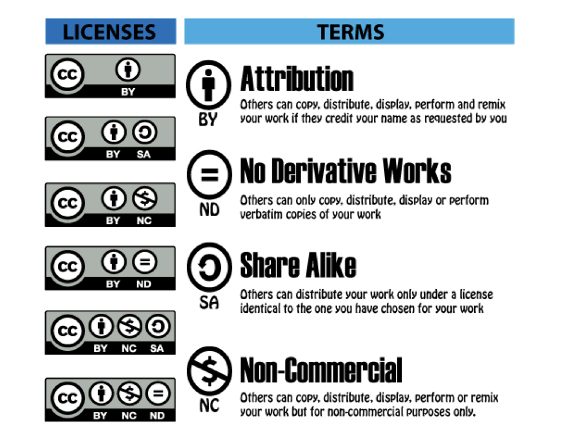

## Who Owns Oral History? A Creative Commons Solution {#who-owns-oral-history}
*by [Jack Dougherty and Candace Simpson](authors-and-contributors.html)*

*This is an updated version of an essay that was previously published in 2012 in an open-access book, [Oral History in the Digital Age](http://ohda.matrix.msu.edu/2012/06/a-creative-commons-solution/).^[@doughertyWhoOwnsOral2012]*

Who “owns” oral history? When an oral history narrator shares her story in response to questions posed by an interviewer, and the recording and transcript are deposited in an archive, who holds the rights to these historical source materials? Who decides whether or not they may be shared with the public, quoted in a publication, or uploaded to the web? Who decides whether someone has the right to earn money from including an interview in a commercially distributed book, video, or website? Furthermore, does [Creative Commons](http://creativecommons.org), a licensing tool developed by the open access movement to protect copyright while increasing public distribution, offer a better solution to these questions than existing oral history protocols?[http://creativecommons.org]

Oral historians have begun to ask these types of questions as we confront new challenges of doing our work in the Internet era. At a November 2010 planning symposium for the *Oral History in the Digital Age* project, law and technology professor Sheldon Halpern posed the provocative question: “What do you think you own?” One of the symposium participants, Troy Reeves, reflected on its broad implications for the field. Over a decade ago, when narrators granted an oral history interview and signed a release form, they could assume that the audio/video recording and transcript “would remain under the care and control” of an archive or library, which would hold ownership rights and grant access to the public as it deemed appropriate. But the Web is dramatically revising these assumptions. Many oral history repositories have begun to share the content of their holdings online and, in the words of one archivist, believe “it is worth giving up some control for the greater good of having more people use the materials.”[@reevesWhatYouThink2012] We elaborate on our thinking about how the Internet has transformed the historical profession in our open-access edited volume, *Writing History in the Digital Age*.[@doughertyWritingHistoryDigital2013]

As an alternative to traditional protocols, Jack and his student researchers began to incorporate Creative Commons language in oral history consent forms while conducting interviews in the metropolitan region of Hartford, Connecticut for the Cities Suburbs and Schools Project at Trinity College. Several interviews are featured in our freely accessible, public history web book, *On the Line: How Schooling Housing, and Civil Rights Shaped Hartford and its Suburbs*, and many are hosted by the Trinity College Digital Repository.[@citiessuburbsandschoolsprojectarchivestrinitycollegedigitalrepository] By blending interpretive text with oral interviews and other interactive features, this web-book tells the story of how real estate firms maintained the color line, mortgage lenders engaged in red-lining, families sought homes on the more desirable side of school attendance lines, and activists fought to cross, redraw, or erase these lines. We initially presented this essay as part of a broader discussion on “Whose Civil Rights Stories on the Web?” at the 2012 joint meeting of the Organization of American Historians/National Council on Public History.[@doughertyWhoseCivilRights2012]

Jack: In the mid-1990s, I began to conduct oral history interviews for my dissertation research on African-American school reform activists in Milwaukee. I recorded interviews, followed standard protocols for consent forms and institutional review, and made good on my promise to transcribe and return a free copy of the tape and transcript to each of the sixty participants who kindly shared their history.^[@doughertyMoreOneStruggle2004 with interviews archived at @doughertyMoreOneStruggle2004a, and some digitized at @MarchMilwaukee] But the “best practices” in the field left me feeling unsatisfied. Originally, I had been drawn toward oral history and public history as means of community empowerment on civil rights history, but the standard guidelines required me to ask people who freely offered their stories to sign away some of their rights.

At that time, my reference guide for consent forms was the Oral History Association’s pamphlet by John Neuenschwander, *Oral History and the Law*, which has since been expanded into a book.^[@neuenschwanderOralHistoryLaw1993, originally published in 1985, has been updated and retitled as @neuenschwanderGuideOralHistory2009] On the legal question of ownership, as soon as the interview is recorded, the oral history narrator initially holds the copyright, but standard practice is to prepare a consent form to transfer away those rights. As Neuenschwander explains, “The vast majority of oral historians and programs at some point secure the transfer of the interviewee’s copyright interests by means of a legal release agreement,” and offers sample language in the appendix.^[@neuenschwanderGuideOralHistory2009, p. 64. He also cites case law that the copyright may be jointly held by the interviewee and interviewer.] Similarly, the Oral History Association’s 2009 statement on “Principles and Best Practices” fully expects oral history participants to sign over their rights as part of the standard procedure for conducting interviews: “The interviewer should secure a release form, by which the narrator transfers his or her rights to the interview to the repository or designated body, signed after each recording session or at the end of the last interview with the narrator.”[@oralhistoryassociationPrinciplesBestPractices2009] As I understood copyright law, since I wished to create a transcript of the interview and freely quote from it in my scholarly writing, the transfer of copyright away from the narrator was in my best interest.

But here was the ugly irony: as a white scholar of the civil rights movement, my consent form required African American activists to “sign over” rights to their oral history interview. At that time, the best arrangement I could negotiate was a two-step process, because I was working with two different repositories. First, my consent form asked oral history narrators to transfer their copyrights directly to me, which in turn, I donated with the tapes and transcripts to two institutions: the Wisconsin Black Historical Society/Museum (a local public history organization that was best positioned to share these stories with the African-American community) and the University of Wisconsin-Milwaukee Library archives (a better-funded, predominantly white institution that was better equipped to share this history more widely on the emerging Internet). I intentionally partnered with both repositories, and kept my promise to give tapes and transcripts back to all parties, to counter prior generations of white academics and journalists who had come into Milwaukee’s black community to “scoop” up stories, while leaving nothing behind. The 1995 version of my oral history consent form included this key language, paraphrased from Neuenschwander’s 1993 pamphlet:

> I agree to be interviewed and tape recorded by Jack Dougherty, as part of his dissertation research on the recent history of African-American education in Milwaukee. At the end of the research project, the original tapes and edited transcripts will be donated to the Milwaukee Urban Archives at University of Wisconsin-Milwaukee and the Wisconsin Black Historical Society/Museum. These materials will be identified by my name and made available to the public for scholarly and educational purposes, unless exceptions are listed below...
>
> I also grant to Jack Dougherty any title to copyright, property right, or literary rights in the recording(s) and their use in publication, as well as to any reproductions, transcripts, indexes, or finding aids produced from the recording(s).
>
> My participation in this project is entirely voluntary, and I may withdraw at any time prior to its conclusion and the donation of the materials to the Archives.
>
> Check here to receive a free copy of the tape.  
>  
> Check here to receive a free copy of any transcriptions (whole or partial) for the opportunity to proofread or clarify your spoken words.  
>  

Yet I was frustrated with this language about copyright transfer. In my eyes, the wording was a necessary evil to preserve these valuable oral histories in a university archive (whose staff at that time coached me on the consent form) and to allow me to quote extensively from them in my eventual book (as required by my publisher’s copyright permissions process). Understandably, many Black Milwaukeeans were highly skeptical or hesitant when I explained the terms of the consent form. Several expressed deep concern that it asked them to sign away their life stories, which I assured them was not the case. A few agreed to be interviewed but did not sign the form. A few others refused to be interviewed at all. One persuaded me, after our interview, to write up a special consent form that preserved her copyright and granted me permission to quote specified passages in my writing, but did not extend any rights to others, such as the archives. Eventually, over sixty oral history participants did agree to sign my consent form, for which I was grateful. Some signed in exchange for a free copy of the recording and transcript as a contribution to their own family histories. Others were motivated by the public good of preserving and sharing their civil rights stories through one or both of my archival partner organizations. Together, all of these conversations challenged me to think more deeply about who benefited from this contractual arrangement. If activists freely shared their civil rights stories with me, did I have the right to profit as a professional historian? The process expanded my thinking about oral history and the public good, and upon receiving an academic book contract, I returned my share of royalties (and later, prize money and speaking fees) back to the Wisconsin Black Historical Society/Museum to continue their public history work.

Given my understanding of oral history and copyright law as a graduate student in the mid-1990s, this was the best user-friendly consent form I could envision. Looking back, there were some alternatives that deserved more consideration. For instance, I could have expanded on the copyright transfer language by adding a line that retained the narrators’ rights to utilize their own interviews during their lifetimes.^[As I recall, one reason I did not include this clause in the consent form was because, in my mind at that time, I feared that the suggested language from the 1993 Oral History Association pamphlet (p. 46) and its emphasis on death might have scared away some of my elderly participants: “Allow me to copy, use and publish my oral memoir in part or in full until the earlier of my death or [insert date].” By contrast, Neuenschwander’s 2009 edition (p. 116) includes more life-affirming language: “[In return for transferring copyright], the Center grants me a nonexclusive license to utilize my interview/s during my lifetime.”] But adding this clause fails to address the underlying issue of transfer of copyright ownership away from the narrator, and out of their family’s hands at the end of their lifetime. Another alternative I could have explored further was to ask narrators to make their interviews part of the public domain. But this option would have gone to the extreme of eliminating all of their rights under copyright law, and furthermore, at that time I could not find useful examples of this approach by oral historians.^[Neuenschwander’s 2009 edition now includes this sample language: “In making this gift I fully understand that my interview/s will not be copyrighted by me or the Oral History Program but will be immediately placed in the public domain. This decision is intended to provide maximum usage by future researchers” (p. 85).] Under these circumstances, this mid-1990s consent form was the best I could do at the time, yet it left a bitter taste and a strong desire to find a better model in the future.

Candace: When I began working with the *On The Line* public history web-book project in the summer of 2011, one of my tasks was to conduct oral history interviews with Hartford civil rights activists. At this point, our research team had stopped using conventional consent forms (which asked participants to “sign over” all rights to their interviews) and had begun using a new form that Jack developed with Creative Commons language. Basically, Creative Commons (CC) is a standardized license that maintains the original copyright for the creator of a work, and allows it to be shared more widely with the public, with certain restrictions if desired. Initially released in 2002 with support from the Center for the Public Domain, there are now [six types of CC licenses](https://creativecommons.org/licenses/) that offer different combinations of licensing terms for source attribution (BY), no derivative works (ND), share alike (SA), and non-commercial (NC) use.^[https://creativecommons.org/licenses/]

(ref:2012-cc-licenses) Six types of Creative Commons licenses. [Image source](http://education-copyright.org/creative-commons), 2012.

```{r 2012-cc-licenses, echo=FALSE, fig.cap="(ref:2012-cc-licenses)"}
 
```

At present, our standard oral history consent form uses the CC By Attribution—NonCommercial license, with this key language:

> I voluntarily agree to participate in an oral history video interview about [insert topic.] I can choose to pause, stop, or erase the recording at any time during the interview.
>
> Afterwards, I grant permission for the oral history video recording, with my name and a summary or transcript, to be distributed to the public for educational purposes, including formats such as print, public programming, and the Internet.
>
> Under this agreement, I keep the copyright to my interview, but agree to share it under a Creative Commons Attribution—NonCommercial 4.0 International license (BY-NC). This allows the public to freely copy, remix, and build on my interview, but only if they credit the original source and use it for non-commercial purposes.  
>  
> In return, the interviewer will send one free copy of the interview recording, and summary or transcript, to my address below.  
>  

See the [full oral history consent form](oral-history-consent.html) in this book.

We prefer the Creative Commons (CC) consent form because it clearly keeps the copyright in the hands of the oral history interview participant, but allows us to freely share the recording and transcript on our open-access public history book and library repository, where individuals and organizations may copy and circulate it, as long as they credit the original source and do not charge any fees. This NonCommercial restriction assures participants that other people cannot profit by selling their interviews, unless the participant wishes to do so under a separate agreement. As the Creative Commons “Frequently Asked Questions” section clarifies, once a CC license is applied to a work, it *cannot be revoked*, but all CC licenses are *non-exclusive*, meaning that the holder of the copyright (in this case, the interview participant) may grant additional licenses to other parties (such as a for-profit book or movie, if desired). Also, CC licenses do not limit “fair use” provisions of existing U.S. copyright law, meaning that commentators have the same rights to report on or quote from the original work.^[https://creativecommons.org/faq/#how-do-cc-licenses-operate] Furthermore, CC licenses are increasingly used by leading knowledge-based institutions such as the Massachusetts Institute of Technology (MIT) OpenCourseWare project and the Public Library of Science (PLOS). Overall, we believe that this combination of intellectual property tools---traditional copyright with Creative Commons licensing—--fits better with our primary goal of historical preservation and public education than does traditional copyright alone.

In Hartford, a specific oral history interview we conducted with school integration activist Elizabeth Horton Sheff deserves mention, because she took our Creative Commons consent form one step further by renegotiating its terms, just before we began our video recording. Sheff agreed with our goal of preserving her oral history for the public good, but her primary concern was to avoid being quoted out of context, as she had experienced with journalists in the past. She wanted her oral history interview to be made available in its totality on the web, but not to allow others to create a modified or excerpted version. Fortunately, Sheff was familiar with Creative Commons because her son is in the independent music business. She asked for a “no derivatives” restriction, and on the spot, we modified the consent form license to the ByAttribution-NonCommercial-NoDerivatives CC license. As a result, her video recorded interview and transcript both appear in the Trinity College library digital repository, but to respect her restriction, we blocked users from downloading a copy of the video, to make it harder for them to create an edited version. Yet anyone can move the video time slider on their web browser to watch only a certain portion if desired (such as minutes 28 to 32). Furthermore, anyone may download the transcript of the interview, and quote from the text under “fair use” guidelines.[@sheffOralHistoryInterview2011]

<!-- TODO - if moving all interviews to CTDA, then drop reference to Trinity repository below -->
(ref:2011-sheff-elizabeth3) View the [oral history video interview and transcript](http://digitalrepository.trincoll.edu/cssp_ohistory/16) with Elizabeth Horton Sheff in 2011.^[@sheffOralHistoryInterview2011]. See additional oral histories with participants in the Sheff v O'Neill school desegregation lawsuit.^[@citiessuburbsandschoolsprojectarchivestrinitycollegedigitalrepository; @onthelinedigitalarchivesconnecticutdigitalarchives.]

```{r 2011-sheff-elizabeth3, echo=FALSE, fig.cap="(ref:2011-sheff-elizabeth3)"}
if(knitr::is_html_output()) knitr::include_url("https://cdnapisec.kaltura.com/html5/html5lib/v2.76/mwEmbedFrame.php/p/2366381/uiconf_id/42684261/entry_id/1_66aksvf1?wid=_2366381&iframeembed=true&playerId=kaltura_player&entry_id=1_66aksvf1") else knitr::include_graphics("images/2011-sheff-elizabeth")
```

We do not contend that Creative Commons has resolved all of our questions about who “owns” oral history, nor do we claim expertise in intellectual property law. But as oral historians seeking alternatives, we believe that this combination—--traditional copyright with Creative Commons licensing—--fulfills our dual needs to maintain the rights of individual participants while sharing history with the public.

*[About the authors](authors-and-contributors.html): Jack Dougherty and Candace Simpson (Trinity 2012) developed these ideas while conducting oral history interviews for this book, and co-presented at the 2012 joint meeting of the Organization of American Historians/National Council on Public History. Jack later expanded the essay for publication.*

 *[On The Line](http://ontheline.trincoll.edu) is an open-access, born-digital, book-in-progress by [Jack Dougherty and contributors](authors-and-contributors.html) at Trinity College, Hartford CT, USA. This work is copyrighted by the authors and freely distributed under a [Creative Commons Attribution-NonCommercial-ShareAlike 4.0 International License](http://creativecommons.org/licenses/by-nc-sa/4.0/). Learn about our [open-access policy and code repository](copyright-with-open-access.html) and [how to read and cite](how-to-read-and-cite.html) our work. This book-in-progress was last updated on: `r Sys.Date()`*
