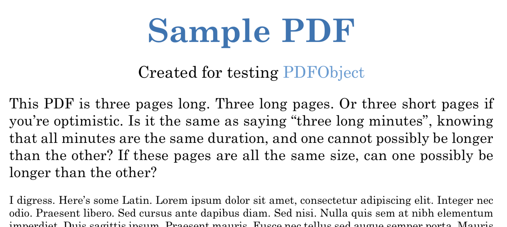

## *On The Line* Style Guide for Bookdown + RMarkdown {#style-guide}

**Important: See the code used in the examples on this page** by viewing it directly on the GitHub repo at <https://github.com/OnTheLine/otl-bookdown/blob/master/09.4-style-guide.Rmd>.

#### General Goals {-}
The broad goal is to compose one version of the text that Bookdown will generate into multiple book products: Web HTML edition, PDF edition, MS Word edition, etc. The Web edition is preferred because only it displays interactive online content (such as interactive maps, scrollable sources, and video clips). But the PDF and MS Word editions are designed to display static screenshots of interactive content, as well as clickable links and footnotes/endnotes for source materials. Also, to make the Web edition as accessible as feasible for visually-impaired readers, this book is continually tested using the [Wave Accessibility Evaluation Tool](http://wave.webaim.org/).

Also, this style guide was created primarily for the web edition of *On The Line* at <http://OnTheLine.trincoll.edu>, and may require additional modifications prior to publishing the final PDF print edition.

#### Markdown vs. R Markdown {-}
The text is based on the easy-to-read Markdown syntax, which is summarized in this [popular cheatsheet](https://github.com/adam-p/markdown-here/wiki/Markdown-Cheatsheet) and this [interactive tutorial](https://www.markdowntutorial.com). But Bookdown uses its own flavor: [RMarkdown by RStudio](https://rmarkdown.rstudio.com/).

#### Formatting {-}
Use brackets and parentheses for an [embedded link](http://example.com), and remember to add a footnote as shown below.

To display the URL of a non-embedded link, use only parentheses (http://example.com) or angle brackets <http://example.com>.

The book is designed for links to open in the same browser tab, since readers should use a right-click or two-finger click to open links in new tabs when desired. Only if absolutely necessary, use HTML tags to create <a href="http://example.com/">link that opens in a new page</a>.

Use HTML-style code comments to insert notes that are invisible in the book products, yet are visible to authors (or anyone) viewing the source code in the public GitHub repo, such as this TODO reminder:
<!-- TODO this comment appears in the source code, but not the book products -->

For an en-dash, use only two hyphens--like this--and compare with below.

For an em-dash, use three hyphens---like this---and compare with above.

For a block quote, start each line with a caret **AND** add two spaces to insert a line break:

> I thoroughly disapprove of duels. If a man should challenge me, I would take him kindly and forgivingly by the hand and lead him to a quiet place and kill him.    
> --- Mark Twain  
> --- notable American author  

#### Headers and Cross-reference links {-}
In this book, we refer to both chapters (1, 2, etc.) and subchapters (1.1, 1.2, etc.) as "chapters" for simplicity. But Bookdown refers to these as chapters and sections, respectively.

- Chapter titles are first-level headers with one hashtag: `# Chapter Title`
- Subchapter titles (or section titles) are second-level headers with two hashtags: `## Subchapter Title`
- Avoid third-level headers with three hashtags, since have not yet found easy control for toc_depth in HTML edition.
- Subheaders are fourth-level headers with four hashtags: `#### Subheader in body text`
- Avoid fifth-level headers with five hashtags, since have not yet found easy control for toc_depth in PDF edition.

Since the `index.Rmd` settings add numbers to chapters/sections, remember to block numbers from appearing in fourth- and fifth-level headers by adding curly brackets arounds a hyphen: `#### Subheader non-numbered {-}`

In Bookdown, a short chapter/section title `# Introduction` has a short default reference: `#introduction`. Also, a longer chapter/section title `# Defining City and Suburban Lines` has a longer default reference: `#defining-city-and-suburban-lines`.

This book simplifies each chapter/section title reference by adding a short ID name in curly brackets, like this: `# Defining City and Suburban Lines {#defining}`.

Also, this book matches the short ID name `{#defining}` to the file name `02-defining.Rmd`. Although Bookdown does not require the file name and short ID to match, this method helps authors to organize all cross-references.

To embed a cross-reference to another chapter/section in the book, add an HTML link using brackets and parentheses. See code: `*by [Ilya Ilyankou and Jack Dougherty](authors-and-contributors.html)*` with demo: *by [Ilya Ilyankou and Jack Dougherty](authors-and-contributors.html)*. This method works best for the HTML edition.

#### Conditional HTML vs LaTex Output {-}
The R package function `is_[html/latex]_output` allows authors to produce conditional output for different book products, such as text that should appear in the HTML edition but not the PDF edition, or vice versa. For example, this book displays a footer in the HMTL edition, but not the PDF edition. See more at <https://blog.earo.me/2019/10/26/reduce-frictions-rmd/>. Compare these code examples:

`r if (knitr::is_latex_output()) '<!--'`
This line appears in the HTML edition, and is commented-out in the PDF edition.
`r if (knitr::is_latex_output()) '-->'`

`r if (knitr::is_html_output()) '<!--'`
This line appears in the PDF edition, and is commented-out in the HTML edition.
`r if (knitr::is_html_output()) '-->'`

#### Preface and Footers {-}
In this book, `index.Rmd` begins with a non-numbered first-level header `# Preface {-}`, followed by non-numbered second-level headers such as `## Authors and Contributors {-}` and `## Acknowledgements {-}`. All of this content is placed in the `index.Rmd` file because creating zero-numbered files (such as 0.1-about.Rmd) generated Bookdown errors.

Also, at the end of each section in the main text, an HTML-only footer has been manually pasted, to ensure that each long web page contains author and copyright information, with links to key sections in the Preface, in case readers print out individual chapters from their browsers. TODO: Find a way to replace manually-pasted footers with a block that is global to the entire book.

#### Footnotes/Endnotes {-}
A text-only footnote.^[This is a footnote, with no reference.]

To create a footnote with citations only, separate BibTeX citation keys with semi-colons: [@hirschMakingSecondGhetto1983; @jacksonCrabgrassFrontierSuburbanization1985; @tyackOneBestSystem1974]

Since footnotes also may include text and punctuation in Markdown syntax, always insert a caret symbol prior to the brackets to demarcate a footnote:^[On this theme, see @doughertyReviewConnecticutPublic2011. On a different theme, see @doughertySchoolChoiceSuburbia2009, pp. 33-35]

**TODO: KNOWN ISSUE in this book re: footnotes/endnotes**
Using Bookdown version 0.16 as of January 2020, note numbering appears differently across editions, and needs to be addressed prior to final publication:

- In the Web HTML edition, customized code in `style.css` renumbers endnotes at the beginning of each chapter (e.g. 2) and subchapter (e.g. 2.1), as desired by the author.
- But in the PDF edition, endnote renumbering begins only at each chapter, not subchapter, regardless of the custom CSS code. Probably need to change a Pandoc LaTeX setting.
- In the MS Word edition, footnotes (rather than endnotes) are continuously numbered without breaks across the entire document, regardless of the custom CSS code.

- Also, avoid placing footnotes in image captions, since URLs cause an extra } symbol to appear when generating PDF version, which crashes the build. Instead, place dynamic reference in the body text immediately before the image, along with footnote ref.

#### R Code Chunks to Display Interactive iFrames and Static Images{-}
In the body of the book, avoid inserting images with simple Markdown syntax, because it does not support Bookdown figure auto-numbering and caption formatting, and does not translate well into PDF and MS Word formats. Instead, follow this R "code chunk" method, as shown in the examples further below for:

1. Static images, in Web and PDF and MS Word editions
2. Interactive maps and charts in Web edition, with static images in PDF and MS Word editions
3. Scrolling PDF files in the Web edition, with static screenshots in the PDF and MS Word editions
4. Playable videos (from different servers) in Web edition, with static screenshots in PDF and MS Word editions

#### Overview of R Code Chunks {-}
- Define a text reference for captions, because this method accepts complex syntax, such as RMarkdown links, as shown in the examples below. Do NOT insert footnote references in the caption. Instead, place them in the body text, as explained above.
- Insert a BLANK LINE between the text reference and the R code chunk that follows.
- Insert an R code chunk <https://bookdown.org/yihui/bookdown/r-code.html>, with NO SPACES between ref:chunk-label, as shown in the examples below below.
- To reduce the width (or height) of the output, add `out.width="50%"` to the code chunk, which works for Web edition and also PDF edition.
- To display interactive content in the Web edition and a static image in the PDF edition, create both elements and insert an if-else statement in the R code chunk to display these elements in different outputs, as shown below. (Thanks to Michael Dorman for this tip.)
- If the interactive content includes an iframe (for a map or chart), the default height will be 400 pixels. To adjust the iframe height (or width), insert a line of code in the `custom-scripts.html` file and add a code comment to the text to serve as a reminder, as shown below. Also, make sure that the `index.Rmd` file includes the custom script in the header, as described in the section above.
- In the body text, insert a dynamic reference to the image in the same file, because PDF engine creates floating images that may be placed on the next page. Example of dynamic ref followed by footnote:  ...as shown in Image \@ref(fig:sample-interactive).^[@clarkCharterOakCity1876]
- Reminder: If the image appears a second time in the book, in a separate chapter, be sure to relabel the text ref: year-title2.
- Reminder: Bookdown does not auto-number figures in the `index.Rmd` file, which serves as a preface or introduction.
- **TODO: KNOWN ISSUES to address prior to final PDF edition**:
  - HTML edition labels images by sequential number across the entire book (1, 2, 3 etc.), while PDF edition labels images by chapter number (1.1, 1.2, 2.1, etc.). See <https://bookdown.org/yihui/bookdown/latexpdf.html> and <https://pandoc.org/MANUAL.html#variables-for-latex>.
  - Reminder from [Yihui Xie](https://bookdown.org/yihui/rmarkdown/r-code.html#figures): "PDF documents are generated through the LaTeX files generated from R Markdown. A highly surprising fact to LaTeX beginners is that figures float by default: even if you generate a plot in a code chunk on the first page, the whole figure environment may float to the next page. This is just how LaTeX works by default. It has a tendency to float figures to the top or bottom of pages. Although it can be annoying and distracting, we recommend that you refrain from playing the “Whac-A-Mole” game in the beginning of your writing, i.e., desperately trying to position figures “correctly” while they seem to be always dodging you. You may wish to fine-tune the positions once the content is complete using the fig.pos chunk option (e.g., fig.pos = 'h'). See https://www.sharelatex.com/learn/Positioning_images_and_tables for possible values of fig.pos and more general tips about this behavior in LaTeX. In short, this can be a difficult problem for PDF output."
  - Decide whether to create PDF versions of JPG/PNG images to improve quality of output, and if so, set `auto_pdf = TRUE` inside `include_graphics()`. Read more at <https://bookdown.org/yihui/bookdown/figures.html>.
  - Decide if 'out.width' and 'out.height' are preferable in all cases to `"fig_height=7"`.
  - For images less than full-width, decide whether to insert `fig.align="center"` for PDF output, since this currently throws an error in MS Word output.

#### Example 1: Static image in all editions, half-size output, no interactive version {-}
(ref:sample-static-image) Caption for sample static image, with Markdown formatting and links.

```{r sample-static-image, fig.cap="(ref:sample-static-image)", out.width="50%"}
 knitr::include_graphics("images/1937-holc-hartford-map-scan.jpg")
```

#### Example 2: Interactive iframe in web edition (with adjusted height), static image in PDF edition  {-}
(ref:sample-interactive) Caption for all versions here, with link to [full-screen interactive map with its own caption](https://ontheline.github.io/otl-redlining/index-caption.html), and link to [map historical sources, known issues, and the code](https://github.com/ontheline/otl-redlining/), developed by Ilya Ilyankou and Jack Dougherty.

<!-- set iframe 600px height 100% width in custom-scripts.html -->
```{r sample-interactive, fig.cap="(ref:sample-interactive)"}
if(knitr::is_html_output()) knitr::include_url("https://ontheline.github.io/otl-redlining/") else knitr::include_graphics("images/1937-otl-redlining.png")
```

#### Example 3: Locally stored PDF scrolling in web edition, static screenshot in PDF edition {-}
(ref:pdf-sample-local) Here's a sample PDF that is locally stored in the GitHub repo, with option to add Markdown link.

```{r pdf-sample-local, fig.cap="(ref:pdf-sample-local)"}
if(knitr::is_html_output()) knitr::include_url("images/sample-3pp.pdf") else 
```
<!-- TODO: test all video examples below in Windows Edge and Android devices -->

#### Example 4a: YouTube video iframe in web edition, static image in PDF edition {-}
(ref:youtube-sample-video) Here's a sample caption for a YouTube video, with option to add Markdown link (to the full video on a historical preservation server, such as CTDA). Successfully avoids auto-play issue. YouTube video formatting in HMTL seems to be cleaner than Vimeo formatting.

```{r youtube-sample-video, fig.cap="(ref:youtube-sample-video)"}
if(knitr::is_html_output()) knitr::include_url("https://www.youtube.com/embed/NuWg9Jrkrpw?start=64") else 
```

#### Example 4b: Vimeo video iframe in web edition, static image in PDF edition {-}
(ref:vimeo-sample-video) Here's a sample caption for Vimeo video, with option to add Markdown link (to the full video on a historical preservation server, such as CTDA). Successfully avoids auto-play issue. But Vimeo formatting in HTML is not always clean.

```{r vimeo-sample-video, fig.cap="(ref:vimeo-sample-video)"}
if(knitr::is_html_output()) knitr::include_url("https://player.vimeo.com/video/27299734") else 
```

#### Example 4c: Kaltura video iframe in web edition, static image in PDF edition {-}
(ref:kaltura-sample-video) Here's a sample caption for a video on Trinity Kaltura server, using an HTML5 embed code that is unclear if is currently supported, but still works as of January 2020. (The default Kaltura "share" embed code is not properly formatted in the iframe.) Successfully avoids auto-play issue.

```{r kaltura-sample-video, fig.cap="(ref:kaltura-sample-video)"}
if(knitr::is_html_output()) knitr::include_url("https://cdnapisec.kaltura.com/html5/html5lib/v2.76/mwEmbedFrame.php/p/2366381/uiconf_id/42684261/entry_id/1_66aksvf1?wid=_2366381&iframeembed=true&playerId=kaltura_player&entry_id=1_66aksvf1") else knitr::include_graphics("images/2011-sheff-elizabeth.jpg")
```

Note that as of January 2020, videos uploaded to CTDA have datastreams generated in MP4 video format, but these run in auto-play format in the browser, which CTDA cannot turn off, so not appropriate to display in the browser in this book. See sample video datastream: <https://collections.ctdigitalarchive.org/islandora/object/120002:172/datastream/MP4> and read more <https://confluence.uconn.edu/display/CTDA/Datastreams>. Therefore, CTDA should be used as a historical preservation video server, but must use either YouTube, Vimeo, or Kaltura examples above to display secondary video clips for display in this book.

#### Tables {-}
This book currently uses Markdown table formatting, with header above and caption (in italicized text) below, using <http://www.tablesgenerator.com/> to generate Markdown output. Reminder: this does not create a Bookdown-generated auto-numbered figure, so cannot (yet) create dynamic reference.
- TODO prior to final publication: decide whether to use the Bookdown-recommended kable package for tables, and add link to CSV in GitHub repo, and so on.

Sample body text immediately above the table, with optional links and footnote.^[@ilyankouMapFederalHOLC2017] Currently, use bold type for table header, not hashtags.

**Sample table**
| **Header 1**              | **Header 2**               | **Header 3**             |
|---------------------------|----------------------------|--------------------------|
| Security Grade            | Second                     | Third                    |
| Location                  | Hartford                   | Hartford                 |
| Trend Next Decade         | Stable                     | Stable                   |

#### Further Reading {-}
- Bookdown sections on Figures <https://bookdown.org/yihui/bookdown/figures.html> and Markdown extensions <https://bookdown.org/yihui/bookdown/markdown-extensions-by-bookdown.html>.
- On R code chunks in RMarkdown https://bookdown.org/yihui/rmarkdown/r-code.html
- On R code chunk options in knitr package https://yihui.name/knitr/options/#code-chunk
- R Markdown book section on figures <https://bookdown.org/yihui/rmarkdown/html-document.html#figure-options>
- R Markdown reference <https://www.rstudio.com/wp-content/uploads/2015/03/rmarkdown-reference.pdf>
- On positioning images in LaTeX <https://www.overleaf.com/learn/latex/Positioning_images_and_tables>
- Tips and tricks for working with images and figures in rmarkdown <http://zevross.com/blog/2017/06/19/tips-and-tricks-for-working-with-images-and-figures-in-r-markdown-documents/#arguments-out.width-and-out.height-apply-to-both-existing-images-and-r-generated-figures>
- Hints on using auto_pdf: <https://blog.earo.me/2019/10/26/reduce-frictions-rmd/>
- Summary of image and table approaches <https://stackoverflow.com/questions/58204272/r-markdown-how-to-create-a-table-with-images-and-text-which-should-be-knitted-a>
- Using "hold position" in kable extra to prevent tables being displayed at bottom of page <https://stackoverflow.com/questions/44850011/how-to-stop-bookdown-tables-from-floating-to-bottom-of-the-page-in-pdf>

`r if (knitr::is_latex_output()) '<!--'`
 *[On The Line](http://ontheline.trincoll.edu) is an open-access, born-digital, book-in-progress by [Jack Dougherty and contributors](authors-and-contributors.html) at Trinity College, Hartford CT, USA. This work is copyrighted by the authors and freely distributed under a [Creative Commons Attribution-NonCommercial-ShareAlike 4.0 International License](http://creativecommons.org/licenses/by-nc-sa/4.0/). Learn about our [open-access policy and code repository](copyright-with-open-access.html) and [how to read and cite](how-to-read-and-cite.html) our work. This book-in-progress was last updated on: `r format (Sys.Date(), '%d %b %Y')`*
`r if (knitr::is_latex_output()) '-->'`
