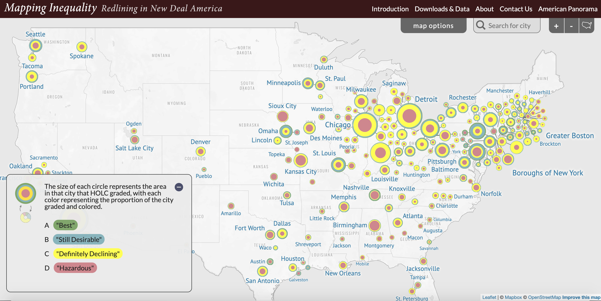
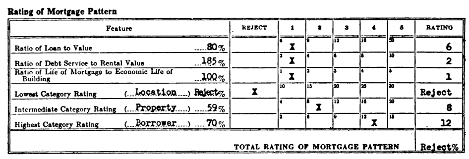
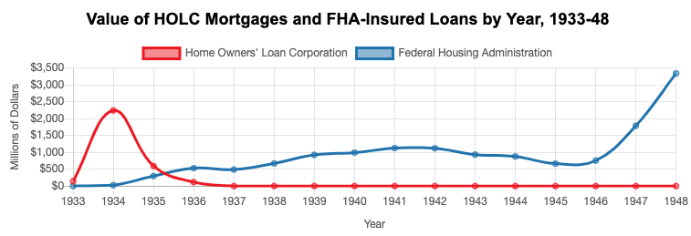

## Federal Lending and Redlining {- #lending}
*by [Shaun McGann and Jack Dougherty](authors.html)*

Racial and economic segregation in American housing was not simply caused by the prejudices of individual property owners. In addition, segregation was systematically institutionalized by governmental public policies that were designed to make it more affordable for White families to purchase newer homes away from central cities and in the suburbs. This chapter focuses on the 1930s Depression, when U.S. federal agencies collaborated with banks and other lenders to bolster the economy by expanding the availability of long-term loans to purchase homes, known as mortgages. Specifically, the chapter compares how two federal lending programs---the Home Owners' Loan Corporation (HOLC) and the Federal Housing Administration (FHA)---carried out their respective missions, and their long-term consequences for metropolitan America. Both HOLC and FHA instituted ratings systems that downgraded neighborhoods based on the demographics of their residents---such as the presence of Black, immigrant, or impoverished families---rather than assessing value solely on the physical condition of the property. Both HOLC and FHA contributed to what we today call "redlining": systematic discrimination in offering home mortgages or other financial services based on the social composition of the neighborhood, rather than the individual property or owner. While government involvement in the private lending market prevented millions of families from being forced out of their homes, and expanded homeownership to millions more, eligibility to participate in these programs was not neutral, and federal funds promoted racial and economic discrimination.^[@freundColoredPropertyState2007] Looking back at these 1930s programs reveals the thoughts and actions of public officials and private real estate interests, who together drew lines that intensified racial and economic segregation in metropolitan Hartford and other regions that continues today.

America's historical awareness of redlining has grown in recent years, thanks to widely-read authors who reconnected the past with present-day policy debates on public investment in urban areas, such as Ta-Nehisi Coates, Richard Rothstein, and contributors to Nikole Hannah-Jones's *The 1619 Project*.^[@coatesCaseReparations2014; @rothsteinColorLawForgotten2017; @hannah-jones1619Project2019] Color-coded maps from the 1930s, probably seen by only a small number of people when they were originally drawn, have been rediscovered and shared widely with millions of people on the web by the [Digital Scholarship Lab at the University of Richmond](https://dsl.richmond.edu/panorama/redlining) and many others.[@nelsonMappingInequalityRedlining2018] Even the 2020 Democratic presidential primary featured a "[What is Redlining](https://twitter.com/ewarren/status/1228009904973238274)?" Twitter historical video when Elizabeth Warren challenged Michael Bloomberg's stance on the issue.^[@warrenWhatRedlining2020; @epsteinWarrenSaysBloomberg2020] But as the history of redlining have become popularized, important distinctions about federal programs such as the HOLC and FHA have become blurred, and the latter portion of this chapter draws on scholarship by Amy Hillier, Todd Michney, and LaDale Winling to clear up common misunderstandings. One important lesson: although the HOLC color-coded maps provide the most visually striking portrayal of discrimination in government policy, the more powerful and enduring tools of segregation persisted in the plain white pages of the FHA's bureaucratic *Underwriting Manual*. For this reason, this chapter presents direct evidence from both HOLC and FHA to help us understand key differences in how they divided metropolitan America.

For readers who have not bought a home: You may not yet be familiar with key concepts in personal finance, such as how lower down payments with amortization of principal and interest have made home ownership a more affordable aspect of "The American Dream." See the "[Home and School Shopping Simulation](home-school-shopping.html)" in the Teaching and Researching chapter in this book for a learning activity developed while teaching undergraduate students about housing, to better understand the present-day realities in order to compare with the past.

### How Federal Lending Changed Homeownership {-}
During the 1920s, purchasing a home was difficult for even middle-class Americans to afford because of the financial terms. Many banks typically offered home mortgage loans that placed the burden of risk on the borrower's shoulders, and required them to pay it back very quickly. Typical mortgages during the 1920s included these terms:

- Large down payment: Typically 50 percent of the home value, because banks usually limited their mortgages to 50 percent (called a loan-to-value ratio of 50 percent).
- Short-term loans: Typically 5 years, designed to repay only the interest on mortgage loan.
- "Balloon payment" loans: Borrowers were required to repay the entire principal, or the amount borrowed, in one lump sum at the end of the loan period.
- Higher interest rates: Typically 6 to 8 percent during the 1920s.

During the Great Depression of the 1930s, the economic collapse devastated the housing market and threatened the interests of both lenders and borrowers. Homeowners who suddenly lost their jobs were now in danger of missing loan payments, defaulting on their mortgages, and losing their homes to bank foreclosures. But when banks foreclosed and attempted to sell off these homes, they typically were worth less than their original price prior to the Depression. In response to this economic crisis, President Franklin D. Roosevelt's "New Deal" administration created federal agencies that increased access to the middle class by offering home mortgages on more favorable terms:

- Smaller down payment: Typically 10 or 20 percent of the home value, because lenders raised the loan-to-value ratio to 80 or 90 percent.
- Longer-term loans: Repayment extended to 15 or 20 years.
- Amortization of loans: This formula meant that borrowers repaid both the interest and principal on the loan in regular installments over time, rather than one lump sum at the end.
- Lower interest rates: Federal support lowered interest rates to around 5 percent during the 1930s.

Picture how homeownership became more affordable for a buyer in the Hartford area, based on typical prices and mortgage terms during this period. Prior to the 1930s, if a home price was $10,000, a typical bank would only offer a $5,000 mortgage loan, limited to 50 percent of the home value, which forced the buyer to raise the remaining $5,000 in cash for the down payment at the time of purchase. If the buyer only had $2,000 on hand, they might need to make up the $3,000 difference by seeking a second mortgage from another lender, who would charge higher fees than the first mortgage lender due to the increased risk. During a five-year loan period, the homeowner would pay back interest to the bank on the first mortgage, but then need to raise funds for the $5,000 "balloon payment" at the end, which often required them to refinance a subsequent loan.

But during the 1930s, New Deal federal agencies provided mortgage loans with better terms for middle-class homebuyers in the Hartford region. In 1934, the *Hartford Courant* observed that buying a $10,000 home required a 20 percent down payment of $2,000, because lenders raised the borrowing limit to 80 percent of the home value. The loan repayment period was extended from 5 years to 15-20 years. Buyers repaid the $8,000 principal plus interest through a series of stable monthly payments. According to an amortization schedule, the monthly repayments on an $8,000 mortgage at 5 percent interest for 20 years would be about $50 per month, very similar to monthly housing rental payments in Hartford at that time. No longer would "balloon payments" explode the homeowners' finances at the end of a short-term loan. Amortization also enabled families to build up equity in their homes, meaning that they gradually owned a larger share of their home's market value, minus the remaining mortgage they owed, while the lender legally held the property deed. For many Americans, as New Deal home loans programs improved these terms into the late 1930s, it became cheaper to buy than to rent.^[On national changes in home mortgage loan terms from the 1920s to the 1930s, see @jacksonCrabgrassFrontierSuburbanization1985, pp. 204-06; @rothsteinColorLawForgotten2017, pp. 63-4. On Hartford changes, see @winslowHomePurchaseMade1934]  

### How HOLC Rated Mortgage Risk {-}
One of Roosevelt's first steps to change mortgages was to sign legislation to create the Home Owners' Loan Corporation (HOLC) in 1933. Historians Todd Michney and LaDale Winling describe how HOLC had two distinct phases. During its "rescue" phase (1933-35), HOLC purchased and refinanced loans for homeowners who were in danger of bank foreclosure due to their failure to keep up with existing mortgage payments or balloon payments. During its "consolidation" phase (1935-51), HOLC managed its mortgage holdings and sold them off to other investors. During this second phase, HOLC launched its City Survey Program and sent field agents to interview local banks and other lenders in 239 cities to assess mortgage investment risks. They conducted neighborhood-level appraisals and compiled data into confidential reports, which HOLC staff converted into color-coded maps, seen only by a small number of people at that time. While the federal government initially created HOLC to make home ownership more accessible to the middle class, these appraisals and maps also reflected the racism and elitism of the people who created them.^[@michneyNewPerspectivesNew2020]

Foster Milliken Jr., the HOLC field agent assigned to the Hartford area, was no stranger to the world of finance. Decades earlier, his father presided over Milliken Brothers, Inc., a multi-million dollar structural steel manufacturer in New York City that built the world's tallest buildings at that time. Prior to the Depression, Foster Milliken Jr. worked as a stockbroker in Manhattan and was familiar with its social circles. When HOLC first sent him to Hartford in 1936, he consulted with real estate board members and banking executives, such as leaders of the Society for Savings, the state's oldest mutual savings bank and the city's leading mortgage lender. While Milliken described these men as "a fair and composite opinion of the best qualified local people, his confidential report labeled Hartford as a "typical New England city" with "ultra-conservative" lending policies. Hartford bankers "desire to solve their own problems without outside help or assistance," he observed, and "it is not surprising that the FHA is generally frowned upon just as was the HOLC."^[@MillikenBrothersFail1907; @FosterMillikenJr1930; @MillikenDurell1935; @millikenjr.ConfidentialReportSurvey1936, p. 3, 20.]

Despite bankers' distrust towards FDR's home lending programs, Milliken persuaded several executives to speak privately with him and offer their candid assessment of neighborhoods in the City of Hartford and two suburbs, West Hartford and East Hartford. Milliken's report captured their collective views of the "trend of desirability" for each area, accompanied by the four-color HOLC "Residential Security Map" to visually illustrate their perceived levels of mortgage investment risk. Green signaled the safest areas for lenders to offer home loans, followed by blue and yellow, and then red to mark the most "hazardous" areas. Years later, these became more widely known as "redlining" maps, as shown in Figure \@ref(fig:1937-holc-hartford-map-scan).^[@homeownersloancorporationResidentialSecurityMap1937; see georeferenced maps at @homeownersloancorporationResidentialSecurityRedlining1937a; @homeownersloancorporationResidentialSecurityRedlining1937]

(ref:1937-holc-hartford-map-scan) Explore the [original 1937 Residential Security Map for Hartford and West Hartford](http://mapwarper.net/maps/15096), and the [adjacent Map for East Hartford](http://mapwarper.net/maps/15097), scanned from the Home Owners' Loan Corporation records at the National Archives. Green indicated the HOLC's view of the safest neighborhoods for mortgage investment, followed by blue and yellow, and then red to signal the riskiest areas.

```{r 1937-holc-hartford-map-scan, fig.cap="(ref:1937-holc-hartford-map-scan)"}
 knitr::include_graphics("images/1937-holc-hartford-map-scan.jpg")
```

Standing in downtown Hartford's business district, Milliken observed that "the entire trend is to the west." Green, the highest rating, was most prominent in the northern half of West Hartford, and the northwest corner of Hartford around Prospect Avenue and Scarborough Streets. These marked the best opportunities for mortgage investment, what Milliken described as "hot spots" of new and well-planned home construction where "lenders with available funds are willing to make their maximum loans" at up to 80 percent of the appraised property value (thereby requiring only a 20 percent down payment from homeowners). Blue, the second-grade rating, stood out along Farmington Avenue from West Hartford Center into Hartford's West End, plus North End neighborhoods such as Blue Hills, and smaller pockets in the South End, as well as portions of East Hartford. Milliken stated that blue represented completely developed neighborhoods of good quality, but not the best, where lenders offered mortgages at no more than 70 percent of the home value (or a 30 percent down payment). Yellow, the third-grade ranking, dominated the southeast corner of West Hartford, most of the South End and large portions of the North End of Hartford, and the majority of East Hartford. Milliken indicated that yellow signified areas in "transition" where mortgage lenders were even more cautious than above. Finally, red marked the lowest-grade areas with the least desirable housing, generally located along the flood-prone banks of the Connecticut River, such as Hartford's Italian and Black neighborhoods in tenement housing along Front Street and Windsor Street.[@millikenjr.ConfidentialReportSurvey1936; @homeownersloancorporationResidentialSecurityMap1937]

A closer look at the HOLC map reveals striking patterns but also some variation across Hartford's city-suburban lines. When comparing the HOLC ratings of the land area evaluated in each municipality, 84 percent of West Hartford received an A or B, compared to 29 percent of Hartford and 5 percent of East Hartford, as shown in Table \@ref(tab:1937-holc-area). But the lowest ratings were not exclusive to the City of Hartford. In West Hartford, 16 percent of the rated land received a C, and the D rating was more prevalent in East Hartford (20 percent of all rated land) compared to Hartford (9 percent).^[Table based on geodata calculations of land areas in 1937 HOLC map and report. Not all land area in each municipality received HOLC ratings.]

Table: (\#tab:1937-holc-area) Percent of Land Area by HOLC Rating in Hartford Area 1937

| Grade & Color | West Hartford | Hartford      | East Hartford | All Areas     |
|:--------------|--------------:|--------------:|--------------:|--------------:|
| A - Green     | 69%           | 7%            | 2%            | 33%           |
| B - Blue      | 15%           | 22%           | 3%            | 16%           |
| C - Yellow    | 16%           | 62%           | 75%           | 44%           |
| D - Red       | 0%            | 9%            | 20%           | 7%            |
| Total         | 100%          | 100%          | 100%          | 100%          |

How did HOLC field agents rate neighborhoods? Although HOLC guidelines considered the physical condition and market price of the housing stock, field agents were instructed to evaluate the "social status of the population," based on the dominant standards of racial superiority and economic privilege at the time. The one-page standardized HOLC appraisal forms asked Milliken to report the percentage of "Foreign-born" and "Negro" families in each neighborhood, as well as "Relief families" who received Depression-era federal income assistance. In the subsequent section asking about the "Infiltration" of outside groups, Milliken occasionally listed "Italians" or "Mixed foreign" residents for specific neighborhoods, as shown in Figure \@ref(fig:1937-holc-inhabitants-c10).^[@homeownersloancorporationResidentialSecurityMap1937, pp. 1, A1-D3.]

(ref:1937-holc-inhabitants-c10) Explore the [HOLC area descriptions](https://github.com/ontheline/otl-redlining/blob/main/sources/holc-hartford-1937-appraisal.pdf), based on forms that instructed field agents to report on the social composition of the neighborhood as a factor to measure mortgage risk. Source: Hartford area C-10, 1937, from the National Archives.

```{r 1937-holc-inhabitants-c10, fig.cap="(ref:1937-holc-inhabitants-c10)"}
 knitr::include_graphics("images/1937-holc-inhabitants-c10.png")
```

HOLC invited field agents to write additional comments at the bottom of the form, and Milliken's notes reflect his biases as well as those he likely heard from local bank and real estate leaders. In suburban West Hartford (map area Green A-2), one of the highest ratings was granted to a newer housing development that attracted "minor executives and businessmen." Milliken approvingly added that "a stream separates this section from its less desirable neighbor," referring to how Trout Brook served as a natural barrier to the adjacent southeastern area of West Hartford (Yellow C-2) which he described as having an "infiltration of mixed foreign" families in "workingmen's homes." In the North End of Hartford, Milliken favorably described the Blue Hills neighborhood (Blue B-5) but disapprovingly stated that it was "largely given over to the Hebrew race," meaning Jews had moved in, "although the better class Italians are now also moving there." In the South End of Hartford (Yellow C-9), Milliken observed that one nearly all-White neighborhood had a small percentage of "Negro families are confined to Roosevelt Street," and he added that "lenders suggest caution in the selection of loans." But all of these neighborhoods stood above HOLC's lowest-rated red areas, which Milliken described as "broader than the so-called slum districts" due to an "undesirable population" with "unstable incomes." Near downtown Hartford, Milliken labeled the Front Street and Windsor Street neighborhoods (Red D-1) as "the city's oldest residential section, which has gradually drifted into a slum area" occupied primarily by Black and Italian residents. See all of the HOLC neighborhood appraisals by clicking on the interactive map shown in Figure \@ref(fig:1937-otl-redlining). Through the process of rating and mapping the Hartford region, the invisible color and class lines in the minds of Hartford's financial leaders were transformed into a visible color-coded map, endorsed by the federal government, yet hidden from public view.
^[@homeownersloancorporationResidentialSecurityMap1937; @ilyankouMapFederalHOLC2017; @universityofconnecticutlibrariesmapandgeographicinformationcenterFederalHOLCRedlining2012; @reecePeoplePlaceOpportunity2009]

(ref:1937-otl-redlining) Click on color-coded areas in the [full-screen interactive map](https://ontheline.github.io/otl-redlining/index-caption.html) to view one-page HOLC appraisals for each neighborhood in 1937, and the factors that field agents and local banks and lenders considered. They rated not only the physical condition of property, but also the "social status of the population," and downgraded neighborhoods with Black, immigrant, and lower-income residents. Decades later, activists labeled these discriminatory lending practices as "redlining." Map developed by Ilya Ilyankou and Jack Dougherty, based on an earlier version with UConn MAGIC and the Kirwin Institute. View [historical sources and code on GitHub](https://github.com/ontheline/otl-redlining).

```{r 1937-otl-redlining, fig.cap="(ref:1937-otl-redlining)"}
if(knitr::is_html_output()) knitr::include_url("https://ontheline.github.io/otl-redlining/", height="600px") else knitr::include_graphics("images/1937-otl-redlining.png")
```

How can we tell whether HOLC neighborhood ratings were driven primarily by physical housing characteristics, or by the discriminatory views of lenders and field agents about the people living there? Given that White elites segregated Black, immigrant, and lower-class residents into sub-standard housing, these two factors are tangled together. For example, one could argue that the neighborhood north of downtown Hartford received a Red D-1 rating not only because it had the greatest concentration of Black residents (66 percent), but also because it had the lowest-quality property (valued at only $4,000 - $6,000 per unit). Answering this question definitively is difficult because HOLC divided the Hartford area into only 27 neighborhoods, and only 3 of these included Black residents, so in statistical terms, this is a small sample size with limited variation.

While not a definitive method, we can assess the relative weight of these factors by comparing two Hartford neighborhoods that shared relatively similar physical housing characteristics, but received different HOLC ratings. Table \@ref(tab:1937-holc-app) compares HOLC appraisal report data for two areas: the Blue Hills neighborhood in Hartford's North End (Blue B-5) versus the South End neighborhood (Yellow C-9). Both consisted primarily of two-family wooden frame homes, built within the previous two decades, which sold and rented at comparable prices in 1937. Why did HOLC grade one as a B and the other as a C? Demographic differences between the two neighborhoods are highlighted in bold type. The South End C-9 neighborhood contained more blue-collar factory workers, more foreign-born families, a very small but noticeable percentages of Black families, and "quite a few" more lower-income families who received government assistance. Once again, this side-by-side comparison of only 2 out of 27 HOLC ratings is not statistically definitive, but it certainly suggests that in the eyes of HOLC appraisers, the social composition of the neighborhood mattered more than the physical composition of the housing or its market value.^[See table source in @ilyankouMapFederalHOLC2017 Although the HOLC report noted that the Hartford C-9 neighborhood included a very small percentage of Black families, that did not automatically place it in the riskiest category, in contrast to Rothstein's claim that "A neighborhood earned a red color if African Americans lived in it, even if it was a solid middle-class neighborhood of single-family homes." @rothsteinColorLawForgotten2017, p. 64.]

Table: (\#tab:1937-holc-app) Compare HOLC Appraisals in Areas B5 vs. C9, Hartford 1937

| Area | B5 (Blue Hills) | C9 (South End) |
|:------|:------|:------|
| Security Grade            | Second                     | Third                    |
| Location                  | Hartford                   | Hartford                 |
| Trend Next Decade         | Stable                     | Stable                   |
| Occupation                | **Shopkeepers & white collar** | **Factory workers & clerks** |
| Estimated Family Income   | $1,800                     | $1,500                   |
| **Foreign-born families** | **5%**                     | **20%**                  |
| Predominant foreign group | Italians                   | Italians                 |
| **Negro Y/N**             | **No**                     | **Yes**                  |
| **Negroes**               | **0%**                     | **1%**                   |
| **Relief Families**       | **None**                   | **Quite a few**          |
| Primary Building: Type    | 2-Family                   | 2-Family                 |
| Construction              | Frame                      | Frame                    |
| Average Age (yrs)         | 15                         | 20                       |
| Repair                    | Good                       | Fair                     |
| Occupancy                 | 98%                        | 97%                      |
| Home ownership rate       | 85%                        | 85%                      |
| Price Range (1937)        | $7,500 to 12,000           | $7,500 to 11,000         |
| Sales Activity            | Poor                       | Almost None              |
| Rental Range (1937)       | $40 to 50/month            | $32.5 to 55/month        |
| Rental Activity           | Good                       | Good                     |
| Mortgage Availability     | Ample                      | Limited                  |

The Hartford region was only one of 239 areas across the U.S. where field agents rated neighborhoods during the 1930s. Historians Robert K. Nelson and colleagues have compiled the most comprehensive digital collection of HOLC maps and appraisal reports at [Mapping Inequality: Redlining in New Deal America](https://dsl.richmond.edu/panorama/redlining/#loc=4/39.1/-94.58), as shown in Figure \@ref(fig:2018-redlining-america). Looking across HOLC reports, they found multiple instances of HOLC field agents stating that "infiltration" by various groups---in the pejorative language used at that time, such as "Colored" or "Italian" or "Jewish" or "Orientals"---often "had a definitively adverse influence on neighborhood desirability" as seen through the eyes of the upper-class White representatives of the real estate industry.^[See "Introduction" in @nelsonMappingInequalityRedlining2018] Clearly, the HOLC maps and appraisals reflected the racist and elitist views of the people who created these documents. But their direct impact on mortgage lending is another matter, to be addressed further below.

(ref:2018-redlining-america) Zoom in and click on HOLC maps and appraisals for cities across the US in the [full-screen interactive version of Mapping Inequality: Redlining in New Deal America](https://dsl.richmond.edu/panorama/redlining/#loc=5/39.1/-94.58) by Robert K. Nelson, LaDale Winling, Richard Marciano, Nathan Connolly, et. al. Their collection includes HOLC materials for several regions in Connecticut: the Hartford area, New Britain, New Haven, Stamford, Waterbury, Darien, and New Canaan. According to the National Archives, HOLC materials also exist for Bridgeport and New London, Connecticut, but have not yet been digitized.

```{r 2018-redlining-america, fig.cap="(ref:2018-redlining-america)"}
if(knitr::is_html_output()) knitr::include_url("https://dsl.richmond.edu/panorama/redlining/#loc=5/39.1/-94.58", height="600px") else 
```

### How FHA Restricted Lending by Location {-}
Shortly after Roosevelt's New Deal launched the HOLC, he signed the National Housing Act in 1934, which created a second agency that also reshaped home mortgage financing, called the Federal Housing Administration (FHA). While the HOLC directly provided mortgages to existing homeowners to rescue them from bank foreclosures, the FHA dealt directly with banks and other lenders, and offered a form of insurance---called underwriting---to guarantee that homebuyers would repay their loans. FHA signaled a major step by the federal government into the marketplace by using public tax dollars to subsidize the cost of mortgages by absorbing risks that would normally fall to privately-owned banks and other financial institutions, and was part of the New Deal administration's overall plan to rebuild the shattered housing market.

The FHA's definition of risks in the housing market reflected the racial views of Frederick M. Babcock, the FHA Director of Underwriting, and other White leaders at this federal agency. Scholars point to Babcock as the first to codify how the real estate industry should factor race into its formal assessments of property values. Originally from Chicago, he graduated from Northwestern University, worked in his father's real estate firm, then wrote his first book, *The Appraisal of Real Estate*, in 1924. Babcock observed that "Residential values are affected by racial and religious factors... A home utility seeks location near people, but always near persons of the same social standing, same races..." He delved further into this theme of socially homogenous neighborhoods when writing his influential textbook, *The Valuation of Real Estate* in 1932. In a section titled "The Influence of Social and Racial Factors," Babcock asserted that while most population changes only lead to gradual differences in property value, "there is one difference in people, namely race, which can result in a very rapid decline." Rapid declines in property values "can be partially avoided by segregation," Babcock claimed, and suggested that Southern methods for separating Whites and Blacks also might be appropriate in Northern states.^[@babcockAppraisalRealEstate1924, p. 71; @babcockValuationRealEstate1932, p. 91. On Babcock's role in codifying race and real estate, see @brownAppraisalNarrativesReading2018; @adamsPuttingRaceExplicitly2009; @BabcockFrederickMorrison2020; @harrisewingFrederickBabcockPhotograph1937]

(ref:1937-babcock-frederick) Frederick M. Babcock, shown here as Director of the Underwriting Division of the Federal Housing Administration in 1937, codified how the presence of "inharmonious" racial groups should be negatively factored into FHA mortgage applications. Photo digitized by [Library of Congress](https://www.loc.gov/pictures/item/2016871684/).

```{r 1937-babcock-frederick, fig.cap="(ref:1937-babcock-frederick)"}
 
```

Under Babcock's influence, the FHA published its first *Underwriting Manual* in 1935 to determine which homebuyers qualified for FHA-insured loans. This detailed 200+ page manual, which grew longer with subsequent editions, established guidelines for FHA staff to rate mortgage applications. Instructions specified exactly how FHA evaluators should inspect the property, evaluate its location, and judge the applicant's credit worthiness, before FHA examiners approved government funds to underwrite the loan and guarantee repayment. The *Manual* featured sample scoring charts, which summarized various factors that FHA evaluators should consider, such as the ratio of the loan to the value of the home, and the likelihood that the building still would have economic value beyond the life of the mortgage. But the most important factor on the form was "Location." Even if the application received high marks in other categories, an unfavorable location rating required FHA staff to reject it, as shown in Figure \@ref(fig:1936-fha-manual-247).^[@federalhousingadministrationUnderwritingManualUnderwriting1935; @federalhousingadministrationUnderwritingManualUnderwriting1936, section 247.]

(ref:1936-fha-manual-247) This sample scoring chart from the [1936 Federal Housing Administration Underwriting Manual](https://babel.hathitrust.org/cgi/pt?id=mdp.39015018409246;view=1up;seq=246) showed how an unfavorable location rating required FHA staff to reject a mortgage application. Hosted by HathiTrust.

```{r 1936-fha-manual-247, fig.cap="(ref:1936-fha-manual-247)"}
 
```

Exactly how did the FHA *Underwriting Manual* define a good location? The most heavily-weighted factor was "Protection from Adverse Influences," which referred to different ways to defend homogenous White middle-class suburban neighborhoods from people they deemed undesirable. FHA sent appraisers to inspect not only the physical building, but the social demographics of its surroundings and future threats to its stability. The *Manual* instructed appraisers to "investigate areas surrounding the location to determine whether or not incompatible racial and social groups are present," such as Black, immigrant, or lower-income residents, as any intrusions would provoke "instability and a reduction in values," as shown in Figure \@ref(fig:1936-fha-manual-226-excerpts). Neighborhoods received higher scores if they were protected by "natural or artificially established barriers," such as hills, parks, highways, or college campuses that prevented "infiltration" by "lower-class occupancy and inharmonious racial groups." The *Manual* also favored legal tools that racially and economically segregated neighborhoods--- such as [racially restrictive covenants](restricting.html) and [exclusionary zoning ordinances](origins-zoning.html)---as described in later chapters of this book. FHA guidelines also shaped local educational policy by cautioning that neighborhood schools "should not be attended in large numbers by inharmonious racial groups," thereby using federal funds to block any attempts to integrate schools. Finally, the *Manual* warned appraisers to carefully consider potential changes in future decades, because if the "character of a neighborhood" declines, "it is usually impossible to induce a higher social class than those already in the neighborhood to purchase and occupy properties." Overall, tax-supported FHA mortgages funded new home construction in all-White suburbs, and divested federal money from existing homes in racially and economically diverse urban neighborhoods.^[@federalhousingadministrationUnderwritingManualUnderwriting1936, part II, sections 226-233, 284, 289. On the racial logic of the *Underwriting Manual*, see @freundColoredPropertyState2007, pp. 155-162; @rothsteinColorLawForgotten2017, pp. 64-66.]


(ref:1936-fha-manual-226-excerpts) Explore [excerpts on "adverse influences" in the 1936 FHA Underwriting Manual](images/bookdown/1936-fha-manual-226-excerpts.pdf) or [view the full document](https://babel.hathitrust.org/cgi/pt?id=mdp.39015018409246;view=1up;seq=195), hosted by Hathitrust. The FHA required evaluators to reduce scores for mortgage applications located near racially or socioeconomically diverse neighborhoods, and to raise scores for those in homogenous all-White middle-class areas.

```{r 1936-fha-manual-226-excerpts, fig.cap="(ref:1936-fha-manual-226-excerpts)"}
if(knitr::is_html_output(excludes="markdown")) knitr::include_url("images/1936-fha-manual-226-excerpts.pdf") else knitr::include_graphics("images/bookdown/1936-fha-manual-226.png")
```

When the FHA expanded its *Underwriting Manual* in 1938, it added a four-level ranking for the neighborhood location, on a scale from A to D, based largely on the HOLC City Security Map ratings. Updated FHA evaluation forms also included specific codes to designate the predominant racial composition of the neighborhood: White, Mixed, Foreign, and Negro, as shown in Figure \@ref(fig:1938-fha-manual-1849).^[@federalhousingadministrationUnderwritingManualUnderwriting1938, section 1849-50]

(ref:1938-fha-manual-1849) The FHA introduced codes to indicate the predominant racial composition of neighborhoods in its [1938 Underwriting Manual](https://babel.hathitrust.org/cgi/pt?id=mdp.39015018409261;view=1up;seq=476). Digitized by HathiTrust.

```{r 1938-fha-manual-1849, fig.cap="(ref:1938-fha-manual-1849)"}
 knitr::include_graphics("images/1938-fha-manual-1849.png")
```

Opponents of racist federal lending policies spoke out. In June 1938, Roy Wilkins at the National Association for the Advancement of Colored People (NAACP) wrote to Robert Weaver, a Black official in the FDR administration, to relay that a White FHA employee had tipped them off about about race restrictive covenants in the mortgage guidelines. The NAACP magazine *The Crisis* reported in 1939 that a local branch in Queens, New York had investigated complaints from Black homebuyers whose FHA applications were rejected. When pressed by NAACP attorney Thurgood Marshall, local FHA officials admitted that "no mortgages were guaranteed for colored people in any neighborhood which was less than 50% Negro." NAACP head William White wrote directly to President Roosevelt to demand the removal of the segregationist clause about "incompatible racial and social groups" from the *Underwriting Manual*, but FDR delayed and deflected in his response. Black newspapers investigated these issues, turning more of their attention from the HOLC to the FHA, while the White press largely ignored it. FHA leaders kept explicitly racist and classist language in the *Underwriting Manual* until pressured to remove it in 1952. Charles Abrahams, a Polish-born fair housing expert in New York City, wrote in 1955 that "FHA adopted a racial policy that could well have been culled from the Nuremberg laws" by setting itself up as "the protector of the all white neighborhood."^[@connollyHowDidAfrican2015; @HousingAuthorityDraws1939; @michneyNewPerspectivesNew2020, pp. 152-56; @rothsteinColorLawForgotten2017, p. 64; @abramsForbiddenNeighborsStudy1955, pp. 229-30.]

### Comparing the Impact of HOLC and FHA {-}
Although both of these New Deal mortgage programs---the Home Owners' Loan Corporation and the Federal Housing Administration---clearly illustrate the segregationist *intent* of the public officials who administered them, their *impact* on people's lives was not identical. While the HOLC "redlining" maps visually capture our attention as stark evidence of government-sponsored discrimination, many readers are surprised to learn that HOLC did, in fact, offer mortgage loans to Black homeowners in "hazardous" neighborhoods, and in several cases at higher proportions than to White homeowners. By contrast, the discriminatory power of FHA-insured mortgage policy has been buried inside lengthy bureaucratic government documents such as the *Underwriting Manual*, whose textual details have not yet attracted similar levels of public attention. The remainder of this chapter seeks to clearly lay out some of the key differences between the relative impact of HOLC versus FHA.

When Kenneth Jackson effectively launched the field of US suburban history with the publication of *Crabgrass Frontier* in 1985, he renewed scholarly attention on the discriminatory practices of both the HOLC and the FHA mortgage programs. Jackson rediscovered the HOLC Residential Security Maps buried deep within the National Archives, reframed them as "redlining" maps by pointing out their racial and antisemitic prejudices, and reprinted examples in his book. Similarly, Jackson called out the FHA *Underwriting Manual* for its multiple prohibitions against insuring loans in racially- or ethnically-mixed neighborhoods neighborhoods.^[@jacksonCrabgrassFrontierSuburbanization1985, pp. 195-218.]

For people reading about redlining for the first time, racist intent by government officials probably served as sufficient evidence of racist impact on local communities. But Jackson did not make that claim. In fact, his discussion of HOLC loans briefly noted one very surprising pattern. Although HOLC maps had redlined areas as "hazardous" to investors, HOLC distributed about 30 percent of its mortgages to homes in the lowest D-grade neighborhoods in cities that Jackson closely examined, such as Newark, New Jersey. He explained this puzzling result by stating that HOLC found that residents of poorer neighborhoods generally repaid their loans at a higher rate than more affluent neighborhoods. In this way, the HOLC program did not refuse to do business in "redlined" areas. Its own reports cautiously stated that "we do not mean to imply that good mortgages do not exist or cannot be made in the Third or Fourth grade areas," the lowest-rated yellow and red areas of the map, "but we do think that they should be made and serviced on a different basis than in the First and Second grade areas." Furthermore, Jackson demonstrated that publicly-funded HOLC maps influenced privately-owned banks to refuse to make loans to low-rated neighborhoods.^[@jacksonCrabgrassFrontierSuburbanization1985, p. 202; @homeownersloancorporationResidentialSecurityMap1937, p. 2.]

Historical geographer Amy Hillier also challenged conventional understandings of "redlining" by investigating HOLC and FHA rating and lending patterns more closely across neighborhoods in the city of Philadelphia. In one study, Hillier confirmed what we suspected but did not have sufficient evidence to prove: HOLC systematically downgraded neighborhoods with Black residents, which were a statistically significant predictor of ratings when compared to census tract demographics, while controlling for differences in housing characteristics. But Hillier's other studies yielded more surprising results when she examined which properties actually received HOLC or FHA loans for a sample of Philadelphia mortgage documents from 1940 to 1960. First, Hillier found that HOLC made a large proportion of its loans to lower-grade areas, despite the racial biases of field agents against Black, immigrant, and lower-class residents. Second, Hillier found that FHA made relatively fewer loans in lower-rated neighborhoods, but data limitations prevented her from making more definitive claims. Overall, when considering both direct and indirect evidence, the FHA is the primary culprit responsible for federal divestment and segregation that led to post-war urban decline. Hillier argues that the FHA "reflected an anti-urban and racial bias deeper than the HOLC's," because its *Underwriting Manual* required privately-owned lenders to avoid risks associated with neighborhood demographics in order to qualify for publicly-funded mortgage insurance, while HOLC reports consistently stated that loans could still be profitable in those areas. "Whether or not [the FHA] used maps with red lines" Hillier concludes, it "did more to institutionalize redlining than any other agency..."^[@hillierRedliningHomeOwners2003, p. 415; @hillierRedliningPhiladelphia2002; @hillierSpatialAnalysisHistorical2003; @hillierSearchingRedLines2005; @hillierResidentialSecurityMaps2005; @hillierWhoReceivedLoans2003]

Available evidence from the Hartford region concurs with Hillier's analysis that FHA was more influential that HOLC in shaping racial and social class divisions that continue today. To grasp the big picture, compare White and Blacks homeownership, and relative rates of federal lending, in both the city and the suburbs. From 1940 to 1950, homeownership rates steadily increased in the City of Hartford for Whites (from 18 to 23 percent) and Blacks (from 6 to 10 percent). Both White and Black single-family homeowners obtained mortgages through savings banks (54 percent) and commercial banks (19 percent), with the federal HOLC program far behind other providers (7 percent) in 1940. Surprisingly, while the total number of Black Hartford single-family homeowners was very small (only 119) in Hartford that year, they were *more likely* than Whites to hold HOLC mortgages (13 percent versus 7 percent) relative to their population. This pattern of Black access to HOLC, which contradicts what the redlining maps suggests at first glance, matches trends found by historians Michney and Winling in several other US cities.^[Table 1: Occupied Dwelling Units and Table 22: Occupancy, Tenure, Race, Population Per Unit (for Connecticut); Table F-4: Holder of First Mortgage on 1-Family Properties, by Race of Occupants and Year Built, for the City of Hartford; all in Volume IV: Mortgages on Owner-Occupied Nonfarm Homes, @uscensusbureauCensusHousing19401943 See calculations in Sources folder in @ilyankouMapFederalHOLC2017; compare with @michneyNewPerspectivesNew2020]

To understand the full influence of FHA during this period, look at Hartford's nearly all-White, rapidly-growing suburbs. West Hartford, for example, had over 33,000 residents, with over 99.5 percent identified as White, and a homeownership rate of 59 percent according to the 1940 Census.^[See Census source notes above and calculations in Sources folder in @ilyankouMapFederalHOLC2017] FHA policies favoring new home construction in all-White areas fit this profile. While the federal government did not publish detailed FHA loan data for the Hartford region, patterns were probably similar what the agency revealed about the Northeast region at large. In 1950, about 17 percent of Northeastern White single-family homeowners benefitted from a government-subsidized FHA-insured mortgage, compared to only 9 percent of Black homeowners. US Census officials tried to dismiss this racial gap by noting that "nonwhite owners" tended to live in "older structures" with a "lower median purchase price" than White owners, and therefore were "not so likely to meet the requirements for government insurance as newer properties with a higher purchase price." But this official explanation was silent on the role played by FHA policymakers who intentionally segregated racial and social classes by design.^[Summary of Findings, Volume IV: Residential Financing, @uscensusbureauCensusHousing19501952, PDF chapter 2, p. XLI]

One final lasting difference between HOLC and FHA was the volume of loans serviced over time. During its rescue phase from 1933-1935, HOLC purchased mortgages with a total value of over $3 billion, but that dropped off during its consolidation phase from 1935-1951. By contrast, the FHA program steadily grew and backed over $5 billion in total loans from the 1930s Depression until World War II, then soared in the post-war years, supporting over $3 billion in loans in 1948 alone, as shown in Figure \@ref(fig:1933-chart-holc-fha).^[@ilyankouChartValueHOLC2020, with data sources from @harrissHistoryPoliciesHome1951, Table 4: Loans Closed by HOLC, 1933-1936, p. 30, and @federalhousingadministrationFifteenthAnnualReport1949, Table 1: Yearly Volume of Mortgages and Loans Insured by FHA Under All Titles: Face amount of mortgages written and net proceeds of loans insured, 1934-1948, p. 8. Note that the chart compares HOLC mortgages versus all types of FHA-insured loans and mortgages. The majority of FHA is home mortgage insurance, but the total also includes property improvements and rental housing, which can be disaggregated in the source table.] While HOLC directly funded mortgages, FHA insured mortgage payments to banks and other lenders, thereby using public funding to cooperate with, rather than compete against, private enterprise. After World War II, the federal government created another FHA-style program through the GI Bill and the Veteran's Administration, called the VA-guaranteed mortgage program, which made it more affordable for returning soldiers and sailors to purchase homes.^[@jacksonCrabgrassFrontierSuburbanization1985, p. 206-07.]

(ref:1933-chart-holc-fha) Explore the [full-screen interactive chart](https://ontheline.github.io/otl-chart-holc-fha/index.html) to compare the value of HOLC mortgages versus all types of FHA-insured loans and mortgages sponsored by year from 1933 to 1948. While HOLC mortgage lending peaked at $2.25 billion in 1934, FHA-insured loans have had a longer-lasting influence that surpassed HOLC in the post-war era and continues to the present. See [historical sources, data, and code on GitHub](https://github.com/ontheline/otl-chart-holc-fha/).

```{r 1933-chart-holc-fha, fig.cap="(ref:1933-chart-holc-fha)"}
if(knitr::is_html_output()) knitr::include_url("https://ontheline.github.io/otl-chart-holc-fha/", height="500px") else 
```

The FHA continues to exist today as the largest federal home lending program  and currently insures mortgage repayments for over 8 million single-family homes. Its explicitly racist policies were removed in the 1950s, and additional improvements came when legislators voted in favor of the 1968 Fair Housing Act, which activists pressured the executive branch to enforce more consistently during the 1970s. By contrast, HOLC actively made loans for only three years during the mid-1930s, then sold off its holdings and dissolved by 1951. Although the HOLC's color-coded redlining maps brightly stand out in our growing historical consciousness about discriminatory federal lending programs in US cities, a more important story lies inside the bureaucratic FHA policies that fueled the growth of new single-family homes in virtually all-White suburbs.^[@FederalHousingAdministration2020]

*[About the authors and contributors:](authors.html) Shaun McGann (Trinity 2014) wrote the first draft of this essay in the Cities Suburbs and Schools seminar, and published it in ConnecticutHistory.org.[@mcgannEffectsRedliningHartford2014] Jack Dougherty expanded the essay for publication in this book. Ilya Ilyankou (Trinity 2018) and Jack Dougherty developed the interactive map, based on an earlier version created with contributors from UConn MAGIC and the Kirwin Institute.*^[@ilyankouMapFederalHOLC2017; @universityofconnecticutlibrariesmapandgeographicinformationcenterFederalHOLCRedlining2012]
