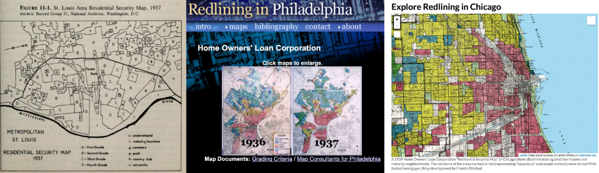
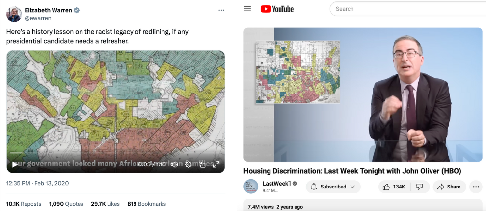
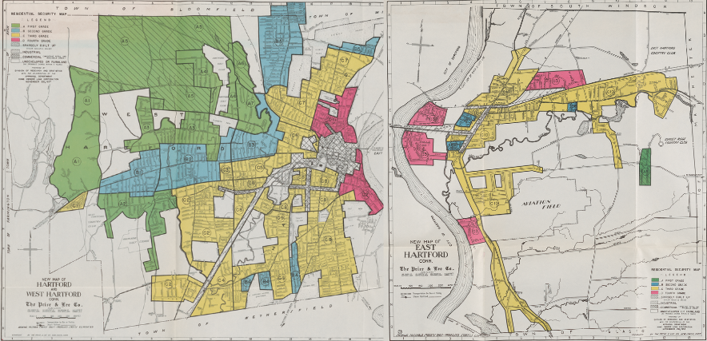
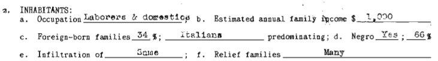
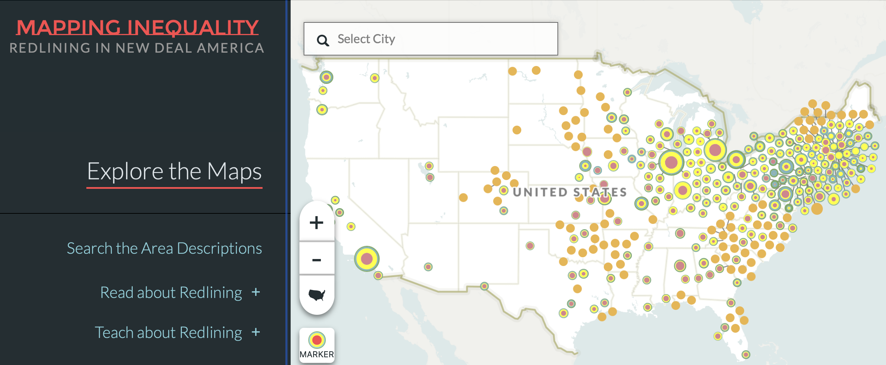
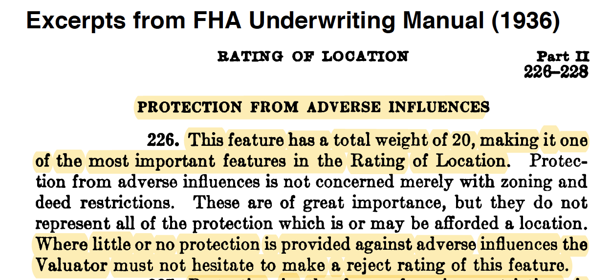

## Federal Lending and Redlining {- #lending}
*by [Shaun McGann and Jack Dougherty](authors.html)*

This chapter compares how two federal programs---the Home Owners' Loan Corporation (**HOLC**) and the Federal Housing Administration (**FHA**)---intensified racial and economic segregation in metropolitan Hartford over time. Both programs were designed to boost the housing market during the 1930s Depression by funding banks and other lenders to offer long-term mortgage loans that made homeownership more affordable. And in different ways, both HOLC and FHA engaged in **redlining**, where financial institutions systematically draw "red lines" around specific areas to downgrade or deny investments. Instead of evaluating an individual mortgage applicant and their property, redlining makes discriminatory decisions based on the racial and socioeconomic makeup of the entire neighborhood. In this way, segregation was not driven solely by individual prejudice of property owners, but also by institutional and government policies that disinvested in city neighborhoods with Black, immigrant, and working-class families, while funding new homes in all-White middle-class suburbs. Although Black civil rights leaders and journalists discovered and challenged federal leaders on this type of discrimination in the 1930s, the term "redlining" was coined by a later generation of activists in the early 1970s.^[@michneyNewPerspectivesNew2020; @illinoislegislativeinvestigatingcommissionRedliningDiscriminationResidential1975; @finleyChicagoFreedomMovement2015a]

This chapter argues that while FHA policies played a larger role in segregating America, HOLC gained more public attention because its eye-catching "redlining" maps and derogatory racist language about Black and immigrant neighborhoods became more widely accessible in the digital age. The transition from the printed page to the web browser is shown in Figure \@ref(fig:1985-jackson-hillier-coates). In 1985, historian Ken Jackson's *Crabgrass Frontier* book explored how FHA and other federal lending programs generally privileged White suburbs. Jackson rediscovered HOLC "redlining" maps that had been hidden away in the US National Archives since the 1930s, and included a black-and-white outline sketch, officially labeled the "Residential Security Map" for St. Louis. By the early 2000s, Amy Hillier's research deepened scholarly understanding of the differences between HOLC and FHA. But Hillier's ["Redlining in Philadelphia" website](https://web.archive.org/web/20040130043548fw_/http://cml.upenn.edu/redlining/HOLC.html) also brought HOLC maps from the archives into living color on computer screens, and sparked the imagination of a younger generation of digital historians. In 2014, when journalist Ta-Nehisi Coates published his widely-acclaimed "Case for Reparations" essay, *The Atlantic* magazine featured an [interactive HOLC map of Chicago](https://www.theatlantic.com/media/interactives/2014/06/chicago/holc.html) on its website. Similarly, Richard Rothstein's best-selling 2017 *The Color of Law* book described institutional racism in both the FHA and HOLC, but the front cover of his book highlighted an HOLC map. Around the same time, Robert Nelson and collaborators launched their first edition of [*Mapping Inequality*](https://dsl.richmond.edu/panorama/redlining/), the most extensive digital collection of HOLC "redlining" maps in the nation, which have now reached millions of online viewers.^[@jacksonCrabgrassFrontierSuburbanization1985; @hillierRedliningPhiladelphia2003, and her earlier print essay @hillierRedliningPhiladelphia2002; @coatesCaseReparations2014; @dintinoHOLCMapExplore2014; @rothsteinColorLawForgotten2017; @nelsonMappingInequalityRedlining2023, first launched in 2016, is currently in its third edition.]

(ref:1985-jackson-hillier-coates) From left to right, HOLC "redlining" maps became more colorful and accessible with digital history. Jackson's 1985 book with black-and-white outline map of St. Louis; Hillier's 2004 website with digitized static map of Philadelphia; Coates's 2014 essay with interactive map of Chicago. Sources: US federal government maps are in the public domain, and copyrighted portrayals of them are reprinted here under fair-use guidelines.

```{r 1985-jackson-hillier-coates, fig.cap="(ref:1985-jackson-hillier-coates)"}
 
```

By 2020, HOLC "redlining" maps leaped out of the pages of history and onto the stages of national politics and popular culture. At the Democratic presidential candidate debate, Massachusetts Senator Elizabeth Warren challenged former New York City mayor Michael Bloomberg's stance on housing and supported her position by releasing a short historical ["What is Redlining?"](https://twitter.com/ewarren/status/1228009904973238274) video on Twitter, re-shared by over 10,000 subscribers, as shown in Figure \@ref(fig:2020-warren-oliver). One year later, comedian John Oliver featured an HOLC redlining map in a [Housing Discrimination episode](https://youtu.be/_-0J49_9lwc) of his satirical news television show, HBO's *Last Week Tonight*, with an additional 7 million views on YouTube. To credit Oliver's research team, he also briefly displayed a scholarly white document to represent the FHA, yet viewers were more likely to remember the color-coded HOLC map.^[@warrenWhatRedlining2020; @epsteinWarrenSaysBloomberg2020; @oliverHousingDiscrimination2021]

(ref:2020-warren-oliver) Eye-catching HOLC redlining maps featured in national politics by Elizabeth Warren on Twitter in 2020, and in popular culture by John Oliver on HBO/YouTube in 2021. Copyrighted images reprinted here under fair-use guidelines.

```{r 2020-warren-oliver, fig.cap="(ref:2020-warren-oliver)"}
 
```

But when "redlining" spread into popular culture and politics, key distinctions between the two federal lending programs, HOLC and FHA, became blurry. This chapter builds on the works of several historians to address two common misconceptions, and draws on clarifying evidence from the Hartford region. The first misconception to clear up is that not all HOLC "redlined" neighborhoods were Black neighborhoods. Looking more closely at Hartford and elsewhere, HOLC also applied its lowest-level "red" rating to some lower-income immigrant neighborhoods with no Black residents. The second misconception to correct is that while HOLC maps may be more visible to us today, FHA loans did more damage over time by divesting in cities and subsidizing suburbs. While HOLC color-coded maps and neighborhood reports *reflected* racist views in 1930s government policy, FHA *caused* more racial and economic segregation through the plain white pages of its bureaucratic application process and *Underwriting Manual*. Surprisingly, Black Hartford homeowners were *nearly twice as likely* as White homeowners to receive HOLC mortgages relative to their population. In comparison, White homeowners were *nearly twice as likely* as Black homeowners to hold FHA-insured mortgages across the Northeast region, and FHA funded far more homes and lasted decades longer than HOLC.^[The arguments in this chapter primarily build on these historical works, though they do not agree with each other on every point: @hillierRedliningHomeOwners2003; @michneyHowCitySurvey2022; @gioielliTyrannyMapRethinking2022; @brownPairHOLCMaps2023]

Before we delve into the differences between HOLC and FHA, let's begin with how financing a home purchase was a very different process a century ago. Also, for readers who are new to present-day concepts in homeownership, such as how mortgages spread out costs over 15-30 years, yet many barriers to affordable housing still remain, explore the "[Home and School Shopping Simulation](home-school-shopping.html)" in this book for a learning activity developed while teaching undergraduate students about housing.

### How Federal Lending Changed Homeownership {-}
During the 1920s, purchasing a home was difficult for even middle-class Americans to afford because of the financial terms. Many banks typically offered home mortgage loans that placed the burden of risk on the borrower's shoulders, and required them to pay it back very quickly. Typical mortgages during the 1920s included these terms:

- Large down payment: Typically 50 percent of the home value, because banks usually limited their mortgages to 50 percent (called a loan-to-value ratio of 50 percent).
- Short-term loans: Typically 5 years, designed to repay only the interest on mortgage loan.
- "Balloon payment" loans: Borrowers were required to repay the entire principal, or the amount borrowed, in one lump sum at the end of the loan period.
- Higher interest rates: Typically 6 to 8 percent during the 1920s.

During the Great Depression of the 1930s, the economic collapse devastated the housing market and threatened the interests of both lenders and borrowers. Homeowners who suddenly lost their jobs were now in danger of missing loan payments, defaulting on their mortgages, and losing their homes to bank foreclosures. But when banks foreclosed and attempted to sell off these homes, they typically were worth less than their original price prior to the Depression. In response to this economic crisis, President Franklin D. Roosevelt's "New Deal" administration created federal agencies that increased access to the middle class by offering home mortgages on more favorable terms:

- Smaller down payment: Typically 10 or 20 percent of the home value, because lenders raised the loan-to-value ratio to 80 or 90 percent.
- Longer-term loans: Repayment extended to 15 or 20 years.
- Amortization of loans: This formula meant that borrowers repaid both the interest and principal on the loan in regular installments over time, rather than one lump sum at the end.
- Lower interest rates: Federal support lowered interest rates to around 5 percent during the 1930s.

Picture how homeownership became more affordable for a buyer in the Hartford area, based on typical prices and mortgage terms during this period. Prior to the 1930s, if a home price was $10,000, a typical bank would only offer a $5,000 mortgage loan, limited to 50 percent of the home value, which forced the buyer to raise the remaining $5,000 in cash for the down payment at the time of purchase. If the buyer only had $2,000 on hand, they might need to make up the $3,000 difference by seeking a second mortgage from another lender, who would charge higher fees than the first mortgage lender due to the increased risk. During a five-year loan period, the homeowner would pay back interest to the bank on the first mortgage, but then need to raise funds for the $5,000 "balloon payment" at the end, which often required them to refinance a subsequent loan.

But during the 1930s, New Deal federal agencies provided mortgage loans with better terms for middle-class homebuyers in the Hartford region. In 1934, the *Hartford Courant* observed that buying a $10,000 home required a 20 percent down payment of $2,000, because lenders raised the borrowing limit to 80 percent of the home value. The loan repayment period was extended from 5 years to 15-20 years. Buyers repaid the $8,000 principal plus interest through a series of stable monthly payments. According to an amortization schedule, the monthly repayments on an $8,000 mortgage at 5 percent interest for 20 years would be about $50 per month, very similar to monthly housing rental payments in Hartford at that time. No longer would "balloon payments" explode the homeowners' finances at the end of a short-term loan. Amortization also enabled families to build up equity in their homes, meaning that they gradually owned a larger share of their home's market value, minus the remaining mortgage they owed, while the lender legally held the property deed. For many Americans, as New Deal home loans programs improved these terms into the late 1930s, it became cheaper to buy than to rent.^[On national changes in home mortgage loan terms from the 1920s to the 1930s, see @jacksonCrabgrassFrontierSuburbanization1985, pp. 204-06; @rothsteinColorLawForgotten2017, pp. 63-4. On Hartford changes, see @winslowHomePurchaseMade1934]  

### How HOLC Rated Mortgage Risk {-}
One of Roosevelt's first steps to change mortgages was to sign legislation to create the Home Owners' Loan Corporation (HOLC) in 1933. Historians Todd Michney and LaDale Winling describe how HOLC had two distinct phases, which reshapes how we understand the role of its "redlining" maps. During its *rescue phase* from 1933-35, HOLC made over 97 percent of its loans by purchasing and refinancing mortgages for homeowners facing bank foreclosure due to their inability to keep up with payments during the Depression. Later, during HOLC's *consolidation phase* from 1935-51, the agency managed its mortgage holdings and sold them off to other investors. Also during this second phase, HOLC launched its City Survey Program and sent field agents to interview local lenders and compile neighborhood risk appraisals into "Residential Security Maps" for 239 cities across the nation. But HOLC did not invent redlining, as life insurance companies previously discriminated in this way, nor did HOLC circulate its maps beyond a small group of government officials. Surprisingly, while we call these "redlining" maps today, historians Michney and Winling emphasize that HOLC *never* used this set of maps to "redline" or deny a loan to anyone, because the agency's first maps were not available until late 1935, *after* HOLC made nearly all of its homeowner loans during its rescue phase.^[To clarify, @michneyHowWhyHome2024 states that "HOLC almost certainly used the City Survey maps for discriminatory purposes" when denying Black buyers the right to purchase its foreclosed properties in White neighborhoods, until a Black veteran successfully challenged this policy in a Philadelphia court in 1943, but these foreclosure sales came after the larger "rescue phase" of HOLC mortgages.]

So why do these maps matter? Although HOLC maps did not *cause* redlining, they clearly *reflect* the racist and elitist perspectives of the federal officials who created them, and this vivid reflection *survived* in the archives to our present day. By contrast, the Federal Housing Administration (FHA) started to produce its own color-coded Neighborhood Ratings Maps in 1935, and used them to deny mortgage insurance applications in city neighborhoods. But federal administrators apparently disposed of most of the damning evidence of these FHA redlining maps, since only a few of them still exist in the archives. According to historians who reconstructed how these rival federal agencies operated, the surviving HOLC maps most likely *mirror* the views of the missing FHA redlining maps.^[@michneyHowWhyHome2024. On FHA Neighborhood Ratings Maps that still exist, see @brownPairHOLCMaps2023]

In Hartford, looking closely at how federal agents created HOLC "redlining" maps in consultation with local lenders reveals their racist and elitist views of the neighborhoods across the growing city-suburban region. Foster Milliken Jr., the HOLC field agent assigned to the Hartford area, was no stranger to the world of finance. Decades earlier, his father presided over Milliken Brothers, Inc., a multi-million dollar structural steel manufacturer in New York City that built the world's tallest buildings at that time. Prior to the Depression, Foster Milliken Jr. worked as a stockbroker in Manhattan and was familiar with its social circles. When HOLC first sent him to Hartford in 1936, he consulted with real estate board members and banking executives, such as leaders of the Society for Savings, the state's oldest mutual savings bank and the city's leading mortgage lender. While Milliken described these men as "a fair and composite opinion of the best qualified local people, his confidential report labeled Hartford as a "typical New England city" with "ultra-conservative" lending policies. Hartford bankers "desire to solve their own problems without outside help or assistance," he observed, and "it is not surprising that the FHA is generally frowned upon just as was the HOLC."^[@MillikenBrothersFail1907; @FosterMillikenJr1930; @MillikenDurell1935; @millikenjr.ConfidentialReportSurvey1936, p. 3, 20.]

Despite bankers' distrust towards FDR's home lending programs, Milliken persuaded several executives to speak privately with him and offer their candid assessment of neighborhoods in the City of Hartford and two suburbs, West Hartford and East Hartford. Milliken's report captured their collective views of the "trend of desirability" for each area, accompanied by the four-color HOLC "Residential Security Map" to visually illustrate their perceived levels of mortgage investment risk. Green signaled the safest areas for lenders to offer home loans, followed by blue and yellow, and then red marked the most "hazardous" areas on what is known today as the Hartford-area "redlining" map, as shown in Figure \@ref(fig:1937-holc-hartford-west-east).^[See originals at @homeownersloancorporationResidentialSecurityMaps1937; georeferenced scans at @mappinginequalityResidentialSecurityMaps2023]

(ref:1937-holc-hartford-west-east) Explore the [1937 HOLC Residential Security Maps for West Hartford, Hartford, and East Hartford](https://dsl.richmond.edu/panorama/redlining/map/CT/Hartford/), georeferenced by Mapping Inequality. Green showed HOLC's safest rating for mortgage investment, followed by blue, yellow, and red to signal the riskiest areas. Since HOLC maps did not circulate outside of a small number of government officials, perhaps no one in the Hartford area saw this map until 2006, when Dougherty brought back scanned images of the originals at the National Archives in College Park, Maryland.

```{r 1937-holc-hartford-west-east, fig.cap="(ref:1937-holc-hartford-west-east)"}
 
```

Standing in downtown Hartford's business district, Milliken observed that "the entire trend is to the west." Green, the highest rating, was most prominent in the northern half of West Hartford, and the northwest corner of Hartford around Prospect Avenue and Scarborough Streets. These marked the best opportunities for mortgage investment, what Milliken described as "hot spots" of new and well-planned home construction where "lenders with available funds are willing to make their maximum loans" at up to 80 percent of the appraised property value (thereby requiring only a 20 percent down payment from homeowners). Blue, the second-grade rating, stood out along Farmington Avenue from West Hartford Center into Hartford's West End, plus North End neighborhoods such as Blue Hills, and smaller pockets in the South End, as well as portions of East Hartford. Milliken stated that blue represented completely developed neighborhoods of good quality, but not the best, where lenders offered mortgages at no more than 70 percent of the home value (or a 30 percent down payment). Yellow, the third-grade ranking, dominated the southeast corner of West Hartford, most of the South End and large portions of the North End of Hartford, and the majority of East Hartford. Milliken indicated that yellow signified areas in "transition" where mortgage lenders were even more cautious than above. Finally, red marked the lowest-grade areas with the least desirable housing, generally located along the flood-prone banks of the Connecticut River, such as Hartford's Italian and Black neighborhoods in tenement housing along Front Street and Windsor Street.^[@millikenjr.ConfidentialReportSurvey1936; @homeownersloancorporationResidentialSecurityMaps1937]

The HOLC map reveals striking patterns but also some variation across Hartford's city-suburban lines. When comparing the HOLC ratings of the land area evaluated in each municipality, 84 percent of West Hartford received an A or B, compared to 29 percent of Hartford and 5 percent of East Hartford, as shown in Table \@ref(tab:1937-holc-area). But the lowest ratings were not exclusive to the City of Hartford. In West Hartford, 16 percent of the rated land received a C, and the D rating was more prevalent in East Hartford (20 percent of all rated land) compared to Hartford (9 percent).^[Table based on land areas in 1937 HOLC map and report. See sources and calculations in @ilyankouMapFederalHOLC2017. Not all land area in each municipality received HOLC ratings.]

Table: (\#tab:1937-holc-area) Percent of Land Area with HOLC Rating in Hartford Area 1937

| Grade & Color | West Hartford | Hartford      | East Hartford | All Areas     |
|:--------------|--------------:|--------------:|--------------:|--------------:|
| A - Green     | 69%           | 7%            | 2%            | 33%           |
| B - Blue      | 15%           | 22%           | 3%            | 16%           |
| C - Yellow    | 16%           | 62%           | 75%           | 44%           |
| D - Red       | 0%            | 9%            | 20%           | 7%            |
| Total         | 100%          | 100%          | 100%          | 100%          |

How did HOLC field agents rate neighborhoods? Although HOLC guidelines considered the physical condition and market price of the housing stock, field agents were instructed to evaluate the "social status of the population," based on the dominant standards of racial superiority and economic privilege at the time. Written in the derogatory language of its time, the one-page standardized HOLC appraisal forms asked Milliken to report the percentage of "Foreign-born" and "Negro" families in each neighborhood, and "Relief families" who received Depression-era federal income assistance, and also any "Infiltration" of outside groups, as shown in Figure \@ref(fig:1937-holc-inhabitants-d1).^[See readable version @homeownersloancorporationAreaDescriptionsResidential1937, pp. 1, A1-D3, based on original @homeownersloancorporationResidentialSecurityMaps1937]

(ref:1937-holc-inhabitants-d1) Explore the [1937 HOLC Hartford area descriptions PDF](https://github.com/ontheline/otl-redlining/blob/main/sources/holc-hartford-1937-appraisal.pdf), based on forms that instructed field agents to report on the social composition of the neighborhood as a factor to measure mortgage risk. Image: Hartford area D-1, 1937, from the National Archives.

```{r 1937-holc-inhabitants-d1, fig.cap="(ref:1937-holc-inhabitants-d1)"}
 
```

HOLC invited field agents to write additional comments at the bottom of the form, and Milliken's notes probably reflect his own racism and elitism as well as the views of local lenders he consulted. In suburban West Hartford (map area Green A-2), one of the highest ratings was granted to a newer housing development that attracted "minor executives and businessmen." Milliken approvingly added that "a stream separates this section from its less desirable neighbor," referring to how Trout Brook served as a natural barrier to the adjacent southeastern area of West Hartford (Yellow C-2) which he described as having an "infiltration of mixed foreign" families in "workingmen's homes." In the North End of Hartford, Milliken favorably described the Blue Hills neighborhood (Blue B-5) but disapprovingly stated that it was "largely given over to the Hebrew race," meaning the arrival of Jewish families, "although the better class Italians are now also moving there." In the South End of Hartford (Yellow C-9), Milliken observed that one nearly all-White neighborhood had a small percentage of "Negro families (who) are confined to Roosevelt Street," and he added that "lenders suggest caution in the selection of loans." But all of these neighborhoods stood above HOLC's lowest-rated red areas, which Milliken described as "broader than the so-called slum districts" due to an "undesirable population" with "unstable incomes." Near downtown Hartford, Milliken labeled the Front Street and Windsor Street neighborhoods (Red D-1) as "the city's oldest residential section, which has gradually drifted into a slum area" occupied primarily by Black and Italian residents. See all HOLC neighborhood appraisals by clicking on the interactive map shown in Figure \@ref(fig:1937-otl-redlining). Through the process of rating and mapping the Hartford region, the invisible color and class lines in the minds of Hartford's financial leaders were transformed into a visible color-coded map, endorsed by the federal government, yet hidden from public view.^[@homeownersloancorporationResidentialSecurityMaps1937; @ilyankouMapFederalHOLC2017, based on earlier maps created with @reecePeoplePlaceOpportunity2009 and @universityofconnecticutlibrariesmapandgeographicinformationcenterFederalHOLCRedlining2012]

(ref:1937-otl-redlining) Click on color-coded areas in the [full-screen interactive map](https://ontheline.github.io/otl-redlining/index-caption.html) to view one-page appraisals of Hartford-area neighborhoods by the HOLC field agent in 1937. Agents rated not only the physical property but also the "social status of the population," and downgraded neighborhoods with Black, immigrant, and lower-income residents. Decades later, activists labeled these "redlining" maps, and while they reflect racist and elitist views, HOLC did not actually use them to deny mortgages. Map developed by Ilya Ilyankou and Jack Dougherty, based on earlier versions created with UConn MAGIC and the Kirwin Institute. View [historical sources and code](https://github.com/ontheline/otl-redlining).

```{r 1937-otl-redlining, fig.cap="(ref:1937-otl-redlining)"}
if(knitr::is_html_output(excludes="markdown")) knitr::include_url("https://ontheline.github.io/otl-redlining/", height="600px") else knitr::include_graphics("images/1937-otl-redlining.png")
```

How can we tell whether HOLC neighborhood ratings were driven primarily by physical housing characteristics, or by the discriminatory views of lenders and field agents about the people living there? Given that White elites segregated Black, immigrant, and lower-class residents into sub-standard housing, these two factors are tangled together. For example, one could argue that the neighborhood north of downtown Hartford received a Red D-1 rating not only because it had the greatest concentration of Black residents (66 percent), but also because it had the lowest-quality property (valued at only $4,000 - $6,000 per unit). Definitively answering this question with statistical analysis is difficult because HOLC divided the Hartford area into only 27 neighborhoods, and only 3 of these included Black residents, resulting in a very small sample size with limited variation.

While not a definitive method, we can assess the relative weight of demographics with a side-by-side comparison of two Hartford neighborhoods that shared relatively similar physical housing characteristics, but received different HOLC ratings. Table \@ref(tab:1937-holc-app) shows HOLC appraisal report data for two areas: the Blue Hills neighborhood in Hartford's North End (Blue B-5) versus the South End neighborhood (Yellow C-9). Both consisted primarily of two-family wooden frame homes, built within the previous two decades, which sold and rented at comparable prices in 1937. So why did HOLC grade one as a B and the other as a C? Demographic differences between the two neighborhoods are highlighted in bold type. The South End C-9 neighborhood contained more blue-collar factory workers, more foreign-born families, a very small percentage of Black families, and "quite a few" more lower-income families who received government assistance. Once again, this side-by-side comparison of only 2 out of 27 HOLC ratings is not statistically definitive, but it certainly suggests that in the eyes of HOLC appraisers, the social composition of the neighborhood mattered more than the physical composition of the housing or its market value.^[See table source in @ilyankouMapFederalHOLC2017]

Table: (\#tab:1937-holc-app) Compare HOLC Appraisals in Areas B5 vs. C9, Hartford 1937

| Area | B5 (Blue Hills) | C9 (South End) |
|:------|:------|:------|
| Security Grade            | Second                     | Third                    |
| Location                  | Hartford                   | Hartford                 |
| Trend Next Decade         | Stable                     | Stable                   |
| Occupation                | **Shopkeepers & white collar** | **Factory workers & clerks** |
| Estimated Family Income   | $1,800                     | $1,500                   |
| **Foreign-born families** | **5%**                     | **20%**                  |
| Predominant foreign group | Italians                   | Italians                 |
| **Negro Y/N**             | **No**                     | **Yes**                  |
| **Negroes**               | **0%**                     | **1%**                   |
| **Relief Families**       | **None**                   | **Quite a few**          |
| Primary Building: Type    | 2-Family                   | 2-Family                 |
| Construction              | Frame                      | Frame                    |
| Average Age (yrs)         | 15                         | 20                       |
| Repair                    | Good                       | Fair                     |
| Occupancy                 | 98%                        | 97%                      |
| Home ownership rate       | 85%                        | 85%                      |
| Price Range (1937)        | $7,500 to 12,000           | $7,500 to 11,000         |
| Sales Activity            | Poor                       | Almost None              |
| Rental Range (1937)       | $40 to 50/month            | $32.5 to 55/month        |
| Rental Activity           | Good                       | Good                     |
| Mortgage Availability     | Ample                      | Limited                  |

While ratings were driven by demographics, race was not always the determining factor in Hartford and other cities. First, although the South End C-9 neighborhood included a very small number of Black families, HOLC still gave it a yellow C rating rather than a red D rating. This presence of Black residents in a C-rated area contradicts claims made by other researchers, such as Richard Rothstein, who mistakenly wrote that "A neighborhood earned a red color if African Americans lived in it, even if it was a solid middle-class neighborhood of single-family homes." Second, while HOLC gave its lowest D-level rating to the Windsor Street neighborhood of Black and Italian families (D-1), it made the same rating to two other working-class areas with no Black residents: the Front Street neighborhood of Italian and Polish families (D-2) and its counterpart across the Connecticut River in East Hartford (D-3).^[@rothsteinColorLawForgotten2017, p. 64. On HOLC D-level ratings in other lower-income immigrant neighborhoods without Black residents, see @michneyHowWhyHome2024; in Boston, see @nelsonRedliningRaceColor2021]

The Hartford region was only one of 239 areas across the U.S. where HOLC field agents rated neighborhoods during the 1930s. Historian Robert K. Nelson and colleagues have compiled the most comprehensive digital collection of HOLC maps and appraisal reports at [Mapping Inequality: Redlining in New Deal America](https://dsl.richmond.edu/panorama/redlining/), now in its third edition, as shown in Figure \@ref(fig:2023-redlining-america).

(ref:2023-redlining-america) Zoom in and click on HOLC maps and appraisals for cities across the US in the [full-screen interactive version of Mapping Inequality: Redlining in New Deal America](https://dsl.richmond.edu/panorama/redlining/map) by Robert K. Nelson and collaborators.

```{r 2023-redlining-america, fig.cap="(ref:2023-redlining-america)"}
if(knitr::is_html_output(excludes="markdown")) knitr::include_url("https://dsl.richmond.edu/panorama/redlining/map", height="600px") else 
```

For Connecticut, the [Mapping Inequality collection](https://dsl.richmond.edu/panorama/redlining/) includes HOLC maps and neighborhood appraisals for 18 of the state's 169 municipalities, with historical context essays on six central cities:       
- Bridgeport, Fairfield, and Stratford, with [context by Sonya Huber](https://dsl.richmond.edu/panorama/redlining/map/CT/BridgeportandFairfield/context)  
- Hartford and its suburbs East Hartford and West Hartford, with [context by Jack Dougherty](https://dsl.richmond.edu/panorama/redlining/map/CT/Hartford/context)     
- New Britain, with [context by Jackie Wu](https://dsl.richmond.edu/panorama/redlining/map/CT/NewBritain/context)    
- New Haven and portions of its suburbs East Haven, North Haven, West Haven, Hamden, and Woodbridge, with [context by Mia Jackson](https://dsl.richmond.edu/panorama/redlining/map/CT/NewHaven/context)    
- Stamford and its suburbs Darien and New Canaan, with [context by Mars Plater](https://dsl.richmond.edu/panorama/redlining/map/CT/StamfordDarienandNewCanaan/context)    
- Waterbury and its suburb of Watertown, with [context by Raechel Guest](https://dsl.richmond.edu/panorama/redlining/map/CT/Waterbury/context)    
Although the city of New London appeared in an inventory of the 1930s HOLC City Survey Program, the Mapping Inequality team has *not* yet been able to locate its map or neighborhood report in the National Archives.^[Although New London is listed in HOLC inventory referenced by @hillierResidentialSecurityMaps2005, p. 229, these materials have not yet located at the National Archives in College Park, Maryland. See historical context essays by @huberContextBridgeportFairfield2024; @doughertyContextHartfordCT2023; @wuContextNewBritain2024; @jacksonContextNewHaven2024; @platerContextStamfordDarien2024; @guestContextWaterburyCT2024.]

Overall, while these HOLC maps and reports reflects the racism and elitism of federal officials and local lenders, the FHA made a more direct and lasting impact on redlining city neighborhoods and segregating White suburbs.  

### How FHA Restricted Lending by Location {-}
Shortly after Roosevelt's New Deal launched the HOLC, he signed the National Housing Act in 1934, which created a second agency that also reshaped home mortgage financing, called the Federal Housing Administration (FHA). While the HOLC directly provided mortgages to existing homeowners to rescue them from bank foreclosures, the FHA dealt directly with banks and other lenders, and offered a form of insurance---called underwriting---where the federal government guaranteed that homebuyer mortgages would be repaid. FHA signaled a major step into the free market by using public tax dollars to subsidize mortgage risks that normally fell to privately-owned banks and other financial institutions, as part of the New Deal administration's overall plan to rebuild the shattered housing market.

The FHA's definition of risks in the housing market reflected the racial views of Frederick M. Babcock, Director of Underwriting, and fellow officials at this federal agency. Scholars point to Babcock as the first to codify how the real estate industry should factor race into its formal assessments of property values. Originally from Chicago, he graduated from Northwestern University, worked in his father's real estate firm, then wrote his first book, *The Appraisal of Real Estate*, in 1924. Babcock observed that "residential values are affected by racial and religious factors... A home utility seeks location near people, but always near persons of the same social standing, same races..." He delved further into this theme of socially homogenous neighborhoods when writing his influential textbook, *The Valuation of Real Estate* in 1932. In a section titled "The Influence of Social and Racial Factors," Babcock asserted that while most population changes only lead to gradual differences in property value, "there is one difference in people, namely race, which can result in a very rapid decline." Rapid declines in property values "can be partially avoided by segregation," Babcock argued, and suggested that Southern methods for separating Whites and Blacks might also be appropriate in Northern states.^[@babcockAppraisalRealEstate1924, p. 71; @babcockValuationRealEstate1932, p. 91. On Babcock's role in codifying race and real estate, see @brownAppraisalNarrativesReading2018; @adamsPuttingRaceExplicitly2009; @BabcockFrederickMorrison2020; @harrisewingFrederickBabcockPhotograph1937]

(ref:1937-babcock-frederick) Frederick M. Babcock, shown here as Director of the Underwriting Division of the Federal Housing Administration in 1937, codified how the presence of "inharmonious" racial groups should be negatively factored into FHA mortgage applications. Photo digitized by [Library of Congress](https://www.loc.gov/pictures/item/2016871684/).

```{r 1937-babcock-frederick, fig.cap="(ref:1937-babcock-frederick)"}
 knitr::include_graphics("images/1937-babcock-frederick.jpg")
```

Under Babcock's influence, the FHA published its first *Underwriting Manual* in 1935 to determine which homebuyers qualified for FHA-insured loans. This detailed 200+ page manual, which grew longer with subsequent editions, established guidelines for FHA staff to rate mortgage applications. Instructions specified exactly how FHA evaluators should inspect the property, evaluate its location, and judge the applicant's credit worthiness before approving government funds to underwrite the loan and guarantee repayment. The *Manual* featured sample scoring charts that summarized various factors for FHA evaluators to consider, such as the ratio of the loan to the value of the home, and the likelihood that the building would have economic value beyond the life of the mortgage, as shown in Figure \@ref(fig:1936-fha-manual-247). But the most important factor on the form was "Location." Even if the application received high marks in other categories, an unfavorable location rating required FHA staff to reject it.^[@federalhousingadministrationUnderwritingManualUnderwriting1935; @federalhousingadministrationUnderwritingManualUnderwriting1936, section 247.]

(ref:1936-fha-manual-247) This sample scoring chart from the [1936 Federal Housing Administration Underwriting Manual](https://babel.hathitrust.org/cgi/pt?id=mdp.39015018409246;view=1up;seq=246) showed how an unfavorable location rating required FHA staff to reject a mortgage application. Source hosted by HathiTrust.

```{r 1936-fha-manual-247, fig.cap="(ref:1936-fha-manual-247)"}
 knitr::include_graphics("images/1936-fha-manual-247.png")
```

Exactly how did the FHA *Underwriting Manual* define a good location? The most heavily-weighted factor was "Protection from Adverse Influences," which referred to different ways to defend homogenous White middle-class suburban neighborhoods from outsiders they deemed undesirable. FHA sent appraisers to inspect not only the physical building, but also the social demographics of its surroundings and future threats to its stability. The *Manual* instructed appraisers to "investigate areas surrounding the location to determine whether or not incompatible racial and social groups are present," such as Black, immigrant, or lower-income residents, as any intrusions would provoke "instability and a reduction in values," as shown in Figure \@ref(fig:1936-fha-manual-226-excerpts). Neighborhoods received higher scores if they were protected by "natural or artificially established barriers," such as hills, parks, highways, or college campuses that prevented "infiltration" by "lower-class occupancy and inharmonious racial groups." The *Manual* also favored legal tools that racially and economically segregated neighborhoods--- such as [racially restrictive covenants](restricting.html) and [exclusionary zoning ordinances](origins-zoning.html)---as described in later chapters in this book. FHA guidelines also shaped local educational policy by cautioning that neighborhood schools "should not be attended in large numbers by inharmonious racial groups," thereby leveraging federal housing funds to block integrated schools. Finally, the *Manual* warned appraisers to carefully consider potential changes in future decades, because if the "character of a neighborhood" declines, "it is usually impossible to induce a higher social class than those already in the neighborhood to purchase and occupy properties." Overall, tax-supported FHA mortgages divested federal funds from existing homes in racially and economically diverse city neighborhoods, while funneling money into new home construction in all-White suburbs.^[@federalhousingadministrationUnderwritingManualUnderwriting1936, part II, sections 226-233, 284, 289. On the racial logic of the *Underwriting Manual*, see @freundColoredPropertyState2007, pp. 155-162; @rothsteinColorLawForgotten2017, pp. 64-66.]

(ref:1936-fha-manual-226-excerpts) Explore [excerpts on "adverse influences" in the 1936 FHA Underwriting Manual](images/bookdown/1936-fha-manual-226-excerpts.pdf) or [view the full document](https://babel.hathitrust.org/cgi/pt?id=mdp.39015018409246;view=1up;seq=195), hosted by Hathitrust. The FHA required evaluators to reduce scores for mortgage applications located near racially or socioeconomically diverse neighborhoods, and to raise scores for those in homogenous all-White middle-class areas.

```{r 1936-fha-manual-226-excerpts, fig.cap="(ref:1936-fha-manual-226-excerpts)"}
if(knitr::is_html_output(excludes="markdown")) knitr::include_url("images/1936-fha-manual-226-excerpts.pdf") else 
```

When the FHA expanded its *Underwriting Manual* in 1938, it added a four-level ranking for the neighborhood location, on a scale from A to D, based largely on the HOLC City Security Map ratings. Updated FHA evaluation forms also included specific codes to designate the predominant racial composition of the neighborhood: White, Mixed, Foreign, and Negro, as shown in Figure \@ref(fig:1938-fha-manual-1849).^[@federalhousingadministrationUnderwritingManualUnderwriting1938, section 1849-50]

(ref:1938-fha-manual-1849) The FHA introduced codes to indicate the predominant racial composition of neighborhoods in its [1938 Underwriting Manual](https://babel.hathitrust.org/cgi/pt?id=mdp.39015018409261;view=1up;seq=476). Hosted by HathiTrust.

```{r 1938-fha-manual-1849, fig.cap="(ref:1938-fha-manual-1849)"}
 knitr::include_graphics("images/1938-fha-manual-1849.png")
```

As stated above, FHA created its own color-coded Neighborhood Ratings Maps in 1935, and used them to redline diverse city neighborhoods and deny government-backed mortgages. Few of these FHA redlining maps survived in the archives, with none for Hartford, but we know that their four-color risk levels (A-green, B-blue, C-yellow, D-red) mirrored the existing HOLC maps as well as the FHA *Underwriting Manual* codes above.^[@brownPairHOLCMaps2023; @michneyHowWhyHome2024. Also note that HOLC and FHA were rival agencies and did not officially share public maps between them until 1942, when FHA received three sets of HOLC City Survey maps, according to @michneyHowCitySurvey2022, pp. 331-332.]

But a related source that still exists is the FHA Block Data Map for Hartford, as shown in Figure \@ref(fig:1939-fha-block-data). FHA created this map with the Works Progress Administration to visualize economic and demographic details across Hartford neighborhoods. To be clear, the colors in this FHA Block Data Map show the average monthly rent (blue is the highest, followed by red, orange, and yellow) and do *not* represent "redlined" areas. But inside each city block are eight numbers, and the last shows "Percent of Total Number of Households of a Race other than White." Historian Lawrence T. Brown explains how "Block Data Maps were fundamentally FHA Negro-tracking maps," designed to show exactly where racial "infiltrations" were rising and FHA mortgage applications would likely to be rejected, based on racist standards in the *Underwriting Manual*. In fact, the FHA publicized its new wall-sized Block Data Maps as "'magic carpets' for mortgage lenders" to virtually fly around a city and view "the probable stability of a neighborhood and the trends which may be taking place there.... (such as) whether there are inharmonious racial groups in the vicinity," and to refresh memories "as to the danger spots in a neighborhood." At the end of this FHA publication, Connecticut readers were directed to the FHA office in Hartford, where the "map is available" for viewing.^[@federalhousingadministrationFileUnitHartford1939; @brownPairHOLCMaps2023; @taylorNewMapAid1937. This 1937 FHA publication points readers to Hartford to view the Waterbury Block Data Map at that time, and presumably the 1939 Hartford map was available to view two years later.]

(ref:1939-fha-block-data) View the [full-size FHA 1939 Block Data Map for Hartford](https://catalog.archives.gov/id/333233779), digitized by the National Archives. Colors represent average rental prices, NOT redlined areas. The inset shows that each city block includes eight numbers, and the last shows the "Percent of Total Number of Households of a Race other than White," to warn readers about FHA's policy against lending to neighborhoods with racial "infiltrations."

```{r 1939-fha-block-data, fig.cap="(ref:1939-fha-block-data)"}
 knitr::include_graphics("images/1939-fha-block-data.png")
```

Opponents spoke out against the FHA's racist lending policies. In June 1938, Roy Wilkins at the National Association for the Advancement of Colored People (NAACP) wrote to Robert Weaver, a Black special assistant in the US Housing Authority, to relay that a White FHA employee had tipped them off about race restrictive covenants in the mortgage guidelines. The NAACP magazine *The Crisis* reported in 1939 that a local branch in Queens, New York investigated complaints from Black homebuyers whose FHA applications were rejected. When pressed by NAACP attorney Thurgood Marshall, local FHA officials admitted that "no mortgages were guaranteed for colored people in any neighborhood which was less than 50% Negro." NAACP director Walter White wrote to President Roosevelt to demand the removal of the segregationist clause about "incompatible racial and social groups" from the *Underwriting Manual*, but FDR delayed and deflected in his response. Black newspapers investigated these issues, turning more attention from HOLC to the FHA, while the White press largely ignored complaints about racism. FHA leaders kept explicitly racist and classist language in the *Underwriting Manual* until pressured to remove it in 1952. Charles Abrahams, a Polish-born fair housing expert in New York City, wrote in 1955 that "FHA adopted a racial policy that could well have been culled from the Nuremberg laws" by setting itself up as "the protector of the all white neighborhood."^[@connollyHowDidAfrican2015; @HousingAuthorityDraws1939; @michneyNewPerspectivesNew2020, pp. 152-56; @rothsteinColorLawForgotten2017, p. 64; @abramsForbiddenNeighborsStudy1955, pp. 229-30.]

### Comparing the Impact of HOLC and FHA {-}
Although both of these New Deal mortgage programs---the Home Owners' Loan Corporation and the Federal Housing Administration---illustrate the segregationist *intent* of government officials, they had a very different *impact* on people's lives. Although color-coded HOLC maps are more likely to grab pubic attention in national politics and popular culture, FHA caused far more damage through its vanilla application form and *Underwriting Manual*. Although we associate HOLC maps with "redlining," readers may be surprised to learn that Black Hartford homeowners were *nearly twice as likely* as White homeowners to receive HOLC mortgages relative to their population. Meanwhile, White homeowners were *nearly twice as likely* as Black homeowners to hold FHA-insured mortgages across the Northeast region, and FHA funded far more homes and lasted decades longer than HOLC.

When Kenneth Jackson's *Crabgrass Frontier* book launched the field of suburban history in 1985, he focused scholarly attention on the discriminatory practices of both the HOLC and the FHA mortgage programs. Jackson rediscovered the HOLC Residential Security Maps buried deep within the National Archives, reframed them as "redlining" maps by pointing out their racial and antisemitic prejudices, and reprinted examples in his book. Similarly, Jackson called out the FHA *Underwriting Manual* for its multiple prohibitions against insuring loans in racially- or ethnically-mixed neighborhoods neighborhoods.^[@jacksonCrabgrassFrontierSuburbanization1985, pp. 195-218.]

For many people reading about redlining for the first time, racist intent by government officials probably meant the same thing as racist impact on local communities. But Jackson did not make that claim. Instead, his discussion of HOLC loans noted a pattern that surprised him. Although HOLC maps had labeled D-level neighborhoods as "hazardous" to investors, HOLC distributed about 30 percent of its mortgages to homes in D-level areas for cities he examined closely, such as Newark, New Jersey. Jackson explained this puzzling result by stating that HOLC found that residents of poorer neighborhoods generally repaid their loans at a higher rate than more affluent neighborhoods. In this way, HOLC did not refuse to do business in "redlined" areas. Even HOLC reports stated that "we do not mean to imply that good mortgages do not exist or cannot be made in the Third or Fourth grade areas," the lowest-rated yellow and red areas of the map, "but we do think that they should be made and serviced on a different basis than in the First and Second grade areas."^[@jacksonCrabgrassFrontierSuburbanization1985, p. 202; @homeownersloancorporationResidentialSecurityMaps1937, p. 2.]

Historical geographer Amy Hillier also challenged conventional misunderstandings of "redlining" by investigating HOLC and FHA rating and lending patterns more closely across neighborhoods in the city of Philadelphia. In one study, Hillier confirmed that HOLC systematically downgraded neighborhoods with Black residents, which were a statistically significant predictor of ratings when compared to census tract demographics, while controlling for differences in housing characteristics. But Hillier's other studies yielded more surprising results when she examined which Philadelphia properties actually received HOLC or FHA loans from 1940 to 1960. First, Hillier found that HOLC made a large proportion of its loans to lower-grade areas, despite field agents' racial and class biases against Black, immigrant, and lower-class residents. Second, Hillier found that FHA made relatively fewer loans in lower-rated neighborhoods, but data limitations prevented her from making more definitive claims. Overall, when considering both direct and indirect evidence, the FHA is the primary culprit responsible for federal divestment and segregation that led to post-war urban decline. Hillier argues that the FHA "reflected an anti-urban and racial bias deeper than the HOLC's," because its *Underwriting Manual* required privately-owned lenders to avoid risks associated with neighborhood demographics in order to qualify for publicly-funded mortgage insurance, while HOLC reports consistently stated that loans could still be profitable in those areas. "Whether or not [the FHA] used maps with red lines" Hillier concludes, it "did more to institutionalize redlining than any other agency..."^[@hillierRedliningHomeOwners2003, p. 415; @hillierRedliningPhiladelphia2002; @hillierSpatialAnalysisHistorical2003; @hillierSearchingRedLines2005; @hillierResidentialSecurityMaps2005; @hillierWhoReceivedLoans2003]

Available evidence from the Hartford region concurs with Hillier's analysis that FHA caused more harm than HOLC in shaping racial and social class divisions that continue today. To grasp the big picture, let's compare White and Blacks homeownership, and relative rates of federal lending, in both the city and the suburbs. From 1940 to 1950, homeownership rates steadily increased in the City of Hartford for Whites (from 18 to 23 percent) and Blacks (from 6 to 10 percent). Both White and Black single-family homeowners obtained mortgages through savings banks (54 percent) and commercial banks (19 percent), with the federal HOLC program far behind other providers (7 percent) in 1940. Surprisingly, while the total number of Black Hartford single-family homeowners was very small (only 119) in Hartford that year, they were *nearly twice as likely* to hold HOLC mortgages than White homeowners (13 percent versus 7 percent) relative to their population. This pattern of Black access to HOLC, which contradicts what the redlining maps suggests at first glance, matches trends that historians Michney and Winling in several other US cities.^[Table 1: Occupied Dwelling Units and Table 22: Occupancy, Tenure, Race, Population Per Unit (for Connecticut); Table F-4: Holder of First Mortgage on 1-Family Properties, by Race of Occupants and Year Built, for the City of Hartford; all in Volume IV: Mortgages on Owner-Occupied Nonfarm Homes, @uscensusbureauCensusHousing19401943 See calculations in Sources folder in @ilyankouMapFederalHOLC2017; compare with @michneyNewPerspectivesNew2020]

To see the larger influence of FHA during the same period, look at Hartford's nearly all-White, rapidly-growing suburbs that the *Underwriting Manual* clearly favored. Since the federal government did not publish detailed FHA loan data for each city and town, we need to rely on Census data for the Northeast region at large. In 1950, White single-family homeowners were *twice as likely* as Black homeowners (17 versus 9 percent) to benefit from a government-subsidized FHA-insured mortgage in the Northeastern region. Census officials tried to dismiss this racial gap by noting that "nonwhite owners" tended to live in "older structures" with a "lower median purchase price" than White owners, and therefore were "not so likely to meet the requirements for government insurance as newer properties with a higher purchase price." But this official explanation was silent on the role played by FHA policies that intentionally divested in racially and economically mixed city neighborhoods, yet invested in all-White segregated suburbs.^[Summary of Findings, Volume IV: Residential Financing, @uscensusbureauCensusHousing19501952, PDF chapter 2, p. XLI]

Another lasting difference between HOLC and FHA was the volume of loans serviced over time. During its rescue phase from 1933-1935, HOLC purchased mortgages with a total value of over $3 billion, but that dropped off during its consolidation phase from 1935-1951, as HOLC was designed to end in that year. By contrast, the FHA program steadily grew and backed over $5 billion in total loans from the 1930s Depression until World War II, then soared in the post-war years with over $3 billion in loans in 1948 alone, as shown in Figure \@ref(fig:1933-chart-holc-fha). While HOLC directly funded mortgages, FHA operated less directly by insuring mortgage payments to banks and other lenders, thereby using public funding to cooperate with, rather than compete against, private enterprise. Based on the FHA model, after World War II the federal government also created the GI Bill and the Veteran's Administration guaranteed mortgage program, which made it more affordable for returning soldiers and sailors to purchase homes, yet with similar segregated consequences.^[@ilyankouChartValueHOLC2020, with data sources from @harrissHistoryPoliciesHome1951, Table 4: Loans Closed by HOLC, 1933-1936, p. 30, and @federalhousingadministrationFifteenthAnnualReport1949, Table 1: Yearly Volume of Mortgages and Loans Insured by FHA Under All Titles: Face amount of mortgages written and net proceeds of loans insured, 1934-1948, p. 8. Note that the chart compares HOLC mortgages versus all types of FHA-insured loans and mortgages. The majority of FHA is home mortgage insurance, but the total also includes property improvements and rental housing, which can be disaggregated in the source table. On GI Bill and VA guaranteed mortgages, see @jacksonCrabgrassFrontierSuburbanization1985, p. 206-07.]

(ref:1933-chart-holc-fha) Explore the [full-screen interactive chart](https://datawrapper.dwcdn.net/PMDj9/2/) to compare the value of HOLC mortgages versus all types of FHA-insured loans and mortgages sponsored by year from 1933 to 1948. While HOLC mortgage lending peaked at $2.25 billion in 1934, FHA-insured loans have had a longer-lasting influence that surpassed HOLC in the post-war era and continues to the present. See [historical sources, data, and code on GitHub](https://github.com/ontheline/otl-chart-holc-fha/).

```{r 1933-chart-holc-fha, fig.cap="(ref:1933-chart-holc-fha)"}
if(knitr::is_html_output(excludes="markdown")) knitr::include_url("https://datawrapper.dwcdn.net/PMDj9/2/", height="400px") else knitr::include_graphics("images/1933-chart-holc-fha.png")
```

The FHA continues to exist today as the largest federal home lending program  and currently insures mortgage repayments for over 8 million single-family homes. Its explicitly racist policies were removed in the 1950s, and additional improvements came when legislators voted in favor of the 1968 Fair Housing Act, which activists pressured the executive branch to enforce more consistently during the 1970s. By contrast, HOLC actively made loans for only three years during the mid-1930s, then sold off its holdings and dissolved by 1951. Although the HOLC's color-coded redlining maps brightly stand out in our growing historical consciousness about discriminatory federal lending programs in US cities, a more important story lies inside the bureaucratic FHA policies that fueled the growth of new single-family homes in virtually all-White suburbs.^[@FederalHousingAdministration2020]

Government policy fundamentally reshaped the private marketplace of housing, as well as the boundary lines that determined where families of different races or incomes could find a home. On one hand, federal involvement in lending markets prevented millions of families from being forced out of their homes, and expanded homeownership to millions more, from the 1930s Depression through the postwar era. On the other hand, eligibility to participate in these federal lending programs was not neutral, and their impact deeply intensified racial and economic discrimination across city and suburban neighborhoods^[@freundColoredPropertyState2007]

*[About the authors and contributors:](authors.html) Shaun McGann (Trinity 2014) wrote the first draft of this essay in the Cities Suburbs and Schools seminar, and published it in ConnecticutHistory.org. Jack Dougherty expanded the essay for this book, and also published an abbreviated version in Connecticut Explored magazine in 2019. Ilya Ilyankou (Trinity 2018) and Jack Dougherty developed the interactive map, based on an earlier version created with contributors from UConn MAGIC and the Kirwin Institute.*^[@mcgannEffectsRedliningHartford2014; @doughertyFederalGovernmentRedlining2019; @ilyankouMapFederalHOLC2017]
