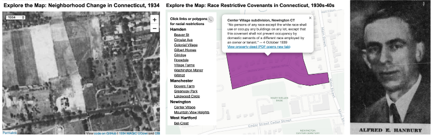
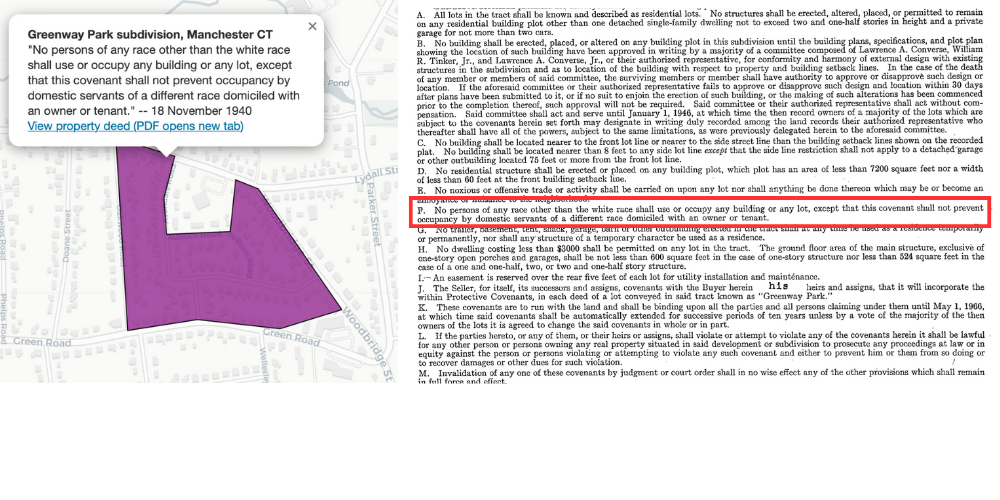
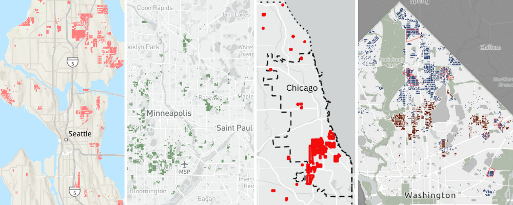
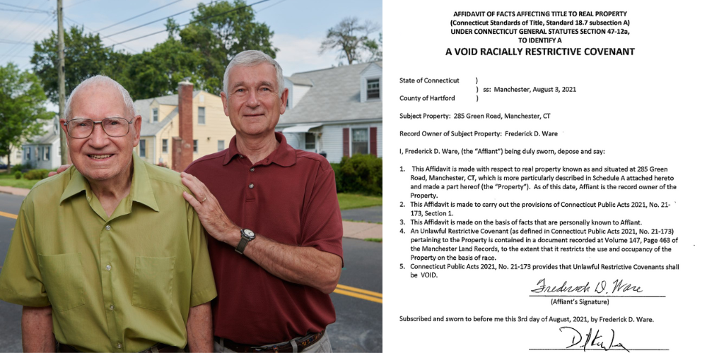

## Restricting with Property Covenants {- #restricting}
*by [Tracey Wilson, Vianna Iorio, and Jack Dougherty](authors.html)*

> No persons of any race except the white race shall use or occupy any building on any lot except that this covenant shall not prevent occupancy by domestic servants of a different race employed by an owner or tenant.  
> -- High Ledge Homes on South Main Street, West Hartford, Connecticut, 1940.^[@highledgehomesinc.AgreementConcerningBuilding1940]   

To some readers, this shockingly racist language might seem like a long-ago segregation policy from the Deep South. Instead, it comes from the Deep North and represents a hidden chapter in White suburban history. Inside this 1940 **property deed**, meaning a real estate contract between sellers and buyers, a **covenant** refers to any limitation on how the land may be used, such as for residential or commercial use. **Race restrictive covenants** like these typically prohibited people outside of the "white race" from owning or residing on property, often with exceptions for domestic servants. Beginning in the 1920s across the U.S., real estate developers, homeowners' associations, and private owners added racial covenants to different types of property contracts. But these represented more than agreements between racist individuals. Since property contracts were filed with local government clerks to become legally-binding public records, racial covenants became another form of government-sponsored housing segregation. White-only property covenants were enforceable in the courts. If a Black resident moved in, a White resident with legal standing could sue in court for breach of contract. Eventually the U.S. Supreme Court ruled racial covenants to be unenforceable in 1948, and the 1968 Fair Housing Act made them unlawful, yet some local governments continued to file property deeds with these restrictions until 1972.^[For an introduction to different types of restrictive covenants, see Examples in @NationalCovenantsResearch2022]

This chapter reveals the history of state-sponsored racial restrictions in Connecticut land records. So far, our team has located 20 racial covenants that real estate developers placed on hundreds of properties for suburban home construction from the late 1930s into the 1940s. We have documented racial covenants in the Connecticut towns of Hamden, Manchester, Newington, and West Hartford, as shown in Figure \@ref(fig:1940-otl-covenants), with evidence pointing to more in East Haddam, Stamford, and other towns to come.^[See historical sources on Hamden, Manchester, Newington, West Hartford, and partial record for East Haddam in @ilyankouMapRaceRestrictive2017. Our current map is based on an earlier version, @universityofconnecticutlibrariesmapandgeographicinformationcenterRaceRestrictiveCovenants2012. On Manchester research, see also @wareBlackWhiteGreenway2020. On a Stamford restrictive covenant discovered when Richard Blumenthal was campaigning for CT Attorney General, see @jacklinCivilityGettingTrampled1990; @keatingDejaVuMoment2010.]

Learn more about [How We Found Restrictive Covenants](covenants.html) in this book. If you know of similar covenants with racial or religious restrictions anywhere in Connecticut, [contact the authors](authors.html).

(ref:1940-otl-covenants) [Explore the full-screen interactive map](https://ontheline.github.io/otl-covenants/index-caption.html) and click links or polygons to view racist restrictions in property deeds across Connecticut in the 1930s-40s, where suburban developers prohibited occupants "other than the white race" or "other than the Caucasian race," until the US Supreme Court declared these unenforceable in 1948. While the racist language still exists in town property records, a 2021 Connecticut law made it easier for current owners to legally remove it, without erasing it from our historical memory. To date, researchers have found racial covenants in the CT towns of West Hartford (by Katie Campbell); Newington and Manchester (by David Ware); and Hamden (by June Gold). If you know of similar covenants with racial or religious restrictions anywhere in Connecticut, [contact the authors](authors.html). View [historical sources and the code](https://github.com/OnTheLine/otl-covenants) for this map, developed by Ilya Ilyankou and Jack Dougherty, based on an earlier version created with UConn MAGIC.

```{r 1940-otl-covenants, fig.cap="(ref:1940-otl-covenants)"}
if(knitr::is_html_output(excludes="markdown")) knitr::include_url("https://ontheline.github.io/otl-covenants/", height="500px") else knitr::include_graphics("images/1940-otl-covenants.png")
```
First, this chapter explains how race restrictive covenants arose in the nation beginning in the 1920s, and to our current knowledge, appeared later in Connecticut during the 1930s-40s, primarily in suburban housing developments. Although racist covenants were more common in Northern and Western cities such as Seattle, Minneapolis, and Chicago, so far those we have found in Connecticut vary, with a heavier concentration around New Haven suburbs than Hartford suburbs. Second, it describes how Connecticut civil rights advocates challenged restrictive covenants as an "un-American" policy during the late 1940s, and helped shift public opinion as the US Supreme Court ruled them to be unenforceable in 1948. In the present day, fair-housing advocates won passage of a 2021 Connecticut law that enables current homeowners to easily void racist covenants in the legal record, without erasing them from our collective memory. Overall, their historical legacy remains with us in two ways. On a tangible level, White homebuyers who purchased covenant-protected property gained financial benefits---meaning higher home values in legally-guaranteed all-White neighborhoods---that they passed forward as inheritances to future family members. On a structural level, the uncovering the hidden history of racist covenants in the Deep North reminds us how Connecticut's suburbs were shaped not simply by market forces, but also government-sponsored White supremacy.

### The Rise of Racial Covenants {-}
The nation's story of restrictive covenants begins with the U.S Supreme Court case *Corrigan v. Buckley* in 1921. White property owners in the Dupont Circle neighborhood of Washington D.C. formed a property owners' association that used racially restrictive covenants to keep out Black homebuyers. The dispute arose when White owner John Corrigan attempted to sell his house to an African-American buyer, Irene Curtis, a violation of the property's racial covenant. Learning of this violation, White neighbor Irene Buckley brought suit to enforce the race restrictive covenant and stop the property sale.

As the case worked its way through the nation's legal system, courts upheld this new tool for racial barriers in housing. First, the District of Columbia Supreme Court approved the racial covenant and cited existing legal segregation in schools and public recreational facilities as precedent. Second, the District of Columbia Court of Appeals also approved the racial covenant and stated that African Americans were free to include the same kind of racially exclusive language against Whites in their own property deeds. Finally, the U.S. Supreme Court unanimously affirmed the lower court decisions in 1926 by refusing to hear the case on grounds that they lacked jurisdiction. When Justice Edward Sanford delivered the U.S. Supreme Court's opinion, he narrowly defined the Constitution's guarantee that no person should "be deprived of life, liberty, or property, without due process of law" as it applied to *Corrigan v. Buckley*. While the Fifth Amendment limited the actions of the federal government, Sanford asserted that it did not apply to individuals entering into a private contact, such as a restrictive covenant. Moreover, he argued that the Thirteenth Amendment did not protect individual rights of Black citizens, and the Fourteenth Amendment again referred to actions of the state, not of private individuals. Therefore, the 1926 *Corrigan v. Buckley* decision reaffirmed the right of property owners to legally enforce race restrictive covenants, while ignoring that the court system itself acted as governmental support for segregation. Their interpretation of the Constitution would prevail for the next two decades.^[@corriganv.buckley1926; @prologuedcMappingSegregationWashington2015]

In Connecticut, lake association developers, who sold rural summer cottages to urban residents with automobiles, apparently were among the first to take advantage of the Supreme Court's ruling in favor of racial covenants. When Charles White and investors in the Andover Lake Corporation sought to attract buyers from Hartford, located 18 miles away, their initial 1928 full-page newspaper ad mentioned it was a "quiet, restricted lake" in regular-size type. One year later, as they struggled to entice buyers, their 1929 full-page ad made a larger promise in bold font: "Reasonable Restrictions Will Maintain the Desirability of this Development," as shown in Figure \@ref(fig:1929-04-28-hc-andover-lake). Those code words signaled that Andover Lake expressly prohibited Blacks and Jews from buying property with restrictive covenants in land records, according to two observers. Similar euphemisms by other Connecticut lake associations advertised in the late 1920s that their property was "wisely restricted" (Secret Lake in Avon), had "sensible restrictions" (Pine Lake Shores in Coventry), and that "proper restrictions assure a happy, congenial family of vacationists" (Lake Hayward in Colchester). In later years, the Andover Lake Property Owners Association prohibited anyone---even other property owners---from swimming in the lake unless they received a two-thirds majority secret ballot. Racism ran so deep that when William Philpot, an African-American minister from New Haven, successfully purchased an Andover Lake cottage in 1955, the Association rejected his application for lake access three times. Philpot protested by conducting a "Wade In" from his property to Andover Lake in 1964, with support from powerful allies, including Governor John Dempsey. Yet the Association filed an injunction to block Philpot from the lake, and persisted until they lost in court in 1967, then finally changed their bylaws to allow any property owner to join.^[@AndoverLakeAd1928; @AndoverLakeAd1929; @demeusyNegroLandownerWins1967; @rhinelanderAndoverLakeInvestors1999; @woodwardJuly29Determined2021. TODO: confirm if 1920s restrictive covenant exists in Andover property records; add newspaper sources for other lake associations and confirm if they also had restrictive covenants in their property records.]

(ref:1929-04-28-hc-andover-lake) The Andover Lake Corporation publicized "reasonable restrictions" as code words for racial prohibitions against Black or Jewish owners of summer cottages. [Image](https://www.newspapers.com/image/370110307/) copyrighted 1929 by *Hartford Courant*, reprinted here under fair-use guidelines.

```{r 1929-04-28-hc-andover-lake, fig.cap="(ref:1929-04-28-hc-andover-lake)"}
 knitr::include_graphics("images/1929-04-28-hc-andover-lake.png")
```

Racial covenants in Connecticut's emerging single-family suburban developments appeared a decade later in the late 1930s. Previously, owners began adding non-racial types of deed restrictions to increase the desirability of property in the 1910s, perhaps earlier. For example in West Hartford, individual owners began to add home-value restrictions, requiring that future homes constructed on the land must be built above a minimum size or sold above a minimum dollar amount, to maintain property values. Some owners added "nuisance" restrictions to prohibit chicken coops or noxious fumes, again to raise property values. Finally, some West Hartford real estate developers began to add home-value restrictions across entire subdivisions, setting the stage for exclusionary zoning policies that the Town would later adopt in 1924, as described [in this book chapter](excluding.html). While these early 1900s home-value deed restrictions effectively limited neighborhoods to wealthier White families, they did not yet contain explicitly racist prohibitions.

To our knowledge, the first racial covenant in *suburban* Connecticut property deeds appeared in late 1939 for an entire subdivision in Newington, a town on Hartford's southern border, based on research by David Ware. During the Depression, real estate developers sought ways to convert rural farmland to prospective homes and make it more attractive to city dwellers to purchase. One developer was Alfred E. Hanbury, who renamed farmland he purchased near the town's crossroads as the "Center Village" subdivision for future homes. Hanbury told city news reporters he was "optimistic concern[ing] the future of Newington as a residential community," with its gas and electric utilities, easy trolley commute to Hartford, and affordable Federal Housing Adminstration mortgages, a topic described [in this book chapter](lending.html). Hanbury added several restrictions to a handwritten deed he filed when selling five property lots to homebuyers in October 1939. First, he required that only single-family homes could be constructed, on plots of land no smaller than about one-fifth of an acre, with no noxious or offensive businesses that might annoy neighbors. Later in the deed, he added an explicitly racist restriction, probably drawn from language he had seen other developers using elsewhere. "No persons of any race except the white race shall use or occupy any buildings on any lot, except that this covenant shall not prevent occupancy by domestic servants of a different race employed by an owner or tenant," as shown in Figure \@ref(fig:1934-1939-1950-newington-hanbury). Selling homes was challenging during the Depression and World War II, but Hanbury finally sold 47 units at Center Village after the war, started work on two more Newington developments, and was selected as one of the first directors of the Home Builders Association of Hartford County, reflecting his status within the profession.^[@hanburyCenterVillageSubdivision1939; On Hanbury's housing developments, see @WillErectHouses1937; @HanburyBuildBrick1946; @ContractorOptimisticOutlook1950; @AlfredHanburyNew1950; @AlfredHanburyDies1970]

(ref:1934-1939-1950-newington-hanbury) Alfred Hanbury developed Newington farmland [as shown in 1934 aerial image](https://ontheline.github.io/otl-neighborhood-change/index.html#zoom=17&lat=41.6989838719968&lng=-72.72799006074369&layer1=magic1934&layer2=esriPresent) into the Center Village housing subdivision and added a [race restrictive covenant](https://ontheline.github.io/otl-covenants/index.html) in 1939. Image of [Hanbury](https://www.newspapers.com/image/370110307/) copyrighted 1950 by *Hartford Courant*, reprinted here under fair-use guidelines. Aerial map digitized by UConn MAGIC, and document from Town of Newington property records, both in public domain.

```{r 1934-1939-1950-newington-hanbury, fig.cap="(ref:1934-1939-1950-newington-hanbury)"}
 
```

In nearby West Hartford, some real estate developers also added racial covenants to attract homebuyers to more exclusive all-White suburban neighborhoods. Edward Hammel, president of High Ledge Homes, Inc., added the first racial covenant we have found in West Hartford in 1940. Described as a "builder of fine homes" in wealthy areas of Westchester County, New York, and Fairfield County, Connecticut, Hammel introduced new methods to make unsold property more marketable. Hammel purchased a subdivision on South Main Street, across from the Rockledge Gold Course, consisting of 84 property lots that the prior owner, developer Robert Bent, had not been able to sell during the Depression. Hammel's land records added a "uniform plan of development" for single-family homes that also prohibited occupants "of any race except the white race." Although High Ledge Homes did not openly publicize their White-only covenant, their 1940 advertising promised homebuyers that with A-level exclusionary zoning requirements, "you'll like your neighbors," as shown in Figure \@ref(fig:1940-wh-high-ledge). The pitch also mentioned "West Hartford's famous schools," one of the earliest real estate advertising references to this young suburb's public education system, and perhaps a premature one for this time period, when Hartford's city schools still had a stronger reputation. By 1941, at least four more West Hartford developers followed Hammel's lead and added racial covenants to their subdivisions.^[@100NewHomes1940; @AdModernHomes1940; @highledgehomesinc.AgreementConcerningBuilding1940. See other West Hartford racial covenants in @ilyankouMapRaceRestrictive2017.]

(ref:1940-wh-high-ledge) Although High Ledge Homes did not openly publicize their White-only covenant [(map on left)](https://ontheline.github.io/otl-covenants/index.html), their 1940 advertising promised homebuyers that with A-level exclusionary zoning requirements, "you'll like your neighbors." Image copyrighted by *Hartford Courant*, reprinted under fair-use guidelines.

```{r 1940-wh-high-ledge, fig.cap="(ref:1940-wh-high-ledge)"}
 knitr::include_graphics("images/1940-wh-high-ledge.png")
```

In Manchester, a suburb located to the east of Hartford, at least three real estate developers added race restrictive covenants to subdivisions in the early 1940s, according to attorney David Ware. At this stage, the ban against occupants "other than the white race" for housing developments such as Greenway Park, now appeared on pre-printed forms designed for mass duplication to individual buyers, as shown in Figure \@ref(fig:1940-manchester-greenway). But Ware points out how racial covenants still remained "hidden" in several ways. First, while land records are public documents in the town clerk's office, individual pages inside large bound volumes were not easily searchable or copied in the 1940s, and still remain difficult to find in today's digital age, as described in [How We Found Restrictive Covenants](covenants.html) in this book. Second, the White-only restriction was buried in the fine print in section F in a long page (sections A-M) of seemingly innocuous restrictions, meaning it would not stand out to homeowners unless they carefully read every line of their property deed. Third, Ware argues that racial covenants were "temporally camouflaged" because the White-only language only appeared in the original version. For all future sales, the deed simply stated that the property was "subject to certain restrictions of record," which disguised its racist origins. For example, when Ware's parents bought their Manchester home in 1950, their property deed vaguely stated that "said premises are subject to certain restrictive covenants of record" -- which went back five prior transfers -- to the original racial restriction in the 1942 deed by Lawrence Converse, present of the Greenway Park, Inc. development. Racism was legally powerful yet well-hidden in the Deep North.^[@wareBlackWhiteGreenway2020, p. 4. See real estate transaction @wareWarranteeDeedGreenway1950, with 5 additional transfers between 1945-1949, back to the original race restriction in @converseWarranteeDeedGreenway1942. Interestingly, in personal correspondence Ware notes that while CT statute chapter 92 section 7.24(b) requires town clerks to record land records within thirty days, and nearly all property owners do so to make them public record, no CT law requires property owners to file land contracts with town clerks, meaning that some restrictive covenants might not have become public record. See @connecticutgeneralassemblyChapter92Section2023]

(ref:1940-manchester-greenway) In Manchester, The Greenway Company placed racial covenants in pre-printed forms in 1940, seen only by homebuyers who read the fine print on the original property deed. [View full-size document](https://github.com/OnTheLine/otl-covenants/blob/main/pdf/manchester_greenway_park.pdf) from Town of Manchester property records, public domain.

```{r 1940-manchester-greenway, fig.cap="(ref:1940-manchester-greenway)"}
 
```

Elsewhere in Connecticut, the racial covenants appeared more frequently. In Hamden, a suburb north of New Haven, real estate developers added White-only restrictions more often than the Hartford suburbs above during the 1940s. So far attorney June Gold has found racial covenants in nine Hamden subdivisions, many of them located between the New Haven city boundary and the planned route of the Wilbur Cross Parkway, shown in Figure \@ref(fig:1940-hamden-covenants). Five of the nine restricted subdivisions were created by three developers: Joseph Maselli and his business partner Pasquale DeRosa, and their competitor, Veggo Larsen. In sum, these nine Hamden subdivisions added racial prohibitions to nearly 450 suburban homes.^[See Hamden restrictive covenant land records in @@ilyankouMapRaceRestrictive2017]

(ref:1940-hamden-covenants) Hamden developers added White-only restrictions to several suburban subdivisions located between the New Haven city border (red line) and the planned route of the Wilbur Cross Parkway in the early 1940s. Explore the [interactive covenants map](https://ontheline.github.io/otl-covenants/index-caption.html).

```{r 1940-hamden-covenants, fig.cap="(ref:1940-hamden-covenants)"}
 knitr::include_graphics("images/1940-hamden-covenants.png")
```

Overall, the frequency and concentration of racial covenants from the 1930s-40s varies across Connecticut suburbs. To date, researchers have located and mapped White-only property deeds in 4 suburbs, covering 20 subdivisions and over 950 homes, as shown in Table \@ref(tab:covenants-by-town). But given the large number of homes built during this period, the percentage with racial covenants can be relatively small. In Manchester, only 248 out of approximately 7,100 (3.5 percent) residential building lots approved by town officials between 1910-1950 included racial covenants. In West Hartford, only 190 homes out of approximately 3020 (6 percent) buildings constructed during the 1940s had racial covenants. Despite the shocking existence of White-only covenants, Connecticut suburbs relied more on other types of government-sponsored discrimination -- such as federal lending policies, public housing barriers, and exclusionary zoning ordinances -- to restrict non-White and low-income residents.^[TODO: Request total number of homes built each year in 1940s from Hamden property assessor database to calculate percentage with racial covenants. See table calculations in @ilyankouMapRaceRestrictive2017. Manchester data from @wareBlackWhiteGreenway2020, p. 15]

Table: (\#tab:covenants-by-town) Race Restrictive Covenants by CT Town, Located To Date

| Town | Subdivisions | Estimated homes restricted |
|:---|---:|---:|
| Hamden | 9 | 446 |
| Manchester | 3 | 248 |
| West Hartford | 5 | 190 |
| Newington | 2 | 72 |
| Total to date | 20 | 957 |

Compared to Connecticut, restrictive covenants were *more* common in other US cities, with some estimates of properties with racial restrictions ranging as high as 80 percent. Public history project teams have uncovered evidence and sparked action, according to the [National Covenants Research Coalition](https://www.nationalcovenantsresearchcoalition.com), including those shown in Figure \@ref(fig:2024-restrictive-cities). One of the earliest to launch online was the [Segregated Seattle project](https://depts.washington.edu/civilr/segregated.htm) in 2005, where researchers have found White-only and anti-Jewish clauses in over 30,000 property deeds in King County to date, plus 20,000 more in other counties in Washington state. Their work pushed state legislators to approve a 2006 law to encourage homeowners to strike out racist covenants in the public record, and a 2023 law to provide compensation for victims. In the Minneapolis-St. Paul region, the [Mapping Prejudice project](https://mappingprejudice.umn.edu) began to document restrictive covenants in 2016 and has found over 30,000 restrictive property deeds to date. Researchers showed that current prices of Minnesota homes with racial covenants are 4 to 15 percent higher than identical homes without covenants. The [Chicago Covenants project](https://www.chicagocovenants.com/) has already found over 100,000 properties with restrictive covenants, after searching about 20 percent of the city's land records, and expects to find more as estimates of White-only property restrictions in that city range from 50 to 80 percent. In St. Louis, Missouri, the [Dividing The City project](https://dsps.lib.uiowa.edu/thedividedcity/) found racial restrictions in about 80 percent of homes built in St. Louis county by 1950.^[See more projects by members of the @NationalCovenantsResearch2022. The earliest digital history project on racial property deeds probably was @plotkinRacialReligiousRestrictive2015, which states that content was posted online prior to 1999. On Seattle and Washington State, see @gregorySegregatedSeattle2006 and @civilrightsandlaborhistoryconsortiumuniversityofwashingtonRacialRestrictiveCovenants2023. On Minnesota, see @universityofminnesotalibrariesMappingPrejudice2020 and @soodLongShadowRacial2019. On the Chicago 80 percent estimate, see @winlingChicagoCovenants2021 and analysis by @weaverNegroGhetto1967, p. 213 and chapter 13. On the St. Louis 80 percent estimate, see @gordonDividingCityRaceRestrictive2022 and @ruff80StLouis2022.]

(ref:2024-restrictive-cities) Restrictive covenants were more common in other US cities. Explore digital history projects with images from [Seattle](https://depts.washington.edu/civilr/covenants.htm), [Minneapolis](https://mappingprejudice.umn.edu/racial-covenants/), [Chicago](https://www.chicagocovenants.com), [St. Louis](https://dsps.lib.uiowa.edu/thedividedcity/), and more by the [National Covenants Research Coalition](https://www.nationalcovenantsresearchcoalition.com).

```{r 2024-restrictive-cities, fig.cap="(ref:2024-restrictive-cities)"}
 
```

### Challenging Racial and Religious Covenants {-}
Across the nation, a coalition of Black homebuyers, real estate agents, civil rights activists, and NAACP attorneys mounted a political and legal battle to overturn racial as well as religious covenants during the 1940s. Their efforts focused primarily on two cities. In Detroit, with its recent history of White mob violence against Black wartime workers, the McGhee family purchased a home and were sued and harassed by a White neighborhood association for violating a racial covenant. In St. Louis, the Shelley family bought their home through a "straw-party," a White buyer who purchased from a White seller and immediately resold to a Black buyer (often at a higher price). On the day the Shelleys moved in, the White neighborhood association delivered a legal summons to evict them for violating the covenant. As state courts defended these covenants, NAACP attorney Thurgood Marshall and colleagues eventually persuaded the U.S. Supreme Court to hear their appeal in January 1948 for the consolidated cases, known as *Shelley v. Kraemer*^[See also the role of Black homeowners and allies in Washington DC and other cities in @gondaUnjustDeedsRestrictive2015, chapter 1. For contemporary accounts by Black activists and researchers, see @longPeopleVsProperty1947; @weaverNegroGhetto1967, chapter 13. For national histories of restrictive covenants, see @voseCaucasiansOnlySupreme2019; @brooksSavingNeighborhoodRacially2013; @rothsteinColorLawForgotten2017, chapter 5]

Meanwhile in Hartford, Black activists and journalists spoke out against racial covenants and called to ban them in Connecticut. The Hartford Negro Citizens' Council, organized at the Women's League in the city's North End in 1941, publicly criticized a housing committee report by the Bridgeport Chamber of Commerce in 1945, which recommended racial covenants to create White-only suburban neighborhoods. Also, Black newspapers such as the *Hartford Chronicle* regularly reported on the national NAACP's efforts to eliminate covenants in other states, and indirectly referred to their existence inside the state, with few details. Perhaps Hartford's Black community did not know the full extent of racial covenants buried deep inside the property records in suburban town clerk's offices.^[@NegroCitizensCouncil1941; @hartfordnegrocitizenscouncilLetterEditorSegregation1945; @MiddletownRestrictiveCovenants1947. Learn about Hartford's 1940s Black press @HartfordChronicle1940]

One Jewish civil rights ally supported Black Hartford activists by condemning covenants that restricted against race or religion. Simon Bernstein, an attorney and Democratic member of Hartford's city council, sent a public letter to the chair of the Judiciary Committee at the State Capitol in April 1947, calling for a bill to prohibit restrictive covenants. One month earlier, Hartford's Black press had run a story on New York State legislators raising their own anti-covenant bill. Bernstein called for Connecticut to ban property covenants regarding "nationality, color and religious belief" because these "un-American" practices are "contrary to public policy". He argued that "real estate deals are public records" and "our Town Clerks are unwitting tools in transcribing prejudices on record" in a "government publication" that grants "immunity" to perpetrators. As an attorney who handled property transfers, Bernstein described but did not name "a nearby town" where a covenant for an entire subdivision restricted sales "to only non-semitic members of the Caucasian race," a phrase he quoted directly. Hartford's White press summarized Bernstein's letter, but only the Black press published it in its entirety. Despite these efforts, Connecticut legislators waited for a decision from the federal government.^[@BillOutlawRace1947; @bernsteinLetterEditor1947; @BernsteinSeeksEnd1947; @StateLawSought1947. @huttonBriefLookBack2014, p. 40 briefly states that the anti-Jewish covenant was in West Hartford. But in our interview with Bernstein at age 98, he only recalled details about an anti-Black covenant in West Hartford that was settled out of court, not the anti-Jewish covenant in his 1947 letter, see @bernsteinOralHistoryInterview2011. @wilsonHighLedgeHomes2018 described anecdotal accounts of anti-Jewish and anti-Catholic housing prohibitions in specific parts of West Hartford, but it is unclear whether or not these were written into property deeds or some other mechanism, as we have not yet found any religious covenants in Connecticut.]

Across the nation by the late 1940s, civil rights activists successfully began to turn the tide in the political and legal struggle against racial covenants. One month before the U.S. Supreme Court heard the NAACP's consolidated *Shelley v. Kraemer* case, President Truman's Committee on Civil Rights issued its report against racial covenants, and the US Department of Justice also filed a brief against this discriminatory practice. NAACP attorneys won the case when the US Supreme Court ruled restrictive covenants to be "unenforceable" in 1948. Yet the Court's reasoning was not a striking blow against racism. First, the Court's unanimous vote was 6-0, minus three justices who recused themselves without explanation, which suggested that perhaps they also owned racially restricted property. Second, the Court decided that private parties *could* voluntarily agree to restrictive covenants, but that the judicial system *could not* enforce these agreements because discriminatory state action violated the Equal Protection clause of the Fourteenth Amendment. In sum, the *Shelley v. Kraemer* ruling overturned the logic of the 1926 *Buckley v. Corrigan* decision, which refused to acknowledge legal enforcement of contracts as an act of government.^[@shelleyv.kraemer1948; @gondaUnjustDeedsRestrictive2015, p. 174]

While restrictive covenants were no longer enforceable, they did not disappear. In Connecticut, the East Haddam Town Clerk filed a racial covenant in December 1950, more than two years after the *Shelley* ruling. Across the nation, the Federal Housing Administration (FHA) continued to require racial covenants for properties it insured until 1950, and continued to back mortgages for some White-only properties until 1962. Also, several state courts resisted the *Shelley* decision until a subsequent US Supreme Court decision in 1953, and the US Congress explicitly made restrictive covenants unlawful when it passed the US Fair Housing Act of 1968. Yet some local governments continued to accept restrictive covenants in property records until a US federal court struck down this practice in the 1972 *Mayers v. Ridley* ruling. Finally, even when local government clerks stopped accepting property deeds with unlawful covenants, generations of racist documents from the past continued to remain "on the books" in town halls across the US.^[@parkerWarranteeDeedMoodus1950; @rothsteinColorLawForgotten2017 pp. 85-91; @mayersv.ridleyDecision1972]

### Confronting the Legacy of Covenants {-}
Although courts ruled that restrictive covenants were no longer enforceable, and town clerks eventually stopped filing racist property deeds into the public record, their legacy still influences us today. White Christian families that purchased restricted homes in the 1940s financially benefitted from government-supported segregation that boosted the value of property that guaranteed no Black or Jewish neighbors. Decades later, even when overtly racist housing preferences have declined, the descendants of 1940s homeowners benefitted from inherited wealth built upon a more intense era of prejudice. Even if someone's White grandparents did not personally express racist views, if their home had a restrictive covenant, or was located in an all-White neighborhood created by covenants, those more-desirable qualities among today's homebuyers probably put more dollars into their grandchildren's pockets. In addition, the legacy of covenants also affected Black or Jewish homebuyers in more recent decades, who had to decide whether or not to live in a neighborhood with a documented past of being openly hostile to their presence.^[Recall that in Minneapolis-St. Paul, current prices of homes with racial covenants are 4 to 15 percent higher than identical homes without covenants, according to @soodLongShadowRacial2019]

Inspired by the [Segregated Seattle project](https://depts.washington.edu/civilr/segregated.htm) and related work in other states, Connecticut residents have gradually begun to confront restrictive covenants in our past, strike them out of the public record, but not erase them from our historical memory. The process is not fast, but key steps have become more visible and gained momentum over the past decade.^[On Seattle and Washington State, see @gregorySegregatedSeattle2006 and @civilrightsandlaborhistoryconsortiumuniversityofwashingtonRacialRestrictiveCovenants2023. In Connecticut, the topic briefly arose in 1990 when the press reported that Richard Blumenthal, at that time the Democratic candidate for state attorney general, owned a home in Stamford CT with a race restrictive covenant. But this was driven by opponents in a political campaign, not a sustained effort for broader public awareness. See @jacklinCivilityGettingTrampled1990; @keatingDejaVuMoment2010]

After we found restrictive covenants in West Hartford property records in 2010, we contacted current residents and invited them to publicly share their reflections in oral history video interviews, to build broader awareness of how racism shaped this predominantly White suburb. Two present-day White residents of West Hartford's High Ledge Homes development were shocked to learn that their neighborhood had been protected by a 1940s White-only covenant, and sought to make sense of its meaning on their lives. Debra Walsh, an educator and actor, reflected on the White privilege that was attached to her decision to buy her home in 2010, shown in Figure \@ref(fig:2011-walsh-debra). Although she had believed that the North had not exhibited such explicit racist policies, the direct evidence of race restrictive covenants convinced her that "West Hartford made a concerted effort to stay White and WASPy and that contributes to the feel of the neighborhood." Walsh acknowledged how the explicit racism of the covenants in her own neighborhood made her feel uncomfortable with the White privilege she experiences. "It's really hard to look really deep within and answer those questions," she explained, "...when you live in the dominant class. Like you don't know how to answer it." Even though she knew the covenants are no longer enforceable, Walsh could see how "the legacy of the piece of land gets passed on to a feeling of a neighborhood," a sense of White exclusivity that pervades even today, when barriers take on less overtly racial language.^[@walshOralHistoryInterview2011. ]

(ref:2011-walsh-debra) Watch the [oral history video or read the transcript of the interview with Debra Walsh](http://digitalrepository.trincoll.edu/cssp_ohistory/21) to hear how she learned about a race restrictive covenant in her West Hartford neighborhood. Interview copyrighted by Walsh and shared under Creative Commons BY-NC-SA license.

```{r 2011-walsh-debra, fig.cap="(ref:2011-walsh-debra)"}
if(knitr::is_html_output(excludes="markdown")) knitr::include_url("https://cdnapisec.kaltura.com/p/2366381/sp/236638100/embedIframeJs/uiconf_id/42684261/partner_id/2366381?iframeembed=true&playerId=kplayer&entry_id=1_cqi53nct&flashvars") else knitr::include_graphics("images/2011-walsh-debra.png")
```

Yet while racial covenants make White West Hartford residents uncomfortable about the past, they remain an important piece of history, a hidden chapter that deserves more attention. Susan Hansen, a librarian and White resident who bought her home in the High Ledge Homes neighborhood in the 1990s, reflected on this theme in her 2011 oral history interview, shown in Figure \@ref(fig:2011-hansen-susan). "I think this is something that people should know," Hansen observed, "because there are people still living on my street who were here then, who must have been fully aware." Hansen also emphasized the importance of knowing that racial covenants were not something that happened only in the Deep South long ago, but are a very recent part of Northern suburban history that should not be whitewashed out of memory. As Hansen concluded, "We need to know that we were being idiots up here, too, and it wasn't somewhere else. It was here. It's still here."^[@hansenOralHistoryInterview2011]

(ref:2011-hansen-susan) Watch the [oral history video or read the transcript of the interview with Susan Hansen](http://digitalrepository.trincoll.edu/cssp_ohistory/17) to hear her reflections about a race restrictive covenant in her West Hartford neighborhood. Interview copyrighted by Hansen and shared under Creative Commons BY-NC-SA license.

```{r 2011-hansen-susan, fig.cap="(ref:2011-hansen-susan)"}
if(knitr::is_html_output(excludes="markdown")) knitr::include_url("https://cdnapisec.kaltura.com/p/2366381/sp/236638100/embedIframeJs/uiconf_id/42684261/partner_id/2366381?iframeembed=true&playerId=kplayer&entry_id=1_1lgpzx7x&flashvars") else 
```

After David Ware wrote his 2020 academic study of restrictive covenants in Manchester, he took it one step further by lobbying Connecticut legislators to change the law. Ware initially began his study when his father revealed that their 1950s family home contained a racial covenant, hidden in the paperwork over five prior real estate transfers. Since a growing number of states had passed laws to address the legacy of covenants, Ware decided that Connecticut needed one too. He drafted a procedure, which State Senator Gary Winfield (co-chair of the Judiciary Committee) and his colleagues refined into a bill that won unanimous support by the legislature and became law with the governor's signature in 2021. Connecticut law now officially declares all unlawful covenants in land records to be void. Furthermore, the law requires towns to make available a free form for any resident to request the clerk to mark their covenant as void in the public record, though many town clerks have not yet complied. The process to void a covenant officially recognizes racism without removing it from our history. One of the first residents to void a racial covenant was David's 95-year-old father, Frederick Ware, as shown in Figure \@ref(fig:2021-ware-void).^[@connecticutgeneralassemblyPublicAct211732021; @severanceRevelationRacistProperty2021; @haighStateLawmakersWork2021; @wareVoidRaciallyRestrictive2021]

(ref:2021-ware-void) Frederick Ware (left), with his son David, one of the first Connecticut residents to void a restrictive covenant in 2021. Photo copyrighted 2021 by UConn and reprinted here under fair-use guidelines. Document from Town of Manchester property records, public domain.

```{r 2021-ware-void, fig.cap="(ref:2021-ware-void)"}
 
```

In the New Haven suburb of Hamden, as current homeowners and community activists became aware of racial covenants in their property deeds, they spoke up and eventually connected with each other to publicly void them. Melinda Tuhus wrote a 1994 *Hartford Courant* opinion essay on discovering a racist covenant when purchasing her home in Hamden. At that time, Tuhus's attorney discouraged her from attempting to strike out the restriction during the closing of her home purchase, arguing that making changes might "muddy the waters" and interfere with the sale. "You can't change history," her lawyer told her, yet Tuhus questioned the decision "to keep it hidden in musty tomes in the town clerk's office."^[@tuhusVestigesRacismLive1994]

Decades later in 2023, when attorney June Gold attended Hamden's Spring Glen Church, she learned about racial covenants from a speaker with [Congregations Organized for a New Connecticut](https://weconect.org) (CONECT). Gold also read about Ware's work in Manchester and used her research skills to uncover several racial covenants in Hamden's town records---to the surprise of the Town Clerk's staff---and taught them about their legal obligation to publicize 2021 state law. Currently, Gold works with community groups to build awareness and offers her free legal services to help current homeowners void these racial restrictions. One of the many Hamden homeowners Gold assisted was Melinda Tulus, who wrote about wanting to "change history" and not "keep it hidden" in her 1994 article, and now had a way to make it happen.^[@mirminaWhenHamdenWoman2023]

Under Connecticut Public Act 2021-173, each Town Clerk must post these forms, both on their website and inside the land records office, to allow property owners to void unlawful covenants, **free of charge**. Property owners may fill out and submit **either** form below:

- [CT Identification and Renunciation of Unlawful Covenant](images/2021-covenant-identification.pdf)
- OR
- [CT Affidavit to Identify Racial Covenant, signed by notary](images/2021-covenant-affidavit.pdf)

**Help us continue the work** to find and strike out Connecticut's restrictive covenants. Feel free to download or modify the "call to action" flyer shown in Figure \@ref(fig:2024-covenants-action). Learn more about [How We Found Restrictive Covenants](covenants.html) in this book and start research in your own community. If you know of similar property records with racial or religious restrictions anywhere in Connecticut, [contact the authors](authors.html).

(ref:2024-covenants-action) Anyone can [download this call to action flyer](images/2024-covenants-action.png) or [modify the template with a free Canva account](https://www.canva.com/design/DAF5r55hEo0/6wlRESbbDdaAc5bpUJfRag/view?utm_content=DAF5r55hEo0&utm_campaign=designshare&utm_medium=link&utm_source=publishsharelink&mode=preview), as long as you credit OnTheLine.trincoll.edu.

```{r 2024-covenants-action, fig.cap="(ref:2024-covenants-action)"}
 knitr::include_graphics("images/2024-covenants-action.png")
```

*[About the authors and contributors:](authors.html) Tracey Wilson (Trinity 1976) wrote the first draft of the West Hartford portion for a monthly newspaper and also published it in her book, Life in West Hartford. Vianna Iorio (Trinity 2019) and Jack Dougherty expanded the chapter for publication in this book. Ilya Ilyankou (Trinity 2018) and Jack Dougherty developed the interactive map, based on an earlier version created with UConn MAGIC. Katie Campbell Levasseur (Trinity 2011) researched restrictive property covenants, and both she and Candace Simpson (Trinity 2012) conducted oral history interviews. David Ware and June Gold contributed restrictive covenants they located in Manchester, Newington, and Hamden.^[@wilsonTakingStockHigh2010; @wilsonHighLedgeHomes2018;  @universityofconnecticutlibrariesmapandgeographicinformationcenterRaceRestrictiveCovenants2012; @ilyankouMapRaceRestrictive2017]*
