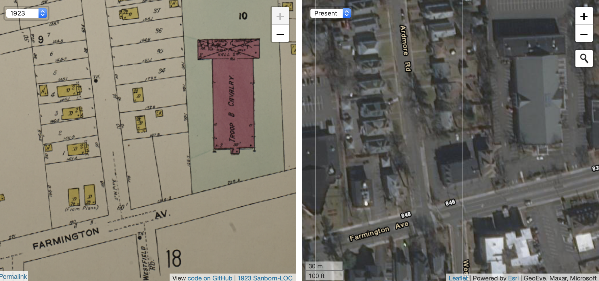
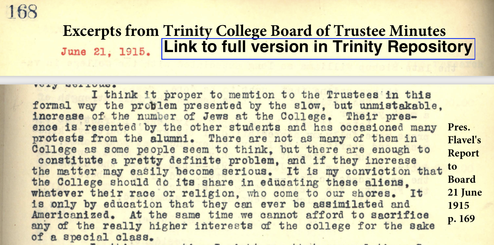

## Origins of Exclusionary Zoning {- #origins-zoning}

In present-day debates over housing, the phrase *exclusionary zoning* refers to local government policies that favor the construction of expensive single-family homes on large tracts of land, rather than more affordable multi-family homes on smaller properties, which limits who can afford to live there. In Connecticut, the origins of exclusionary zoning can be traced back to one suburban town's attempt to block an urban Jewish grocer from building a store in a residential neighborhood in 1924. While this conflict centered around commercial development, it triggered a new phase in ongoing disputes over who controlled real estate, and the legal tools that property owners and local governments used to separate themselves from people they deemed as undesirable neighbors. Unlike other discriminatory barriers of this era---such as [mortgage redlining](lending.html) and [restrictive covenants](restricting.html)---exclusionary zoning did not directly refer to race or religion. Instead, zoning policies cleverly carved up suburban neighborhoods with minimum home-size and property-size requirements that segregated residents by access to wealth. In this way, exclusionary zoning became a more sophisticated and so-called "color-blind" tool of housing discrimination that largely resisted fair-housing legislation of the 1960s-70s civil rights era, and continues to divide Connecticut into the present day.

When Jacob Solomon Goldberg returned home to Hartford after military service in World War I, he sought to advance himself from a butcher into a businessman. Jacob partnered with his brother Barney and their brother-in-law Hyman M. Cohen to buy a small grocery store in downtown Hartford, near their East Side neighborhood, which they managed together during the early 1920s. Like other entrepreneurs of their era, they "followed the trend of business to the west" and dreamed of opening a second grocery store in the rapidly-growing suburb of West Hartford. The town's population grew at a faster rate than Hartford during the 1910s and nearly doubled in size to almost 9,000 residents. West Hartford town officials granted more than 300 building permits for single- and two-family homes in 1922, more than any other town in Connecticut that year. Linked by convenient trolley lines to the capital city and corporate headquarters for the nation's leading banks and insurance companies, West Hartford was quickly becoming an ideal destination for the rising middle class.^[Jacob Solomon Goldberg (1891-1939) and his wife Anna Miller Goldberg should not be confused with other Hartford residents with similar names. @JacobGoldbergObituary1939 Jacob and his partners purchased and re-named the Guilfoil City Hall Grocery at 42 State Street, Hartford, in 1919.  @SecondAnniversaryCity1921; @KingswoodMarketHas1924; @connecticutstateboardofeducationSurveySchoolsWest1923, p. 103.]

Goldberg and his family searched for the perfect location to open a second grocery store. With funds from Jacob's father David, who previously owned a Jewish meat market in Hartford, they bought two valuable parcels of undeveloped land on Farmington Avenue at the corner of Ardmore Avenue, on the trolley line about halfway between the Hartford border and West Hartford's town center. In the early 1920s, only a dozen grocers served all of West Hartford, including several small shops that sold food products out of their homes. Nearby customers typically made frequent purchases during the week due to limited transportation and refrigeration. The closest competitors were located about a half-mile in opposite directions: West Hill Grocery (also on Farmington Avenue, closer to the Hartford border) and M.J. Burnham's (a larger store in West Hartford Center). Although the immediate area around Goldberg's property had only 60 houses in 1923, real estate developers and town officials had subdivided the land into smaller lots, and were building side streets and sewer lines, in anticipation of many more homebuyers. Next door to Goldberg's vacant lots stood the only non-residential building in the vicinity: the West Hartford Armory for the Connecticut National Guard Troop B Cavalry. Perhaps the odor from its horse stables may have explained why no one had yet built a home on Goldberg's empty property lots.^[When David Goldberg died in 1924, his estate valued the property at $40,000, and Jacob and his mother Rachel became its administrators. @DavidGoldbergObituary1924; @DavidGoldbergEstate1924; @ProbateCourtGoldberg1924; @silvermanHartfordJews165919701970, p. 170. West Hill Grocery was located at 765 Farmington Avenue, near the corner of Whiting Lane, and M.J. Burnham's was located at 19 South Main Street in West Hartford Center. @sanbornmapcompanySanbornFireInsurance1923; @GeerHartfordDirectory1923; @rossanoBuiltServeConnecticut2003.]

But when Goldberg applied for a building permit in January 1923, the West Hartford building inspector declined. Instead, the inspector called a public hearing, where "a score of property owners in the Ardmore road section appeared and protested" against Goldberg's plan to build a grocery store. In their eyes, it made no difference that Goldberg had followed every legal requirement in the town building code. It made no difference that his proposed store would be facing the busier Farmington Avenue, or be much smaller than the Armory building next door, as shown in Figure \@ref(fig:otl-ardmore-1923). What mattered was that property owners challenged Goldberg's right to build a store in *their* neighborhood, and the town government took their side and refused to grant his building permit.^[@LegalFightStore1923]

(ref:otl-ardmore-1923) In 1923, West Hartford property owners and town officials objected to Jacob Goldberg's application to build a grocery store at the corner of Farmington Avenue and Ardmore Road (shown in blue), much smaller than the West Hartford Armory next door (shown in red). This dispute motivated West Hartford to become the first municipality in Connecticut to enact a zoning ordinance in 1924. Source: [Sanborn fire insurance maps](https://www.loc.gov/collections/sanborn-maps/?fa=location:west+hartford) digitized by the Library of Congress. [Interactive map](https://ontheline.github.io/otl-ardmore-road-wh/index-caption.html) developed by Ilya Ilyankou and Jack Dougherty, with [sources and code on GitHub](https://github.com/ontheline/otl-ardmore-road-wh).

```{r otl-ardmore-1923, fig.cap="(ref:otl-ardmore-1923)"}
if(knitr::is_html_output(excludes="markdown")) knitr::include_url("https://ontheline.github.io/otl-ardmore-road-wh/index.html", height = "400px") else 
```

### Was Opposition Driven by Anti-Semitism? {- #anti-semitism}
Why did West Hartford property owners and town officials block Goldberg's building permit? Were they opposed to a grocery story in their residential neighborhood---or to the presence of a Jewish grocer from Hartford? The answer depends on the type of evidence you consider.

On the surface, there is no evidence of overt anti-Semitism against Goldberg in this 1923 dispute. No one was recorded to have publicly uttered an anti-Jewish slur against him, nor did he publicly charge that he was rejected due to his religion, according to available documents. In fact, a Protestant West Hartford real estate businessman, Fred Kenyon, faced similar opposition around the same time. When Kenyon proposed to build a public garage on nearby Lancaster Road in December 1922, objections from local property owners led the building inspector to reject his permit. Two months later, homeowners on nearby Fern Street went to court to stop Kenyon's real estate company from removing a deed restriction that guaranteed only single-family homes would be built on property in their neighborhood, since they feared that multi-family apartment buildings would lower their property values. Since West Hartford residents and town officials blocked both Goldberg (a Jew) and Kenyon (an Episcopalian), religion was not the sole factor, at least on the surface. ^[No evidence of overt anti-Semitism appears in the newspaper accounts of public meetings, nor in the sparse minutes from town council meetings on the matter. Thanks to local historian Jeff Murray for his research and analysis about Fred Kenyon. @westhartfordTownCouncilMeeting1923; @WestHartfordHas1923; @LandHouseRestriction1923; @FredKenyonDies1937]

But below the surface, the controversy over Goldberg's store arose during a period of intense anti-Semitism and anti-immigration. Across the nation during the 1920s, automaker Henry Ford and broadcaster Father Charles Coughlin widely circulated anti-Jewish conspiracy theories, and US lawmakers imposed immigration quotas to sharply reduce Jewish migrants from Eastern European. In cities like Hartford, Protestant and Catholic leaders at selective institutions of business, medicine, law, and higher education blocked or discouraged Jews from employment or enrollment. In Protestant-led small suburbs like West Hartford, town officials and property owners most likely perceived Goldberg as a Jewish outsider to their community. Even if no one uttered an anti-Jewish slur against him at a public meeting, to fully understand this controversy we need to examine how local leaders created an anti-Semitic climate, and how some spoke bluntly against Jews in their private conversations.^[@highamStrangersLandPatterns2002; @dinnersteinAntisemitismAmerica1995; @bergoffenJewishExperienceAmherst2020]

When Jacob was growing up in Hartford's Jewish community in the early 1900s, he most likely heard the history of how freedom of religion was not originally extended to his people. Early Connecticut began as Christian colony, with no separation of church and state. After Reverend Thomas Hooker and his followers broke away from the Puritans and settled Connecticut in the 1630s, they established the Congregational Church as the seat of government in each town, and required residents to pay taxes to support its work. Despite the promise of freedom of religion in the First Amendment to the US Constitution in 1789, Connecticut did not disestablish the Congregational Church as the state religion until three decades later in 1818. That year, delegates to Connecticut's Constitutional Convention debated the topic of religious freedom, but deliberately voted to extend it only to "every society or denomination of Christians." Jews were not permitted to form their own congregations or worship publicly until 1843, when a delegation of German Jews persuaded the state legislature to grant this right by statute (though the state constitutional language remained overtly Christian until 1965).^[@dalinMakingLifeBuilding1997, pp. 10-13; @cohnCivilRightsJews2010; @hortonConnecticutStateConstitution2011, pp. 11-13; @finlayImportanceBeingPuritan2015; @furerChurchStateLand2018]

When Jacob's parents, David and Rachel Goldberg, migrated to Hartford in 1884, they established one of the city's first kosher meat markets, and helped to settle many of the Eastern European Jews who came after them. Hartford became home to Connecticut's largest Jewish community, with about 11 percent of the city's population estimated to be Jewish in 1920. Most Jewish immigrants lived in crowded tenement buildings in the Front Street and Windsor Street neighborhoods near the Connecticut River, which experts had declared to be "the worst housing conditions in the country" among cities of Hartford's size. To earn a living, Jewish men commonly became peddlers who vocally advertised their goods up and down the streets, and maybe after gaining a foothold, opened a retail storefront. They sometimes came into conflict with Hartford Police over noise complaints in the streets, or doing business on Sundays in violation of Connecticut's Blue Laws to protect the Christian sabbath. By 1912, the Goldbergs earned enough money from their retail business to move out of the crowded East Side and into a single-family home in Hartford's North End.^[@silvermanHartfordJews165919701970, p. 170; @GeerHartfordDirectory1912, p. 263; @beckerJewishCommunityHartford1979; @veillerHousingConditionsTenement1903, p. 155; @dalinMakingLifeBuilding1997, ch. 4; @baldwinDomesticatingStreetReform1999, ch. 7.]

Jacob followed his father into the retail food business in part because Hartford's Christian elite blocked Jews from higher-status positions in other economic sectors. Although Hartford was one of the nation's insurance and banking centers, these institutions only hired a few Jews to serve as bookkeepers or sales agents, and did not allow them to rise into positions of responsibility until the 1950s. According to a survey of 800 officers and directors employed at Hartford's ten largest insurance companies and six largest banks in 1967, only 1 percent were Jewish (and most of them were concentrated in one bank). Both the Protestant-run Hartford Hospital and the Catholic-run St. Francis Hospital barred nearly all Jewish doctors, with rare exceptions, from practicing medicine at their facilities until World War II. These hospital hiring policies were "never written and seldom articulated," but clearly understood. Similarly, Hartford's top three corporate law firms---Robinson and Cole; Day, Berry, and Howard; and Shipman and Goodwin---refused to employ Jews through the 1950s, based on unwritten but widely recognized "gentlemen's agreements" that Jews should not apply, nor would they be considered.^[@silvermanHartfordJews165919701970, p. 86; @lazarusPracticeMedicinePrejudice1991, p. 24; @dalinMakingLifeBuilding1997, pp. 59, 78-82, 174-75; @huttonBriefLookBack2014].

### Uncovering Unwritten Rules Against Jews at Trinity College {-}
Although "unwritten rules" against Jews typically did not appear in public documents, in special cases we can find them in private documents that their creators believed would remain secret. At Trinity College, Hartford's preeminent institution of higher education, administrative and student leaders strongly expressed anti-Semitic views and implemented strategies to reduce the number of Jewish students, according to long-hidden minutes of the Board of Trustees meetings from 1915 to 1922. Since these anti-Jewish rules did not appear in any College publications or newspaper accounts from this period, they would be invisible to us today if Trinity's archivists had not made this history public in recent years. Anti-Semitism at Trinity is noteworthy because the Episcopalians who established the College in 1823 directly challenged the lack of religious tolerance in the Congregationalist Church that dominated state government at that time, and adopted a charter that promised Trinity would "not make the religious tenets of any person a condition of admission."^[For decades, Trinity Board Minutes were guarded as "confidential" and "not available for research use"---even for Trinity faculty like me. Trinity archivist Peter Knapp acknowledged the College's anti-Jewish policies and quoted from the Board Minutes in his book in 2000, but these documents were not made publicly available until the Trinity Archives changed its policy in 2017, and uploaded them to the Digital Repository in 2019. @knappTrinityCollegeTwentieth2000, pp. 57-61; @stoykovichAvailabilityTrinityBoard2021. See 1823 College Charter reprinted in @trinitycollegeBulletinCatalogue1919, p. 12.]

Rev. Flavel S. Luther served as President of Trinity College from 1904 to 1919. In public, he was a well-respected mathematician, engineer, and ordained leader in the Episcopalian Church. Hartford voters also elected him to the Connecticut State Senate from 1907 to 1911, where his key accomplishment was to [consolidate rural school districts and solidify town-level governance](consolidating.html). Luther was a Progressive-era Republican who identified with (and bore some resemblance to) former US President Theodore Roosevelt, who accepted his invitation to deliver Trinity's commencement address in 1918. To this day, a Trinity student tradition is to wait until graduation day before stepping on the Luther-Roosevelt commemorative stone on the Long Walk.^[@osbornFlavelSweetenLuther1906; @CommencementPhoto1918; @DrLutherEducator1928; @TraditionsLutherRooseveltLong2020]

(ref:1918-luther-roosevelt-tripod) Trinity President Flavel S. Luther (left) identified with (and bore some resemblance to) former US President Theodore Roosevelt (right), in this graduation day photo from the [Trinity Tripod](https://digitalrepository.trincoll.edu/cgi/viewcontent.cgi?article=3071&context=tripod), June 22, 1918.

```{r 1918-luther-roosevelt-tripod, out.width=350, fig.cap="(ref:1918-luther-roosevelt-tripod)"}
 knitr::include_graphics("images/1918-luther-roosevelt-tripod.png")
```

But behind closed doors, Luther and his contemporaries spoke candidly against Jews. Luther first raised the topic with Trinity's Board of Trustees in 1915, when he warned them about "the problem presented by the slow, but unmistakable, increase of the number of Jews at the College," as shown in Figure \@ref(fig:1915-1922-trinity-excerpts). At that time, probably no more than 10 percent of the 250 students on campus were Jewish, most of whom resided in the city of Hartford. "Their presence is resented by the other students and has occasioned many protests by the alumni," Luther observed, and cautioned that "if they increase, the matter may easily become serious." Following the Protestant ideology of prior educators, Luther expressed his conviction that Trinity "should do its share in educating these aliens, whatever their race or religion...[because] it is only by education that they can ever be assimilated and Americanized." Nevertheless, he believed that Jewish student enrollment should be limited in some way because "we cannot afford to sacrifice any of the really higher interests of the college for the sake of a special class." No objections were recorded among the other fourteen board members in attendance, including distinguished clergymen, bankers, judges, and businessmen. No one mentioned that Trinity's founders originally established their college on the principles of religious tolerance.^[18 June 1915 Report by President Luther, read aloud at 21 June 1915 meeting, @trinitycollegeBoardTrusteesMinutes1926, p. 169. Other Board members attending were Rev. Francis Goodwin (Hartford parks architect), Rev. William Vibbert (New York City rector), P. Henry Woodward (Hartford banker), Rev. Chauncey Brewster (New Haven rector), William C. Skinner (President of Colt's Manufacturing), Ambrose Spencer Murray Jr., Hon. Frank L. Wilcox (Connecticut banker), Rev. Henry Ferguson, Edgar Waterman (Trinity treasurer), Edward B. Hatch (Hartford manufacturer), George D. Howell, Hon. Joseph Buffington (US Circuit Court judge), Robert Thorne, Rev. Samuel Hart (Divinity School dean). The 10 percent Jewish student estimate is based on 23 Jewish students in 1914-15 (p. 277) and a total enrollment of 257 students in 1913-14 (p. 297). @DrLutherEducator1928]

(ref:1915-1922-trinity-excerpts) Explore [excerpts of anti-Jewish views and policies by Trinity College leaders](images/1915-1922-trinity-excerpts.pdf) in the Board of Trustees meeting minutes from 1915 to 1922, or [view the entire document in the Trinity Digital Repository](https://digitalrepository.trincoll.edu/trustees_mins/12).

```{r 1915-1922-trinity-excerpts, fig.cap="(ref:1915-1922-trinity-excerpts)"}
if(knitr::is_html_output(excludes="markdown")) knitr::include_url("images/1915-1922-trinity-excerpts.pdf") else 
```

Although Trinity admitted some Jewish students, the College did not accept Black students at that time. During the same closed-door meeting in 1915, President Luther confided to Board members that he had received several applications from "colored boys who wished to enter Trinity College," but reported that he found ways to reject all of them. "In each case so far I have been able to avoid an issue by methods which savor somewhat, I fear, of insincerity; but which have been effective." Perhaps Luther lied to Black applicants about their qualifications, or the finances that would be required, or invented some other reasons why they could not attend Trinity. Looking into the future, he predicted that "the time will come when this matter must be faced and definitely decided." But that day was in the distant future, because Trinity only admitted a few Black students in the 1950s, and did not begin to address racism in its admissions practices until the late 1960s.^[21 June 1915 meeting, @trinitycollegeBoardTrusteesMinutes1926, p. 169. On the small number of Black and Asian students at Trinity prior to the 1920s, see @knappTrinityCollegeTwentieth2000, pp. 337-341.]

But Luther accurately predicted that the rising number of Jewish students would soon become a "serious" problem at Trinity College. In April 1918, the Board of Trustees heard from a Student Senate committee, appointed by the faculty "as the result of undergraduate expression of feeling against the Jews." These five Student Senators, two of whom also led the *Trinity Tripod* campus newspaper, claimed that the "alarmingly" high rate of Jewish enrollment was approaching 25 percent (although the actual figure was closer to 15 percent). Student Senators' objections to Jews reflected their negative views of Hartford residents and recent Eastern European immigrants. "The Jews come up to the College from the city, get all they can *from* from the College, and give nothing *to* the College," they wrote. Although Student Senators praised the high scholastic standing of their Jewish peers, they criticized their lack of support for college athletics as well as the war effort. "Speaking in general terms, the Jews have not enlisted in military service while the Gentiles have," they claimed (a false statement, as documents later showed). Furthermore, the Student Senators complained that "most of the Jews at Trinity are Russian," which they believed meant that every classroom "has a Russian socialistic expression of opinion." As a consequence, they told the Board that their classmates "hesitate about showing friends around the College, when they are sure to be greeted frequently by Jews." Board members asked President Luther to address this problem. [Student Senate committee letter, 24 April 1918, by Walter G. Smyth, Harmon T. Barber, Edward M. Hyland Jr., Edward G. Armstrong, and George C. Griffith, read aloud at 27 April 1918 Board meeting, @trinitycollegeBoardTrusteesMinutes1926, pp. 274-75. Smyth and Barber also were leaders of the student newspaper. @TripodElections1918]

President Luther presented more data and observations about Jewish students at the June 1918 Board meeting, He understood Trinity's larger problem was that World War I caused total enrollment to fall from around 250 to only 158 students in 1917-18, when many men left college to enlist in military service or join the workforce. The actual number of Jewish students remained relatively stable at 25 that year, but the proportion of Jews on campus had risen to 15 percent. Drawing on his personal observations of student life, Luther pointed to "a few of the Jews in College who, by reason of exceptional personal qualities, are cordially accepted as good fellows. The other students call them 'White Jews'." Luther's comment revealed how Trinity's dominant White Protestant culture considered most Jews to be *non-White* in this era, and assigned them to a lower position in the racial hierarchy. While Luther described Jews as "good scholars...who pay their bills," he concluded that "they are a definite hindrance to the growth of the College," and suggested ways that Trinity might deter their future enrollment, perhaps by mandatory Christian chapel services for all students.^[President Luther report to Board of Trustees, 28 May 1918, read aloud at Board meeting, 14 June 1918 @trinitycollegeBoardTrusteesMinutes1926, pp. 276-278. On "White Jews," see @brodkinHowJewsBecame1998]

One year later, Trinity student leaders continued to demand that the College reduce Jewish enrollments, but now cloaked their anti-Semitism in more publicly acceptable language of the era. The "Student Movement for Americanization at Trinity" submitted its resolutions to the Board of Trustees in April 1919, and demanded a reduction in "the undesirable element," a coded phrase that replaced direct references to "Jews" or "Hebrews." While Americanization proponents recognized that Trinity's charter promised equality of opportunity regardless of religion, they argued that "90% of the undesirable element lives in Hartford," and that the College needed to discourage local Jews from attending Trinity. They proposed a policy of "compulsory residence" in college dormitories "to influence and Americanize all students which cannot be done to some of the students while living at their homes."[Student Movement for Americanization at Trinity resolutions, presented at 26 April 1919 Board meeting, @trinitycollegeBoardTrusteesMinutes1926, pp. 320-321.]

Trinity leaders embraced this Americanization strategy. While the College lack sufficient on-campus housing for all students, the Board voted to require dormitory residence for all freshmen and sophomore students "of alien birth, and... whose fathers were of alien birth," effective Fall 1919. The policy was designed to discourage Hartford Jews from enrolling (since they would have to pay additional residence fees rather than live at home), and to assimilate those who did enroll. While Board members debated whether to publish the College's alien residence rule, it never appeared in public documents such as the Trinity catalogue, student handbooks, or the newspapers. But the policy definitely was implemented, and seemed to meet its objectives. In October 1919, the Board learned that the rule was applied to 16 students, but "only three of these cases were Hebrews." Furthermore, to avoid creating an undue burden for non-Jewish immigrants, the Board voted to exempt "students of alien parentage residing in other towns than Hartford" from the dormitory residence requirement, at the discretion of administrators. In other words, the son of a Swedish immigrant in West Hartford could attend Trinity while continuing to live at home, but the son of a Jewish immigrant in Hartford could not.^[Report of the Special Committee, presented at 20 June 1919 Board meeting, p. 329-330; Motion voted on at 20 June 1919 Board meeting, p. 333-334; 20 June 1919 Board of Fellows report (on "the particularly undesirable element which so seriously lowers the standing of the College"), p. 335; 24 October 1919 Report of the Executive Committee to the Board, p. 341, @trinitycollegeBoardTrusteesMinutes1926. No mention of the aliens-in-dorms policy appears in public documents, such as existing copies of the Trinity College *Bulletin* from 1919 to 1923, the Trinity *Student Handbook* for 1922-1923, the *Trinity Tripod* student newspaper for 1919, or the *Hartford Courant* daily newspaper.]

Two years later, new Trinity President Remsen Ogilby asked the Board to grant him greater discretion over its Americanization policies, but continued to limit the number of Jewish students. In June 1921, Ogilby asked the Board "for a reconsider of the rule requiring sons of foreign born to live on the campus," and noted that the rule "has caused bitter feelings in some quarters." Perhaps the alien residence rule was enforced when student applicants listed the nation of birth for themselves and their parents on college forms. Initially, Ogilby seemed to take a stand against treating Jewish students differently. "If the rule is intended to keep out the members of one single race," he warned, "it is not honest and rules out too many good students who would otherwise be with us." The Board voted to grant him the power to waive the resident rule on a case-by-case basis. Yet one year later, Ogilby reported on Trinity's success in reducing its Jewish population. "The number of Jewish students has been a matter of interest to many of us and has concerned two or three," Ogilby told the Board in 1922, attempting to minimize and put past controversies behind him. He proudly announced that "the percentage of Hebrews in the student body" had declined from 10.5 percent in 1921 to 9 percent in 1922. Ogilby did not emphasize that the number of Jewish students had remained stable at around 25 (roughly the same number as in 1918), but the proportion of Jews fell as the Trinity's total enrollment rebounded to 268 men after World War I. Ogilby backed off his initial stance against treating Jewish students differently. In 1922, he presented additional suggestions on "limiting the number of Hebrew students" to the Board's Executive Committee, which they discussed, but without taking action. Unlike wealthier institutions such as Harvard and Yale, Trinity College did not invoke an admissions quota to directly reduce the number of Jewish students. Instead, Trinity relied on the alien residence rule to indirectly discourage Hartford Jews from attending, and to assimilate those who persisted. Since the alien residence requirement was an "unwritten rule" that did not appear in College publications, and did not surface again in Board minutes, we do not know exactly when Trinity stopped enforcing it. ^[17 June 1921 President Ogilby report to Board, p. 396; 18 June 1941 Board vote, p. 408; 28 October 1922, President Ogilby report to the Board, p. 439; 28 October 1922 Report of the Executive Committee, @trinitycollegeBoardTrusteesMinutes1926, p. 441. For comparisons with Harvard, Yale, and other institutions, see @synnottHalfOpenedDoorDiscrimination2017; @karabelChosenHiddenHistory2005]

To be clear, the presence of anti-Semitism at Trinity College does not prove it also motivated West Hartford town official or property owners to oppose Jacob Goldberg's building permit in 1923. But these documents demonstrate that anti-Semitism was prevalent among Protestant leaders of Hartford's most-respected institutions---even those that pledged religious tolerance---and that these leaders were highly skilled in hiding their anti-Jewish views and actions from the public eye. Rabbi Abraham Feldman, who arrived to lead Hartford's Beth Israel congregation in 1925, recalled his early encounters with West Hartford town leaders while speaking with an oral historian in 1974. "West Hartford was a closed community politically," Feldman recalled, calling it "the most Republican town in the US" in the 1920s. Although Jews were just beginning to move out from the city to the suburb, "there was no chance for a young Jew, or a Jewish lawyer... who wanted to enter the political life of the community," he remembered, adding that West Hartford's Protestant leaders "didn't want any Catholics, either."^[@feldmanOralHistoryInterview1974, p. 19.]

### Fighting Back {-}
Faced with these anti-Semitic barriers, many Hartford Jews fought back by gathering resources to create their own institutions during this era. Jewish doctors opened Hartford's Mount Sinai Hospital in 1923, and proudly declared that their doors were open "to all citizens regardless of race or creed." Connecticut's only Jewish-led hospital both served the needs of immigrant patients who were viewed as second-class citizens by other hospitals, and created employment opportunities for Jews in medical professions. Jacob's sister, Celia Goldberg Pessin, earned her nursing degree at New York City's Mount Sinai Hospital, and became the first Jewish woman to enter nurses training in Hartford. When Jewish lawyers were refused jobs at Hartford's corporate law firms, some opened their own smaller law offices. Another one of Jacob's sisters, Dora Goldberg Schatz, married attorney Nathan Schatz, who partnered with his brother Louis (a Jewish graduate of Trinity College) to create the Schatz and Schatz law firm in Hartford in 1917. In higher education, Rabbi Feldman also played an instrumental role in the founding of the University of Hartford, open to all students, in 1957.^[Mount Sinai Hospital opening in *Hartford Times* 3 March 1923, cited in @lazarusPracticeMedicinePrejudice1991, p. 36; @chameidesMountSinaiConnecticut2010; @NursingPioneerDies1975; @dalinMakingLifeBuilding1997, pp. 62, 78; @silvermanHartfordJews165919701970, p. 86; @RabbiAbrahamFeldman1967; @RabbiAbrahamFeldman1972; @UniversityHartfordEarly2005]

Jacob Goldberg also fought back. When the West Hartford building inspector refused to grant him a permit to construct his grocery store in early 1923, Goldberg hired an attorney and filed a lawsuit. (Perhaps he received informal advice from his brother-in-law Nathan Schatz, the Jewish attorney who was a rising figure in the Connecticut Republican party.) Goldberg's lawsuit challenged the constitutional authority of the local government to block construction of a building on the arbitrary grounds that "neighbors do not want it." The lawsuit spelled out how Goldberg employed a well-respected local architect, William T. Marchant, who designed the 80 by 60 foot store to conform with all aspects of the West Hartford building code. Furthermore, Marchant's design would be attractive, similar in style to several homes and other buildings he had designed in the area, not an eyesore. Goldberg's lawsuit claimed that West Hartford's building inspector was "exceeding his constitutional rights," even if the town government had delegated him "with such arbitrary powers." The fight over issuing a building permit to a Jewish Hartford grocer grabbed larger headlines than two months earlier, when local Episcopalian businessman Fred Kenyon was declined a permit to build a public garage on a nearby residential street.^[@LegalFightStore1923; @WilliamMarchantCollection2021; @silvermanHartfordJews165919701970, p. 258.]

(ref:1923-02-07-goldberg-courant) The controversy over granting a building permit to a Jewish Hartford grocer grabbed larger headlines than similar disputes involving Fred Kenyon, a local Protestant real estate businessman. Source: Hartford Courant, February 7, 1923.

```{r 1923-02-07-goldberg-courant, out.width=500, fig.cap="(ref:1923-02-07-goldberg-courant)"}
 knitr::include_graphics("images/1923-02-07-goldberg-courant.png")
```

West Hartford fought back against Goldberg....

### MORE TO COME based on rough notes below {-}

During the 1920s, several states granted local governments a new policy tool—known as municipal zoning—to exert greater control over land development. But tools can be used to achieve different goals. We can use them to help people or cause harm. Evaluating the history of zoning requires a closer look at how local governments implemented this policy, and to what ends.

Progressive advocates saw zoning as a necessary tool for government to regulate the free market and to protect the health and safety of its citizens. For example, zoning gave municipalities the power to draw lines on the land and create separate spaces for residential, commercial, and industrial development. Family homes could be legally separated from potentially harmful businesses or factories. When the Connecticut General Assembly approved zoning enabling law in 1923, it stated that local regulations should be designed for this purpose: "... to prevent a close arrangement or constructions of buildings upon the streets, to secure safety from fire and other dangers, to avoid undue concentration of population and to provide health, comfort and general welfare in living and working conditions."^[TODO: check original source, cited in @whittenWestHartfordZoning1924, p. 8; @PlansApportionPopulation1923]

But local governments often crafted zoning ordinances to achieve other, less innocent goals. Some wrote local ordinances that made housing construction in selected neighborhoods affordable only for upper-class families, thereby blocking out lower-income families. Today we call this "exclusionary zoning" and its roots can be traced back nearly a century ago.

West Hartford became the first Connecticut town to enact municipal zoning in 1924, immediately after the state granted this power. Town leaders hired Robert Whitten, a consultant from Cleveland, Ohio, to guide this process. He drafted West Hartford's first zoning guidelines, which emphasized how these land-use laws would bring "orderliness" and "efficiency" to real estate development in this rapidly growing suburb, "and an increase of health, comfort and happiness for all people."^[@whittenWestHartfordZoning1924, preface]

Whitten also recommended a system of dividing residential areas by minimum home construction sizes, to effectively segregate citizens by social class. In the most exclusive A district, constructing a single-family home required the largest size property lot (at least 9,000 square feet, or 1/5 of an acre), and building a two-family home required twice as much land. Similar rules mandated the minimum width of the property facing the street. The 1924 zoning plan clearly stated that these rules "will under most conditions, make it uneconomic to build two-family houses" in the A district. Exclusionary zoning required more land per family, which increased home prices to levels that only wealthier residents could afford. While zoning did not explicitly ban lower-class citizens, it effectively pushed them downward to the D-level districts (which permitted two-family duplexes with lower minimum property sizes), or out of the suburb entirely. Under the new zoning law, Hartford's tenement houses and apartment buildings, crowded with working-class families, would be "effectively prevented in West Hartford."^[@whittenWestHartfordZoning1924, p. 10.] West Hartford town leaders voted to adopt most of their consultant's recommendations.


### Explore interactive West Hartford zoning maps, 1924 and present {-}

<http://magic.lib.uconn.edu/otl/dualcontrol_zoning_westhartford.html>

*TODO: rebuild map in Leaflet*

Drafting local ordinances this way made zoning an exclusionary tool to restrict neighborhoods by wealth, and most likely to pump up high-end real estate sales. Unlike other tools developed around the same time (such as racially restrictive property covenants that prohibited non-white residents, and have since been outlawed by civil rights legislation), class-based zoning remains perfectly legal today.  But it does nothing to promote the health and safety of the citizenry, as promised by the original intent of the state law.

Drafting local ordinances this way made zoning an exclusionary tool to restrict neighborhoods by wealth, and most likely to pump up high-end real estate sales. Unlike other tools developed around the same time (such as racially restrictive property covenants that prohibited non-white residents, and have since been outlawed by civil rights legislation), wealth-based zoning remains perfectly legal today. But it does nothing to promote the health and safety of the citizenry, as promised by the original intent of the state law.
