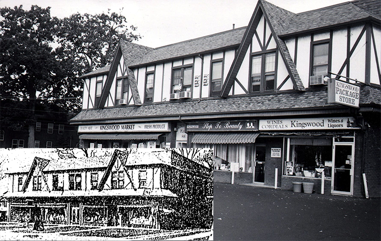
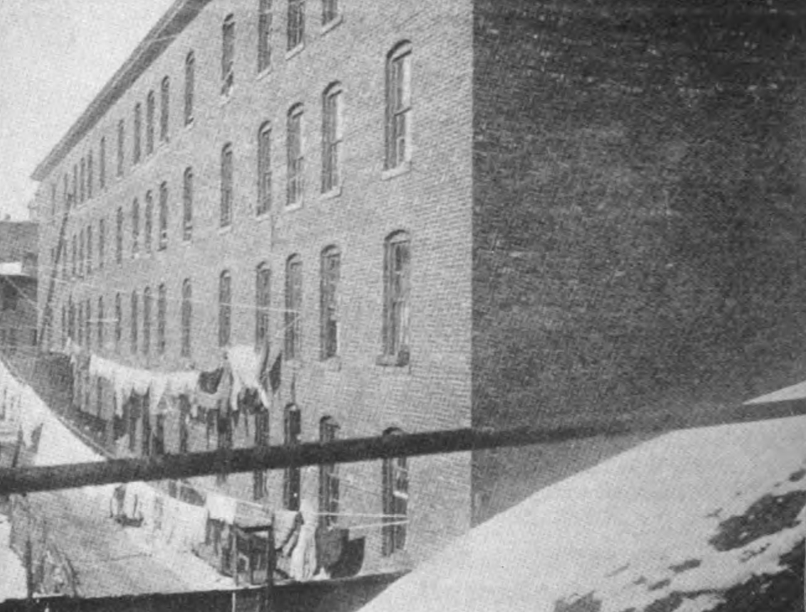
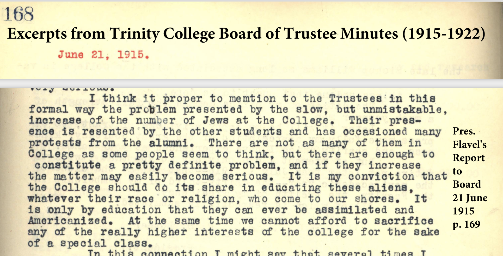

## A Jewish Grocer and the Origins of Zoning in Connecticut {- #origins-zoning}
When Jacob Solomon Goldberg returned home to Hartford after military service in World War I, he sought to advance himself from a butcher to a businessman. Jacob partnered with his brother Barney and their brother-in-law Hyman M. Cohen to buy a small grocery store in downtown Hartford, near their East Side neighborhood, which they managed together during the early 1920s. Like other entrepreneurs of their era, they "followed the trend of business to the west," they told local reporters, and dreamed of opening a second grocery store in the rapidly-growing suburb of West Hartford. This town's population grew at a faster rate than Hartford during the 1910s, nearly doubling in size to almost 9,000 residents during that decade. West Hartford town officials granted more than 300 building permits for single- and two-family homes in 1922, more than any other town in Connecticut that year. Linked by convenient trolley lines to the capital city with its corporate headquarters for the nation's leading banks and insurance companies, West Hartford was quickly becoming an ideal destination for the rising middle class. The emerging suburb, adjacent to Hartford's premier West End neighborhoods, was politically independent, and its real estate opportunities became a magnet for the elite.^[Jacob Solomon Goldberg (1891-1939) and his wife Anna Miller Goldberg should not be confused with other Hartford residents with similar names. Jacob and his partners purchased and re-named the Guilfoil City Hall Grocery at 42 State Street, Hartford, in 1919. @SecondAnniversaryCity1921; @KingswoodMarketHas1924; @JacobGoldbergObituary1939; @connecticutstateboardofeducationSurveySchoolsWest1923, p. 103.]

Goldberg and his family searched for the perfect location to open a second grocery store. With funds from Jacob's father David, who previously owned a Jewish meat market in Hartford, they bought two valuable parcels of undeveloped land on Farmington Avenue at the corner of Ardmore Road, on the trolley line about halfway between the Hartford border and West Hartford's town center. In the early 1920s, only a dozen grocers served all of West Hartford's population, including several small shops where owners sold food products out of their homes. Customers typically made frequent purchases from neighborhood grocers during the week due to limited transportation and refrigeration. Goldberg's closest competitors were located about a half-mile in opposite directions: West Hill Grocery (also on Farmington Avenue, closer to the Hartford border) and M.J. Burnham's (a larger store in West Hartford Center). Although the immediate area around Goldberg's property had only 60 houses in 1923, real estate developers and town officials had subdivided the land into smaller lots, and were building side streets and sewer lines, in anticipation of many more homebuyers. Next door to Goldberg's vacant lots stood the only non-residential building in the vicinity: the West Hartford Armory for the Connecticut National Guard Troop B Cavalry, built in 1913. Perhaps the odor from its horse stables helped explain why no one had yet built a home on Goldberg's empty property lots.^[When David Goldberg died in 1924, his estate valued the property at $40,000, and Jacob and his mother Rachel became its administrators. @DavidGoldbergObituary1924; @DavidGoldbergEstate1924; @ProbateCourtGoldberg1924; @silvermanHartfordJews165919701970, p. 170. West Hill Grocery was located at 765 Farmington Avenue, near the corner of Whiting Lane, and M.J. Burnham's was located at 19 South Main Street in West Hartford Center. @sanbornmapcompanyHartfordConnecticutInsurance1961; @GeerHartfordDirectory1923; @rossanoBuiltServeConnecticut2003; @WestHartfordArmory2015]

But when Goldberg applied for a building permit in January 1923, the West Hartford building inspector refused to grant it. Instead, the inspector called a public hearing, where reporters described how "a score of property owners in the Ardmore Road section appeared and protested" against Goldberg's plan to build a grocery store. In their eyes, it made no difference that Goldberg had hired a well-known local architect whose design followed every legal requirement in the town building code. It made no difference that his proposed store would be facing the busier Farmington Avenue or occupy much less space than the Armory building next door, as shown in Figure \@ref(fig:1923-otl-ardmore-road-wh). What mattered was that property owners objected to Goldberg's right to build a store in *their* neighborhood, and the town government took *their* side by declining to grant a permit. Goldberg eventually prevailed and opened the Kingswood Market grocery store, as shown in Figure \@ref(fig:1928-2004-kingswood-hc-whhs). He probably chose the name to identify with the Kingswood School, an elite private country day school for boys that opened three blocks away in 1922, and did *not* generate controversy among property owners. Although Goldberg won this battle, the dispute over property rights and the exclusionary climate surrounding it helps to explain how zoning happened in Connecticut in the 1920s.^[@LegalFightStore1923. Goldberg and his partners probably selected the name "Kingswood Market" to identify with the private Kingswood School, which opened in 1922 on nearby Outlook Avenue, @KingswoodSchoolProposed1921; @KingswoodSchoolHome1922. Images of Kingswood Market originally appeared in @KingswoodMarket3rd1928; and courtesy of the Noah Webster House & West Hartford Historical Society in @faudeWestHartford2004; @KingswoodMarketWest2015]

(ref:1923-otl-ardmore-road-wh) In 1923, West Hartford property owners and town officials objected to Jacob Goldberg's application to build a grocery store at the corner of Farmington Avenue and Ardmore Road (shown in blue), which would be much smaller than the West Hartford Armory next door (shown in red). Source: [Sanborn fire insurance maps](https://www.loc.gov/collections/sanborn-maps/?fa=location:west+hartford) digitized by the Library of Congress. [Interactive map](https://ontheline.github.io/otl-ardmore-road-wh/index-caption.html) developed by Ilya Ilyankou and Jack Dougherty, with [sources and code on GitHub](https://github.com/ontheline/otl-ardmore-road-wh).

```{r 1923-otl-ardmore-road-wh, fig.cap="(ref:1923-otl-ardmore-road-wh)"}
if(knitr::is_html_output(excludes="markdown")) knitr::include_url("https://ontheline.github.io/otl-ardmore-road-wh/index.html", height = "400px") else knitr::include_graphics("images/1923-otl-ardmore-road-wh.png")
```

(ref:1928-2004-kingswood-hc-whhs) Jacob Goldberg eventually won the legal battle to open Kingswood Market in November 1924, pictured here on its third anniversary (bottom left) and also in 2004. Other first-floor storefronts included the Kingswood Pharmacy and Dettenborn Hardware, with small shops and offices on the second floor. Images from *Hartford Courant* (1928); Noah Webster House & West Hartford Historical Society (2004), used with permission.

```{r 1928-2004-kingswood-hc-whhs, fig.cap="(ref:1928-2004-kingswood-hc-whhs)"}
 
```

### Opposing Goldberg and Urban Influences {-}
Why did West Hartford property owners and town officials block Goldberg's building permit? Were they opposed to a grocery store in their residential neighborhood---or to the presence of a Jewish grocer from Hartford? The best answer is *both*. During this period of rapid growth, challenging Goldberg's grocery was a way for West Hartford neighbors and leaders to share their fears about "undesirable" urban influences infringing on their suburb and threatening their property values. Some objected to business development, some resented immigrant outsiders, and Goldberg symbolized both. To fully tell Goldberg's story and explain how it fits into the origins of zoning, we need to consider both aspects of opposition.

On the surface, there is no evidence of overt anti-Semitism against Goldberg in this 1923 dispute. No one publicly uttered an anti-Jewish slur against him, nor did he publicly charge that his permit was rejected due to his religion, according to available documents. Similar opposition arose against Fred Kenyon, a local Protestant real estate businessman, who in December 1922 proposed to build a public garage for residents to park their automobiles, to be located in the rear of Lancaster Road, only one block away. The West Hartford building inspector refused to grant Kenyon a permit due to objections from property owners at a public hearing. Two months later, homeowners on nearby Fern Street went to court to stop Kenyon's real estate company from removing a deed restriction that guaranteed only single-family homes would be built on property in their neighborhood, since they feared that multi-family apartment buildings would lower their property values. Since West Hartford residents and town officials blocked both Goldberg (a Jew) and Kenyon (an Episcopalian), we can conclude that religion was not the sole factor. Both cases reveal a common fear that real estate development would threaten residential property values.^[No evidence of overt anti-Semitism appears in the newspaper accounts of public meetings, nor in the sparse minutes from town council meetings on the matter. Thanks to local historian Jeff Murray for his research and analysis on Fred Kenyon. @westhartfordTownCouncilMeeting1923; @WestHartfordHas1923; @LandHouseRestriction1923; @FredKenyonDies1937]

But we also need to understand that the controversy over Goldberg's store arose during a period of intense anti-Jewish and anti-immigrant fervor. Around 30 percent of Hartford's population were foreign-born immigrants between 1910 and 1920, with Russians, Italians, Irish, and Poles as the largest groups. In the aftermath of the first World War and the Russian Revolution, a "Red Scare" prompted many native-born Americans to fear that anarchists and Communists were spreading their ideas among US immigrant workers. In Hartford, when 2,000 people attended an anti-capitalism rally led by the International Workers of the World in 1919, the city council voted unanimously to prohibit the IWW and Communists from holding public meetings, distributing literature, or raising the Red flag. The Palmer Raids, organized by the US Attorney General, targeted cities like Hartford to arrest and deport immigrant labor activists. Governor Marcus Holcomb launched Connecticut's Department of Americanization in 1919 with a mission to convert "our foreign-born and illiterate population." He sought to adopt what former President Theodore Roosevelt envisioned as "one common language, one country, one allegiance, one loyalty and one flag." The state-funded [Connecticut Americanizer](http://hdl.handle.net/11134/30002:o20830502) reminded readers not to forget Roosevelt's warning that Americans should live as one nation, "not as dwellers in a polyglot boarding house." The US Congress passed the Emergency Immigration Act of 1921 with quotas that sharply reduced migration from Eastern and Southern Europe. Amid all of this, US automaker Henry Ford and others widely circulated anti-Jewish conspiracy theories. Newspapers announced that the Ku Klux Klan had established a "small but well-organized local chapter" in Hartford, and its members declared that "You have to be a Protestant to belong to this organization... And you can't be a half-hearted Protestant either." In Protestant-led small towns like West Hartford, even if no one publicly uttered an anti-Jewish slur against Goldberg, some local officials and property owners most likely perceived him as a Jewish Hartford outsider to their community.^[@staveMakingHartfordHome1979; @uscensusbureauTable13Country1922; @shubertPalmerRaidsConnecticut1971; @weaverHartfordConnecticutCapital2003, pp. 113-114; @whiteStampingOutReds2005; @thorntonShoeleatherHistoryWobblies2013; @thorntonRedScareConnecticut2020; @GoodLuckSays1919; @AmericanizationUrgedRoosevelt1919; @KuKluxKlan1921; @KuKluxKlan1922; @KuKluxKlan1922a]

Decades earlier, Hartford Jews had to push state leaders to grant them religious freedom. Connecticut began as a Christian colony, with no separation of church and state. After Reverend Thomas Hooker and his followers broke away from the Massachusetts Bay Colony and settled Connecticut in the 1630s, they interwove their local churches with town government, and required residents to pay taxes to support them. Despite the promise of freedom of religion in the First Amendment to the US Constitution in 1789, Connecticut did not officially remove the Congregational Church as the state religion until three decades later. Delegates to Connecticut's Constitutional Convention in 1818 debated the topic of religious freedom, but deliberately voted to extend it only to "every society or denomination of Christians," not other faiths. Jews were not permitted to form their own congregations or worship publicly until 1843, when a delegation of German Jews persuaded the state legislature to grant this right by statute (though the state's laws remained overtly Christian until another constitutional convention in 1965).^[@dalinMakingLifeBuilding1997, pp. 10-13; @cohnCivilRightsJews2010; @hortonConnecticutStateConstitution2011, pp. 11-13; @finlayImportanceBeingPuritan2015; @furerChurchStateLand2018]

When Jacob's parents, David and Rachel Goldberg, migrated from Latvia to England to Hartford in 1884, they established one of the city's first kosher meat markets, and helped to settle many of the Eastern European Jews who came after them. In the 1920s, Hartford became home to Connecticut's largest Jewish community, estimated to be about 11 percent of the city's population. Most of the recent Jewish immigrants lived in crowded tenements in the Front Street and Windsor Street neighborhoods near the Connecticut River, which experts had declared to be "the worst housing conditions in the country" among cities of Hartford's size. Photographs of multi-family tenement buildings appeared in the pages of Progressive-era reformers' reports, as shown in Figure \@ref(fig:1903-tenement-veiller-154b), and visually represented the "undesirable" urban elements that suburban leaders strongly sought to avoid. To earn a living, Jewish men commonly became peddlers who vocally advertised their goods up and down the streets, and maybe after gaining a foothold, opened a retail storefront. They sometimes came into conflict with Hartford police over noise complaints in the streets, or doing business on Sundays in violation of Connecticut's Blue Laws, intended to protect the Christian sabbath.^[@silvermanHartfordJews165919701970, p. 170;  @beckerJewishCommunityHartford1979; @veillerHousingConditionsTenement1903, p. 155; @pennybackerEastSideStory1995; @dalinMakingLifeBuilding1997, ch. 4; @baldwinDomesticatingStreetReform1999, ch. 7]

(ref:1903-tenement-veiller-154b) Photo with the caption, "Hartford - A Type of Tenement House," appeared in Lawrence Veiller's 1903 report on *Housing Conditions and Tenement Laws*, and visually symbolized urban influences that suburban leaders sought to avoid.

```{r 1903-tenement-veiller-154b, out.width=550, fig.cap="(ref:1903-tenement-veiller-154b)"}
 
```

Most Jews who climbed up the economic ladder moved out of Hartford's crowded East Side. In 1912, the Goldberg family had earned enough money from their retail business to purchase a home in Hartford's North End. "The poor Jews still lived in the Third Ward" along the Connecticut River, recalled Joseph Klau, one of Goldberg's contemporaries, while many middle-class Jews in the 1920s bought property along Albany Avenue, heading west from downtown. "Every little Jewish builder was given a [property] lot and a construction loan," Klau remembered, "and the two- and three-family houses went up like mushrooms...with central heating and electric lights, and real bathrooms." Some middle-class Jews moved further away from the central city and rented apartments or bought homes in West Hartford.^[The Goldberg family moved to 47 Clark Street, according to @GeerHartfordDirectory1912, p. 263; @klauOralHistoryInterview1974, cited in @huttonBriefLookBack2014, p. 12; @sanbornmapcompanyHartfordConnecticutInsurance1961. See also @waldenRememberingOldNeighborhood2010; @waldenRevisitingOurNeighborhoods2013]

Owning a retail business was the best route to the middle class for Jacob Goldberg, because Hartford's most prestigious institutions in finance, medicine, and law generally refused to employ Jews in higher-status positions. Although the city was one of the nation's centers of banking and insurance, companies such as The Hartford, Aetna, and Travelers only hired a few Jews to serve as bookkeepers or sales agents, and did not allow them to rise into positions of authority until the 1950s. According to a survey of 800 officers and directors employed at Hartford's ten largest insurance companies and six largest banks in 1967, only 1 percent were Jewish (and most of them were concentrated in one institution, Constitution National Bank). Both the Protestant-run Hartford Hospital and the Catholic-run St. Francis Hospital barred nearly all Jewish doctors, with rare exceptions, from practicing medicine at their facilities until World War II. These hospital hiring policies were "never written and seldom articulated," but clearly understood. Similarly, Hartford's top three corporate law firms at that time---Robinson, Robinson & Cole; Day, Berry & Howard; and Shipman & Goodwin---refused to employ Jews through the 1950s. Joseph Klau recalled how he earned his undergraduate and law degrees from Harvard University, then came back to Hartford in 1927 but couldn't get a job. "I went for all of them, knocking on doors... nobody was taking in a Jew as their [lawyer]" at any of the city's major law firms. Exclusion from upper-status employment was based on unwritten but widely recognized "gentlemen's agreements" that Jews should not apply, nor would they be considered.^[@silvermanHartfordJews165919701970, p. 86; @lazarusPracticeMedicinePrejudice1991, p. 24; @dalinMakingLifeBuilding1997, pp. 59, 78-82, 174-75; @klauOralHistoryInterview1974, p. 14; @huttonBriefLookBack2014]

Although "unwritten rules" against Jews typically did not appear in public, occasionally we can find them in private documents that their creators believed would remain secret, such as minutes of closed-door board meetings. At Trinity College, Hartford's preeminent institution of higher education, Rev. Flavel S. Luther served as president from 1904 to 1919, and also was elected by Hartford voters as a Progressive-era Republican in the Connecticut State Senate, where his key accomplishment was to [consolidate rural school districts and solidify town-level governance](consolidating.html). But in Trinity's Board of Trustee meetings from 1915 to at least 1922, Luther and his contemporaries strongly expressed anti-Semitic views and implemented strategies to reduce the number of Jewish students, and reject all Black applicants, according to minutes that were long hidden from public view, as shown in Figure \@ref(fig:1915-1922-trinity-excerpts-screenshot) and described in more detail in the "[Uncovering Unwritten Rules Against Jewish and Black Students at Trinity College](uncovering-unwritten.html)" chapter in this book. The prevalence of anti-Jewish policies at Hartford's most respected academic institution---established in 1823 on the grounds of religious tolerance by Episcopalians who objected to the Congregational Church's dominance in Connecticut---demonstrates that over the course of a century, its leaders had become skilled in hiding their own prejudices from the public eye.^[18 June 1915 Report by President Luther, read aloud at 21 June 1915 meeting, @trinitycollegeBoardTrusteesMinutes1926, p. 169.]

(ref:1915-1922-trinity-excerpts-screenshot) Read more about the words and actions of Trinity's leaders in the supplemental chapter on "[Uncovering Unwritten Rules Against Jewish and Black Students at Trinity College](uncovering-unwritten)" in this book.

```{r 1915-1922-trinity-excerpts-screenshot, fig.cap="(ref:1915-1922-trinity-excerpts-screenshot)"}

```

To be clear, anti-Jewish or anti-immigrant views among the Protestant leadership in Hartford's preeminent colleges, banks, insurance companies, hospitals, and corporate law firms does not prove that they were also held by West Hartford's Protestant property owners and town officials who objected to Jacob Goldberg's building permit in 1923. But the evidence from Trinity College demonstrates how hateful biases were hidden behind closed doors. Oral history also reveals that anti-Semitism was not far beneath the surface in West Hartford. In 1925, Rabbi Abraham Feldman arrived in Hartford to lead Congregation Beth Israel, a Reform synagogue whose members were considering moving to West Hartford, and had purchased land on Farmington Avenue, not far from Goldberg's store. Feldman reflected on some of his early, unpleasant encounters with West Hartford town leaders while speaking with an oral historian in 1974. "West Hartford was a closed community politically," Feldman recalled, labeling it "the most Republican town in the US" in the 1920s. Although Jews were just beginning to move from the city to the suburb, "there was no chance for a young Jew, or a Jewish lawyer... who wanted to enter the political life of the community," he remembered, adding that West Hartford's Protestant leaders "didn't want any Catholics, either." Overall, while there is no direct evidence of overt anti-Semitism during the Goldberg controversy, the widespread prevalence of these views means we cannot ignore them when telling the story of an urban Jewish grocer and the origins of exclusionary zoning in the suburbs.^[@MayBuildTemple1924; @feldmanOralHistoryInterview1974, p. 19.]

### Fighting Back {- #fighting-back}
Faced with these anti-Semitic barriers, many Hartford Jews fought back by gathering resources to create their own institutions during this era. Jewish doctors opened Hartford's Mount Sinai Hospital in 1923, and proudly declared that their doors were open "to all citizens regardless of race or creed." Connecticut's only Jewish-led hospital both served the needs of immigrant patients who were viewed as second-class citizens by other hospitals, and created employment opportunities for Jews in medical professions. Jacob's sister, Celia Goldberg Pessin, earned her nursing degree at New York City's Mount Sinai Hospital, and became the first Jewish woman to enter nurse's training in Hartford. When Jewish lawyers were refused jobs at Hartford's corporate law firms, some opened their own smaller law offices. Another one of Jacob's sisters, Dora Goldberg Schatz, married attorney Nathan Schatz, who partnered with his brother Louis (a Jewish graduate of Trinity College) to create the Schatz and Schatz law firm in Hartford in 1917. Decades later, in higher education, Rabbi Feldman also played an instrumental role in the founding of the University of Hartford, open to all students, in 1957.^[Mount Sinai Hospital opening in *Hartford Times* 3 March 1923, cited in @lazarusPracticeMedicinePrejudice1991, p. 36; @chameidesMountSinaiConnecticut2010; @NursingPioneerDies1975; @dalinMakingLifeBuilding1997, pp. 62, 78; @silvermanHartfordJews165919701970, p. 86; @RabbiAbrahamFeldman1967; @RabbiAbrahamFeldman1972; @UniversityHartfordEarly2005]

Jacob Goldberg also fought back. When the West Hartford building inspector refused to grant him a permit to construct his grocery store in January 1923, Goldberg hired an attorney and filed a lawsuit. (Perhaps he received informal advice from his brother-in-law Nathan Schatz, the Jewish attorney who was a rising figure in the Connecticut Republican party.) Goldberg's lawsuit challenged the constitutional authority of the local government to block construction of a building on the arbitrary grounds that "neighbors do not want it." The lawsuit spelled out how Goldberg employed a respected local architect, William T. Marchant, to design the 80 by 60 foot store to conform with all aspects of the West Hartford building code, and also to be an attractive building. While Goldberg could have hired one of several Jewish architects in Hartford, he probably selected Marchant, a Gentile who resided in West Hartford, because he was well-known to town officials and had recently designed the high school and several other public buildings. Goldberg's lawsuit claimed that West Hartford's building inspector was "exceeding his constitutional rights" by rejecting the project, even if the town government had delegated him "with such arbitrary powers." This fight over issuing a building permit to a Jewish Hartford grocer grabbed large headlines, as shown in Figure \@ref(fig:1923-02-07-goldberg-hc), especially when compared to a similar rejection of local Protestant businessman Fred Kenyon two months earlier, which barely made it into the news.^[@LegalFightStore1923; @WilliamMarchantCollection2021; @Marchant68Dies1948; @silvermanHartfordJews165919701970, p. 258. By comparison, the rejection of Fred Kenyon's public garage permit at a December 14, 1922 public hearing was not reported at the time, and appeared near the bottom of a story six months later in @WestHartfordHas1923]

(ref:1923-02-07-goldberg-hc) The controversy over granting a building permit to Jewish Hartford grocer Jacob Goldberg grabbed larger headlines than a similar conflict involving local Protestant real estate businessman Fred Kenyon. Source: Hartford Courant, February 7, 1923.

```{r 1923-02-07-goldberg-hc, out.width=500, fig.cap="(ref:1923-02-07-goldberg-hc)"}
 knitr::include_graphics("images/1923-02-07-goldberg-hc.png")
```

Initially, West Hartford leaders fought back against Goldberg. Town Council members voted in March 1923 to task their attorney, and also to retain the services of a second attorney, to defend their building inspector's refusal to grant a permit. Behind the scenes, West Hartford's attorneys realized that Goldberg had a strong case. Without a clearly-defined policy, a court might rule that the Town had refused to grant him a permit for arbitrary reasons, and might reduce the Town's authority to reject other buildings in the future. Perhaps they also discussed the potential risks of bad press over a Protestant-led town government fighting to block a Jewish-owned grocery. In any case, the Town Council eventually relented. At the end of their June 1923 meeting, the Council went into a closed-door executive session, away from the press and the public. They quietly voted to approve Goldberg's building permit, and also created a committee to review local ordinances on building restrictions in residential areas, to ensure they were on stronger legal footing next time. The Council succeeded in keeping the Goldberg controversy out of the headlines, at least temporarily. The following day's news did not mention Goldberg by name, and only hinted at the end of the story that it was "unofficially rumored" that a permit would be granted.^[@DemandEconomyWest1923; @westhartfordTownCouncilMeeting1923, June 5, 1923, p. 210; @WestHartfordTax1923]

For a second time, West Hartford residents spoke out against Goldberg's proposed store. A group of 14 local property owners protested at the next Town Council meeting, and were represented by a spokesperson: real estate businessman M. Martin Kupperstein, who also was one of the few Jewish residents in the neighborhood. Perhaps he was selected to counter any perceptions that their opposition was anti-Semitic. After Kupperstein urged the Council to reverse its decision, the Town Council's attorney informed the protesters that they had examined Goldberg's case "from every possible angle" and decided "it would be a poor policy for the town to attempt to withhold the permit." To put it more simply, another council member stated that the Town would not prevail in court.^[@westhartfordTownCouncilMeeting1923, June 19, 1923, p. 211; @WestHartfordStore1923; @MorrisMartinKupperstein1938. Kupperstein resided at 847 Farmington Avenue, West Hartford, @GeerHartfordDirectory1923, p. 466.]

Who were these West Hartford property owners, and what motivated their protests against Goldberg's grocery store? With the exception of Kupperstein, none of their names appear in official minutes or news accounts of the two public hearings in 1923, nor do we have a record of the words they spoke. Furthermore, while the *Hartford Courant* referred to this neighborhood as "one of West Hartford's exclusive residential sections," that description did not match Ardmore Road, where nearly every building was a two-family duplex, in contrast to several other nearby streets with more expensive single-family homes. Perhaps the relative affordability of two-family homes explained why Ardmore Road developed so rapidly, growing from 1 household in 1922 to over 40 households by 1926, according to city directory listings as shown in Table \@ref(tab:1922-26-ardmore-road). Interestingly, the proportion of households with Jewish names rose from 0 out of 13 in 1923 to 8 out of 43 (nearly 20 percent) by 1926, meaning that Ardmore Road also attracted a larger percentage of Jewish residents than probably any other street in West Hartford at that time. Moreover, the Catholic Church purchased a large parcel of land in October 1923 on Farmington Avenue, near the Ardmore Road intersection, where they built St. Thomas the Apostle Church, a structure nearly as large as the nearby Armory. To be clear, we do not know precisely which families lived on Ardmore Road in early 1923, nor could they predict the future, but the Goldberg store controversy may have symbolized that *their* neighborhood was rapidly changing.^[@LegalFightStore1923. Out of 54 buildings on Ardmore Road today, all appear to have been constructed as 2-family units except two addresses: 10 and 14. See Ardmore Road household data from Geer's City Directory listings, 1922-26, and West Hartford Voting Registration Records for Ardmore Road (1920-1926; transcribed by Jeff Murray in 2017 from West Hartford Historical Society archives), both available at https://github.com/OnTheLine/otl-ardmore-road-wh.]

Table: (\#tab:1922-26-ardmore-road) Households on Ardmore Road, 1922-26

| Year | Households | Percent Jewish |
|-----:|-----:| -----: |
| 1922 |    1 |        |
| 1923 |   13 |        |
| 1924 |   34 |        |
| 1925 |   41 |        |
| 1926 |   43 |   19%  |

After Jacob Goldberg finally won his building permit, Kingswood Market opened its doors for business in November 1924. He incorporated the business with his brother Barney and two brothers-in-law: attorney Nathan Schatz and Hyman M. Cohen, who managed the market. Jacob Goldberg also moved into the West Hartford neighborhood and purchased a single-family home on nearby Outlook Avenue. Two years later, the Goldberg family sold the business, and a series of owners continued to operate Kingswood Market for decades, until it was unable to compete against a much larger and more modern Whole Foods grocery store that opened four blocks away in 2005. Neighborhood residents mourned when Kingswood Market closed its doors in 2007.^[@KingswoodMarketHas1924; @KingswoodMarketCorporation1924; @CityHallMarket1924; @KingswoodMarket3rd1928; @KingswoodBuildingFarmington1926; @WestHartfordMen1952; @wfsbeyewitnessnewsKingswoodMarketClosing2007; @KingswoodMarketClosing2007. Jacob Goldberg resided at 17 Outlook Avenue in late 1924, @BuildingPermitsWorth1924].

The Town Council concluded this episode by announcing the creation of a new Zoning Commission in July 1923, to find a better way to deal with decisions over what kinds of buildings should be constructed in the future. But zoning was still a new concept, and the council did not yet have a clear idea of how it would work. At that same meeting, the attorney for Fred Kenyon, the local Protestant businessman whose public garage permit also had been rejected, sought to re-open the issue for his client. Since the Town granted a building permit to Goldberg, he argued, shouldn't they also grant a permit to Kenyon? One Council member moved to refer the request to the brand-new Zoning Commission they had created a few minutes earlier, but Kenyon's attorney objected because this entity "had not yet consulted any regulations." The Council agreed with him, but then voted to refer Kenyon's request back to the building inspector who had previously rejected it, which meant it went nowhere.^[@WestHartfordHas1923]

Pressure continued to mount to define what zoning would mean for West Hartford. Simply put, town leaders were searching for a legally defensible framework for preventing what they deemed to be undesirable urban elements from entering *their* rapidly-growing suburb. When West Hartford property owners complained about grocery stores, public garages, and apartment buildings, these types of buildings symbolized their larger fears about Hartford city life---especially its growing population of immigrants in crowded tenements---invading *their* small town. Very soon, zoning would be designed primarily to protect them and their property values.
