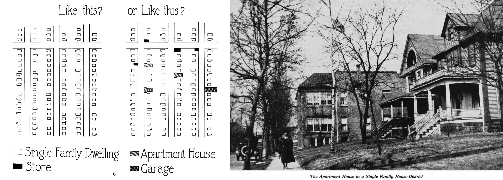

## Bringing Zoning to Connecticut {- #bringing-zoning}
How did Connecticut's suburban leaders define what zoning would look like in their local communities? West Hartford's history matters because it hired national experts to design a town-wide plan and became Connecticut's first municipality to enact local zoning in 1924, and set precedents followed by many other suburbs. Zoning in West Hartford did not only separate industrial, commercial, and residential areas. The plan went further by *economically segregating* residential areas through minimum-land rules that favored neighborhoods with more expensive single-family homes, and physically distanced them from less expensive multi-family housing and apartment buildings. Although Connecticut state law justified zoning on the basis of public health and welfare, suburban leaders refined its purpose to attract higher-income homebuyers and protect their property values. Moreover, in the aftermath of the Goldberg grocery store controversy, town leaders turned to zoning as a legally defensible strategy that enabled suburbs to segregate or exclude what they viewed as "undesirable" urban influences---on the basis of wealth---without directly referring to their race, religion, or nationality. In this way, zoning became a powerful and long-lasting tool of government-sponsored housing discrimination that continues into the present day.

Across the US, when local governments began to adopt zoning laws during the 1910s, state and federal courts were still sorting out what types of restrictions they would permit. Traditionally, US law had been established to defend individual property owners and courts were reluctant to infringe on their rights in the free market. In this context, some cities defended their zoning policies on the grounds that local governments had a responsibility to exert some authority over the real estate market to protect the interests of their residents. For example, New York City's 1916 zoning code separated industrial and residential land for health reasons, and limited the height of skyscrapers to ensure that air and sunlight reached people in smaller buildings nearby. Zoning advocates carefully justified New York City's right to exercise limited "police powers" over land use in order to protect the "public health, safety, order, and general welfare" of its residents. The courts gradually seemed to accept this rationale.^[@whittenBuildingZonePlan1917, p. 334; @wolfZoningAmericaEuclid2008]

But US courts objected to other forms of zoning, such as *race-based zoning* that explicitly separated residents into Black or White neighborhoods. The US Supreme Court's ruling in the 1917 *Buchanan v. Warley* case overturned race-based zoning, but not on the civil rights grounds that we might expect today. Three years earlier, the city of Louisville, Kentucky approved a zoning law that prohibited Blacks from living in residential blocks that were more than 50 percent White, and vice versa. William Warley, the Black president of the local NAACP chapter, tested the zoning law by purchasing vacant property in a White-majority block from Charles Buchanan, a White real estate agent. Warley cleverly inserted a clause that required him to complete the contract only if the law allowed him to occupy the property as a residence, which the zoning law did not permit. Buchanan went to court to demand his right to sell the property to Warley, and the scenario reversed traditional roles, by forcing the White real estate agent to argue *against* the segregationist housing policy. The US Supreme Court agreed and overturned Louisville's racial zoning on grounds that it interfered with the White agent's constitutional right to sell his property as he pleased---which also happened to protect the Black buyer's right to live in a White-majority neighborhood.^[@buchananv.warleyDecision1917; @powerApartheidBaltimoreStyle1983, pp. 311-313]

In West Hartford, town councilman Josiah B. Woods stood out among his peers as the strongest advocate for zoning in the early 1920s, and served continuously on its zoning commission until 1945. Educated at Amherst College and employed in the business world, he recognized the need for a long-term strategy to manage real estate development in his rapidly growing suburb. Woods witnessed the heated conflict between Goldberg, property owners, and the building inspector who refused to grant the permit, and sought to replace arbitrary decision-making with a town-wide land-use policy that promoted efficient and orderly economic growth. Up to this point, land owners occasionally inserted [restrictions into property deeds](restricting.html), such as requiring homes to be built above a minimum size or sold above a minimum price, to increase its value. But deed restrictions relied on individual actions, in contrast to a more comprehensive town-wide policy that Woods desired. Zoning seemed promising, but the concept was still new across the nation, and relatively unknown in Connecticut. Woods persuaded other members of the town council to create a zoning committee in the fall of 1922, and to appoint him as chair. Months later, his photo appeared prominently in local newspaper coverage that explained how zoning would solve West Hartford's problems, as shown in Figure \@ref(fig:1923-03-19-wh-woods-hc).^[@WestHartfordHopes1923; @WoodsLeaveWest1945; @WoodsDiesWas1948]

(ref:1923-03-19-wh-woods-hc) Josiah B. Woods, West Hartford town councilman and zoning committee chair, appeared prominently in newspaper coverage in support of Connecticut's zoning enabling act. Source: Hartford Courant, March 13, 1923.

```{r 1923-03-19-wh-woods-hc, out.width=500, fig.cap="(ref:1923-03-19-wh-woods-hc)"}
 knitr::include_graphics("images/1923-03-19-wh-woods-hc.png")
```

To figure out how zoning might work for West Hartford, Josiah Woods and his colleagues sought advice from national leaders. Herbert Hoover, the US Secretary of Commerce (and future US President), led the most activist federal agency of his era by promoting a zoning framework for states and local governments to adopt. The Commerce Department actively circulated the *[Standard Zoning Enabling Act](http://archive.org/details/standardstatezon05bass)*, drafted by New York City attorney and zoning advocate Edward M. Bassett in late 1921. The document offered legally defensible language for state governments to grant zoning authority to local municipalities to achieve multiple objectives. The first few lines introduced zoning in benevolent terms, such as making land-use decisions to reduce street congestion, ensure fire safety, and prevent overcrowding "for the purpose of promoting health, safety, morals, or the general welfare of the community." But the document also mentioned that zoning regulations would consider "the character of the district... with a view to conserving the value of buildings." In other words, the federal government's *Standard Zoning Enabling Act* gave legal cover to local municipalities: if they acted under the pretense of public health and community welfare, they could write zoning laws to exclude undesirable types of housing (and their undesirable occupants) in order to raise property values for more desirable homes. Hoover's strategy quickly succeeded. When his Commerce Department began working on this issue, only 48 US cities and towns had enacted zoning in late 1921, but that number grew to 218 by late 1923.^[@usdepartmentofcommerceStandardStateZoning1924, pp. 4, 6; @knackRealStoryStandard1996]

Connecticut lawmakers latched onto Hoover's language and considered a bill modeled on the *Standard Zoning Enabling Act* in March 1923, during the peak of the Goldberg controversy. Josiah Woods publicly urged other West Hartford town council members to support the bill, which would grant decision-making authority to West Hartford and seven other municipalities that it specifically listed. Zoning would solve West Hartford's long-term problems, Woods declared, by giving the town the power "to protect the residential character" of designated areas. Woods testified on behalf of the Town Council in favor of the zoning enabling act at the Connecticut legislature, as did New York City zoning advocate Edward Bassett. Their advocacy helped Connecticut's first zoning bill sail through the legislature without controversy, and the governor signed it on June 1923.^[Josiah Woods most likely obtained an early draft of US Commerce Department's *Standard Zoning Enabling Act* by spring 1923, because the 1924 edition stated it was first distributed as a mimeograph in August 1922, revised and made public in the same form in January 1923, then printed for wider distribution. @usdepartmentofcommerceStandardStateZoning1924 Indirect quote of Woods on "protect the residential character" in @DemandEconomyWest1923. @usdepartmentofcommerceStandardStateZoning1924; @WestHartfordHopes1923; @ExpertFavorsGeneral1923; @PlansApportionPopulation1923; @BallotProbeBill1923; @connecticutgeneralassemblyPublicAct2791923]

### Designing Zoning to Exclude {-}
Josiah Woods pushed West Hartford to move as quickly as possible to become Connecticut's first municipality to act on its new local zoning powers. With the Goldberg controversy still hanging over their heads, the Town Council quickly appointed Woods to chair their new Zoning Commission, and allocated funds to hire zoning attorney Edward Bassett to advise them on next steps in the summer of 1923. Bassett cautioned Woods and his colleagues that "all zoning must be constructive and not arbitrary," in order to avoid legal challenges in court. Furthermore, zoning policies affected only future construction in this fast-growing suburb, and would not apply retroactively to existing buildings.^[@ZoningCommissionBe1923; @WestHartfordHas1923; @MoneyWestHartford1923; @ZoningCommissionReady1923]

West Hartford also hired Robert Harvey Whitten, an urban planner who helped Bassett create New York City's zoning code, and also served as a zoning consultant for Cleveland, Ohio; Atlanta, Georgia; and several cities in New England states. In each of these places, Whitten's job was to design the details of a zoning plan and draft them into a public document to persuade local leaders and their constituents to support it. His 1921 *[Cleveland Zone Plan](http://hdl.handle.net/2027/yale.39002044619519)* featured many visual elements, including diagrams of the dangers of mixing residential and commercial buildings, and photographs of apartment buildings intruding on single-family homes, as shown in Figure \@ref(fig:1921-whitten-cleveland). Whitten's vision of urban planning emphasized homogeneity, with uniform building types in the same neighborhood. Zoning is "like good housekeeping," he quipped. "It provides a place for everything and tries to keep everything in its place."^[@ExpertZoningEngaged1923; @RobertWhittenCity1936; @whittenClevelandZonePlan1921]    

(ref:1921-whitten-cleveland) Whitten illustrated his zoning reports to praise neighborhoods with only single-family homes (left image), and to oppose mixing them with apartment buildings and small businesses (center and right images). Source: Cleveland Zone Plan, 1921, hosted by HathiTrust.

```{r 1921-whitten-cleveland, fig.cap="(ref:1921-whitten-cleveland)"}
 
```

In Atlanta, city leaders hired Whitten to design racially-segregated zoning, despite the US Supreme Court's 1917 *Buchanan* prohibition against this policy. In 1922, one year prior to his work in West Hartford, Whitten's *[Atlanta Zone Plan](https://www.google.com/books/edition/The_Atlanta_Zone_Plan/MmNAAQAAMAAJ)* was published by city officials and directly called for "Race Zoning" to divide residential areas into "white", "colored", and "undetermined" districts. Under Whitten's plan, Black families were not permitted to move into homes in White zones that they did not occupy prior to the passage of the proposed zoning law, and vice versa. "Race zoning is essential in the interest of the public peace, order and security," Whitten wrote, "and will promote the welfare and prosperity of both the white and colored race." Although the Georgia Supreme Court later ruled that Whitten's plan was unconstitutional, Atlanta's city leaders relied on his race-based zoning maps in future decades. In other words, West Hartford leaders had hired a planner who used segregationist tools to lay out the future of their suburb. Whether  explicitly calling for racial segregation (as Whitten did in the South), or indirectly calling for economic segregation with rules that did not mention race or nationality (as Whitten did in the North), the goal of these exclusionary zoning plans was to geographically separate people according to their social status.^[@whittenAtlantaZonePlan1922, p. 10; @silverRacialOriginsZoning1997; @rothsteinColorLawForgotten2017, pp. 46-53]

Whitten crafted the 1924 *[West Hartford Zoning report](https://www.google.com/books/edition/West_Hartford_Zoning/bdKsAAAAMAAJ)* to blend the soft rhetoric of inclusion with hard rules of exclusion. The introduction promised that zoning would bring "orderliness" and "efficiency" to the town's rapid growth, with "an increase of health, comfort and happiness for all people." It recognized that the suburb's primary function was to provide housing for people who worked in the adjacent city of Hartford and to serve "all classes and all grades of economic ability," including "factory workers, office employees, and the various business and professional groups." But deep inside the body of the report, Whitten devised a system to sort residents into economically segregated homogeneous neighborhoods.^[@whittenWestHartfordZoning1924, pp. preface, 1, 2, 10].

Whitten's zoning plan divided West Hartford into five residential areas---A, B, C, D, and E---based on new rules that required a minimum amount of land per family to construct housing, as shown in Table \@ref(tab:1924-zone). The most exclusive A zones were designated for upper-income single-family homes because they required at least 9,000 square feet of land (1/5 of an acre) per family. At the opposite end were the C, D, and E zones, set aside for more affordable multi-family duplexes, triples, and apartments, where the rules required significantly less land per family. Additional rules also increased the amount of land needed to build in more exclusive areas: A-zone homes could occupy no more than 30 percent of the property lot, and also must be 60 feet wide on the street-facing side in order to spread them further apart. While these 1920s rules may seem modest by today's standards, Whitten recommended *nearly twice* the amount of land per family in West Hartford's most exclusive zone compared to similar zones in Cleveland and Atlanta. Connecticut's suburbs offered more space for large-lot zoning requirements.^[@whittenWestHartfordZoning1924, pp. 10, 13. Whitten recommended a minimum of 5,000 square feet of land per family in A-1 zones in Cleveland and Atlanta, @whittenClevelandZonePlan1921, p. 12; @whittenAtlantaZonePlan1922, p. 13]

Table: (\#tab:1924-zone) Minimum Land Required Per Family in West Hartford Zoning, 1924

| Zone | Intended use | Min. land per family | Land cost per family | Scale diagram |
|:-----|:-------------|--------------:|------------:| ---------------------------:|
| A    | 1-fam home   |  9,000 sq ft  |  \$\$\$\$\$ |  |
| B    | 1-fam home   |  6,000 sq ft  |    \$\$\$\$ |  |
| C    | 2-fam duplex |  3,000 sq ft  |      \$\$\$ |  |
| D    | 3-fam triple |  1,500 sq ft  |        \$\$ |  |
| E    | apartments   |    750 sq ft  |          \$ |  |

*Each zone set a minimum land requirement per family, shown in green, which intentionally made it "uneconomic" to build affordable multi-family housing in the A and B areas. Icons by [Georgiana Ionescu](https://thenounproject.com/georgiana.ionescu/collection/real-estate-outline/).*
<!-- Design notes: https://docs.google.com/spreadsheets/d/1g58ZaR1lsfr1s5mdvZFru6DAJFnA9jNwDVlrxaQ0rbA/edit#gid=0
Graphics from https://www.figma.com/file/7JitgyYxiT3xR3fyoZttKb/otl-zoning-graphics
Export at 4x resolution, then reduce size 25% to return to original dimensions -->

Overall, West Hartford's 1924 zoning formula relied on minimum-land rules to create separate neighborhoods for expensive single-family homes and affordable multi-family homes, and to physically distance these residents from each other. Whitten's report bluntly stated its objectives. Zoning policy would make it "uneconomic to build two-family houses" in A and B areas because real estate developers needed to buy *twice* as much land compared to the amount needed for a single-family home, as shown in Figure \@ref(fig:1924-whitten-highlight-10). Given the same land costs, developers would generate more profits by building and selling two single-family homes, rather than one two-family home. While "three-family houses and apartment houses are not prohibited in the A, B, or C area districts," Whitten clarified, his zoning laws would influence the marketplace by removing incentives to build mixed-income housing. In short, the new rules rewarded developers who built economically exclusionary neighborhoods.^[@whittenWestHartfordZoning1924, p. 10.]

(ref:1924-whitten-highlight-10) Whitten's zoning plan for West Hartford demonstrated how local governments could create minimum-land rules that made it "uneconomic" for private real estate developers to build multi-family housing in areas designated for single-family homes, thereby creating powerful incentives for exclusion. Source: *[West Hartford Zoning](https://www.google.com/books/edition/West_Hartford_Zoning/bdKsAAAAMAAJ)*, 1924, hosted by Google Books.

```{r 1924-whitten-highlight-10, fig.cap="(ref:1924-whitten-highlight-10)"}
 knitr::include_graphics("images/1924-whitten-highlight-10.png")
```

Exclusionary zoning was designed to sharply reduce the amount of multi-family housing that developers would build. Although West Hartford's zoning plan did not prohibit multi-family housing, it pushed lower-income families into lower-rated C, D, and E areas---the only zones where duplexes, triples, and apartments could be constructed economically---which sharply limited the supply of affordable housing in the suburb. Whitten's 1924 report cautioned readers about multi-family housing taking over suburban space that, in his view, should be reserved for single-family homes. It featured photographs with captions warning that "large apartment houses are spreading farther west along Farmington Avenue and into side streets," the same areas as the Goldberg grocery store controversy the prior year, as shown in Figure \@ref(fig:1924-whitten-apartments-p17-16). Through minimum-land rules, Whitten promised that "crowded tenement house conditions [that] exist in many larger communities," such as the city of Hartford, "will be effectively prevented in West Hartford." It's unclear whether Whitten knew that one of the buildings pictured in his report was The Packard, originally designed by Jewish builders in 1917 to become upscale apartments, though it was not a financial success when it finally opened in 1922. In any case, Whitten's words and images were intended to stir up anxieties among suburban homeowners about multi-family urban tenements and their "undesirable" occupants.^[@whittenWestHartfordZoning1924, pp. 10, 12, 16, 17. Thanks to Mary Donohue for her research on The Packard, an upscale apartment building originally designed in 1917 by Jewish architect Harry Beckanstin, on land purchased by Barnet Sharfman and his partners, which was resold several times. @donohueWestHartfordHouse2018; @WestHartfordAsk1917; @HartfordLargestApartment1919; @PackardApartmentsSold1923; @routhierBankForecloseVintage1992]

(ref:1924-whitten-apartments-p17-16) The 1924 *West Hartford Zoning* report warned that "large apartment houses are spreading farther west along Farmington Avenue" from the city into the suburb, where town leaders and their zoning experts believed single-family homes belonged. On the right side is The Packard, originally designed by Jewish builders to become upscale apartments.

```{r 1924-whitten-apartments-p17-16, fig.cap="(ref:1924-whitten-apartments-p17-16)"}
 knitr::include_graphics("images/1924-whitten-apartments-p17-16.png")
```

The true power of zoning was revealed in Whitten's 1924 map and its vision for future real estate development in West Hartford. The policy envisioned that most property would become single-family housing, as shown in the darker green shades on top of the original black-and-white map in Figure \@ref(fig:1924-otl-zoning-west-hartford). Zoning assigned more than 80 percent of West Hartford property to zones A and B combined, the most exclusive areas that required the highest minimum amount of land per family, as shown in Table \@ref(tab:1924-zone-land). Furthermore, the vast majority of the town's undeveloped property (to the north and the west) was labeled zones A and B, which Whitten's report acknowledged "would assume a single-family development through this entire area" if no changes were made in years to come. By contrast, less than 20 percent of West Hartford's property was intended for multi-family housing in C, D, and E zones. Moreover, much of the C and D areas were assigned to the town's southeast corner, which Whitten's zoning plan also designated as the industrial area (shown in dark cross-hatch on the original map), making housing less desirable. Apartment buildings were only intended for the thin strip of E zone on Farmington Avenue from the Hartford border to West Hartford Center. Finally, C, D, and E zones had already been mostly developed, which limited new opportunities for multi-family construction. Overall, the zoning policy guaranteed that West Hartford's future housing would be more expensive and exclusive.^[  @whittenTentativeZoningMap1924; @whittenWestHartfordZoning1924, p. 14. See 1924 zoning geodata and land calculations in @ilyankouMapExclusionaryZoning2021. Even with a more refined estimate of land assignment that removes parcels that were or became non-residential (schools, parks, cemeteries, streams, industrial areas, commercial-only areas, etc.), the percentage of A and B property combined is more than 80 percent.]

(ref:1924-otl-zoning-west-hartford) Explore the [interactive map](https://ontheline.github.io/otl-zoning-west-hartford/index-caption.html). When West Hartford became the first Connecticut municipality to enact zoning in 1924, leaders followed Robert Harvey Whitten's recommendation to divide the town into five residential zones (A to E), shown here in dark-to-light shades of green overlaid on top of the original black-and-white map for clarity. Zone A required at least 9,000 square feet of property per family, and was intended for more expensive single-family homes, while making multi-family housing "uneconomic" to build there. Over 80 percent of the town's land---and nearly all of its undeveloped land to the north and west---was assigned to zones A and B to ensure the dominance of single-family housing across the suburb. Follow zoning maps over time by changing the background layers. Map developed by Ilya Ilyankou (Picturedigits) and Jack Dougherty, with MAGIC UConn Libraries. View [historical sources and code on GitHub](https://github.com/ontheline/otl-zoning-west-hartford).

```{r 1924-otl-zoning-west-hartford, fig.cap="(ref:1924-otl-zoning-west-hartford)"}
if(knitr::is_html_output(excludes="markdown")) knitr::include_url("https://ontheline.github.io/otl-zoning-west-hartford/", height = "800px") else knitr::include_graphics("images/1924-otl-zoning-west-hartford.png")
```

Table: (\#tab:1924-zone-land) Land Assigned by Zone, West Hartford, 1924

| Zone | Land (acres) | Percent |
|:-----|-------------:|--------:|
| A    | 6,430        | 45%     |
| B    | 5,540        | 39%     |
| C    | 1,825        | 13%     |
| D    | 435          | 3%      |
| E    | 109          | 1%      |
| Total| 14,339       | 100%    |

Josiah Woods and his colleagues embraced Whitten's zoning plan for West Hartford. As the Zoning Commission chairman, Woods wrote the foreword to the published report, which called attention to the need for an "orderly" process to develop the suburb's "large unbuilt areas" in the near future. After public discussions and some minor adjustments, the Town Council voted to approve nearly all of their consultant's recommendations in March 1924, and became Connecticut's first municipality to enact local zoning ordinances, only nine months after the 1923 state law granted permission for selected towns to do so. New York City zoning attorney Edward Bassett sent his compliments to West Hartford on their fast adoption of Whitten's recommendations. The Connecticut Chamber of Commerce brought Bassett back the following year, to advise more towns that sought to be granted the same zoning powers as West Hartford. Bassett persuaded them to drop their individual petitions for zoning, which he argued would be found unconstitutional, and instead to support a state-wide comprehensive bill that he assured them would "stand the tests of the court." Local leaders followed Bassett's advice, and Connecticut passed its second enabling act in 1925, a more comprehensive bill that expanded zoning power to nearly all 169 municipalities across the state.^[@whittenWestHartfordZoning1924, p. 1; @FramingZoningSystem1924; @ZoningPlanWest1924. See seven minor adjustments listed in @ZoningCommissionPlan1924; @VoteSupportZoning1925; Connecticut's 1925 zoning act specifically exempted the city of New Haven. @connecticutgeneralassemblyPublicAct2421925]

Bassett's prediction was accurate. In its landmark 1926 *Euclid v. Ambler* decision, the US Supreme Court shifted its interpretation of individual versus governmental property rights. The test case came the Cleveland suburb of Euclid, Ohio, which created residential zoning that blocked landowners from selling their property for industrial use. Previously in the 1917 *Buchanan* case, the Court ruled against racial zoning on the grounds that local government infringed on individual rights to sell property to whomever they chose. But less than a decade later in the *Euclid* case, the court's 6-3 majority agreed that local governments *could* limit individual rights to property as long as they "find their justification... for the public welfare." Zoning laws are constitutional, the Court ruled, unless they are "clearly arbitrary and unreasonable, having no substantial relation to the public health, safety, morals, or general welfare" of the community. This language precisely matched the state zoning enabling bill that Bassett, Hoover, and other zoning advocates had recommended. Also, while the *Euclid* case involved industrial versus residential zoning, and did not directly address exclusionary minimum-land zoning that towns like West Hartford had implemented, the Court made its views on multi-family housing very clear. "Very often the apartment house is a mere parasite," the Court wrote, "constructed in order to take advantage of the open spaces and attractive surroundings" created by single-family homes, which are threatened by the growth of multi-family homes. In this way, the Supreme Court ruling justified zoning to primarily protect "the public welfare" of single-family homeowners and their right to physically separate themselves from multi-family rental housing.^[@euclidv.amblerDecision1926; @freundColoredPropertyState2007, pp. 81-87; @rothsteinColorLawForgotten2017, pp. 52-53. Prior to the 1926 US Supreme Court decision, a 1924 Federal District Court ruled against Euclid's zoning ordinance as an overreach of governmental power, but accurately recognized that its true purpose was "to classify the population and segregate them according to their income or situation in life. The true reason why some persons live in a mansion and others in a shack, why some live in a single-family dwelling and others in a double-family dwelling, why some live in a two-family dwelling and others in an apartment, or why some live in a well-kept apartment and others in a tenement, is primarily economic. It is a matter of income and wealth, plus the labor and difficulty of procuring adequate domestic service." @amblerv.euclidDecision1924, p. 316. See also the CT Supreme Court's reasoning about crowded housing creating immoral people in its 1920 *Windsor v. Whitney* decision, which recognized the Town of Windsor's right to lay out streets and claim eminent domain while taking private property for the public good. "Streets of reasonable width add to the value of the land along the street, enhance the general value of land and buildings in the neighborhood and greatly increase the beauty of the neighborhood. These are all facts of universal knowledge...Narrow streets in congested industrial centers breed disease. Too many houses crowded upon a lot without sufficient space for light and air menace health. Such a neighborhood affects the morals of its people." @windsorv.whitneyDecision1920, p. 365]

The US Supreme Court's *Euclid* decision emboldened local governments to enact more exclusionary zoning. Back in West Hartford, the fast-changing real estate market led some developers to test the boundaries by buying sufficient land to meet the minimum requirements to build 6-family and 12-family apartments in A and B zones, which Whitten intended for single-family homes. In response, the Town Council made zoning even *more* restrictive in 1927, by voting to outright prohibit the construction of "houses for more than one family" in A and B areas, regardless of the amount of land per family. Although West Hartford's law against *any* multi-family housing was later pulled back, town leaders continued to protect single-family housing and deter most multi-family housing, with little justification on how its laws served the general welfare of the community.^[@12FamilyApartmentWay1926; @ApartmentsBannedAreas1927; @westhartfordReportZoningCommission1928, p. 83]

Although West Hartford initially justified its zoning policy on the grounds of public health and welfare, this soft rhetoric steadily slipped away and was replaced by harder rules of economic exclusion over time. We can see this shifting rhetoric in Josiah Woods, West Hartford's long-time zoning commissioner. Back in 1923, Woods defended zoning on the grounds that it was designed to "protect the residential character" of neighborhoods. But in 1944, during a local dispute over the scope of the town's zoning authority, he spoke more bluntly about its true purpose. "It is wise to go back to the fundamentals of zoning," Woods reminded his audience, stating that the underlying goal is "to make West Hartford a suburban town 'for real homes'," meaning single-family owner-occupied dwellings, rather than multi-family housing for renters. "The Town is given the authority to make zones for the preservation of existing [property] values," Woods continued, and "zoning exists to protect those values." If suburban property owners simply understood, Woods suggested, that zoning was created to defend their common economic interests---and to protect them from urban intrusions---there would be no conflict over the core principles of zoning in West Hartford.^[@DemandEconomyWest1923; @ProtectionPropertyValues1944]

Although West Hartford leaders made minor changes to their zoning plans over time, local laws largely excluded all but single-family construction during the post-war housing boom of the 1940s and '50s. Exclusionary zoning policy became firmly entrenched as existing land in the town was almost entirely "built out" by late 1960s, as shown in Figure \@ref(fig:1900s-otl-year-built). This map of all properties (residential, commercial, industrial) by "year built" illustrates two key periods of development in suburban West Hartford. First, the 1920s boom on the east side and town center filled up 15 percent of all parcels available today. Second, the 1950s growth on the north, west, and south sides filled up 31 percent of all parcels available today. In addition, the total area of developed property increased from the 1920s (6 percent of all available acres) to the 1950s (24 percent of all available acres), and average parcel sizes grew larger over time. By the late 1960s, nearly all land that could be developed had been used and the town was almost entirely "built out" based on the zoning policies established in 1924. After suburban land has been subdivided into large property lots with single-family homes, the possibility of change becomes more difficult.^[See West Hartford property development data and tables from pre-1900s to 2010s at https://github.com/ontheline/otl-year-built.]

(ref:1900s-otl-year-built) Explore the [full-size interactive map](https://ontheline.github.io/otl-year-built/index-caption.html) of residential-commercial-industrial property development by "year built" in suburban West Hartford, which shows two key periods of activity: the 1920s boom in the east side and town center, and the 1950s growth on the north, west, and south sides. By the late 1960s, the town was almost entirely "built out." Source: Property assessment data provided by the Town of West Hartford and AppGeo, only for properties that currently exist. "Year built" means the most recent year of construction recorded, which is missing for about 3 percent of nearly 20,000 parcels. View [historical sources and map code](https://github.com/ontheline/otl-zoning-west-hartford/), developed by Jack Dougherty and Ilya Ilyankou.

```{r 1900s-otl-year-built, fig.cap="(ref:1900s-otl-year-built)"}
if(knitr::is_html_output(excludes="markdown")) knitr::include_url("https://ontheline.github.io/otl-year-built/", height = "600px") else knitr::include_graphics("images/1900s-otl-year-built.png")
```

Elsewhere in the nation, some Progressive-era proponents of zoning began to express doubts about how its purpose had shifted toward exclusionary goals. William Munro, a former Harvard professor of municipal government and prominent urban planner, called out this problem in his 1931 article titled "A Danger Spot in the Zoning Movement." Back in the early 1900s, Munro recalled how US city planners first discussed the concept of zoning, adopted from progressive German cities, as a means to control private property for the public good. Looking back, "the chief argument in favor of zoning... was a means of promoting the welfare of the whole community and guiding its growth along orderly lines." Zoning solved municipal design problems, Munro argued, by preventing industrial intrusions into residential neighborhoods, and promoting thoughtful planning about where to construct public schools. But zoning "quickly became popular" across US metro areas because "real estate agents and promoters throughout the country got behind the movement" as "an opportunity to boom their business" by separating residential areas for higher profits. Nowadays in the 1930s, Munro observed that people think about zoning "as merely a matter of maintaining or increasing property values." In local disputes over rezoning, Munro lamented that "the issue is not usually approached from the standpoint of what the city needs." Instead, property owners "have come to feel that they have a vested right" to preserve single-family zoning in which they have invested, and to prevent changes that would permit the construction of a two-family duplex on their street. "We seem to be in danger of forgetting the original purpose of the zoning process as a whole," Munro concluded, because we have placed private interests over the public good.^[@munroDangerSpotZoning1931; @weissRiseCommunityBuilders1987, p. 99]

Munro's cautionary tale shows how the US zoning movement veered away from its original progressive goals for the public good and shifted into a legally-defensible tool to protect real estate profits and single-family homeowners. When West Hartford adopted zoning in 1924, its soft rhetoric initially referred to the public welfare of the community, but its hard rules were clearly designed to separate and stratify neighborhood residents by income. The primary objectives of West Hartford's original zoning plan were to exclude multi-family housing from most areas of town and to physically distance suburban homeowners from urban renters they deemed as undesirable. While this story of exclusionary zoning began in one Connecticut suburb, it quickly spread to others across the state.
