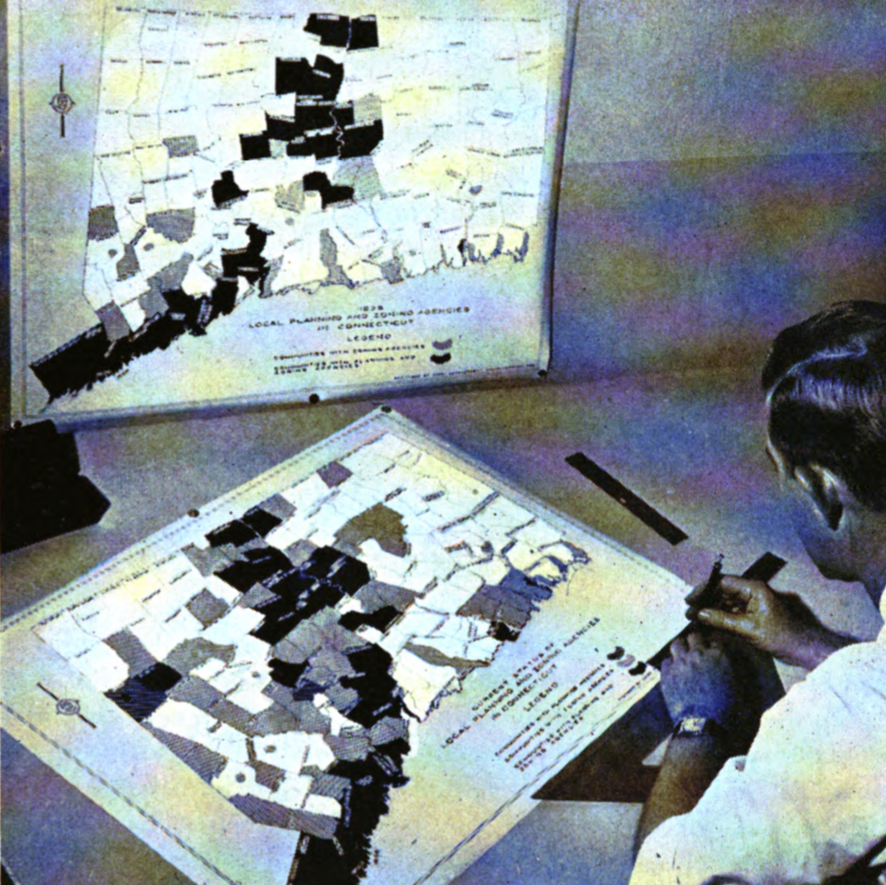
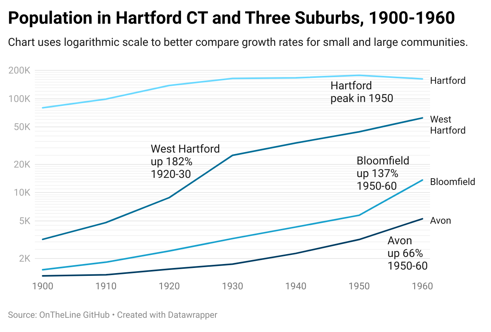
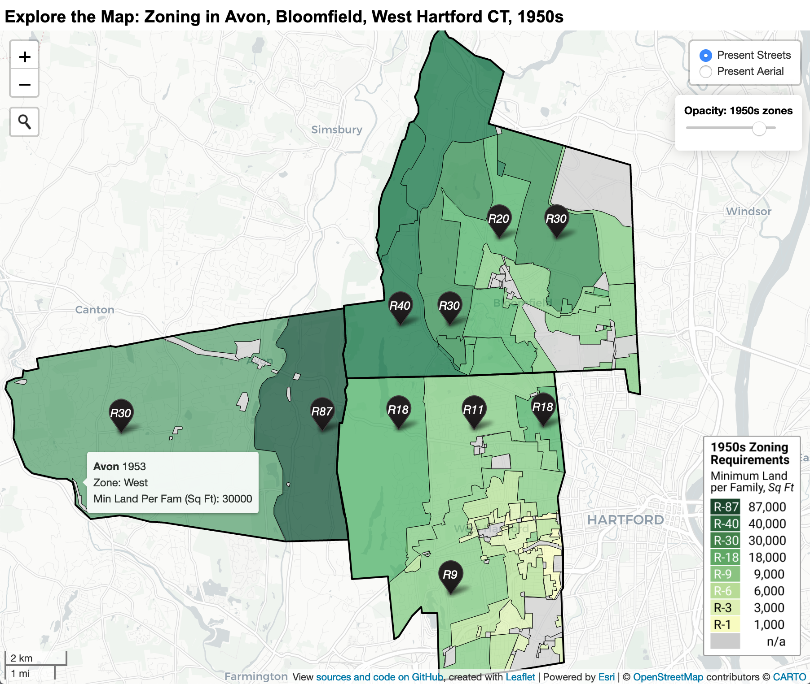

## Expanding Zoning Across Suburbs {- #expanding-zoning}

After Connecticut legislators allowed town governments to enact zoning in 1923, local land-use policies spread quickly across the state. While each town made its own decisions, the growth of zoning was tracked by the Connecticut Development Commission, a state agency created in 1939 to promote economic growth and efficient planning for industry and housing. The Commission published a series of maps to illustrate the growth of local planning and zoning agencies in Connecticut, as shown in Figure \@ref(fig:1946-ctdevcomm-p19) from its 1944-1946 report. Towns that enacted local zoning policies tended to be clustered in the rapidly-growing suburbs around the state's major cities of Hartford, Bridgeport, and New Haven. By 1957, 77 percent (131 out of 169) of town governments had established some type of planning and/or zoning agency, as shown in Figure \@ref(fig:1957-otl-planning-zoning-ct). Nearly every town within a 20-mile radius around Hartford---including outlying rural areas far from the city center---enacted some type of land-use agency to exert control over what type of housing could be built in their community.^[@connecticutdevelopmentcommissionReport1946, p. 19; @connecticutdevelopmentcommissionLegislationPassed19571957; @connecticutdevelopmentcommissionDepartmentEconomicCommunity2019. See historical sources for 1957 map at https://github.com/ontheline/otl-planning-zoning-ct]

(ref:1946-ctdevcomm-p19) A Connecticut Development Commission employee reviews a 1938 map of local planning and zoning agencies in order to create an updated version in this photo from their 1944-1946 report. Zoning grew most quickly in suburban towns clustered around the major cities of Hartford, Bridgeport, and New Haven.

```{r 1946-ctdevcomm-p19, out.width=500, fig.cap="(ref:1946-ctdevcomm-p19)"}
 
```

(ref:1957-otl-planning-zoning-ct) Explore the [full-size interactive map](https://ontheline.github.io/otl-planning-zoning-ct/). By 1957, more than 77 percent of town governments had established some type of planning and/or zoning agency, including nearly every town within a 20-mile radius of Hartford, according to the Connecticut Development Commission. View [historical sources and open-source map code](https://github.com/ontheline/otl-planning-zoning-ct/), developed by Jack Dougherty and Ilya Ilyankou.

```{r 1957-otl-planning-zoning-ct, fig.cap="(ref:1957-otl-planning-zoning-ct)"}
if(knitr::is_html_output(excludes="markdown")) knitr::include_url("https://ontheline.github.io/otl-planning-zoning-ct/") else knitr::include_graphics("images/1957-otl-planning-zoning-ct.png")
```

How and why did zoning expand across Connecticut? How did exclusivity vary in different communities? This chapter compares how zoning grew in three adjacent but very different suburban towns: Avon, Bloomfield, and West Hartford. Although West Hartford acted first to enable zoning in 1924, the neighboring town of Bloomfield hired its own expert to catch up in the late 1920s, and zoned its land with more exclusive minimum requirements than West Hartford during its 1950s building boom. Meanwhile, residents in the farming town of Avon initially opposed zoning in the 1930s, but changed course by hiring its own expert in the 1950s and approved even more exclusive minimum-land requirements than its neighbors.

To some degree, the differences in the timing of zoning across these three towns can be explained as local government responses to population growth. West Hartford enacted zoning in response to its high growth rate during its housing boom of the 1920s, when the population increased 182 percent. Similarly, Bloomfield actively expanded its zoning policies during its peak growth decade of the 1950s, when its population climbed 137 percent, as shown in Figure \@ref(fig:1900-1960-pop-h3sub).^[See 1900-1960 population data at https://github.com/ontheline/otl-datawrapper. See similar use of logarithmic scale for comparative population growth across metropolitan Hartford towns in @technicalplanningassociatesWethersfieldConnecticutPlan1950, PDF p. 18.]

(ref:1900-1960-pop-h3sub) Explore the [full-size interactive chart](https://datawrapper.dwcdn.net/p69o9/), which uses a logarithmic scale to better compare growth rates for small and large communities. Each suburban town experienced sharp population growth (West Hartford in the 1920s, Bloomfield and Avon in the 1950s) as the population of the central city of Hartford peaked in 1950. Source: US Census. View [historical data](https://github.com/ontheline/otl-datawrapper).

```{r 1900-1960-pop-h3sub, fig.cap="(ref:1900-1960-pop-h3sub)"}
if(knitr::is_html_output(excludes="markdown")) knitr::include_url("https://datawrapper.dwcdn.net/p69o9/") else 
```

But zoning was not merely a response to population growth....

### TO COME in this section {-}

This section will trace the growth of exclusionary zoning during the twentieth century, as Hartford-area suburbs competed against one another to attract higher-income families...

Across these three suburbs, the most restrictive minimum-land requirement for a single-family home increased from 9,000 square feet in the 1920s to over 87,000 square feet in the 1950s, as shown in Table \@ref(tab:1950s-most-exclusive).^[TODO FIX: Avon Zoning Regulations (amended Oct 19, 1951, and Fall 1953); Bloomfield (adopted March 15, 1950); West Hartford (amended to Dec 3, 1951); adapted from @avonPresentZoningFact1954; see also Bloomfield 1958 and West Hartford 1958 zoning map legends. Assume 1958 Bloomfield R-40 minimum lot width of 150 ft based on present-day requirements.]

Table: (\#tab:1950s-most-exclusive) Most Exclusive Minimum-land-per-family Zoning Rules in Three Hartford Suburbs, mid-1950s

| Town  | Zone | Min. land per family | Scale diagram |
|:------|-----:|------:|--------------------:|
| Avon  | East | 87,000 sq ft  |  |
| Bloomfield | R-40 | 40,000 sq ft  |  |
| West Hartford | AAA  | 18,000 sq ft  |  |

*In the mid-1950s, the minimum amount of land required per single-family home in Avon's most exclusive zone (87,000 square feet) was more than two times larger than Bloomfield's most exclusive zone (40,000 square feet), and more than four times larger than West Hartford's most exclusive zone (18,000 square feet). Icons by [Georgiana Ionescu](https://thenounproject.com/georgiana.ionescu/collection/real-estate-outline/).*
<!-- Graphics from https://www.figma.com/file/7JitgyYxiT3xR3fyoZttKb/otl-zoning-graphics
Export at 4x resolution, then reduce size 25% to return to original dimensions -->

TODO: Describe how the three towns decided to zone land for future residential growth that would attract higher-income families. To draw meaningful comparisons between suburbs, we digitized and stitched together mid-1950s paper zoning maps from their three separate town governments, and converted their minimum-land rules into a common scale with modern labels. For example, the most exclusionary zone in this map, R-87, represents a residential zone that requires at least 87,000 square feet of land (about 2 acres) to construct a single-family home...as shown in Figure \@ref(fig:1950s-otl-zoning-metro-hartford).

(ref:1950s-otl-zoning-metro-hartford) Explore the [interactive map](https://ontheline.github.io/otl-zoning-metro-hartford/index-caption.html) by floating your cursor to view mid-1950s minimum-land zoning rules in three suburban towns: Avon, Bloomfield, and West Hartford, Connecticut.  

```{r 1950s-otl-zoning-metro-hartford, fig.cap="(ref:1950s-otl-zoning-metro-hartford)"}
if(knitr::is_html_output(excludes="markdown")) knitr::include_url("https://ontheline.github.io/otl-zoning-metro-hartford", height = "550px") else 
```

TODO: ... How much land did each town assign to exclusionary residential zones in the mid-1950s? ...summarize data as shown in Table \@ref(tab:1950s-land-zone).

Table: (\#tab:1950s-land-zone) Percent of Land Area by Town and Zone Type, mid-1950s

| Zone equivalent | Avon | Bloomfield | West Hartford |
|:-----|-----:|-----:|-----:|
| R-87 | 26% |  |  |
| R-40 |  | 32% |  |
| R-30 | 72% | 27% |  |
| R-20 |  | 14% |  |
| R-18 |  |  | 31% |
| R-15 |  | 10% |  |
| R-10.5 |  |  | 19% |
| R-10 |  | 5% |  |
| R-9 |  |  | 24% |
| R-6 |  |  | 11% |
| R-3 |  |  | 6% |
| R-1 |  |  | 2% |
| non-residential | 2% | 12% | 7% |
| Total acres | 14979 | 16943 | 14333 |

TODO: Note that a strict calculation might manually remove park areas (such as Pennfield state park in Bloomfield) from residential zone calculations, but towns did include them in zoning maps, so left as-is.
