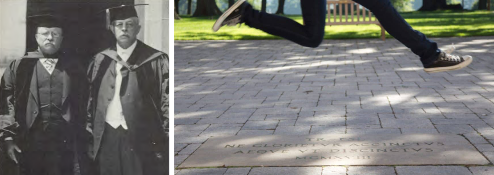
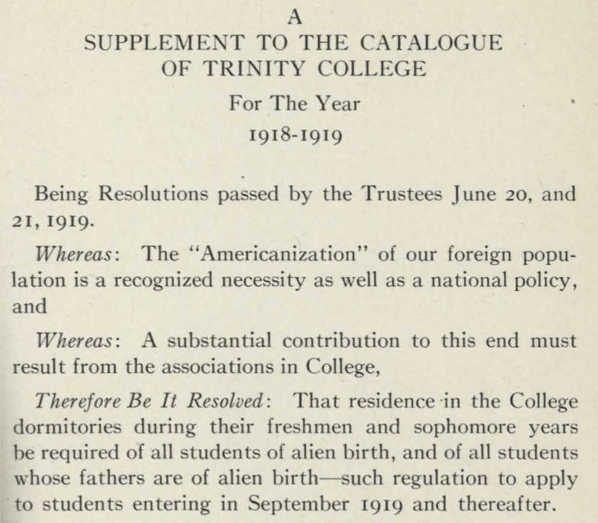

## Uncovering Unwritten Rules Against Jewish and Black Students at Trinity College {- #uncovering-unwritten}

*This section supplements the prior chapter on [A Jewish Grocer and the Origins of Zoning](origins-zoning.html) in this book. It sheds more light on anti-Jewish and anti-Black views and policies implemented by Trinity College leaders during the 1910s and '20s, which were largely hidden from public view until recent years. Today at Trinity, the Primus Project "aspires to tell a truer and fuller story of Trinity's history" by exploring how the institution and key individuals "engaged with systems of slavery and white supremacy." Also, President Joanne Berger-Sweeney announced that Trinity will relaunch its Committee on Named Facilities and Commemoratives to evaluate how spaces are named.^[@PrimusProjectSlavery2021; @berger-sweeneyNamingBuildingsTrinity2021]*

Although "unwritten rules" against Jews typically did not appear in public documents in this period, in certain cases we can find them in private documents that their creators believed would remain secret. At Trinity College, Hartford's preeminent institution of higher education, administrative and student leaders expressed explicitly anti-Semitic views from 1915 to at least 1922, and implemented strategies to reduce the number of Jewish students---and to reject all Black applicants---according to Board of Trustees meeting minutes that were long hidden from public view. For decades, Trinity Board Minutes were guarded as "confidential" and "not available for research use," even by Trinity faculty members like me. Trinity archivist Peter Knapp wrote a book in 2000 that acknowledged the College's anti-Jewish policies and quoted from Board minutes. But these source documents were not made publicly available until the Trinity Archives changed its policy in 2017 to release materials after a 50-year period, and began to upload them to the digital repository in 2019. Since Trinity's anti-Jewish rules did not appear in any standard College publications or newspaper accounts from this period, they would have remained invisible today if Trinity's archivists had not made this history public. Furthermore, anti-Semitism at Trinity is noteworthy because the Episcopalians who established the College in 1823 directly challenged the lack of religious tolerance in the Congregational Church that dominated state government at that time, and adopted a charter that promised Trinity would "not make the religious tenets of any person a condition of admission."^[@knappTrinityCollegeTwentieth2000, pp. 57-61; @stoykovichAvailabilityTrinityBoard2021. See 1823 College Charter reprinted in @trinitycollegeBulletinCatalogue1919, p. 12.]

Rev. Flavel S. Luther served as President of Trinity College from 1904 to 1919. In public, he was a well-respected mathematician, engineer, and ordained minister in the Episcopalian Church. Hartford voters also elected him to the Connecticut State Senate from 1907 to 1911, where his key accomplishment was to [consolidate rural school districts and solidify town-level governance](consolidating.html). Luther was a Progressive-era Republican who identified with (and bore some resemblance to) former US President Theodore Roosevelt, who accepted his invitation to deliver Trinity's commencement address in 1918. To this day, a Trinity student tradition is to wait until graduation day before stepping on the Luther-Roosevelt commemorative stone on the Long Walk.^[@osbornFlavelSweetenLuther1906; @CommencementPhoto1918; @DrLutherEducator1928; @weaverHistoryTrinityCollege1967, pp. 264-68; @TraditionsLutherRooseveltLong2020]

(ref:1918-roosevelt-luther-2018-walk) Former US President Theodore Roosevelt (left) delivered the 1918 commencement address at the invitation of his friend, Trinity President Flavel S. Luther (left), an event commemorated by the "TR-FSL" plaque that students traditionally avoid stepping on prior to graduation day. Images from Weaver, *History of Trinity College* and "Traditions" web page at Trinity.

```{r 1918-roosevelt-luther-2018-walk, fig.cap="(ref:1918-roosevelt-luther-2018-walk)"}
 
```

But behind closed doors, Luther and his contemporaries spoke candidly against Jews. Luther first raised the topic with Trinity's Board of Trustees in 1915, when he warned them about "the problem presented by the slow, but unmistakable, increase of the number of Jews at the College," as shown in Figure \@ref(fig:1915-1922-trinity-excerpts). At that time, probably about 10 percent of the 250 students on campus were Jewish, and most of these students resided in the city of Hartford rather than on campus. "Their presence is resented by the other students and has occasioned many protests by the alumni," Luther observed, and cautioned that "if they increase, the matter may easily become serious." Luther expressed his conviction that Trinity "should do its share in educating these aliens, whatever their race or religion... [because] it is only by education that they can ever be assimilated and Americanized." Nevertheless, he believed that Jewish student enrollment should be limited in some way because "we cannot afford to sacrifice any of the really higher interests of the college for the sake of a special class." No objections were recorded among the other fourteen board members in attendance, including distinguished clergymen, bankers, judges, and businessmen. No one mentioned that Trinity's founders originally established their college on the principles of religious tolerance.^[18 June 1915 Report by President Luther, read aloud at 21 June 1915 meeting, @trinitycollegeBoardTrusteesMinutes1926, p. 169. Other Board members attending were Rev. Francis Goodwin (Hartford parks architect), Rev. William Vibbert (New York City rector), P. Henry Woodward (Hartford banker), Rev. Chauncey Brewster (New Haven rector), William C. Skinner (President of Colt's Manufacturing), Ambrose Spencer Murray Jr., Hon. Frank L. Wilcox (Connecticut banker), Rev. Henry Ferguson, Edgar Waterman (Trinity treasurer), Edward B. Hatch (Hartford manufacturer), George D. Howell, Hon. Joseph Buffington (US Circuit Court judge), Robert Thorne, Rev. Samuel Hart (Divinity School dean). The 10 percent Jewish student estimate is based on 23 Jewish students in 1914-15 (p. 277) and a total enrollment of 257 students in 1913-14 (p. 297). @DrLutherEducator1928]

(ref:1915-1922-trinity-excerpts) **Scrolling version**: Explore [excerpts of anti-Jewish and anti-Black views and policies by Trinity College leaders](images/1915-1922-trinity-excerpts.pdf) in the Board of Trustees meeting minutes from 1915 to 1922, or [view the entire document in the Trinity Digital Repository](https://digitalrepository.trincoll.edu/trustees_mins/12).

```{r 1915-1922-trinity-excerpts, fig.cap="(ref:1915-1922-trinity-excerpts)"}
if(knitr::is_html_output(excludes="markdown")) knitr::include_url("images/1915-1922-trinity-excerpts.pdf") else knitr::include_graphics("images/1915-1922-trinity-excerpts-screenshot.png")
```

Although some Jewish students were admitted, Trinity leaders refused to accept Black students in this era. During the same closed-door meeting in 1915, President Luther confided to Board members that he had received several applications from "colored boys who wished to enter Trinity College," but reported that he found ways to reject all of them. "In each case so far I have been able to avoid an issue by methods which savor somewhat, I fear, of insincerity; but which have been effective." Perhaps Luther lied to Black applicants about their qualifications, or the finances that would be required, or invented some other reasons why they could not attend Trinity. Looking into the future, he predicted that "the time will come when this matter must be faced and definitely decided." But that day was in the distant future, because Trinity only admitted a few Black students in the 1950s, and did not begin to address racism in its admissions practices until the late 1960s.^[21 June 1915 meeting, @trinitycollegeBoardTrusteesMinutes1926, p. 169. On the small number of Black and Asian students at Trinity prior to the 1920s, see @knappTrinityCollegeTwentieth2000, pp. 337-341.]

Luther accurately predicted that the rising number of Jewish students would soon become a "serious" problem at Trinity College. In April 1918, the Board of Trustees heard from a Student Senate committee, appointed by the faculty "as the result of undergraduate expression of feeling against the Jews." Five Student Senators, two of whom also led the *Trinity Tripod* campus newspaper, claimed that the "alarmingly" high rate of Jewish enrollment was approaching 25 percent (although the actual figure was closer to 15 percent). Student Senators' objections to Jews reflected their negative views of Hartford residents and recent Eastern European immigrants. "The Jews come up to the College from the city, get all they can *from* from the College, and give nothing *to* the College," they wrote. Although Student Senators praised the high scholastic standing of their Jewish peers, they criticized their lack of support for college athletics as well as the war effort. "Speaking in general terms, the Jews have not enlisted in military service while the Gentiles have," they claimed. Furthermore, the Student Senators complained that "most of the Jews at Trinity are Russian," which they believed meant that every classroom "has a Russian socialistic expression of opinion." As a consequence, they told the Board that their classmates "hesitate about showing friends around the College, when they are sure to be greeted frequently by Jews." Board members asked President Luther to address this problem. [Student Senate committee letter, 24 April 1918, by Walter G. Smyth, Harmon T. Barber, Edward M. Hyland Jr., Edward G. Armstrong, and George C. Griffith, read aloud at 27 April 1918 Board meeting, @trinitycollegeBoardTrusteesMinutes1926, pp. 274-75. Smyth and Barber also were leaders of the student newspaper. @TripodElections1918]

President Luther presented more data and observations about Jewish students at the June 1918 Board meeting, He understood Trinity's larger problem was that World War I caused total enrollment to fall from around 250 to only 158 students in 1917-18, when many men left college to enlist in military service or join the workforce. The actual number of Jewish students remained relatively stable at 25 that year, but the proportion of Jews on campus had risen to 15 percent. Drawing on his personal observations of student life, Luther pointed to "a few of the Jews in College who, by reason of exceptional personal qualities, are cordially accepted as good fellows. The other students call them 'White Jews'." Luther's comment revealed how Trinity's dominant White Protestant culture considered most Jews to be *non-White* in this era, and assigned them to a lower position in the racial hierarchy. While Luther described Jews as "good scholars... who pay their bills," he concluded that "they are a definite hindrance to the growth of the College," and suggested ways that Trinity might deter their future enrollment, perhaps by mandatory Christian chapel services.^[President Luther report to Board of Trustees, 28 May 1918, read aloud at Board meeting, 14 June 1918 @trinitycollegeBoardTrusteesMinutes1926, pp. 276-278. On "White Jews," see @brodkinHowJewsBecame1998. Trinity re-instated compulsory chapel services on weekdays and Sundays in January 1919, "unless men are excused to attend church in town," @CompulsoryChapelTrinity1919]

One year later, Trinity student leaders continued to demand that the College reduce Jewish enrollments, but now cloaked their anti-Semitism in more publicly acceptable language of the era. The "Student Movement for Americanization at Trinity" submitted its resolutions to the Board of Trustees in April 1919, and demanded a reduction in "the undesirable element," a slightly coded phrase that replaced direct references to "Jews" or "Hebrews." While Americanization proponents recognized that Trinity's charter promised equality of opportunity regardless of religion, they argued that "90% of the undesirable element lives in Hartford," and that the College needed to discourage local Jews from attending Trinity. They proposed a policy of "compulsory residence" in college dormitories "to influence and Americanize all students which cannot be done to some of the students while living at their homes." Their proposal echoed former President Theodore Roosevelt's warning against the nation becoming "a polyglot boarding house," and aligned with Connecticut Governor Marcus Holcomb's agenda for the newly-launched Department of Americanization.^[Student Movement for Americanization at Trinity resolutions, presented at 26 April 1919 Board meeting, @trinitycollegeBoardTrusteesMinutes1926, pp. 320-321; @GoodLuckSays1919; @AmericanizationUrgedRoosevelt1919]

Trinity leaders embraced the Americanization strategy by enacting an alien-residence policy. To address what some discreetly called "the particularly undesirable element which so seriously lowers the standing of the College," the Board voted to require on-campus dormitory residence for all freshmen and sophomore students "of alien birth, and... whose fathers were of alien birth," effective in Fall 1919. This alien-residence policy was designed to discourage Hartford Jews from attending (since they would have to pay additional residence fees rather than live at home), and to assimilate those who did enroll. The College focused only on students' first two formative years, in part because they lacked sufficient dormitories to mandate it for all students. Board members also discussed whether the alien-residence rule should appear in official College publications, and finally granted President Luther permission to do so. The outcome was a one-page supplement to the 1918-19 Trinity *Catalogue*, as shown in Figure \@ref(fig:1919-trinity-supplement), published at the end of the academic year in June 1919 so that hardly anyone would actually see it in print. The alien-residence rule did not appear in future editions of the *Catalogue*, nor the *Student Handbook*, nor the *Trinity Tripod* student newspaper, nor the *Hartford Courant* daily newspaper. This cleverly allowed Trinity leaders to hide the policy away from public view, yet still enforce a rule that was "on the books." ^[Report of the Special Committee, presented at 20 June 1919 Board meeting, p. 329-330; Motion voted on at 20 June 1919 Board meeting, p. 333-334; 20 June 1919 Board of Fellows report, p. 335, @trinitycollegeBoardTrusteesMinutes1926; @trinitycollegeSupplementCatalogueTrinity1918; @baldwinShadowIvoryTower2021, pp. 26-27. No mention of the alien-residence policy appeared in the Trinity College *Bulletin (Catalogue)* from 1919 to 1923, the Trinity *Student Handbook* for 1922-1923 (no issues available prior to 1916-17), the *Trinity Tripod* student newspaper for 1919, or the *Hartford Courant* daily newspaper.]

(ref:1919-trinity-supplement) Explore the [alien-residence rule in a June 1919 one-page supplement](images/1915-1922-trinity-excerpts.pdf), added nearly a year after the publication of the 1918-19 Trinity College *Catalogue*. This effectively hid the rule from public view, but still allowed Trinity officials to enforce it. View [the full document in the Trinity Digital Repository](https://digitalrepository.trincoll.edu/bulletin/74/).

```{r 1919-trinity-supplement, fig.cap="(ref:1919-trinity-supplement)"}
if(knitr::is_html_output(excludes="markdown")) knitr::include_url("images/1919-trinity-supplement.pdf", height = "550px") else 
```

Trinity leaders definitely enforced their alien-residence policy. Officials reported to the Board in October 1919 that the rule was applied to 16 students, but "only three of these cases were Hebrews." This may have signaled that the policy began to meet its goal by deterring some Hartford Jews from applying and assimilating others who chose to enroll, or that other immigrant groups were finding their way to Trinity. To avoid burdening non-Jewish immigrants, the Board refined its policy to exempt "students of alien parentage residing in other towns than Hartford" from the dormitory residence requirement, at the discretion of administrators. In other words, the son of a Swedish immigrant in West Hartford could attend Trinity while continuing to live at home, but the son of a Jewish or Italian immigrant in Hartford could not.^[Report of the Special Committee, presented at 20 June 1919 Board meeting, p. 329-330; Motion voted on at 20 June 1919 Board meeting, p. 333-334; 20 June 1919 Board of Fellows report, p. 335; 24 October 1919 Report of the Executive Committee to the Board, p. 341, @trinitycollegeBoardTrusteesMinutes1926]

Two years later, new Trinity President Remsen Ogilby asked the Board to grant him greater discretion over the College's alien-residence policy, while continuing to quietly limit the number of Jewish students. In June 1921, Ogilby asked the Board "for a reconsideration of the rule requiring sons of foreign born to live on the campus," and noted that the rule "has caused bitter feelings in some quarters." Initially, Ogilby seemed to take a stand against treating Jewish students differently. "If the rule is intended to keep out the members of one single race," he warned, "it is not honest and rules out too many good students who would otherwise be with us." The Board voted to grant him the power to waive the alien-residence rule on a case-by-case basis. Yet one year later, Ogilby reported on Trinity's success in reducing its Jewish population. "The number of Jewish students has been a matter of interest to many of us and has concerned two or three," Ogilby told the Board in 1922, attempting to minimize and put past controversies behind him. He proudly announced that "the percentage of Hebrews in the student body" had declined from 10.5 percent in 1921 to 9 percent in 1922. Interestingly, his presentation did not emphasize that the actual number of Jewish students had remained stable at around 25 (roughly the same number as in 1918), a fact that was disguised because the proportion of Jewish students declined after World War I, when Trinity's total enrollment rebounded to 268 men. Furthermore, Ogilby backed off his initial stance against treating Jewish students differently. In 1922 he presented additional suggestions on "limiting the number of Hebrew students" to the Board's Executive Committee, which they discussed, without acting upon, at least on record. Unlike other institutions such as Harvard and Yale, there is no direct evidence that Trinity overtly or covertly invoked an admissions quota to reduce Jewish student enrollment. Instead, Trinity relied on its alien-residence policy to discourage Hartford Jews from attending, and to assimilate those who persisted. Since this rule was hidden from public view, and did not surface again in confidential Board minutes, we do not know when Trinity stopped enforcing it.^[17 June 1921 President Ogilby report to Board, p. 396; 18 June 1941 Board vote, p. 408; 28 October 1922, President Ogilby report to the Board, p. 439; 28 October 1922 Report of the Executive Committee, @trinitycollegeBoardTrusteesMinutes1926, p. 441. For comparisons with other academic institutions, see @synnottHalfOpenedDoorDiscrimination2017; @karabelChosenHiddenHistory2005; @bergoffenJewishExperienceAmherst2020]

In the following decades, scarcely any mention about Jewish or Black students appears in the [Trinity Board of Trustee minutes that are currently digitized and publicly available](https://digitalrepository.trincoll.edu/trustees_mins/), which at this moment stops in 1967. We do not know whether these topics were not discussed during Board meetings, or if they were discussed in ways to avoid mentioning them in the official minutes. Furthermore, what do the Trustee minutes reveal about being "locked-in" their April 22, 1968 Board meeting by more than 160 Trinity students protesting for increased financial aid for Black students and the expansion of Black studies in the curriculum? What do the official documents tell us about the aftermath of this protest, when the Trustees and the Faculty conflicted over the question of punishing student activists? We do not yet know much more than what appears in the pages of former archivist Peter Knapp's history of Trinity College. But the current Trinity College Archives policy states that Board of Trustee records are sealed "for a period of 50 years from the date of creation." According to current archivist Eric Stoykovich, while the Trustees' Minutes for this period of controversy are officially open to researchers, the 9th volume (dated April 15, 1967 to May 27, 1972) is not yet available in digitized form, but could become fully available in May 2022.^[@knappTrinityCollegeTwentieth2000, chapter 6; @stoykovichAvailabilityTrinityBoard2021]
