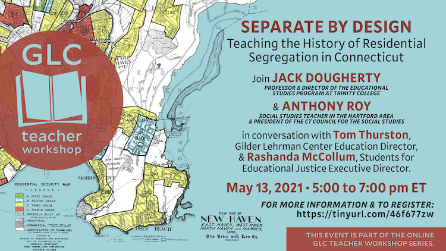

## Teaching Segregation in Connecticut {- #teaching-segregation-ct}

*This chapter was prepared for the "Separate by Design: Teaching the History of Residential Segregation in Connecticut" educator workshop, sponsored by the Gilder Lehrman Center at Yale University, with Anthony Roy, Tom Thurston, Rashanda McCollum, and me on May 13th, 2021.*

(ref:2021-glc-yale-event) Learn more [about this event from the Gilder Lehrman Center at Yale](https://glc.yale.edu/event/separate-design-teaching-history-residential-segregation-connecticut).

```{r 2021-glc-yale-event, out.width=625, fig.cap="(ref:2021-glc-yale-event)"}
 
```

While researching and writing this *On The Line* book-in-progress with undergraduate students at Trinity College, our primary goal has been to make visible the hidden boundary lines that have divided metropolitan Hartford from the past to the present, in order to engage wider audiences with our troubled history and pathways to changing our future. Rather than waiting until the full manuscript is finished, my contributors and I created this open-access book and uploaded chapters as we completed them to make this history more findable and useful. Also, we strived to write introductory-level chapters---since that's where all of us begin---and to offer clear explanations instead of complex jargon. Pictures also play an important role in the book, and we've added interactive maps, charts, and other illustrations to help communicate concepts that can be difficult to grasp with words alone.

The racial and economic segregation we see today did not happen overnight, nor was it caused by nature. The segregated patterns today were created by decisions made by prior generations of elected leaders, real estate interests, and homebuyers. Making sense of how cities and suburbs evolved over time is not simple. But if we really want to dismantle *systemic racism* and related power structures that shape our present-day reality, then we need to understand how these *systems* actually work.

Teaching historical thinking is one part of the solution. In my prior work as a secondary school teacher, I learned the power of posing thoughtful questions---and providing accessible primary sources---to guide students to think like historians. Sam Wineburg and colleagues have created several valuable resources to assist K-12 teachers in this process, which build on the field of inquiry-based learning.^[@wineburgReadingHistorianTeaching2011; @thompsonExaminingEvidenceSeven2014] In our state, Rebecca Fuhrer has led the development of the [TeachItConnecticut](https://teachitct.org) at CT Humanities, a growing collection of inquiry-based lesson plans to help elementary and secondary educators guide students to "think like historians" with Connecticut primary sources. To be clear, more work remains to be done. In particular, we need to fulfill the promise of [CT Public Act 19-12](https://pa1912.serc.co) to include Black and Latino Studies in the public school curriculum. We also need to continually rethink the *mainstream* curriculum, and ways to connect White students and communities with the Connecticut's history of segregation, and how to speaks to all of us.

In this spirit, this chapter suggests ways to pair historical questions and source materials from the *On The Line* book that educators are welcome to freely borrow and adapt for their classrooms. While my current teaching context is at the college level, I've always been impressed by K-12 educators who find creative ways to integrate complex topics into the K-12 curriculum. If you have inquiry-based Connecticut history lesson plans you wish to share with other educators, consider [sharing it with TeachItCT](https://teachitct.org/questions/), or if you teaching ideas that are directly relevant to *On The Line*, please [contact the authors](authors.html).

### Neighborhood Change {-}
Question: How have neighborhoods changed in Connecticut from 1934 to today?

Source: [Map of Neighborhood Change in Connecticut, 1934-present](https://ontheline.github.io/otl-neighborhood-change/index-caption.html).

(ref:1934-otl-neighborhood-change) Explore the [full-screen interactive map](https://ontheline.github.io/otl-neighborhood-change/index-caption.html) of neighborhood change in Connecticut, which displays side-by-side aerial imagery from 1934 to the present for the entire state. Search for an address and zoom into a specific location. Click the "Permalink" button in the bottom-left corner to save a specific view to share with others. For example, view how 1960s interstate highways carved up cities [such as the I-84 exchange in Hartford's Parkville neighborhood](https://ontheline.github.io/otl-neighborhood-change/#zoom=16&lat=41.76123678695253&lng=-72.69959092140199&layer1=magic1934&layer2=esriPresent), or how suburban commercial and residential development altered rural farmland [such as the WestFarms Mall area in West Hartford/Farmington](https://ontheline.github.io/otl-neighborhood-change/#zoom=15&lat=41.72233878762285&lng=-72.7622151374817&layer1=magic1934&layer2=esriPresent). [Open-source map](https://github.com/ontheline/otl-neighborhood-change/) developed by Ilya Ilyankou and Jack Dougherty for [On The Line](https://ontheline.trincoll.edu) at Trinity College, with [MAGIC UConn Libraries](http://magic.lib.uconn.edu).

```{r 1934-otl-neighborhood-change, fig.cap="(ref:1934-otl-neighborhood-change)"}
if(knitr::is_html_output(excludes="markdown")) knitr::include_url("https://ontheline.github.io/otl-neighborhood-change/index.html", height = "500px") else knitr::include_graphics("images/1934-otl-neighborhood-change.png")
```

Activity:  

- Enter your school address. What looks different between then and now? What looks similar?
- Enter your home address. What looks different between then and now? What looks similar?
- Follow the path from your home to school. What differences or similarities do you notice?
- What might have caused the changes you see in the photos?
- What kinds of things can you *not* see in the aerial photos?

Thanks to teacher [Josh Blanchfield](https://twitter.com/JoshBlanchfield) for sharing his ideas and experiences on using the neighborhood change map with his students.

Read more: Connecticut State Library, “Aerial Photographs of Connecticut [1934-present], http://libguides.ctstatelibrary.org/hg/aerialphotos/home.

Teacher Tip: Most *On The Line* maps can be display with or without the explanatory caption by truncating the last portion of the web link. This allows educators to choose which format works best for their students.

- With caption: https://ontheline.github.io/otl-neighborhood-change/index-caption.html
- Without caption: https://ontheline.github.io/otl-neighborhood-change/

### Redlining Neighborhoods {-}
Question: TODO

Source: TODO

Activity: TODO

Read more:

Robert K. Nelson et al., “Mapping Inequality: Redlining in New Deal America,” American Panorama, Digital Scholarship Lab, University of Richmond, 2018, https://dsl.richmond.edu/panorama/redlining/.
