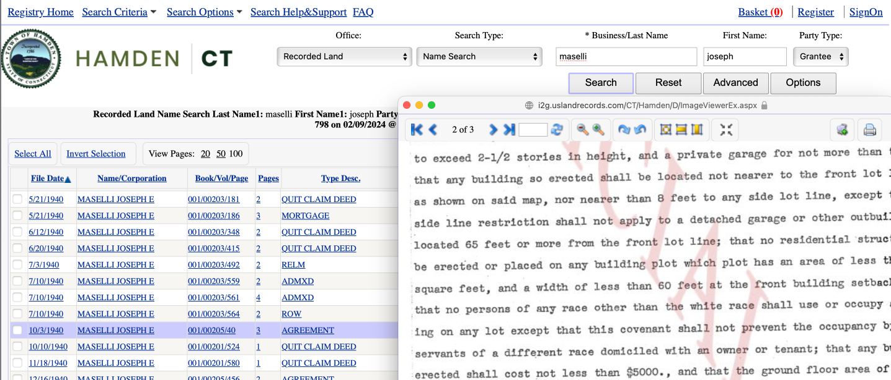
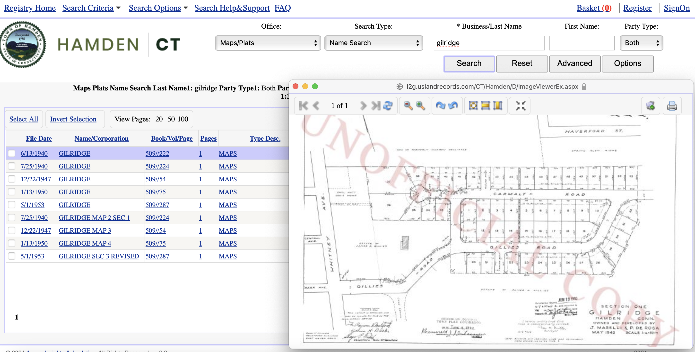
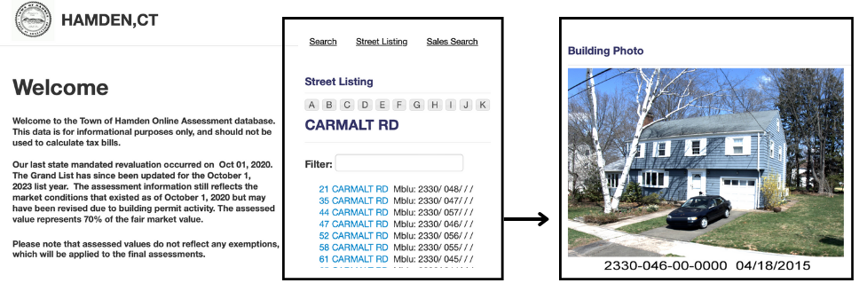
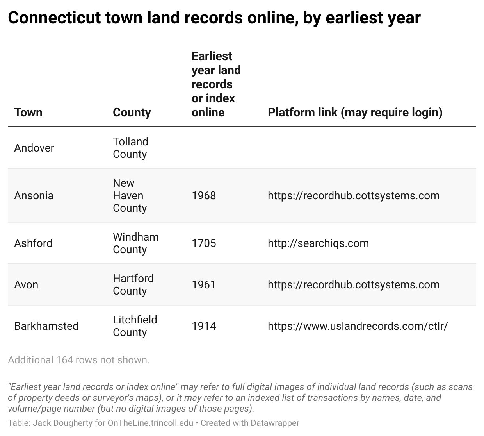

## How We Found Restrictive Covenants {- #covenants}
*by [Katie Campbell Levasseur, David K. Ware, June Gold, and Jack Dougherty](authors.html)*

Our **[Restricting with Racial Covenants](restricting.html) chapter in this book** was inspired by several public history and advocacy projects across the U.S, including several now organized as the [National Covenants Research Coalition](https://www.nationalcovenantsresearchcoalition.com). One of the earliest to launch online was the [Segregated Seattle project](https://depts.washington.edu/civilr/segregated.htm) in 2005, where researchers found White-only and anti-Jewish covenants in tens of thousands of properties across King County and Washington State. Their public history work pushed state legislators to approve a 2006 law to encourage homeowners to strike out racist covenants in the public record, and a 2023 law to provide compensation for victims.^[@NationalCovenantsResearch2022. The earliest digital history project on racial property deeds probably was @plotkinRacialReligiousRestrictive2015, which states that content was posted online prior to 1999. On Seattle and Washington State, see @gregorySegregatedSeattle2006 and @civilrightsandlaborhistoryconsortiumuniversityofwashingtonRacialRestrictiveCovenants2023.]

This chapter outlines different strategies for finding race restrictive covenants in Connecticut. Our methods vary by the type of land records available in each town clerk's office, and our methods also changed over time as more (but not all) documents from the past have gradually been digitized. When possible, we recommend consulting with local experts who have more experience, such as property lawyers and professional title searchers, and to learn from methods advanced by members of the [National Covenants Research Coalition](https://www.nationalcovenantsresearchcoalition.com). We share our experiences to encourage readers to search their own local property records, build public awareness of how racism shaped our communities, act on Connecticut's 2021 legislation for property owners to reject racist covenants, and to advocate for policies that promote justice in housing. **Help us continue the work**: in early 2024 we created the <https://myCTdeed.com> site to build public awareness and simplify the process for current owners to find and reject unlawful covenants from their property.

### From Oral Interviews to Printed Records {-}
One method to finding racial covenants is to start with oral interviews and trace the chain of ownership back through printed property records. When Katie Campbell and Jack Dougherty began searching in West Hartford in 2010, we began with anecdotal accounts by long-term residents that we attempted to confirm in the Town Clerk's property records. But we faced several obstacles. First, the town clerk's land records room contained over 4,000 print volumes of land transaction documents, with partially organized paper indexes but few digitized records at that time. Second, we had no legal training nor experience with title searching, so we read accounts of what other researchers had done elsewhere and tried to apply it to our local context. Third, no one in our small circle of Hartford-area civil rights activists, attorneys, or town officials had ever seen a restrictive covenant in the Hartford region, so we didn't know exactly what to look for or whether we would actually find one. Due to the overwhelming size of the task at that time, we limited our search to property records in West Hartford, the largest suburb bordering the City of Hartford, and did not attempt to look elsewhere.

Tracey Wilson, the West Hartford town historian and history teacher, gave us leads for possible covenants from anecdotal accounts by long-term residents while writing her monthly history column in the *West Hartford Life* periodical. Our most specific lead came from Mary Everett, who described in our history interview how she bought a home at 30 Ledgewood Road around 1970, when her lawyer mentioned that the property included a racially restrictive covenant from the 1940s that was no longer enforceable.^[@everettOralHistoryInterview2011]

Working backwards with property records, we traced the chain of property title ownership by following real estate transactions from the 1970s to the original deed in the 1940s. When conducting our research in 2010, the Town of West Hartford had recently made available a public online property assessment database, which allowed searches by name or address, but with transactions only into the 1970s. Our search for Mary Everett (or her spouse, Ronald) pointed us to a 1970 warranty deed in book 474, page 185, available only in print volumes in the property records room. This 1970 deed referred to the printed book and page numbers for prior transactions. By tracing the trail backwards in time, we finally found the original 1940 deed for the High Ledge Homes subdivision, which included this race restriction: "No persons of any race except the white race shall use or occupy any building on any lot except that this covenant shall not prevent occupancy by domestic servants of a different race employed by an owner or tenant." Also, the entire High Ledge Homes subdivision appeared on a wall map in the property room, which referenced a 1938 subdivision surveyor's map number 222, stored separately on microfilm in the town clerk's office. By matching up past and present maps, we geographically confirmed that 30 Ledgewood Road was constructed on building lot #78, one of the 84 parcels of land specifically restricted by the racial covenant in the original 1940 subdivision deed, described in the video in Figure \@ref(fig:2011-covenants-video).^[@campbellHowWeFound2011; @highledgehomesinc.AgreementConcerningBuilding1940]

(ref:2011-covenants-video) In this [2011 video](https://player.vimeo.com/video/220562166), Katie Campbell Levasseur describes how we traced restrictive covenants in paper property records in the Town of West Hartford town clerk's office.

```{r 2011-covenants-video, fig.cap="(ref:2011-covenants-video)"}
if(knitr::is_html_output(excludes="markdown")) knitr::include_url("https://player.vimeo.com/video/220562166") else knitr::include_graphics("images/2011-covenants-video.png")
```

We also tried to widen our search by skimming paper indexes of real estate transactions in the Town of West Hartford's property records room. For example, a print volume called the *Grantor Index Corporate Pages* listed transactions by grantor (seller) to grantee (buyer) in partially alphabetical order by years during the racial covenant period (roughly 1920s through 1940s). The "Corporate" element of this title held some promise that we might find deeds where the developer was doing business as a corporation, rather than an individual. We searched for listings labeled as "agreements" and inspected those by volume and page to see if the deed between parties included any restrictions. Using this approach, we identified about 200 documents listed as "agreements," and among those we found 22 "agreements" that included some type of restriction, all between 1933 and 1949. (We determined that before 1933, searching for "agreements" was not a productive way to look for restrictions, because we found restrictions in deeds that were not listed as "agreements.") As a result, we found two types of restrictions in the records between 1915 and 1950, which we labeled *value* and *race*. Value restrictions were more common than race restrictions. Value restrictions typically stated that the owner could not build a home below a certain square footage, or below a minimum price (such as $5,000 in the 1920s), in an effort to maintain higher property values. But race restrictions stated that the land could not be occupied by non-White people, except for domestic servants. In some cases, deeds or agreements combined the two types. In either case, individuals or developers used these restrictions to control the social class and/or racial composition of a neighborhood, and its relative price in the minds of prospective wealthy White buyers.

Looking back, over the past decade the partial digitization of West Hartford records makes the job somewhat easier today, but still requires searching print volumes to reliably trace sales back into the 1940s. First, the [Town of West Hartford Online Assessment Database](https://gis.vgsi.com/westhartfordct/Default.aspx) offers name and address search, but ownership history is currently incomplete prior to the 1970s. Second, the [Town of West Hartford Land Records portal](https://www.westhartfordct.gov/town-departments/townl-clerk/land-records) offers search by name, date, and book-page number (not consistently by address or parcel number), but many document images are still not available online, and lands records are incomplete prior to 1963. Third, even if West Hartford's Land Records portal included document images for the 1940s, the tool currently lacks full-text search for keywords related to restrictive covenants, such as "the white race." Searching by paper is still necessary for land records in this town at this point in time.

In sum, while our 2010 study of West Hartford was not exhaustive, we located race restrictive covenants in 5 subdivisions that included about 190 parcels of land in the early 1940s. We estimate about 6 percent of West Hartford homes built during this period had restrictive covenants, given around 3,020 buildings were constructed in town during the 1940s. We count the entire decade because developers did not successfully sell homes on every parcel during the Depression and World War. In 2012 we placed scanned PDFs of all historical documents and digitized subdivision boundaries in an interactive Google Map, hosted by the University of Connecticut Libraries Map and Geographic Information Center. In 2017, we migrated historical documents and geodata into our [GitHub public repository](https://github.com/ontheline/otl-covenants/) and displayed them in our [open-source Leaflet map](https://ontheline.github.io/otl-covenants/index-caption.html).^[See table calculations, historical documents, and map code in @ilyankouMapRaceRestrictive2017]

Starting with anecdotal accounts of restrictive covenants produced mixed results, which perhaps tells us something about *historical memory* and how people believe they remember the past. Both during and a decade after our research, we heard some White West Hartford residents describe their memories of anti-Jewish or anti-Catholic restrictive covenants on their homes, yet still have not found documents supporting claims about their specific properties, nor any religious-based covenants in West Hartford as of this writing. How do we explain this difference between historical memory versus documents? One interpretation is that homeowners might be confusing different tools of housing segregation. Rather than a formal restrictive covenant (which would appear in the land records), perhaps Jewish or Catholic homebuyers were excluded by: (a) a neighborhood association agreement (which might exist on paper, but which might not filed as a property record with the town government), or (b) perhaps more likely, by the real estate agents who collectively or individually refused to show property to outsiders (which may have been openly discussed, but not documented on paper).^[For more anecdotal accounts of anti-Jewish and anti-Catholic covenants that we could not confirm with documents, see @wilsonTakingStockHigh2010. Wilson wrote: "By word of mouth I had heard that in the 1930s and 1940s and into the 1950s, no Roman Catholics could live on Stoner Drive, the first street developed on 'the mountain.' No Catholics could buy on Wood Pond or Sunset Farms. According to another resident, the address of a house on the corner of Foxcroft Road and Fern Street was changed to Fern Street because no Jews were allowed on Foxcroft Road." But we could not find property records to confirm any of those 2010 claims.]

### Search Full-Text Historical Newspapers {-}
Another strategy to locate racial covenants is to search for keywords in full-text historical newspaper databases, which may lead to news stories or real estate ads with clues to trace back in the property records. For example, in our 2010 research for racial covenants in West Hartford, we searched the full-text *Hartford Courant* historical newspaper, at that time a newer 2005-era technology available through our Trinity College library subscription to the ProQuest database, and now more widely available through the [ResearchIT CT portal](https://researchitct.org) with any Connecticut public library card. By searching for "restrictive" and "covenant" and related terms, we found 1947 news accounts about Simon Bernstein, a Hartford lawyer and Democratic city council member, who wrote a public letter asking the state legislative Judiciary Committee to invalidate race- and religious-restrictive covenants. The *Hartford Courant*, a White-run daily newspaper, ran a short excerpt of Bernstein's letter, which mentioned an unnamed nearby town where a property deed restricted its sale "to only non-semitic members of the Caucasian race." Later our search of Library of Congress historical newspapers led us to the *Hartford Chronicle*, a Black-owned weekly newspaper, which published Bernstein's full letter. Six decades after Bernstein wrote his letter, we were very fortunate to conduct an oral history interview with him at age 98. He clearly recalled a different racial covenant case he was involved in as an attorney, regarding the Mountain Road area of West Hartford, which was settled out of court. But without sufficient details, we never found any documentation about either covenant seen by Bernstein.^[Compare the excerpt versus the full letter in @BernsteinSeeksEnd1947; @bernsteinLetterEditor1947, and see also @bernsteinOralHistoryInterview2011. *Hartford Courant* historical newspaper searches are now publicly available through @connecticutstatelibraryResearchITCT. Learn more about @HartfordChronicle1940 and related newspapers, publicly available through @uslibraryofcongressChroniclingAmericaHistoric]

More recently, we have had more success searching for clues about restrictive covenants in newspaper real estate ads from the early 20th century across Connecticut. Purchasing an individual subscription on the [Newspapers.com](https://www.newspapers.com/) platform allowed us to do full-text searching of multiple newspapers across the entire state, though many papers still have not yet been digitized. For example, by searching for key phrases --- such as "wisely restricted" or "reasonable..." or "sensible..." or "proper restrictions" --- we found several Connecticut real estate advertisements that openly publicized euphemistic prohibitions, as shown in Figure \@ref(fig:2024-newspapers-search). These code words sometimes led us directly to anti-Black and anti-Jewish prohibitions in the town land records. Another advantage of searching the Newspapers.com database is its wider inclusion of *Hartford Courant* local and regional editions for suburban and rural towns, compared to the ProQuest database that sometimes includes only the city edition.^[@ancestry.comNewspapersCom]

(ref:2024-newspapers-search) Screenshot of search for "wisely restricted" coded phrase in Newspapers.com database.

```{r 2024-newspapers-search, fig.cap="(ref:2024-newspapers-search)"}
 knitr::include_graphics("images/2024-newspapers-search.png")
```

### Search Subdivision Maps {-}
Another strategy to locate restrictive covenants in Connecticut focuses on how housing developers converted large landholdings into subdivisions for individual homes, and the maps they created in that process. When retired attorney David Ware searched for racial covenants in suburban Manchester in 2020, he went to the Town Clerk's office and began looking at surveyor's subdivision maps, submitted by developers for town approval from the 1910s through the 1950s. Depending on the town, original paper subdivision maps may be stored in large flat drawers, or they may have been microfilmed or digitized into an online database. Typically, these maps identify the seller of the property, the person or corporation subdividing it into smaller lots for home sales, perhaps a name they gave to the development, and the year, as shown in Figure \@ref(fig:1940-manchester-greenway-map).^[See 1940 Greenway Park map from Town of Manchester CT property records, in @ilyankouMapRaceRestrictive2017]

(ref:1940-manchester-greenway-map) 1940 surveyor's map of Greenway Park housing development, submitted by Greenway Incorporated and approved by the Town of Manchester, Connecticut.

```{r 1940-manchester-greenway-map, fig.cap="(ref:1940-manchester-greenway-map)"}
 knitr::include_graphics("images/1940-manchester-greenway-map.png")
```

In Manchester during the early 1940s, Ware found that developers of larger housing subdivisions, meaning 30 or more residential lots, were more likely to add *uniform restrictions* in property deeds for sales to builders or homeowners to maintain consistency and property values across a neighborhood. A list of uniform restrictions might prohibit shacks, trailers, and nuisances to other neighbors, and it might also include racist covenants. While smaller subdivisions are not necessarily free from racial prohibitions, Ware decided that the more efficient way to identify the greatest number of race-restricted properties was to start with larger subdivisions. The next step is to search by name of the property seller in the "Grantor Index" for the years during and after the creation of the subdivision, and often there are multiple entries for owners or developers selling subdivided lots for individual homes. Grantor Index entries usually include a brief description of the property (such as the development name and lot number), the date, and most importantly, the town clerk's record of the deed by volume (or book) and page number. If the developer added a racial covenant, it will appear (or be referred to, directly or indirectly) in the deed on this volume and page, and subsequent property transfers will refer back to this deed. For large subdivisions, it's wise to check at least two or more individual lot sales to confirm the presence of racial covenants. Based on this research, Ware recommended that Connecticut create a simpler process for current homeowners to renounce racial covenants in their property records. Connecticut's General Assembly and Governor responded in 2021 and unanimously approved Public Act 21-173, as described in the [Restricting chapter](restricting.html) in this book.^[@wareBlackWhiteGreenway2020]

### Search Digitized Property Records {-}
When retired attorney and educator June Gold learned in 2023 about racial covenants in Hamden, a suburb of New Haven, she began investigating property records and free legal services to help current homeowners remove them, as described in the [Restricting chapter](restricting.html) in this book. Searching for covenants became easier when the [Town of Hamden lands records from 1778 to date](https://www.hamden.com/276/Land-Records) were hosted online. The Town Clerk contracted with a private company to digitize and publish their public land records, primarily for attorneys and title searchers working on present-day real estate transactions, but also for historical researchers.^[Hamden land records in @avenuinsightsandanalyticsConnecticutLandRecords, and see other towns in table below.]  

Searching digitized property records has several advantages, but it's important to begin with key constraints. First, while Hamden's online records are robust, there currently is *no full-text search capability*, meaning that ordinary users cannot yet easily search across thousands of scanned property deeds for keywords or phrases found in restrictive covenants, such as "the white race" or "non-semitic" persons. (But land record digitization services most likely have the technology to enable full-text searches, as described further below.) Second, digitized property records are typically organized to search by names of sellers and buyers (grantors and grantees), date, and volume and page number---but typically not by street address (or parcel number) for more than five decades ago. So searching for racial covenants still requires hunting backwards in time, from the current owner to prior owners, and skimming pages of original property deeds for any restrictions.

When searching Hamden property records online, one strategy is to begin with the name and address of a current homeowner who recalled hearing about a racial covenant in their property deed when they purchased their home and signed closing paperwork with an attorney. Beginning with the buyer's name, you can trace the transfer of ownership---sometimes multiple transactions over time---through volume and page references to the original property agreements with racist prohibitions, as shown in Figure \@ref(fig:2024-hamden-property-name).

(ref:2024-hamden-property-name) Search by name in Town of Hamden online land records, showing a racial covenant in a 1940 property agreement.  

```{r 2024-hamden-property-name, fig.cap="(ref:2024-hamden-property-name)"}
 
```

After locating a racial covenant on one property, another strategy is to trace the paper trail of neighboring homes, especially those located in the same subdivision, since many developer's maps also have been digitized in the town property records, as shown in Figure \@ref(fig:2024-hamden-property-map). For example, after finding the name of one developer with a racial covenant, search that name to check if they created other subdivisions with similar covenants. Sometimes Gold also searches for similar property documents (such as an "agreement" or "warranty deed") in the same or adjacent volumes to where she has already located one racial covenant. In addition, she recommends exploring present-day maps of suburban neighborhoods to identify the geographic outlines of likely subdivisions from the relevant time period.

(ref:2024-hamden-property-map) Search by "Gilridge" development name in the Town of Hamden online land records, showing a 1940 subdivision map of homes with racial covenants.

```{r 2024-hamden-property-map, fig.cap="(ref:2024-hamden-property-map)"}
 
```

Another online tool Gold uses is [Hamden's online property assessment database](https://gis.vgsi.com/hamdenct/) (also called assessor records), primarily created to track current owners and the appraised value of their property for taxation. While online assessor records may only go back a few decades in Connecticut towns, most platforms allow searches by owner name and street address, which helps Gold inform present-day homeowners about racial covenants placed on their home in past. For example, if a 1940s subdivision developer added a racial covenant to all properties on Carmalt Road, the assessment database allows Gold to lookup current owners' names and addresses to contact them about their opportunity to renounce an unlawful covenant, as shown in Figure \@ref(fig:2024-hamden-assessment-data).^[For many municipalities, see @visiongovernmentsolutionsConnecticutAssessorOnline]

(ref:2024-hamden-assessment-data) Search by name or street listing in the Town of Hamden online assessment database, showing current owners of homes with racial covenants.

```{r 2024-hamden-assessment-data, fig.cap="(ref:2024-hamden-assessment-data)"}
 
```

A growing number of Connecticut town governments have digitized some portion of their printed bound volumes of public land records, but details vary widely, as shown in Figure \@ref(fig:datawrapper-land-records-online). Note that "Earliest year land records or index online" may refer to full digital images of individual land records (such as scans of property deeds or surveyor's maps), or it may refer to an indexed list of transactions by names, date, and volume/page number (but no digital images of those pages). Also, while most town governments with online land records make them publicly searchable (often with a free guest login), most require payment to print official copies, and a few towns even require a paid subscription to view online public records. Regardless of the status of a town's digital property records, all printed property records are publicly viewable at the town clerk's office. As of this writing, the major digitization providers with links to Connecticut towns they serve are: [Avenu Analytics & Insights](https://www.uslandrecords.com/ctlr/); [Cott Systems, Inc. RECORDhub](https://recordhub.cottsystems.com) and [its older Town Clerk Portal](https://connecticut-townclerks-records.com); [SearchIQS](http://searchiqs.com/); and [NewVision Systems](https://webhost01.newvisionsystems.com/officialrecords.aspx) (with no public list of links to town databases).^[Table of CT land records online in @ilyankouMapRaceRestrictive2017; @avenuinsightsandanalyticsConnecticutLandRecords; @cottsystemsinc.RECORDhubLandRecords; @cottsystemsinc.ConnecticutTownClerks; @searchiqsCTLandRecords; @newvisionsystemsinc.OfficialRecords. See also @caticConnecticutTownLand]

(ref:datawrapper-land-records-online) [Search the interactive table](https://www.datawrapper.de/_/gMG9N/) and view [data sources](https://docs.google.com/spreadsheets/d/1t6UFa-y7HmiulmLxydlfXevpquFRF5JZD7OsBxdq0R4/edit#gid=0)

```{r datawrapper-land-records-online, fig.cap="(ref:datawrapper-land-records-online)"}
if(knitr::is_html_output(excludes="markdown")) knitr::include_url("https://datawrapper.dwcdn.net/gMG9N/", height = "551px") else 
```

Although Connecticut town clerks did not digitize property records with restrictive covenants in mind, these online resources offer a valuable opportunity for historical researchers and fair housing advocates. The four major digitization services scanned images of property records, which are public documents, and some of them contain evidence of unlawful covenants created decades ago. Even if the town clerk or the digitization service does not currently offer full-text searches of these scanned images, the technology exists to run optical character recognition (OCR) searches for key phrases such as "the white race" or "non-semitic" persons. Furthermore, the National Covenant Research Coalition observes, "If you have a committed group and are willing to negotiate with [local government] officials, you may be able to get access to the whole database." We believe it is in Connecticut's public interest to reveal our history of racism in order to make a better future together.^[See "What is a Covenant" in @NationalCovenantsResearch2022]

*[About the authors:](authors.html) Katie Campbell Levasseur (Trinity 2011) co-authored the West Hartford portion, David K. Ware co-authored the Manchester portion, and June Gold co-authored the Hamden portion, all in collaboration with Jack Dougherty.*
