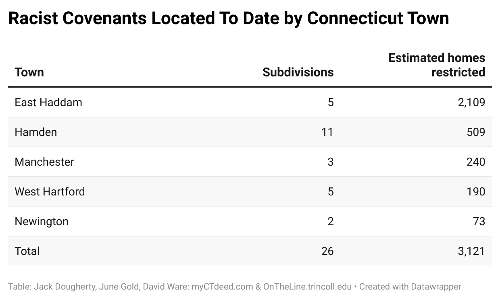

## Shifting Tools of Educational Exclusion: Racist Covenants, Residential Zoning, and Selling Public Schools in Private Housing Markets {- #hes2025}

*by [Jack Dougherty](authors.html)*

*Conference paper, Comparative Histories of Housing, Schooling, and Inequality panel, History of Education Society annual meeting, Providence, RI, November 8, 2025*

Why do we care about the relationship between schooling and housing? Because in the metropolitan United States, where you live has increasingly shaped your educational opportunities over time, and in turn, your educational attainment has increasingly shaped where you can afford to live. In recent decades, a growing number of historians and I have underscored this mutually-reinforcing relationship between public education access and private housing markets. While my work has focused primarily on how the schooling-housing relationship shaped city-suburban inequality in one region -- metropolitan Hartford, Connecticut -- during the twentieth century, my goal today is to broaden my analysis by offering a comparative lens to show how these historical processes have varied over time and across different regions across northern, central, and western areas of the US.

As part of my larger (and still-not-finished!) book project, this paper focuses on the evolution of three policy tools used by local and state governments to protect the educational privileges of White upper-class families and distance themselves from Black, Brown, and working-class families during the twentieth century. These three policy tools are:

- 1) Racist covenants in property deeds that restricted residency to Whites only, and were enforced by government from the 1920s-50s;

- 2) Exclusionary zoning ordinances with minimum-size land requirements that favor higher-price single-family home construction, again with government enforcement, from the 1920s to the present;

- 3) Statewide standardized school testing, where government and business publication of public school scores enabled real estate firms to market private homes and promote homebuyer "shopping for schools" without violating federal fair housing laws that prohibit what agents can say about the social composition of neighborhoods, from the mid-1980s to the present. (Since I have previously published works on the third tool, today I'll focus primarily on new work about the first and second tools.)

All three tools illustrate how the actions of government policymakers, real estate interests, and homeowners can promote exclusion and protect privilege. To be clear, there are many other tools of exclusion and privilege at work -- such as public housing segregation and federal mortgage lending policies -- that I do not cover here, but are addressed in the larger book. But today my thesis is that when we look historically at this particular three-tool series, we see how explicitly racist barriers (such as overtly anti-Black prohibitions in property deeds) shifted over time to more sophisticated hurdles (such as minimum land-size zoning requirements, and marketing public schools to raise private home prices). Furthermore, by comparing how the frequency and implementation of these tools varied across Connecticut and other US metropolitan regions, we begin to see broader patterns about power, place, and time.

#### 1) Racist Covenants {-}
*Note: This section summarizes a [longer book chapter](restricting.html) written with several co-authors: [Tracey Wilson, Vianna Iorio, David K. Ware, June Gold, and Jack Dougherty](authors.html).*

> No persons of any race except the white race shall use or occupy any building on any lot except that this covenant shall not prevent occupancy by domestic servants of a different race employed by an owner or tenant.  
> -- High Ledge Homes on South Main Street, West Hartford, Connecticut, 1940.^[@highledgehomesinc.AgreementConcerningBuilding1940]   

To some readers, this shockingly racist language might seem like a long-ago segregation policy from the Deep South. Instead, these words appear in official government land records in what some call the Deep North, and represents a hidden chapter in White suburban history that needs to be revealed and reckoned with today. Overall, the historical legacy of racist covenants remains with us in two ways. On a tangible level, White homebuyers who purchased covenant-protected property gained financial benefits---meaning higher home values in legally-guaranteed all-White neighborhoods---that they passed forward as inheritances to future family members. On a systemic level, uncovering the hidden history of racist covenants in the Deep North reminds us how Connecticut's suburbs were shaped not simply by individual actions or market forces, but more broadly by government-supported White supremacy.

When buyers and sellers of real estate agree on a contract, they usually sign a property deed or legal agreement to document the sale, and may decide to include a *covenant* to limit how the land may be used. For example, a seller might insert a covenant that forbids opening a business on property intended only for residential homes, in addition to any local laws or zoning ordinances governing land use. Beginning in the 1920s across the U.S., real estate developers, homeowners' associations, and private owners commonly added *race restrictive covenants* like the one cited above to prohibit people outside of "the white race" from owning, using, or residing on property, with some exceptions for domestic servants. When property sellers file a deed with their local government, the town or county clerk records the transfer into the official land records, where any covenants become legally binding on future owners. For example, if property includes a racial covenant, a White resident with legal standing could bring a lawsuit to court to enforce the legal agreement and block a sale to a Black homebuyer. In this way, covenants became larger than the actions of racist individuals by growing into another form of government-supported housing segregation. After activists opposed racial covenants, the U.S. Supreme Court eventually ruled them to be unenforceable in 1948, and the federal Fair Housing Act of 1968 made them unlawful. Yet some local governments continued to accept and file racial covenants until courts stopped this practice in 1972. Even today, decades after the law changed, perhaps a million racial covenants still exist on the books in local government land record offices across the nation, while a newer generation of activists have made it easier for current homeowners to find and reject them.^[For an introduction to different types of restrictive covenants, see Examples in @NationalCovenantsResearch2022]

So far we have found state-sponsored racist restrictions in the public land records in only 10 of Connecticut's 169 individual towns, but located over 2,000 racial covenants that real estate developers placed on suburban homes and lakefront cottages from the 1930s to the 1950s, as shown in Figure \@ref(fig:1940-otl-covenants3).^[See historical sources and tables in @ilyankouMapRaceRestrictive2017. Our current map is based on an earlier version, @universityofconnecticutlibrariesmapandgeographicinformationcenterRaceRestrictiveCovenants2012. See also @wareBlackWhiteGreenway2020, @goldDoesMyConnecticut2024]

(ref:1940-otl-covenants3) Click links or polygons in the [full-screen interactive map](https://ontheline.github.io/otl-covenants/index-caption.html) to view Connecticut neighborhoods where most or all properties include racist covenants by housing developers to prohibit occupants "other than the white race." Although the US Supreme Court declared racial covenants unenforceable in 1948, and the federal Fair Housing Act of 1968 made them unlawful, only in 2021 did Connecticut pass a law to make it easier for current owners to reject this language in official town land records. If you know of similar covenants with racial or religious restrictions anywhere in Connecticut, [contact the authors](authors.html). Research by June Gold, David Ware, Katie Campbell Levasseur, and Jack Dougherty. View [historical sources and the code](https://github.com/OnTheLine/otl-covenants) for this map, developed by Ilya Ilyankou and Jack Dougherty, based on an earlier version created with UConn MAGIC.

```{r 1940-otl-covenants3, fig.cap="(ref:1940-otl-covenants3)"}
if(knitr::is_html_output(excludes="markdown")) knitr::include_url("https://ontheline.github.io/otl-covenants/", height="500px") else knitr::include_graphics("images/1940-otl-covenants.png")
```
My colleagues and I also created a public outreach site <https://myCTdeed.com> to educate broader audiences and show how new state laws passed in 2021 make it easier for homeowners to officially renounce these racist barriers from their property deeds, without erasing them from the historical record.

Of the 2,000 homes with White-only property deeds we have found across 10 Connecticut towns, the concentration varies widely, as shown in Figure \@ref(fig:datawrapper-covenants-by-town2). In the Hartford suburb of Manchester, only 3.5 percent (248 out of approximately 7,100) of residential building lots approved by town officials between 1910-1950 included racial covenants. Also in nearby West Hartford, only 6 percent (190 out of approximately 3020) of buildings constructed during the 1940s had racial covenants. Yet in the suburb of Hamden, just north of New Haven, 23 percent (521 out of 2297) of homes built during the 1940s included racial covenants. More research remains to be done to uncover more of Connecticut's past.^[See table calculations in @ilyankouMapRaceRestrictive2017. Manchester data from @wareBlackWhiteGreenway2020, p. 15]

(ref:datawrapper-covenants-by-town2) [View the table](https://www.datawrapper.de/_/dCnch/) and [calculations](https://github.com/OnTheLine/otl-covenants), by Jack Dougherty, June Gold, and David Ware.

```{r datawrapper-covenants-by-town2, fig.cap="(ref:datawrapper-covenants-by-town2)"}
if(knitr::is_html_output(excludes="markdown")) knitr::include_url("https://datawrapper.dwcdn.net/dCnch/", height="400px") else 
```

Compared to Connecticut, racist covenants were *more* common in other US metropolitan regions such as Seattle, Minneapolis, Chicago, and St. Louis, with White-only restrictions ranging up to 80 percent of all homes in this period, according to preliminary reports compiled by the  [National Covenants Research Coalition](https://www.nationalcovenantsresearchcoalition.com), including those shown in Figure \@ref(fig:2024-restrictive-cities2). One of the earliest public history projects to launch online was the [Segregated Seattle project](https://depts.washington.edu/civilr/segregated.htm) in 2005, where researchers have found White-only and anti-Jewish clauses in over 30,000 property deeds in King County to date, plus 20,000 more in other counties in Washington state. Their work pushed state legislators to approve a 2006 law to encourage homeowners to strike out racist covenants in the public record, and a 2023 law to provide compensation for victims. In the Minneapolis-St. Paul region, the [Mapping Prejudice project](https://mappingprejudice.umn.edu) began to document restrictive covenants in 2016 and has found over 30,000 restrictive property deeds to date. Researchers showed that current prices of Minnesota homes with racial covenants are 4 to 15 percent higher than identical homes without covenants. The [Chicago Covenants project](https://www.chicagocovenants.com/) has already found over 100,000 properties with restrictive covenants, after searching about 20 percent of the city's land records, and expects to find more as estimates of White-only property restrictions in that city range from 50 to 80 percent. In St. Louis, Missouri, the [Dividing The City project](https://dsps.lib.uiowa.edu/thedividedcity/) found racial restrictions in about 80 percent of homes built in St. Louis County by 1950, for a total of about 100,000 parcels in the city and county combined.^[See more projects by members of the @NationalCovenantsResearch2022. The earliest digital history project on racial property deeds probably was @plotkinRacialReligiousRestrictive2015, which states that content was posted online prior to 1999. On Seattle and Washington State, see @gregorySegregatedSeattle2006 and @civilrightsandlaborhistoryconsortiumuniversityofwashingtonRacialRestrictiveCovenants2023. On Minnesota, see @universityofminnesotalibrariesMappingPrejudice2020 and @soodLongShadowRacial2019. On the Chicago 80 percent estimate, see @winlingChicagoCovenants2021 and analysis by @weaverNegroGhetto1967, p. 213 and chapter 13. On the St. Louis 80 percent estimate, see @gordonDividingCityRaceRestrictive2022 and @ruff80StLouis2022.]

(ref:2024-restrictive-cities2) Restrictive covenants were more common in other US cities. Explore digital history projects with images from [Seattle](https://depts.washington.edu/civilr/covenants.htm), [Minneapolis](https://mappingprejudice.umn.edu/racial-covenants/), [Chicago](https://www.chicagocovenants.com), [St. Louis](https://dsps.lib.uiowa.edu/thedividedcity/), and more by the [National Covenants Research Coalition](https://www.nationalcovenantsresearchcoalition.com).

```{r 2024-restrictive-cities2, fig.cap="(ref:2024-restrictive-cities2)"}
 knitr::include_graphics("images/2024-restrictive-cities.png")
```

#### 2) Exclusionary Zoning {-}
*Note: This section summarizes a [longer chapter in the book](bringing-zoning.html)*

While explicitly racist restrictive covenants emerged in several Connecticut towns to varying degrees from the 1920s to the 1950s, state and local governments widely embraced a more sophisticated and less overtly racist tool during the same period, which we now call exclusionary zoning. Inspired by zoning proponents in New York and other cities, Connecticut suburban town leaders successfully pushed their state legislators for the right to create local zoning ordinances in the mid-1920s. Suburban leaders hired urban experts to design minimum-land rules to ensure that only single-family homes for middle- and upper-class families would be built in their fast-growing suburbs, with regulations making it “uneconomic” to build two- and three-family homes and apartment buildings that would attract lower-income families they deemed as undesirable. Since local zoning laws embodied “planning” but did not overtly mention “race,” they were widely adopted and grew extensively across the state during the post-war era, and remain largely intact today as Connecticut’s most durable exclusionary policy tool.

Across the US, when local governments began to adopt zoning laws during the 1910s, state and federal courts were still sorting out what types of restrictions they would permit. Traditionally, US law had been established to defend individual property owners and courts were reluctant to infringe on their rights in the free market. In this context, some cities defended their zoning policies on the grounds that local governments had a responsibility to exert some authority over the real estate market to protect the interests of their residents. For example, New York City's 1916 zoning code separated industrial and residential land for health reasons, and limited the height of skyscrapers to ensure that air and sunlight reached people in smaller buildings nearby. Zoning advocates carefully justified New York City's right to exercise limited "police powers" over land use in order to protect the "public health, safety, order, and general welfare" of its residents. The courts gradually seemed to accept this rationale.^[@whittenBuildingZonePlan1917, p. 334; @wolfZoningAmericaEuclid2008]

But when the West Hartford became the first Connecticut town to enact local zoning ordinances in 1924, their scope clearly went beyond the realm of public health and community welfare by emphasizing exclusionary policies. West Hartford town leaders began to lobby their state legislators to grant them the power to enact local zoning laws a year earlier, when they failed to find any legal justification to stop a Hartford Jewish immigrant named Jacob Goldberg from building a small grocery store in what had previously been a predominantly Protestant neighborhood, but where Jewish families were beginning to congregate in two- and three-family homes.

<!-- TODO: TWO IMAGES HERE: Goldberg's grocery store and town leader pushing for zoning -->

West Hartford town leaders embraced the new concept of zoning laws to give them more control over property development in their rapidly-growing suburb, specifically the kinds of people who would live there. They hired a nationally-known zoning consultant, Robert Harvey Whitten, who clearly understood how to segregate residents through zoning laws. A year earlier in 1922, Atlanta city leaders hired Whitten to design racially-segregated zoning in his *[Atlanta Zone Plan](https://www.google.com/books/edition/The_Atlanta_Zone_Plan/MmNAAQAAMAAJ)*, which proposed to divide the city into "white", "colored", and "undetermined" districts, despite the US Supreme Court's 1917 *Buchanan* prohibition against an explicitly racial zoning policy.^[@whittenAtlantaZonePlan1922, p. 10; @silverRacialOriginsZoning1997; @rothsteinColorLawForgotten2017, pp. 46-53]

Instead of explicit *racial segregation* like Atlanta, Whitten crafted the 1924 *[West Hartford Zoning report](https://www.google.com/books/edition/West_Hartford_Zoning/bdKsAAAAMAAJ)* to divide this northern White suburb into five *economically segregated* residential areas---A, B, C, D, and E---based on new rules that required a minimum amount of land per family to construct housing, as shown in Table \@ref(tab:1924-zone2). The most exclusive A zones were designated for upper-income single-family homes because they required at least 9,000 square feet of land (1/5 of an acre) per family. At the opposite end were the C, D, and E zones, set aside for more affordable multi-family duplexes, triples, and apartments, where the rules required significantly less land per family. Additional rules also increased the amount of land needed to build in more exclusive areas: A-zone homes could occupy no more than 30 percent of the property lot, and also must be 60 feet wide on the street-facing side in order to spread them further apart. While these 1920s rules may seem modest by today's standards, Whitten recommended *nearly twice* the amount of land per family in West Hartford's most exclusive zone compared to similar zones in Cleveland and Atlanta. Connecticut's suburbs offered more space for large-lot zoning requirements.^[@whittenWestHartfordZoning1924, pp. 10, 13. Whitten recommended a minimum of 5,000 square feet of land per family in A-1 zones in Cleveland and Atlanta, @whittenClevelandZonePlan1921, p. 12; @whittenAtlantaZonePlan1922, p. 13]

Table: (\#tab:1924-zone2) Minimum Land Required Per Family in West Hartford Zoning, 1924

| Zone | Intended use | Min. land per family | Land cost per family | Scale diagram |
|:-----|:-------------|--------------:|------------:| ---------------------------:|
| A    | 1-fam home   |  9,000 sq ft  |  \$\$\$\$\$ |  |
| B    | 1-fam home   |  6,000 sq ft  |    \$\$\$\$ |  |
| C    | 2-fam duplex |  3,000 sq ft  |      \$\$\$ |  |
| D    | 3-fam triple |  1,500 sq ft  |        \$\$ |  |
| E    | apartments   |    750 sq ft  |          \$ |  |

*Each zone set a minimum land requirement per family, shown in green, which intentionally made it "uneconomic" to build affordable multi-family housing in the A and B areas. Icons by [Georgiana Ionescu](https://thenounproject.com/georgiana.ionescu/collection/real-estate-outline/).*
<!-- Design notes: https://docs.google.com/spreadsheets/d/1g58ZaR1lsfr1s5mdvZFru6DAJFnA9jNwDVlrxaQ0rbA/edit#gid=0
Graphics from https://www.figma.com/file/7JitgyYxiT3xR3fyoZttKb/otl-zoning-graphics
Export at 4x resolution, then reduce size 25% to return to original dimensions -->

Overall, West Hartford's 1924 zoning formula relied on minimum-land rules to create separate neighborhoods for expensive single-family homes and affordable multi-family homes, and to physically distance these residents from each other. Whitten's report bluntly stated its objectives. Zoning policy would make it "uneconomic to build two-family houses" in A and B areas because real estate developers needed to buy *twice* as much land compared to the amount needed for a single-family home, as shown in Figure \@ref(fig:1924-whitten-highlight-10b). Given the same land costs, developers would generate more profits by building and selling two single-family homes, rather than one two-family home. While "three-family houses and apartment houses are not prohibited in the A, B, or C area districts," Whitten clarified, his zoning laws would influence the marketplace by removing incentives to build mixed-income housing. In short, the new rules rewarded developers who built economically exclusionary neighborhoods.^[@whittenWestHartfordZoning1924, p. 10.]

(ref:1924-whitten-highlight-10b) Whitten's zoning plan for West Hartford demonstrated how local governments could create minimum-land rules that made it "uneconomic" for private real estate developers to build multi-family housing in areas designated for single-family homes, thereby creating powerful incentives for exclusion. Source: *[West Hartford Zoning](https://www.google.com/books/edition/West_Hartford_Zoning/bdKsAAAAMAAJ)*, 1924, hosted by Google Books.

```{r 1924-whitten-highlight-10b, fig.cap="(ref:1924-whitten-highlight-10b)"}
 knitr::include_graphics("images/1924-whitten-highlight-10.png")
```

Exclusionary zoning was designed to sharply reduce the amount of multi-family housing that developers would build. Although West Hartford's zoning plan did not prohibit multi-family housing, it pushed lower-income families into lower-rated C, D, and E areas---the only zones where duplexes, triples, and apartments could be constructed economically---which sharply limited the supply of affordable housing in the suburb. Whitten's 1924 report cautioned readers about multi-family housing taking over suburban space that, in his view, should be reserved for single-family homes. It featured photographs with captions warning that "large apartment houses are spreading farther west along Farmington Avenue and into side streets," the same areas as the Goldberg grocery store controversy the prior year, as shown in Figure \@ref(fig:1924-whitten-apartments-p17-16b). Through minimum-land rules, Whitten promised that "crowded tenement house conditions [that] exist in many larger communities," such as the city of Hartford, "will be effectively prevented in West Hartford." It's unclear whether Whitten knew that one of the buildings pictured in his report was The Packard, originally designed by Jewish builders in 1917 to become upscale apartments, though it was not a financial success when it finally opened in 1922. In any case, Whitten's words and images were intended to stir up anxieties among suburban homeowners about multi-family urban tenements and their "undesirable" occupants.^[@whittenWestHartfordZoning1924, pp. 10, 12, 16, 17. Thanks to Mary Donohue for her research on The Packard, an upscale apartment building originally designed in 1917 by Jewish architect Harry Beckanstin, on land purchased by Barnet Sharfman and his partners, which was resold several times. @donohueWestHartfordHouse2018; @WestHartfordAsk1917; @HartfordLargestApartment1919; @PackardApartmentsSold1923; @routhierBankForecloseVintage1992]

(ref:1924-whitten-apartments-p17-16b) The 1924 *West Hartford Zoning* report warned that "large apartment houses are spreading farther west along Farmington Avenue" from the city into the suburb, where town leaders and their zoning experts believed single-family homes belonged. On the right side is The Packard, originally designed by Jewish builders to become upscale apartments.

```{r 1924-whitten-apartments-p17-16b, fig.cap="(ref:1924-whitten-apartments-p17-16b)"}
 knitr::include_graphics("images/1924-whitten-apartments-p17-16.png")
```

The true power of zoning was revealed in Whitten's 1924 map and its vision for future real estate development in West Hartford. The policy envisioned that most property would become single-family housing, as shown in the darker green shades on top of the original black-and-white map in Figure \@ref(fig:1924-otl-zoning-west-hartford2). Zoning assigned more than 80 percent of West Hartford property to zones A and B combined, the most exclusive areas that required the highest minimum amount of land per family, as shown in Table \@ref(tab:1924-zone-land). Furthermore, the vast majority of the town's undeveloped property (to the north and the west) was labeled zones A and B, which Whitten's report acknowledged "would assume a single-family development through this entire area" if no changes were made in years to come. By contrast, less than 20 percent of West Hartford's property was intended for multi-family housing in C, D, and E zones. Moreover, much of the C and D areas were assigned to the town's southeast corner, which Whitten's zoning plan also designated as the industrial area (shown in dark cross-hatch on the original map), making housing less desirable. Apartment buildings were only intended for the thin strip of E zone on Farmington Avenue from the Hartford border to West Hartford Center. Finally, C, D, and E zones had already been mostly developed, which limited new opportunities for multi-family construction. Overall, the zoning policy guaranteed that West Hartford's future housing would be more expensive and exclusive.^[@whittenTentativeZoningMap1924; @whittenWestHartfordZoning1924, p. 14. See 1924 zoning geodata and land calculations in @ilyankouMapExclusionaryZoning2021. Even with a more refined estimate of land assignment that removes parcels that were or became non-residential (schools, parks, cemeteries, streams, industrial areas, commercial-only areas, etc.), the percentage of A and B property combined is more than 80 percent.]

(ref:1924-otl-zoning-west-hartford2) Explore the [interactive map](https://ontheline.github.io/otl-zoning-west-hartford/index-caption.html). When West Hartford became the first Connecticut municipality to enact zoning in 1924, leaders followed Robert Harvey Whitten's recommendation to divide the town into five residential zones (A to E), shown here in dark-to-light shades of green overlaid on top of the original black-and-white map for clarity. Zone A required at least 9,000 square feet of property per family, and was intended for more expensive single-family homes, while making multi-family housing "uneconomic" to build there. Over 80 percent of the town's land---and nearly all of its undeveloped land to the north and west---was assigned to zones A and B to ensure the dominance of single-family housing across the suburb. Follow zoning maps over time by changing the background layers. Map developed by Ilya Ilyankou (Picturedigits) and Jack Dougherty, with MAGIC UConn Libraries. View [historical sources and code on GitHub](https://github.com/ontheline/otl-zoning-west-hartford).

```{r 1924-otl-zoning-west-hartford2, fig.cap="(ref:1924-otl-zoning-west-hartford2)"}
if(knitr::is_html_output(excludes="markdown")) knitr::include_url("https://ontheline.github.io/otl-zoning-west-hartford/", height = "800px") else knitr::include_graphics("images/1924-otl-zoning-west-hartford.png")
```

Soon after West Hartford's launch of zoning laws, Connecticut passed its second enabling act in 1925, a more comprehensive bill that expanded zoning power to nearly all 169 municipalities across the state.^[@whittenWestHartfordZoning1924, p. 1; @FramingZoningSystem1924; @ZoningPlanWest1924. See seven minor adjustments listed in @ZoningCommissionPlan1924; @VoteSupportZoning1925; Connecticut's 1925 zoning act specifically exempted the city of New Haven. @connecticutgeneralassemblyPublicAct2421925] A year later in its 1926 *Euclid v. Ambler* decision, the US Supreme Court reinforced the power of public officials to control private property development if justified to protect "the public welfare." But the Court also made its views of the danger of multi-family housing on the public very clear. "Very often the apartment house is a mere parasite," the Court wrote, "constructed in order to take advantage of the open spaces and attractive surroundings" created by single-family homes, which are threatened by the growth of multi-family homes. In this way, the Supreme Court ruling justified zoning to primarily protect "the public welfare" of single-family homeowners and their right to physically separate themselves from multi-family rental housing.^[@euclidv.amblerDecision1926; @freundColoredPropertyState2007, pp. 81-87; @rothsteinColorLawForgotten2017, pp. 52-53.]

As Connecticut suburbs like West Hartford largely excluded all but single-family construction during the post-war housing boom of the 1940s and '50s, other suburbs raced to enact exclusionary zoning policies to defend their land from "undesirable" elements. Beginning in 1939, the growth of zoning was loosely tracked by the Connecticut Development Commission, a state agency created to promote economic growth and efficient planning for industry and housing. The Commission published a series of maps to illustrate the rise of local planning and zoning agencies in Connecticut, as shown in Figure \@ref(fig:1946-ctdevcomm-p19b) from its 1944-1946 report. Towns that enacted local zoning policies tended to be clustered in the rapidly-growing suburbs around the state's major cities of Hartford, Bridgeport, and New Haven. By 1957, 77 percent (131 out of 169) of town governments had established some type of planning and/or zoning agency, as shown in Figure \@ref(fig:1957-otl-planning-zoning-ct2). Nearly every town within a 20-mile radius of Hartford---including outlying rural areas far from the city center---enacted some type of land-use agency to exert control over what kind of housing could be built in their community.^[@connecticutdevelopmentcommissionReport1946, p. 19; @connecticutdevelopmentcommissionLegislationPassed19571957; @connecticutdevelopmentcommissionDepartmentEconomicCommunity2019. See historical sources for 1957 map at https://github.com/ontheline/otl-planning-zoning-ct]

(ref:1946-ctdevcomm-p19b) A Connecticut Development Commission employee reviews a 1938 map of local planning and zoning agencies in order to create an updated version in this photo from their 1944-1946 report. Zoning grew most quickly in suburban towns clustered around the major cities of Hartford, Bridgeport, and New Haven.

```{r 1946-ctdevcomm-p19b, out.width=500, fig.cap="(ref:1946-ctdevcomm-p19b)"}
 knitr::include_graphics("images/1946-ctdevcomm-p19.png")
```

(ref:1957-otl-planning-zoning-ct2) Explore the [full-size interactive map](https://ontheline.github.io/otl-planning-zoning-ct/). By 1957, more than 77 percent of town governments had established some type of planning and/or zoning agency, including nearly every town within a 20-mile radius of Hartford, according to the Connecticut Development Commission. View [historical sources and map code](https://github.com/ontheline/otl-planning-zoning-ct/), developed by Jack Dougherty and Ilya Ilyankou.

```{r 1957-otl-planning-zoning-ct2, fig.cap="(ref:1957-otl-planning-zoning-ct2)"}
if(knitr::is_html_output(excludes="markdown")) knitr::include_url("https://ontheline.github.io/otl-planning-zoning-ct/") else knitr::include_graphics("images/1957-otl-planning-zoning-ct.png")
```

Why did zoning expand across Connecticut, and how did the level of exclusivity vary across different communities? One key factor was suburban competition for rising property values. Rising suburban leaders sought to attract upper-income families to purchase homes in their town, which would raise everyone's property values and generate tax revenues, without increasing the percentage cost of public services, such as schools. Until the mid-1970s, Connecticut's public schools were funded almost entirely by local property taxes, with limited contributions from state or federal funds. Suburban towns largely funded their schools independently because colonial-era Connecticut eventually [carved the state into 169 separate local governments](carving.html), rather than county governments that pooled together resources to fund an entire metropolitan region. As a result, the primary goal for most suburban leaders was to increase the combined value of all taxable property, also known as the grand list, meaning the town assessor's official estimate of the value of all homes, businesses, farms, and factories within its borders. Although attracting more homebuyers would increase the population and overall school costs, suburban leaders calculated that the children of upper-income families would be less expensive to educate than those of lower-income families, and economies of scale meant that the percentage of tax revenue spent on schools and other public services would remain stable.

Exclusionary zoning made economic sense for suburban leaders because it effectively limited new home growth to wealthier homebuyers, raised property values for all, and sought to keep overall school costs relatively steady. This dynamic sparked a mid-twentieth-century "zoning race" between rising Connecticut suburbs that increased minimum-land requirements to attract wealthier single-family homeowners, and prohibited affordable multi-family housing to keep out lower-income families. When zoning policies and property values served the interest of suburban homeowners, they were incentivized to vote for local leaders who embraced this exclusive fiscal equation---which also kept out potential opponents---thereby reinforcing in insular cycle of suburban politics.


#### 3) Selling and Shopping for Schools {-}

Prior to the 1950s, schools were relatively weak in attracting middle-class families to the suburbs, but in post-war human capital markets, education became a powerful magnet. Suburban governments, real estate interests, and prospective homebuyers converged to create the practice commonly known today as “shopping for schools.” Agents began to advertise private homes by their location in higher status public school areas. Local school leaders competed for upper-class families by offering curricular extras. State legislators invested in suburban schools, and legitimized school-by-school rankings by publishing standardized test results. Upwardly mobile families with children sought more desirable school attendance areas, and paid higher prices for private homes that included access to this public good.

The rise of suburban schools can be attributed partly to the actions of real estate firms, which promoted selected private suburban homes by marketing their access to more desirable public schools. In West Hartford, as school enrollments grew with the post-war baby boom, a heated controversy arose at a 1954 school board meeting over a proposal to address overcrowding by redistricting neighborhoods to less crowded schools. Parents who objected based their views on the real estate market. "Whenever real estate men sell property, they tell their clients that they are in the Sedgwick, Webster Hill, or Bugbee areas," attendance zones on the newly-constructed western side of town. Superintendent Edmund Thorne responded by blaming real estate agents for creating "social class consciousness" in the suburb, and asked, "Doesn't it boil down to some people thinking there is more prestige to going to one school than another?" But what Thorne perceived as an imaginary distinction was becoming very real for suburban homebuyers.^[@NewSchoolLines1954]

Newspaper advertisements reflect the rise of "branding" marketing by real estate firms during the 1950s and 1960s, as shown in \@ref(fig:1960-branding3).^[@DisplayAdWest1960] My students and I compiled a sample of real estate ads in the *Hartford Courant* Sunday edition from 1920 to 1990. We tabulated the proportion of ads that mentioned a specific school by name, rather than a generic description such as "near school." Compared to other suburbs, West Hartford had the highest proportion of school-specific ads, peaking at 38 percent of all residential ads in the town in 1965. Through marketing, real estate firms sought to increase the dollar value of a private home by signaling its location within what homebuyers perceived as a more desirable public school attendance zone. Simply moving into the suburb of West Hartford was no longer sufficient: success also entailed buying into the "right" neighborhood" to attend a "good" public school.^[@doughertyShoppingSchoolsHow2012]

(ref:1960-branding3) Three West Hartford private real estate ads in 1960, with public schools highlighted in red. Copyrighted by the *Hartford Courant*, reprinted here under Fair Use guidelines.

```{r 1960-branding3, fig.cap="(ref:1960-branding3)"}
 knitr::include_graphics("images/1960-05-01-HC-branding-homes.png")
```

By the late 1980s, real estate firms had discovered how to respond to clients' requests about neighborhood school quality without violating fair housing laws. Rather than voicing their opinions, agents began distributing packets of school data, which became more widely available after Connecticut passed a 1985 law to create standardized student achievement tests (such as the Connecticut Mastery Test (CMT) and the Connecticut Academic Performance Test (CAPT), and subsequent requirements for uniform reporting of district data (the Strategic School Profiles). "Agents get so many questions from buyers about schools, and they are very conscious and concerned about giving out misleading information," Lynda Wilson, President of the Greater Hartford Association of Realtors, told a reporter in 1993. "They are afraid if they give wrong information, they can be accused of steering." Margaret O'Keefe, who had previously served as PTO president of two West Hartford schools, added that she understood new federal restrictions to mean it was permissible to share objective education data with clients, but not her own subjective judgments about the quality of individual schools. "You're treading on very dangerous ground," she concluded, "unless you have facts."^[@hathawayPriceNextQuestion1993]

The politics of the school accountability movement, combined with growing access to the Internet, fueled this data-driven wave of "shopping for schools" in the suburban housing market. In 1995, the Prudential Connecticut Realty Company opened its first experimental "computerized library," located at their West Hartford office, for potential buyers to browse photographs of homes and "information on communities' demographics and school systems." The Connecticut Department of Education launched its own website in 1996, and began to include test score data for individual schools for the first generation of web surfers in 1997. By the year 2000, homebuyers with computer access could easily and instantly view details about local schools, whether located around the corner or across the country. Part of the data revolution was driven by state education agencies, to comply with the federal No Child Left Behind Act of 2001. But private real estate firms and non-profit education advocates also harnessed the Web to deliver school-level test scores and demographics to millions of families who eagerly consumed it.^[@doughertyShoppingSchoolsHow2012]

<!-- TODO add images here -->
