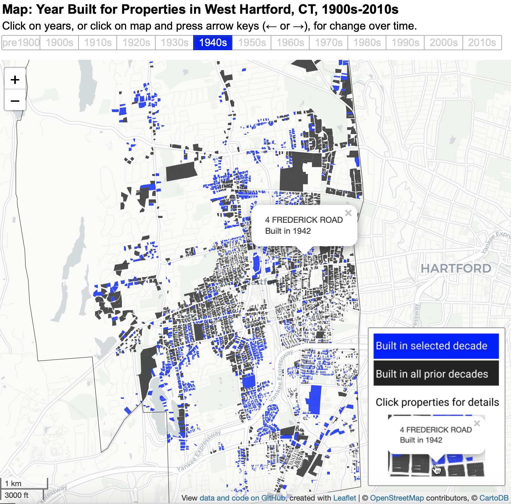
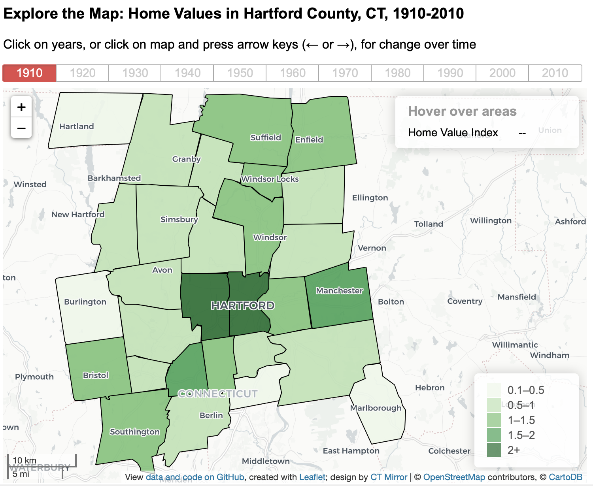
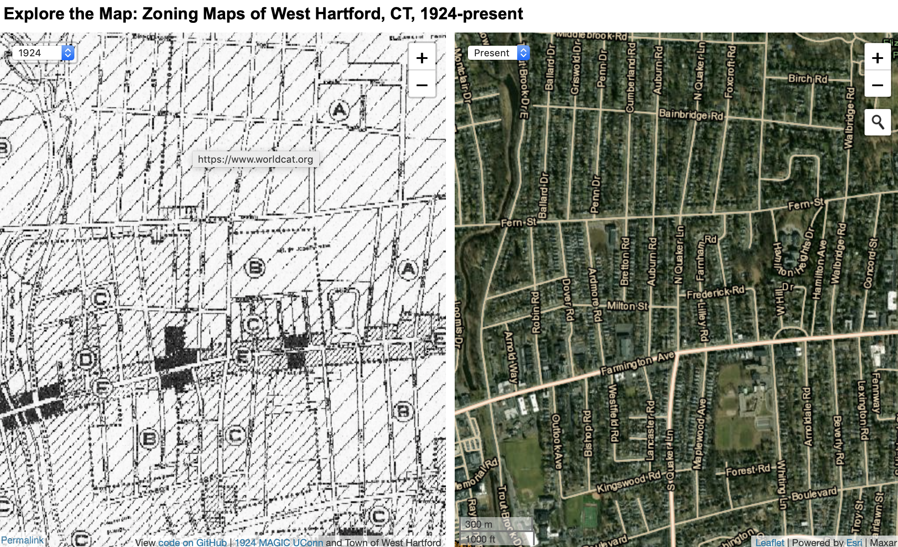
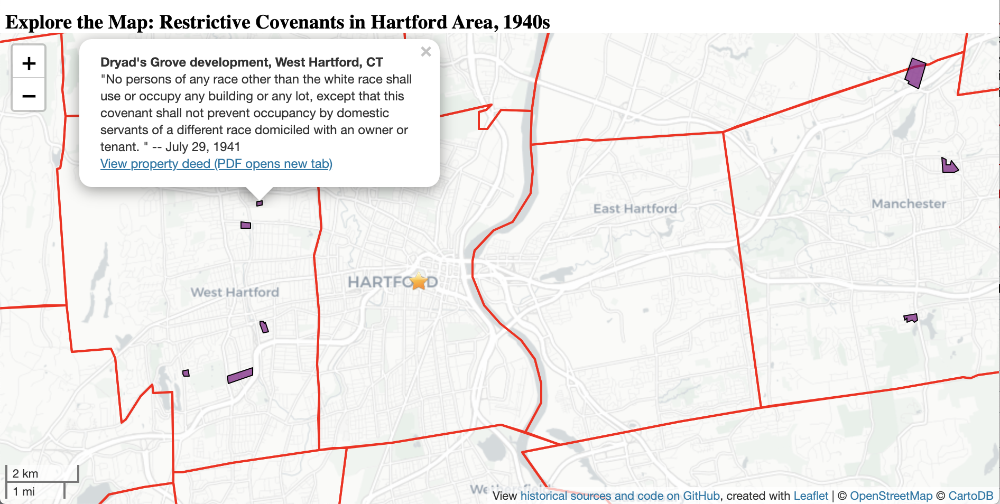
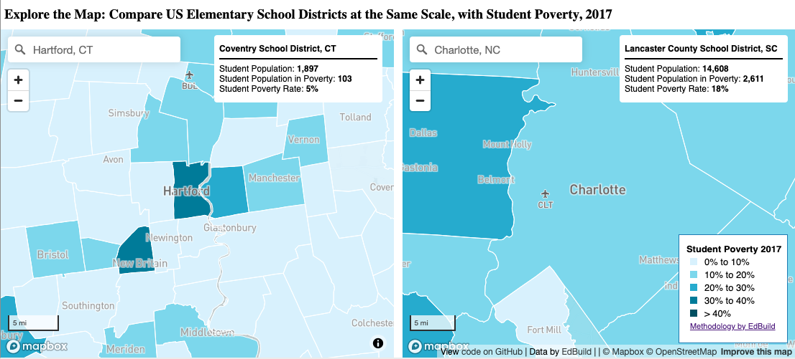
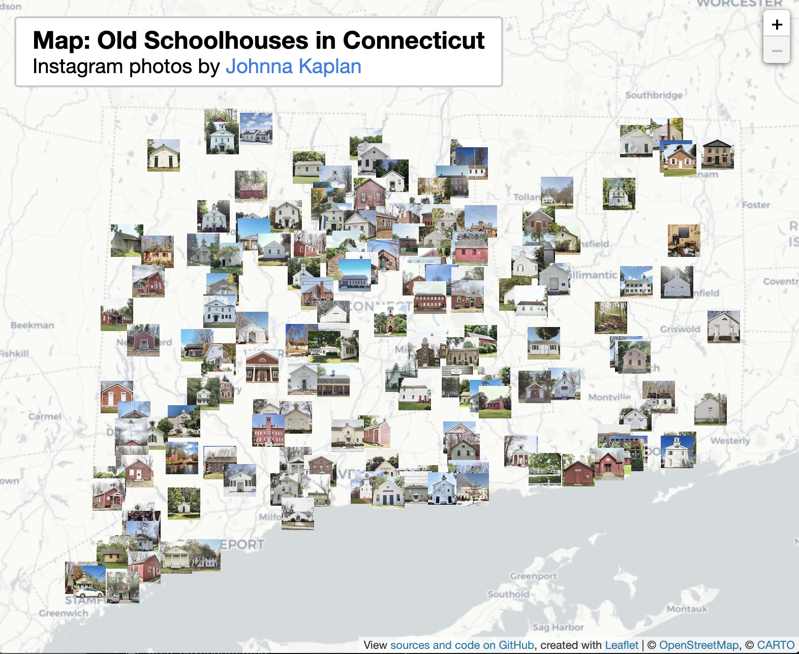

# Mapping and Publishing *On The Line* {#mapping-publishing}

This chapter details our design process and web technologies we used to create this open-access digital book. Our interactive maps and charts, built with open-source code libraries such as Leaflet and Chart.js, help broader audiences to visualize spatial and historical change over time. The chapter also describes our publishing workflow, based on the open-source Bookdown package for RStudio, which produces both HTML web pages and PDF print pages. We share our knowledge about these tools so that others may innovate and build more digital books to tell their own stories.

### Maps by Year {-}
*by [Jack Dougherty and Ilya Ilyankou](authors.html)*

List of maps created for *On The Line*, listed by earliest year of data. Click links to explore the full-size interactive versions on the web, access the source data and code, and read in context in this book.

| Screenshot | Description and Links |
|:---|:------|
|  | Town Borders in Hartford County, CT, from 1600s to Present. Explore the [full-size interactive map](https://ontheline.github.io/otl-town-borders/index-caption.html). View [open-source code and historical data](https://github.com/ontheline/otl-town-borders). Read in context in [Carving Up Town Boundaries](carving.html). |
|  | Racial Change in Hartford County, CT, 1900-2018. Explore the [full-size interactive map](https://ontheline.github.io/otl-racial-change/index-caption.html). View [open-source code and historical data](https://github.com/ontheline/otl-racial-change).  Read in context in [Segregating Along Color Lines](segregating.html). |
|  | Year Built for Properties in West Hartford, CT, 1900s-2010s. Explore the [full-size interactive map](https://ontheline.github.io/otl-year-built/index-caption.html). View [open-source code and historical data](https://github.com/ontheline/otl-year-built).  Read in context in [Expanding Zoning Across Suburbs](expanding-zoning.html). |
|  | Home Value Index in Hartford County, CT, from 1910-2010. Explore the [full-size interactive map](https://ontheline.github.io/otl-home-value/index-caption.html). View [open-source code and historical data](https://github.com/ontheline/otl-home-value). Read in context in [Richest City in the Nation](richest.html). |
|  | Real Estate Development in West Hartford CT, 1920s. Explore the [full-size interactive map](https://ontheline.github.io/otl-ardmore-road-wh/index-caption.html). View [open-source code and historical data](https://github.com/ontheline/otl-ardmore-road-wh). Read in context in [A Jewish Grocer & the Origins of Zoning](origins-zoning.html).  |
|  | Exclusionary Zoning in West Hartford, CT, 1924-present. Explore the [full-size interactive map](https://ontheline.github.io/otl-zoning-west-hartford/index-caption.html). View [open-source code and historical data](https://github.com/ontheline/otl-zoning-west-hartford). Read in context in [Bringing Zoning to Connecticut](bringing-zoning.html).  |
|  | Neighborhood Change in Connecticut, 1934-present. Explore the [full-size interactive map](https://ontheline.github.io/otl-neighborhood-change/index-caption.html). View [open-source code and historical data](https://github.com/ontheline/otl-neighborhood-change). Read in context in [Teaching Segregation in Connecticut](teaching-segregation-ct.html). |
|  | Federal Home Owners' Loan Corporation "Redlining" in Hartford area, 1937. Explore the [full-size interactive map](https://ontheline.github.io/otl-redlining/index-caption.html). View the [open-source code and historical data](https://github.com/ontheline/otl-redlining). Read in context in [Federal Lending and Redlining](lending.html). |
|  | Racially Restrictive Covenants in Hartford area, 1940s.  Explore the [full-size interactive map](https://ontheline.github.io/otl-covenants/index-caption.html). View [open-source code and historical data](https://github.com/ontheline/otl-covenants).  Read in context in [Restricting with Racial Covenants](restricting.html). |
|  | Zoning in Avon, Bloomfield, and West Hartford CT, 1950s. Explore the [full-size interactive map](https://ontheline.github.io/otl-zoning-metro-hartford/index-caption.html). View [open-source code and historical data](https://github.com/ontheline/otl-zoning-metro-hartford).  Read in context in [Expanding Zoning Across Suburbs](expanding-zoning.html). |
|  | Local Planning and Zoning Agencies in Connecticut, 1957. Explore the [full-size interactive map](https://ontheline.github.io/otl-planning-zoning-ct/index-caption.html). View [open-source code and historical data](https://github.com/ontheline/otl-planning-zoning-ct).  Read in context in [Expanding Zoning Across Suburbs](expanding-zoning.html). |
|  | Compare US Elementary School Districts at the Same Scale, with Student Poverty, 2017. Explore the [full-size interactive map](https://ontheline.github.io/otl-compare-school-districts/index-caption.html). View [open-source code and data](https://github.com/ontheline/otl-compare-school-districts). Read in context TODO |
|  | Old Schoolhouses in Connecticut, featuring photos by Johnna Kaplan.   Explore the [full-size interactive map](https://ontheline.github.io/otl-oldschoolct/index-caption.html). View the [open-source code and data](https://github.com/ontheline/otl-oldschoolct). Read in context in [Consolidating Rural School Districts](consolidating.html). |   

TODO: Add more maps; add charts section
