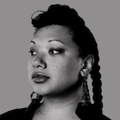
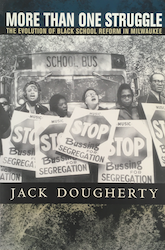

# Preface {-}
<!-- R global options: each R chunk image to display without code (no echo); display PDF version over JPG/PNG when available -->
```{r setup, include=FALSE}
knitr::opts_chunk$set(echo = FALSE)
options(knitr.graphics.auto_pdf = TRUE)
```


**Book-in-progress last updated on `r format (Sys.Date(), '%d %b %Y')`**

*On The Line*, an open-access digital book, makes visible the hidden history of schooling and housing boundaries that divided metropolitan Hartford, Connecticut, and tells the stories of everyday families and civil rights activists who seek to cross over, redraw, or erase these lines.

Feedback and corrections on this book-in-progress are welcome [by email to the lead author](author.html), or GitHub users can submit a pull request to [our repository](https://github.com/ontheline/otl-bookdown).

This text of this book is copyrighted by the authors and freely distributed under a <a rel="license" href="http://creativecommons.org/licenses/by-nc-sa/4.0/">Creative Commons Attribution-NonCommercial-ShareAlike 4.0 International License</a>. You may re-use and modify our text for non-commercial purposes, with a source credit to: [OnTheLine.trincoll.edu](http://OnTheLine.trincoll.edu) by Jack Dougherty and contributors. Similarly, our interactive charts and maps in this book are copyrighted by Jack Dougherty and contributors, and freely shared under an [MIT license](https://choosealicense.com/licenses/mit/), with the open source code available at our [GitHub repository](https://github.com/ontheline). You may re-use and modify our charts, maps, and code, with an acknowledgement to: [OnTheLine.trincoll.edu](http://OnTheLine.trincoll.edu) by Jack Dougherty and contributors.  Learn how to work with GitHub and create your own charts and maps in [Hands-On Data Visualization](http://HandsOnDataViz.org) by Jack Dougherty and Ilya Ilyankou.

Other images and videos in this book include a caption stating if the original is copyrighted by its creator.

## About the Book {-}
*On The Line* tells the story of schooling and housing boundaries that shaped American metropolitan life over the past century, and also the civil rights struggles of families and activists to cross over, redraw, or erase these powerful lines. Set in the city of Hartford, Connecticut, and its emerging suburbs, the book explains how this metropolitan area became one of the most racially and economically polarized regions in the northeastern United States. The story highlights how government, business, and white middle-class families drew lines to distance themselves from others, and the evolving coalitions that have sought to reform the relationship between private housing and public education.  

This **digital-first book** was designed for the open web. The narrative is wrapped around digital evidence---including interactive maps, videos, and documents---to make hidden boundaries more visible, and to amplify the voices of people who challenged these lines. *On The Line* is best read in your web browser, where readers may fully explore the evidence, follow links to related sources, and connect with the author and other readers through comments. In addition to the web edition, the same text (with static images and links) also appears in the downloadable e-book versions, and an inexpensive print edition to come.  

In an **open-access book**, history becomes more widely available to the public, without barriers of price or permissions. As educators, we believe that knowledge becomes more valuable when it is easily discoverable and accessible, not hidden behind password-protected paywalls. Moreover, the liberating power of history---and civil rights history in particular---should be freely available, especially for the communities of people who lived these stories. Anyone may freely read this book online or download it from the web, and after it is completed, purchase or borrow a low-cost paperback edition.

Written **for the liberal arts**, the book blends interdisciplinary scholarship with highly-engaged student learning. It draws on the fields of history, social sciences, and policy analysis in urban America, and more than a decade of collaborative research with undergraduate students, faculty, staff, and community partners at Trinity College. Rather than simply report our results, we describe our discovery process, so that others may expand upon, or even challenge our findings, in future works. We also strived to explain new concepts and make the text accessible for younger students and residents of the Hartford region.

In sum, *On The Line* blends the best aspects of conventional publishing and web innovation. The main narrative still looks and feels like a scholarly book, divided into chapters and backed up by endnotes. But the web platform allows us to embed digital evidence on the page, and to link directly to external resources located elsewhere. As a result, this book delivers a more comprehensive, coherent, and connected work of scholarship than what was previously possible in print-only publications, or scattered online journal articles and blog posts, at no cost to the reader. Flip the page---in whatever format you prefer---and find out for yourself.  

## How to Read and Cite {-}
<!-- TODO - INSERT screencast of book features, such as text, notes, interactives. Remind readers to open links in new tabs, usually with a right-click or two-finger click, from HODV -->

This open-access book-in-progress is freely available on the web at <http://ontheline.trincoll.edu>. The web edition allows readers to fully experience the interactive maps, video clips, and clickable source links. Any modern web browser will display the book, but readers may prefer larger screens (desktop, laptop, tablet) over smaller screens (such as smartphones). In your web browser, try these toolbar features near the top of the page:

- Menu
- Search
- Font to adjust text size and display
- View source code on GitHub
- Download PDF
- Shortcuts (arrow keys to navigate; `s` to toggle sidebar; `f` to toggle search)
- Social Media
- Share

```{r how-to-read}
 
```
<!-- TODO - after completion, revise text about book-in-progress -->
<!-- A second option is to freely [download the PDF edition](https://ontheline.trincoll.edu/Dougherty-etal-OnTheLine.pdf), which you can print out on paper for off-line reading. Although static images will appear in place of interactive maps and videos, the text and source notes in the PDF version are nearly identical to the web version. Since this digital-first has been created primarily for the web, some aspects of the book-in-progress may appear incomplete in the PDF edition.  After the final manuscript is completed, a cleaner PDF version will be formatted, which the publisher will use to create an inexpensive paperback edition for sale.

Finally, the book consists of several chapters, such as [Chapter 2: Defining City and Suburban Lines](defining.html). Each of these contains several sub-chapters, such as [2.1: The Richest City in the Nation](richest.html). For simplicity, refer to any of these as "chapters" of the book. -->

### How to Cite {-}
<!-- To cite this book-in-progress, please refer to the web edition (rather than the PDF editions), since this online version is easiest for all readers to access instantly. -->

For general citations of the book-in-progress, see these samples of common academic styles:

>**Chicago-style footnote or endnote:**  
>Jack Dougherty and contributors, *On the Line: How Schooling, Housing, and Civil Rights Shaped Hartford and Its Suburbs* (Trinity College, book-in-progress, 2021), http://ontheline.trincoll.edu.
>
>**Chicago-style bibliography entry:**  
>Dougherty, Jack, and contributors. *On the Line: How Schooling, Housing, and Civil Rights Shaped Hartford and Its Suburbs*. Trinity College, book-in-progress, 2021. http://ontheline.trincoll.edu.
>
>**MLA bibliography entry (with web address):**  
>Dougherty, Jack, and contributors. *On the Line: How Schooling, Housing, and Civil Rights Shaped Hartford and Its Suburbs*. Trinity College, book-in-progress, 2021. Web. <http://ontheline.trincoll.edu/>.
>
>**APA reference entry:**  
>Dougherty, J., & contributors. (2021). *On the Line: How Schooling, Housing, and Civil Rights Shaped Hartford and Its Suburbs*. Trinity College, book-in-progress. Retrieved from http://ontheline.trincoll.edu

To cite a specific passage, insert the author/title/web address of the relevant chapter as a "book section" in your preferred citation style. Since the web edition does not include page numbers, include the chapter-level web address to point readers to the specific page.

>Sample Chicago-style note for a specific chapter:  
>Elaina Rollins, Clarissa Ceglio, and Jack Dougherty, "Writing Greater Hartford's Civil Rights Past with ConnecticutHistory.org," in *On The Line: How Schooling, Housing, and Civil Rights Shaped Hartford and its Suburbs* (Trinity College, book-in-progress, 2021), https://ontheline.trincoll.edu/writing.

What if web links break?
All past and present editions of On The Line include the stable web address (http://OnTheLine.trincoll.edu), which redirects readers to the current version of the book.

The web edition of the book also includes internal links to different pages within the book (e.g. selected chapters, bibliography, etc.) If any internal links break, this platform has been set up to automatically redirect readers to the book's home page.

The book also contains external links (such as endnotes that refer to other articles, books, or websites). Whenever possible, external links point to open-access sources. When only paywall-protected sources are available, external links may include a web address specific to readers on the Trinity College network.

If any external links break, each endnote contains a full citation and external web address, which readers may search in the "Way Back Machine" at (http://archive.org) to see the most recent version of this site. [Donate to the Internet Archive](http://archive.org/donate/), the non-profit organization that maintains this valuable collection of our digital history as a free public service.

## Authors and Contributors {- #authors}
<!-- TODO: improve table output for PDF? See posts on tables with images for HTML and LaTeX -->
<!-- current method: create uniform 150x150 at 300dpi JPG (not PNG) images; use colon to left-justify, and hyphens to set relative width (2 vs. 10) -->
While teaching and researching this book at Trinity College, over 25 undergraduate students have co-authored publications or co-presented conference papers with the lead author. Several also were invited to co-author chapters or make other significant contributions to this publication, and are listed below.

|  | Lead Author |
| :-- | :---------- |
|  | Jack Dougherty, the lead author of *On The Line*, is Professor of Educational Studies at Trinity College. He collaborates with students, colleagues, and community partners by using digital history and data visualization to explore cities, suburbs, schools, and housing in metropolitan Hartford, Connecticut. Contact him on his [faculty profile page](http://internet2.trincoll.edu/facprofiles/Default.aspx?fid=1004266) or his personal site <https://jackdougherty.org>.|
|  | **Co-Authors** |
|  | Jasmin Agosto (Trinity College Class of 2010 with bachelor's degree in American Studies and Educational Studies) co-authored [Mobilizing Against Racial Steering and Redlining](mobilizing.html), and also researched 18th-19th century school documents, and decades of school residency cases. Photo by Seth Markle. |
|  |  Clarissa Ceglio co-authored [Writing Greater Hartford's Civil Rights Past with ConnecticutHistory.org](writing.html) |
|  | Ilya Ilyankou (Trinity College Class of 2018 with bachelor's degree in Computer Science and Studio Arts) developed several interactive maps in this book. His open-source code and map links are available at our GitHub public repository: <http://github.com/OnTheLine/>. |
|  | Vianna Iorio (Trinity College Class of 2019 with double major in Educational Studies and English) co-authored [Restricting with Property Covenants](restricting.html), [Mobilizing Against Racial Steering and Redlining](mobilizing.html), [Jumping the School District Line](jumping.html), and more chapters to come. |
|  | Katie Campbell Levasseur (Trinity College Class of 2011 with bachelor's degree in Educational Studies and Mathematics) conducted restrictive covenant property records research and co-authored [How We Found Restrictive Covenants](covenants.html). |
| | June Gold co-authored [Restricting with Property Covenants](restricting.html) and [How We Found Restrictive Covenants](covenants.html).|  
|  | JiYun (Lisa) Lee (Trinity College Class of 2017 with bachelor's degree in Educational Studies and Psychology) co-authored [Jumping the School District Line](jumping.html). |
|  | Shaun McGann (Trinity College Class of 2014 with bachelor's degree in Political Science and Urban Studies) co-authored [Federal Lending and Redlining](lending.html). |
|  |  Emily Meehan (Trinity College Class of 2016 with bachelor's degree in Educational Studies) co-authored [Racial Barriers to Public Housing](public-housing) |
|  |  Elaina Rollins (Trinity College Class of 2016 with bachelor's degree in Educational Studies) co-authored [Writing Greater Hartford's Civil Rights Past with ConnecticutHistory.org](writing.html) |
|  | Candace Simpson (Trinity College Class of 2012 with bachelor's degree in Educational Studies) co-authored [Who Owns Oral History? A Creative Commons Solution](who-owns-oral-history.html) and conducted oral history interviews on restrictive property covenants and Sheff v. O'Neill.|  
| | David K. Ware co-authored [Restricting with Property Covenants](restricting.html) and [How We Found Restrictive Covenants](covenants.html).|  
|  | Tracey M. Wilson (Trinity College Class of 1976) co-authored [Restricting with Property Covenants](restricting.html). See related chapters in her 2018 open-access book, *Life in West Hartford*,(http://lifeinwesthartford.org). |

More co-authors to come...

### Additional contributors {-}
Staff and students at [MAGIC](https://magic.lib.uconn.edu), the Map and Geographic Information Center at the University of Connecticut Libraries, co-created the [first edition of interactive maps](mapping-publishing.html) for this book, with support from a National Endowment for the Humanities grant in 2010-11.

- Michael Howser, Project Director and Map Interface Development
- Curtis Denton, Project Management and Interface Design
- Cary Lynch, Map Interface Development and Interface Design
- Bill Miller, Aerial Photography Digitization Project Manager
- Tom Bachant, Map Interface Development
- George Bentley, Shapefile and KML Development
- Jonathan Pollak, Shapefile and KML Development
- Benjamin Spaulding, Dual Map Interface WMS Code Development
- Josh Strunk, Aerial Photography Mosaic and Digitization

<!-- book cover images at 165px width, 300 dpi, PNG files -->

|  | Other books by Jack Dougherty |
| :-- | :---------- |
|  | *Hands-On Data Visualization: Interactive Storytelling from Spreadsheets to Code*, with Ilya Ilyankou. O'Reilly Media, 2021.</br> This open-access publication is freely available online and for sale in print at <http://HandsOnDataViz.org.> </br>Learn how to tell your story with data and use many of the tools we used to create interactive charts and maps for the *On The Line*, such as Chart.js and Leaflet map code templates on GitHub. |
|  | *Web Writing: Why and How for Liberal Arts Teaching and Learning*, co-edited with Tennyson O'Donnell. Ann Arbor: University of Michigan Press, 2015.</br> This open-access publication is freely available online at <http://WebWriting.trincoll.edu> and for sale in print at <https://www.press.umich.edu/8291956/web_writing>.</br>See also more than 1,000 comments by 70 readers and 4 expert reviewers commissioned by the publisher during the open peer review phase on the draft manuscript at <https://webwriting2013.trincoll.edu/>. |
|  | *Writing History in the Digital Age*, co-edited with Kristen Nawrotzki. Ann Arbor: University of Michigan Press, 2013.</br> This open-access publication is freely available online and for sale in print at <https://www.press.umich.edu/4766562/writing_history_in_the_digital_age>.</br>See also more than 940 comments by 65 readers and 4 expert reviewers commissioned by the publisher during the open peer review phase on the draft manuscript at <http://WritingHistory.trincoll.edu>.  |
|  | *More Than One Struggle: The Evolution of Black School Reform in Milwaukee*. Chapel Hill: University of North Carolina Press, 2004, <https://www.uncpress.org/book/9780807855249/more-than-one-struggle/>.</br> See also more than [60 oral history interviews donated to the University of Wisconsin-Milwaukee Archives](http://digicoll.library.wisc.edu/cgi/f/findaid/findaid-idx?c=wiarchives;view=reslist;subview=standard;didno=uw-mil-uwmmss0217), and several that were included in the [UWM Libraries March on Milwaukee digital history project](https://uwm.edu/marchonmilwaukee/). |

## Acknowledgements {-}
TODO
